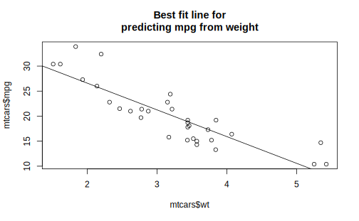
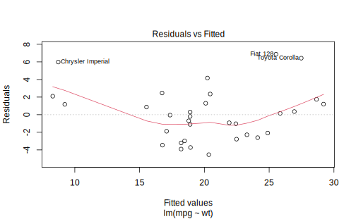
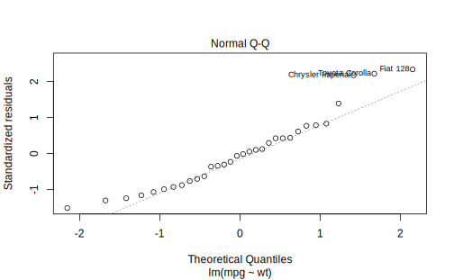

# Grundlæggende R {#baser}


“Det er ikke, fordi noget er svært, at vi ikke tør, det er, fordi vi ikke tør, at noget er svært” - Seneca

## Inledning til kapitel

Først og fremmest, velkommen til kurset! Det her dokument er kursusnotaterne, som indeholder bla. videoer, forklaringer og problemstillinger, og jeg opdaterer dem løbende gennem hele forløbet. Vær opmærksom på, at der også vil være flere dokumenter på Absalon vedrørende forelæsninger, workshops og løsningerne til øvelserne.

I dette kapitel opsummerer jeg nogle grundlæggende elementer inden for R og statistik, der betragtes som forudsætninger i dette kursus. Selvom vi i kurset skifter hurtigt over til tidyverse-pakken, som erstatter en stor del af funktionaliteten fra base-R, er det stadig vigtigt at have et grundlæggende kendskab til hvordan tingene fungerer i base-R. Hvis du har begrænset erfaring med base-R, anbefaler jeg, at du bruger ekstra tid ud over de første mødegange for at nå det nødvendige niveau. 

For at bestå kurset forventes det ikke, at du kender til alle detaljer og teorier bag de statistiske metoder, men at du kan anvende dem hensigtsmæssigt i praksis i R og fortolke resultaterne korrekte. Der vil være masser af muligheder for at øve dig I at anvende statistik hele vejen gennem kurset, og under eksamen vil jeg ikke stille spørgsmål om metoder, der ikke er dækket i de forskellige øvelser (herunder workshop-opgaver). Lineær regression vil også blive gennemgået i forelæsningerne så vær ikke bekymret hvis du ikke har set det hele før.  

:::checklist
Se gerne også "Quiz - grundlæggende" på Absalon for at tjekke din forståelse og udfylde eventuelle huller i din viden (OBS: Quizzen er tilgængelig kort tid inden kursets start).  
:::


## RStudio

Vi kommer fremadrettet til at være afhængig af RStudio til at arbejde med bl.a. R Markdown dokumenter. Kendskab til R Markdown er emnet i vores næste lektion og jeg går ud fra, at du ikke har benyttet det før.

Det allerførste du bør gør, hvis du ikke har installeret RStudio på din computer, er at downloade det gratis på nettet:

https://www.rstudio.com/products/rstudio/download/#download

Følg venligst RStudios egne anvisninger til at få det installeret. Bemærk, at installering af RStudio er ikke den samme som at have R installeret på din computer - man skal installere dem begge to (man kan bruge R uden RStudio men ikke omvendt.

### De forskellige vinduer i RStudio

<div class="figure" style="text-align: center">

<p class="caption">(\#fig:unnamed-chunk-2)Image source: https://epirhandbook.com/en/r-basics.html</p>
</div>

Du kan læse følgende for at lære de fire forskellige vinduer i RStudio at kende:

https://bookdown.org/ndphillips/YaRrr/the-four-rstudio-windows.html

Her er et kort oversigt:

* Man skriver kode i __Source__ (øverst til venstre)
* Man kører kode ved at tryk CMD+ENTER (eller WIN-KEY+ENTER)
* Koder køres ind i __Console__ (som plejer at være nederst til venstre, selvom det er øverst til højere i billedet). Man kan også skrive koder direkte i Console, men det ikke anbefales generelt, når koden ikke bliver gemt.
* __Environment__ - her kan man se blandt andet, alle objekter i Workspace.

## Working directory

Når man arbejder på et projekt, er det ofte nyttigt at vide, den _working directory_ som R arbejder fra - det er den mappe, hvor R forsøger at åbne eller gemme filer fra, medmindre man angiver et andet sted.
 

```r
getwd() #se nuværende working directory
list.dirs(path = ".", recursive = FALSE) #se mappe indenfor working directory
setwd("~/Documents/") #sætte en ny working directory (C:/Users/myname/Documents hvis man bruger Windows)
```

Hvis man bruger Windows, husk at man kan skrive en path på følgende måde:


```r
#notrun
setwd("C:/Users/myname/Documents") #enten med /
setwd("C:\\Users\\myname\\Documents") #eller med \\
```

__OBS__: jeg bruger Mac, så hvis der er et vigtigt ting at man skal huske hvis man bruger en Windows computer, kan jeg også tilføje det her. Bemærk dog, at de allerfleste ting ved R programmering og tidyverse er ens uanset om man bruger Windows eller Mac.

## R pakker

R pakker er simpelthen en samling af funktioner (eller datasæt i nogle tilfælde), der udvider, hvad er tilgængelige i base-R (den R man få, uden at indlæse en pakke). I R er der mange tusind R pakker (op mod 100,000), der er tilgængelige på __CRAN__ (https://cran.r-project.org/). Indenfor det biologiske fag er der også mange flere pakker på __Bioconductor__ (https://www.bioconductor.org/), og i nogle tilfælde kan R pakker også installeres direkte fra __Github__.

I dette kursus arbejder vi rigtig meget med en pakke der hedder __tidyverse__. __tidyverse__ er faktisk en samling af otte R pakker, som indlæses på en gang. Inden du indlæse pakken, skal du først sikre dig, at pakken er installeret på systemet ved følgende kommando:


```r
install.packages("tidyverse")
```

Alle pakker på __CRAN__ er installeret på samme måde. Når du faktisk gerne vil bruge en R pakke, skal du først indlæse den ved at bruge `library()`:


```r
library(tidyverse)
```

Vi kommer til at arbejde med __tidyverse__ pakker fra kapitel tre (vi starter med __ggplot2__ og så nogle af de andre pakke fra __tidyverse__ fra kapitel fire), __så det er en god idé at har tidyverse installeret allerede nu__, når det nogle gange kan tage lidt tid til at installere eller opdatere de mange andre mulige pakker, der __tidyverse__ er afhængig af. 

Vær opmærksom på, at der nogle gange opstår konflikter når det samme funktionnavn findes i flere pakker - for eksempel, funktionen `filter()` findes indenfor to forskellige pakker, nemlig `dplyr` og `stats`. Når du skriver `filter()` så ved R ikke, hvilke pakker du mener. I dette tilfælde kan du være gennemskueligt overfor den pakke, du gerne vil bruge ved at skrive `dplyr::filter()` eller `stats:filter()` i stedet for bare `filter()`. 

Som sidste kommentar, er det god praksis at indlæse alle pakker, der du benytter sig af, på toppen af din script, så at du hurtigt kan få overblik over, hvilke pakker, der skal indlæses til at få dine koder til at fungere.  

## Hvor kommer vores data fra?

De forskellige datasæt, vi kommer til at arbejde med i kurset stammer fra mange forskellige steder.

### Indbyggede datasæt

I R er der mange indbygget datasæt som er meget brugbart for at vise koncepter, hvilket gøre dem især populært i undervisningsmateriale. Indbyggede datasæt er ofte tilgængligt indenfor mange pakker, men `library(datasets)` er den mest brugt (der er også mange indenfor `library(ggplot2)`. For eksempel, for at indlæse datasættet, der hedder 'iris', kan man bruge `data()`:


```r
library(datasets)
data(iris)
```

Så er en _dataframe_, der hedder 'iris' tilgængelige som en _objekt_ i _workspacen_ - se den "Environment" fane på højere side i RStudio, eller indtaste `ls()`, så bør du kunne se et objekt med navnet 'iris'. Man kan kun arbejde med objekter som er en del af workspacen.

### Importering af data fra .txt fil

Det er meget hyppigt, at man har sin data i formen af en .txt fil eller .xlsx fil på sin computer. Den nemmeste måde at få åbnet en .txt fil er ved at bruge `read.table()`, som i nedenstående:


```r
data <- read.table("mydata.txt") #indlæse data filen mydata.txt som er i working directory
head(data)
```

Hvis datasættet har kolonner navne, der er skrevet ind i filen, så skal man huske at bruge `header=T` for at undgå, at den første række i datasættet bliver disse tekste i stedet for virkelige observationer.


```r
data <- read.table("mydata.txt",header=T) #indlæse data filen mydata.txt som er i working directory
head(data)
```

### Importering af data fra Excel

Der findes også en hjælpsom pakke, som hedder __readxl__, der kan indlæse Excel-ark direkte ind i R:


```r
library(readxl)
data <- read_excel("data.xlsx")
data
```

### Kaggle

Hvis du gerne vil øve dig med statistike analyser (udover nuværende kursus), er Kaggle en fantastisk ressource til at finde forskellige datasæt. I rigtige mange tilfælde kan man også finde analyser some andre har lavet I R (også Python), hvilket kan inspirere jeres egen læring.

Link hvis interesseret: https://www.kaggle.com/

## Beregninger i R

Her er nogle helt grundlæggende koncepter når man arbejder med R. Du må selvfølgelige gerne springe sektionen over, hvis du allerede har meget erfaring med base R, men det kan være værd at tjekke, om der noget ting, der lige skal gennemgås. En god tilgang er bare at arbejde gennem problemstillingerne nedenfor, og bruger følgende notater som en reference.  

### Objektor

Man definere en objekt med brug af `<-` tegn


```r
x <- 2 #x er defineret som 2
```

OBS: en objekts værdi kan nem overskrives - vær opmærksomt på rækkefølgen af de udførte kommandoer:


```r
x <- 2 #x er defineret som 2
x <- 4 #nu er x omdefineret som 4
```


### Vectorer

I R laver man en vector med `c()`, hvor man adskiller de forskellige elementer med en komma, som i nedenstående eksempel:


```r
a <- c(1,2,3,4,5) #sæt objektet 'a' til at være en vector af tal 
a
```

```
#> [1] 1 2 3 4 5
```

<!-- Man kan også  -->

<!-- ```{r} -->
<!-- a <- 1:5 -->
<!-- ``` -->

Man er ikke begrænset til tal:


```r
c <- c("cat","mouse","horse","sheep","dog")
c
```

```
#> [1] "cat"   "mouse" "horse" "sheep" "dog"
```


### datatyper

Nar vi kommer til at arbejde med visualiseringer og data beardejdning er det vigtigt at have styr på datatyper i datasættet. For eksempel har vectoren `c` ovenpå typen `character` (forkortet `chr`) og ikke `numeric` (forkortet `num`):


```r
is.numeric(c)
#> [1] FALSE
is.character(c)
#> [1] TRUE
```

Her er en list overfor nogle af de vigtigste datatyper:

Datatype | Navn | Beskrivelse
---- | ----- | ---
`int` | integer | kun hel tal `c(-1,0,1,2,3)`
`lgl` | logical | `TRUE TRUE FALSE TRUE FALSE`
`chr` | character | `c("Bob","Sally","Brian",...)`
`fct` | factor | bestemte niveauer e.g. `Species`: `c("setosa","versicola")`
`dbl` | double | Tal fk. c(`4.3902`, `3.12`, `4.5`)
`lst` | list | blande forskellige data typer og specificere elementer med `[[i]]` `[[1]] [1] c("red","blue")` `[[2]] [1] TRUE` `[[3]] [1] c(3,2.3,1.459)`


En datatype, der bør få særlig opmærksomhed er `fct` (factor). I følgende vector `tea_coffee` har vi tekst, men blandt de fem elementer er der kun to bestemte niveauer (nemlig "tea" og "coffee"). 


```r
tea_coffee <- c("tea","tea","coffee","coffee","tea")
is.factor(tea_coffee)
#> [1] FALSE
tea_coffee
#> [1] "tea"    "tea"    "coffee" "coffee" "tea"
```

Vi vil derfor gerne fortælle R, at `tea_coffee` er ikke bare nogle tilfældig tekst men at der er en struktur med, så vi bruger funktionen `as.factor` for at lave den om til datatypen `fct`.


```r
tea_coffee <- as.factor(tea_coffee)
is.factor(tea_coffee)
#> [1] TRUE
tea_coffee
#> [1] tea    tea    coffee coffee tea   
#> Levels: coffee tea
```

Den 'ekstra' oplysninger man har ved at sige, at en variabel betragtes som factor bliver vigtigt når man arbejder med visualiseringer - for eksempel, hvis vi gerne vil lave et barplot hvor man gerne vil adskille søjlerne efter de to niveauer "tea" og "coffee" (visualiseringer er emnet fra kapitel 3). 

## Dataframes

http://www.r-tutor.com/r-introduction/data-frame

Mange af de ting, som vi laver i R tager udgangspunkten i dataframes (eller datarammer).

<!-- height <-  c(140,187,154,132,165) -->
<!-- age <- c(34,31,25,43,29) -->
<!-- score <- c(56,82,48,75,79) -->


```r
mydf <- data.frame("personID"=1:5, "height"=c(140,187,154,132,165), "age"=c(34,31,25,43,29))
mydf
```

```
#>   personID height age
#> 1        1    140  34
#> 2        2    187  31
#> 3        3    154  25
#> 4        4    132  43
#> 5        5    165  29
```

Man kan fa adgang til variabler i en dataframe ved at bruge det dollar tegn `$`. For eksempel giver følgende variablen `personID` fra dataframen `mydf`:


```r
mydf$personID
```

```
#> [1] 1 2 3 4 5
```

Husk, at vores dataframe, ligesom et matrix (i R: `matrix()`) har to dimensioner - række og kolonner Forskellen mellem en matrix og en dataramme er, at datarammer kan indeholde mange forskellige data typer (herunder numeriske, faktorer, karakterer osv.), men matrix indeholder kun numeriske data. For eksempel i tilfældet af ovenstående dataframen er alle variabler numeriske, men vi kan godt tilføje en variabel som er ikke-numeriske:


```r
mydf$colour <- c("red","blue","green","orange","purple") #make new variable which is non-numeric
mydf
```

```
#>   personID height age colour
#> 1        1    140  34    red
#> 2        2    187  31   blue
#> 3        3    154  25  green
#> 4        4    132  43 orange
#> 5        5    165  29 purple
```

Nu er `mydf` er en dataframe, der blander forskellige datatyper, men følgende er en matrix


```r
matrix(c(1, 2, 3, 4, 5, 6), 
    nrow=3,
    ncol=2)
```

```
#>      [,1] [,2]
#> [1,]    1    4
#> [2,]    2    5
#> [3,]    3    6
```

og kan kun indeholde numeriske data, som kan bruges til at lave matematik operationer (matrix multiplikation osv.). I dette kursus beskæftiger os primært med dataframes (som bliver kaldt for tibbles i __tidyverse__).

### Delmængder af dataframes

Selvom vi kommer til at redefinere hvordan man laver delmængde når vi kommer til at arbejde med pakken __tidyverse__, er det alligevel vigtigt at forstå, hvordan man laver en delmængde i base-R, og det er et område, der ofte skaber forvirring blandt de uerfarne. 

Når man vil gerne har en bestemt delmængde af en vector, bruger man firkantet paranteser `[ ]`. Følgende kode giver mig de første to værdier fra vectoren `a`:


```r
a[1:2]
```

```
#> [1] 1 2
```

Bemærk, at mens vectorer har kun en dimension, __har dataframes to dimensioner__. Når man skal lave en delmægde af en dataframe, skal man derfor fortælle R, hvilke række og hvilke kolonner skal være med.


```r
mydf[række indekser, kolonner indekser]  #not run
```

For eksempel, hvis vi gerne vil have de første to observationer med, samt kun den anden variabel, skriver man følgende:


```r
mydf[1:2, 2]  #first two rows (observations), second column (variable) only
```

```
#> [1] 140 187
```

Hvis vi vil beholde den første to observationer og samtlige variabler, kan den anden plads være tom:


```r
mydf[1:2, ]  #first two rows, all columns
```

```
#>   personID height age colour
#> 1        1    140  34    red
#> 2        2    187  31   blue
```

Jeg kan også angive et variabelnavn direkte:


```r
mydf[1:2,"height"]
```

```
#> [1] 140 187
```

Man kan kigge på en subset af rækkerne i de data ved at 


```r
mydf[mydf$height>=165,] #alle rækker i datarammen med height = 165 eller over
```

```
#>   personID height age colour
#> 2        2    187  31   blue
#> 5        5    165  29 purple
```

Her er en tabel af comparitiver, og jeg gengiver samme tabel når I kommer til at lave delmængde i __tidyverse__:

comparitiv | beskrivelse
--- | ---
`<` | less than
`>` | greater than
`<=` | less than or equal to
`>=` | greater than or equal to
`==` | equal to
`!=` | not equal to
`&` | and 
`%in%` | in
`|` | or
`!` | not

Jeg mener, at `%in%` er særlig brugbart og er værd at lære:


```r
mydf[mydf$personID %in% c(1,3,5),] #alle personer med personID 1,3 eller 5 
```

```
#>   personID height age colour
#> 1        1    140  34    red
#> 3        3    154  25  green
#> 5        5    165  29 purple
```

Her er et eksempel på, hvordan man bruger udråbstegnet: personer med personID, der ikke er 1,3 eller 5:


```r
mydf[!(mydf$personID %in% c(1,3,5)),] #alle personer med personID 2 eller 4
```

```
#>   personID height age colour
#> 2        2    187  31   blue
#> 4        4    132  43 orange
```


## If/else

If/else kodekonstruktioner giver mulighed for at udføre forskellige handlinger baseret på, om en bestemt betingelse er opfyldt. Her er et eksempel med `if` med betingelsen `number > 0`:


```r
number <- 42
if (number > 0) {
  print("Number is positive")
}
```

```
#> [1] "Number is positive"
```

Hvis betingelse er sand udføres den handling indenfor `{ }`, dvs. "Number is positive" printes.

If/else konstruktioner gør det samme, men hvis betingelsen er falsk, udføres en alternativ handling:


```r
number <- -5
if (number > 0) {
  print("Number is positive")
} else {
  print("Number is not positive")
}
```

```
#> [1] "Number is not positive"
```

Man kan også opnå samme resultat med at bruge `ifelse`:


```r
number <- 3
numbers_of_interest <- c(1,3,5,7)
ifelse(test = number %in% numbers_of_interest, 
       yes = "Number is interesting",
       no =  "Number is uninteresting")
```

```
#> [1] "Number is interesting"
```

Man behøver ikke at skrive ordene "test", "yes" og "no" hver gang, såfremt at du bruger samme rækkefølgen som funktionen forventer:


```r
ifelse(number %in% numbers_of_interest, 
       "Number is interesting",
       "Number is uninteresting")
```

```
#> [1] "Number is interesting"
```

## Loops

I base-R kan man laver simpel loops(løkke) med følgende konstruktion:


```r
for (i in 1:5) {
  print(i)
}
```

```
#> [1] 1
#> [1] 2
#> [1] 3
#> [1] 4
#> [1] 5
```

Loops bliver et stort emne senere i kurset (emne 8/9).

## Descriptive statistics


### Simulere data fra den normale fordeling

Hvis du har bruge for at vide mere om den normale fordeling: http://www.r-tutor.com/elementary-statistics/probability-distributions/normal-distribution

Man kan nemt lave sin egne 'fake' data ved at simulere det fra en fordeling, der typisk er normalfordelingen, da den er den mest almindelige fordeling i den virkelige verden (husk den klassiske klokkeform). I R kan funktionen rnorm bruges til at simulere data. Først angiver man antallet af observationer, og derefter den gennemsnitlige værdi og standardafvigelsen (sd), som er de to nødvendige parametre for at beskrive en normalfordeling.


```r
x <- rnorm(25,mean=0,sd=1) #standard normal distribution
x #så har vi 25 værdier fra en normal distribution med mean=0 og standard deviation=1.
```

```
#>  [1] -0.03774752 -0.46724254  1.65900960 -1.12714440  0.46195114  0.90216477
#>  [7] -0.22390568 -0.95924908 -1.13878515  1.52199968 -1.12422917 -0.69705402
#> [13]  0.41244232 -0.62192152  1.82505375 -0.21022846 -1.05875395  0.53971136
#> [19] -1.34878873 -0.82418692  1.65858428  0.49271191 -0.12669777  0.37990131
#> [25]  0.04452919
```

I stedet for at kigge på alle værdier på én gang, vil vi måske hellere kigge kun på de første (eller sidste) værdier:


```r
head(x) #første 6
#> [1] -0.03774752 -0.46724254  1.65900960 -1.12714440  0.46195114  0.90216477
tail(x) #sidste 6
#> [1] -0.82418692  1.65858428  0.49271191 -0.12669777  0.37990131  0.04452919
x[1] #første værdi
#> [1] -0.03774752
x[length(x)] #sidste data point
#> [1] 0.04452919
```

Bemærk, at i modsætning til Python og mange andre programmeringssprog, bruger R en 1-baseret indeksering. Det betyder, at den første værdi er x[1] og ikke x[0] som i Python.

### Measures of central tendency

function | Description
--- | ---
`mean()` | mean $\bar{x}_{i} = \frac{1}{n}\sum_{i=1}^{n} x_{i}$
`median()` | median value
`max()` | maximum value
`min()` | minimum value
`var()` | variance $s^2 = \frac{1}{n-1}\sum_{i=1}^{n} (x_{i} - \bar{x}_{i})^2$
`sd()` | standard deviation $s$

Lad os afprøve dem på vores simulerede data:


```r
my_mean <- mean(x)
my_median <- median(x)
my_max <- max(x)
my_min <- min(x)
my_var <- var(x)
my_sd <- sd(x)
c(my_mean,my_median,my_max,my_min,my_var,my_sd) #print results
```

```
#> [1] -0.002715024 -0.126697771  1.825053754 -1.348788729  0.941737877
#> [6]  0.970431799
```

Man kan også lave et summary af dataen, som består af mange af de statistiker navnt ovenpå:


```r
summary(x)
```

```
#>      Min.   1st Qu.    Median      Mean   3rd Qu.      Max. 
#> -1.348789 -0.824187 -0.126698 -0.002715  0.492712  1.825054
```

### `tapply()`

`tapply()` er en meget nyttig funktion i R, som kan bruges til at anvende en funktion på en gruppe af data baseret på værdier i en anden vektor. Funktionen tager tre hovedargumenter: den vektor, som vi ønsker at anvende funktionen på, den vektor, som bruges til at gruppere dataene, og funktionen, som vi ønsker at anvende på hver gruppe. `tapply()` vil derefter opdele dataene i grupper baseret på den anden vektor og anvende funktionen på hver gruppe.

Resultatet af `tapply()` vil være en vektor, som indeholder resultaterne af funktionen anvendt på hver gruppe af data. For eksempel:


```r
data(iris)
tapply(iris$Sepal.Length,iris$Species,mean) # ovenstående i kun en linje
```

```
#>     setosa versicolor  virginica 
#>      5.006      5.936      6.588
```

Her tager vi en vektor ved navn Sepal.Length, opdeler den efter Species og beregner gennemsnittet ved hjælp af funktionen mean for hver af de tre arter i variablen `Species` (setosa, versicolor og virginica). Alternativt kunne man have beregnet gennemsnittet for hver af de tre Species separat (en tilgang, der ikke skalerer godt!):


```r
# gennemsnit Sepal Length for Species setosa
mean_setosa <- mean(iris$Sepal.Length[iris$Species=="setosa"])

# gennemsnit Sepal Length for Species versicolor
mean_versi <- mean(iris$Sepal.Length[iris$Species=="versicolor"]) 

# gennemsnit Sepal Length for Species virginica
mean_virgin <- mean(iris$Sepal.Length[iris$Species=="virginica"])

c(mean_setosa,mean_versi,mean_virgin)
```

```
#> [1] 5.006 5.936 6.588
```

Det er også værd at ved koncepten, fordi vi kommer til lære en lignende koncept i __tidyverse__ (med `group_by` og `summarise`).

## Statistike tester

Her er en oversigt over nogle af de mest grundlæggende tests, som man kan udføre på data i R. Det kan være nyttigt som en reference senere hen, hvis det er nødvendigt. Jeg vil ikke gå i dybden med teorien bag disse tests (da det antages, at du har lært det tidligere), men jeg forventer, at du er i stand til at anvende dem korrekt i R og fortolke resultaterne. Hvis du ikke er bekendt med nogle af disse tests, vil der være masser af muligheder for at øve dig i statistik gennem kurset.

* t-test: Bruges til at sammenligne to grupper og afgøre, om forskellen mellem deres gennemsnitlige værdier er statistisk signifikant.

* ANOVA: Bruges til at sammenligne mere end to grupper og afgøre, om der er statistisk signifikant forskel mellem mindst to af grupperne.

* Korrelationsanalyse: Bruges til at afgøre, om der er en statistisk signifikant sammenhæng mellem to variabler.

* Regressionsanalyse: Bruges til at afgøre, om der er en statistisk signifikant sammenhæng mellem en uafhængig variabel og en afhængig variabel og at forudsige værdien af den afhængige variabel baseret på værdien af den uafhængige variabel.

* Chi-square test: Bruges til at afgøre, om der er en statistisk signifikant forskel mellem observerede og forventede værdier for kategoriske variabler.

### P-værdien

Først og fremmest er det vigtigt at kunne huske p-værdi både i forhold til definitionen og i forhold til hvordan det fortolkes.

P-værdien er sandsynligheden for at observere et resultat lige så ekstremt eller mere ekstremt end det observerede, givet at null-hypotesen er sand. Null-hypotesen er en antagelse om, at der ikke er nogen signifikant forskel mellem grupper eller variabler i det dataset, som der arbejdes med.

Hvis p-værdien er mindre end det valgte signifikansniveau (typisk 0,05), så betyder det, at det observerede resultat er usandsynligt at opstå ved ren tilfældighed, og null-hypotesen forkastes til fordel for den alternative hypotese om, at der er en signifikant forskel mellem grupper eller variabler i datasættet.

### Korrelation

Korrelation måler styrken og retningen af den lineære sammenhæng mellem to kontinuerte variabler, som begge er normalfordelte:

* $>0$ betyder, at der er en positiv sammenhæng
* $<0$ betyder, at der er en negativ sammenhæng
* $=0$ betyder, at der er ingen sammenhængen mellem de to variabler


```r
data(cars)
cor(cars$speed, cars$dist) 
```

```
#> [1] 0.8068949
```

Husk dog, at "Correlation does not equal causation" - dvs. at korrelation er bare en sammenhæng og ikke nødvendigvis angiver en årsagssammenhæng mellem de to variable.

Funktionen `cor.test()` kan bruges til at teste, om korrelationen mellem to variable er statistisk signifikant. Null-hypotesen antager, at der ikke er nogen korrelation mellem de to variable i den population, som datasættet repræsenterer.


```r
cor.test(cars$speed, cars$dist) 
```

```
#> 
#> 	Pearson's product-moment correlation
#> 
#> data:  cars$speed and cars$dist
#> t = 9.464, df = 48, p-value = 1.49e-12
#> alternative hypothesis: true correlation is not equal to 0
#> 95 percent confidence interval:
#>  0.6816422 0.8862036
#> sample estimates:
#>       cor 
#> 0.8068949
```

Så kan man se, at p-værdien er 0, der er  under 0.05. Derfor konkluderer man, at der er en signifikant sammenhæng mellem de to variabler.

### Test for uafhængighed (chi-sq test)

En chi-squared test kan bruges til at undersøge, om der er en statistisk signifikant sammenhæng mellem antallet af observationer i to eller flere forskellige kategorier. For eksempel kan man teste for sammenhængen mellem antallet af kopier af en genvariant og to forskellige farver på blomster i en bestemt planteart.


        0     1     2  
-----  ----  ----  ----
red     29    31    16 
pink    11    16    24 

Vi vil gerne vide, om phenotype er afhængig af genotype:

* $H_{0}:$ antal gen copi og phenotype er uafhængie af hinanden  VS 
* $H_{1}:$ antal gen copi og phenotype er afhængie af hinanden 

Testen går ud på, at man beregner forventede værdier under nulhypotesen om, at der ikke er nogen sammenhæng mellem de to kategorier, og sammenligner disse forventede værdier med observerede værdier. Man laver testen i R ved at benytte funktionen `chisq.test()`: 


```r
chisq.test(dat)
```

```
#> 
#> 	Pearson's Chi-squared test
#> 
#> data:  dat
#> X-squared = 9.9516, df = 2, p-value = 0.006903
```

Her er p-værdien = 0.006903 < 0.05, så vi forkaster nulhypotesen og konkluderer, at der er en signifikant sammenhæng mellem de to variabler. Ud fra rådatasættet kan man også observere, at der er flere røde blomster uden nogen kopi af genet sammenlignet med røde blomster med to kopier af genet, mens det modsatte er tilfældet for de lyserøde blomster.

### 1 sample t-test

For at vise en 1-sample t-test, simulerer jeg nogle data fra en normalfordeling med middelværdi på 3 ved hjælp af rnorm()-funktionen:


```r
set.seed(290223) # bare for at få den samme resultat hver gang
x <- rnorm(10,mean = 3,sd = 1)
```

Forestil dig, at du ikke helt stoler på funktionen `rnorm()` og ønsker at teste, om `x` stammer fra en normalfordeling med en middelværdi på 3. Nulhypotesen og den alternative hypotese (to-sidet test) er derfor:

* $H_{0}: \mu = 3$,  VS 
* $H_{1}: \mu \neq 3$ 

For at lave testen i R, bruger man funktionen `t.test()` og angiver `mu = 3` for at reflektere vores hypoteser:


```r
t.test(x,mu = 3)
```

```
#> 
#> 	One Sample t-test
#> 
#> data:  x
#> t = -1.1448, df = 9, p-value = 0.2818
#> alternative hypothesis: true mean is not equal to 3
#> 95 percent confidence interval:
#>  2.169968 3.272231
#> sample estimates:
#> mean of x 
#>  2.721099
```

Fra resultatet kan man se, at p-værdien er estimeret til 0.2818, og da den er > 0.05 kan vi ikke forkaste nulhypotesen, og vi konkluderer derfor, at middelværdien af x ikke adskiller sig signifikant fra 3.

**Bemærkning**: da vi simulerede vores data fra en normal fordeling med et gennemsnit på tre, vidste vi i forvejen at det korrekte svar er, at beholde nullhypotesen. Havde vi forkastet nullhypotesen, havde vi lavet en **type I fejl** - det vil sige, at vi forkaster nullhypotesen når det faktisk er sandt. 

### 2-sample t-test

Undersøger om der er en forskel i de gennemsnitlige værdier mellem to grupper - kan de to grupper betragtes til at stammer fra den samme normale fordeling? Hypoteserne er således (to-sidet):

* $H_{0}: \mu_{1} = \mu_{2}$,  VS 
* $H_{1}: \mu_{1} \neq \mu_{2}$ 

I følgende kode simulere jeg to stikprøver, der kommer fra en normal fordeling med forskellige gennemsnitte og bruger funktionen `t.test`. Man kan angive at de to stikprøver har samme variance ved at skrive  `var.equal = T` indenfor funktionen `t.test`:


```r
x <- rnorm(10,3,1)
y <- rnorm(10,5,1)

t.test(x,y,var.equal = T)
```

```
#> 
#> 	Two Sample t-test
#> 
#> data:  x and y
#> t = -5.4258, df = 18, p-value = 3.729e-05
#> alternative hypothesis: true difference in means is not equal to 0
#> 95 percent confidence interval:
#>  -2.700858 -1.193081
#> sample estimates:
#> mean of x mean of y 
#>  2.783056  4.730025
```


Hvis man til gengæld ikke kan antage, at variansen er den samme i de to grupper:


```r
x <- rnorm(10,3,1)
y <- rnorm(10,5,3) #større variance

t.test(x,y,var.equal = F) #var.equal=F er 'default' så man behøver ikke at specifere
```

```
#> 
#> 	Welch Two Sample t-test
#> 
#> data:  x and y
#> t = -2.0238, df = 11.77, p-value = 0.0663
#> alternative hypothesis: true difference in means is not equal to 0
#> 95 percent confidence interval:
#>  -3.9077927  0.1483728
#> sample estimates:
#> mean of x mean of y 
#>  2.757436  4.637146
```

Bemærk at hvis man kan antage at variancen er den samme, så har man mere **power** (kræft) til at kalde en virkelig forskel for signifikant.

### Paired t-test

En paired t-test bruges når man for eksempel har målinger for den samme sæt personer i hver stikprøve, og man gerne vil teste om forskellen i værdier mellem de to stikprøver er signifikant. For eksempel hvis vi har "before" og "after" målinger for den samme 10 individer:  


```r
set.seed(320)
before <- rnorm(10,3,1)
after <- rnorm(10,6,2)

t.test(before,after,paired=T) #specificy paired data
```

```
#> 
#> 	Paired t-test
#> 
#> data:  before and after
#> t = -9.3296, df = 9, p-value = 6.356e-06
#> alternative hypothesis: true mean difference is not equal to 0
#> 95 percent confidence interval:
#>  -5.415186 -3.301613
#> sample estimates:
#> mean difference 
#>       -4.358399
```

```r
t.test(before-after,mu=0) #exactly the same result
```

```
#> 
#> 	One Sample t-test
#> 
#> data:  before - after
#> t = -9.3296, df = 9, p-value = 6.356e-06
#> alternative hypothesis: true mean is not equal to 0
#> 95 percent confidence interval:
#>  -5.415186 -3.301613
#> sample estimates:
#> mean of x 
#> -4.358399
```

### ANOVA (variansanalyse)

Har man flere grupper i stedet for to, kan man bruge ANOVA (analysis of variance eller variansanalyse). For en kategorisk variabel med $k$ grupper, er nul/alternativhypotesen:

* $H_{0}: \mu_{1} = \mu_{2} = \ldots = \mu_{k}$
* $H_{1}:$ ikke alle middelværdier er enes 


```r
#simulere data til 3 forskellige grupper fra den normale fordeling med standard afvigelse af 3
group1 <- rnorm(50,10,3)
group2 <- rnorm(55,10,3)
group3 <- rnorm(48,5,3)

#data må være i en dataramme, med den ene kolon = vores værdier, og den anden kolon = grupper
y <- c(group1,group2,group3)
x <- c(rep("G1",50),rep("G2",55),rep("G3",48))
mydf <- data.frame("group"=x,"value"=y)
```

For at udføre testen kan man bruge funktionen lm(), som står for "linear model" og kan bruges til at opbygge forskellige modeller. Her angiver vi en model, hvor hver gruppe (`G1`, `G2` og `G3` fra variablen `x`) har sin egen middelværdi (variablen value), hvilket er modellen under alternativhypotesen:


```r
mylm <- lm(value~group,data=mydf) #H1 model
```


Under nulhypotesen har alle grupper den samme middelværdi, og derfor behøver vi ikke at inkludere variablen `group` i modellen. Vi angiver situationen i modellen ved at skrive 1, som betyder, at forventede værdier for den afhængige variabel `value` blot er dens middelværdi:


```r
mylm_null <- lm(value~1,data=mydf) #H0 model
```

For at sammenligne de to modeller benytter vi funktionen `anova()` (efter analysis of variance):


```r
anova(mylm_null,mylm)
```

```
#> Analysis of Variance Table
#> 
#> Model 1: value ~ 1
#> Model 2: value ~ group
#>   Res.Df    RSS Df Sum of Sq      F    Pr(>F)    
#> 1    152 2215.4                                  
#> 2    150 1509.9  2    705.55 35.047 3.245e-13 ***
#> ---
#> Signif. codes:  0 '***' 0.001 '**' 0.01 '*' 0.05 '.' 0.1 ' ' 1
```

P-værdien er  (<0.05), så nulhypotesen er forkastet til fordel af alternativhypotesen, altså modellen, hvor hver gruppe har sin egen middelværdi. Bemærk at det er til trods af, at to af de tre grupper kommer fra en normal fordeling med præcis de samme middelværdier (det er nok, at den trejde gruppe har en ænderledes middelværdi).

<!-- * Grupper må være normale fordelt -->
<!-- * Variancen må være de samme i alle grupper -->


### Lineær regression

_OBS: se også video i forbindelse med Rmarkdown (næste emne), hvor jeg gennemgå lineær regression med R_

Formål: måler (en retningsbestemt) relation mellem to kontinuerte variabler. I simpel lineær regression svarer det til, at man gerne vil finde den rette linje gennem punkterne, der bedste beskriver relationen.

Eksempel - datasættet `mtcars`, response (afgængig) variabel er `mpg` og predictor (uafhængig) variabel er `wt`. 



Man skriver relationen i R som `mpg ~ wt` og benytter `lm()`(`lm(mpg~wt,data=mtcars)`): 


```r
mylm <- lm(mpg ~ wt, data=mtcars)  # build linear regression model
mylm
```

```
#> 
#> Call:
#> lm(formula = mpg ~ wt, data = mtcars)
#> 
#> Coefficients:
#> (Intercept)           wt  
#>      37.285       -5.344
```

Vores "Coefficients" beskriver den bedste rette linje: 

* Skæringen (intercept): 37.285
* Hældningskoefficient (slope): -5.344

Det betyder, at hvis vægten `wt` af en bil stiger med 1, så stiger `mpg` ved -5.344 (det vil sige at `mpg` reduceres med 5.344).

### R-squared coefficient of determination

Den $R^2$ eller "forklaringsgraden" (coefficeint of determination) har til formål at forklare, hvor godt vores lineær model passer til de data. For eksempel hvor meget af variansen i `mpg` forklares af variablen `wt`? 

* Hvis det er tæt på 1 - så er der en meget tæt relation (hvis man kender vægten, så vide man også `mpg` med stor sikkerhed)
* Hvis det er tæt på 0 - så er relationen svag - høj sandsynlighed for, at der er andre variabler der bedre kan forklare variansen i `mpg`.

I ovenstående model, kan man se  den $R^2$ værdi med `summary(mylm)`.


```r
summary(mylm)
```

```
#> 
#> Call:
#> lm(formula = mpg ~ wt, data = mtcars)
#> 
#> Residuals:
#>     Min      1Q  Median      3Q     Max 
#> -4.5432 -2.3647 -0.1252  1.4096  6.8727 
#> 
#> Coefficients:
#>             Estimate Std. Error t value Pr(>|t|)    
#> (Intercept)  37.2851     1.8776  19.858  < 2e-16 ***
#> wt           -5.3445     0.5591  -9.559 1.29e-10 ***
#> ---
#> Signif. codes:  0 '***' 0.001 '**' 0.01 '*' 0.05 '.' 0.1 ' ' 1
#> 
#> Residual standard error: 3.046 on 30 degrees of freedom
#> Multiple R-squared:  0.7528,	Adjusted R-squared:  0.7446 
#> F-statistic: 91.38 on 1 and 30 DF,  p-value: 1.294e-10
```

Det fortæller os, at $R^2$ = 0.7528.

### Antagelser - lineær regression

* Normalfordelte residualer
* Residualer har samme spredning (varianshomogenitet)
* Uafhængighed
* Fit er linæer

Koden `plot(mylm,which=c(1))` angiver residualer vs predikterede (fitted) værdier - de skal være tilfældigt fordelt over plottet og prikkernes varians skal være nogenlunde konstant langt x-aksen (det giver, at den røde linje er flade).


```r
plot(mylm,which=c(1))
```



Med koden `plot(mylm,which=c(2))` kan man tjekke antagelsen på en normal fordeling. Punkterne skal være nogenlunde tæt på den diagonale linje.


```r
plot(mylm,which=c(2))
```



### Multiple lineær regression

Her kan man tilføje flere variabler i vores model formel.


```r
mylm_disp <- lm(mpg ~ wt + disp, data=mtcars) # build linear regression model
summary(mylm_disp)
```

```
#> 
#> Call:
#> lm(formula = mpg ~ wt + disp, data = mtcars)
#> 
#> Residuals:
#>     Min      1Q  Median      3Q     Max 
#> -3.4087 -2.3243 -0.7683  1.7721  6.3484 
#> 
#> Coefficients:
#>             Estimate Std. Error t value Pr(>|t|)    
#> (Intercept) 34.96055    2.16454  16.151 4.91e-16 ***
#> wt          -3.35082    1.16413  -2.878  0.00743 ** 
#> disp        -0.01773    0.00919  -1.929  0.06362 .  
#> ---
#> Signif. codes:  0 '***' 0.001 '**' 0.01 '*' 0.05 '.' 0.1 ' ' 1
#> 
#> Residual standard error: 2.917 on 29 degrees of freedom
#> Multiple R-squared:  0.7809,	Adjusted R-squared:  0.7658 
#> F-statistic: 51.69 on 2 and 29 DF,  p-value: 2.744e-10
```

Her kan man se, at med tilføjelsen af variablen `disp`, er $R^2$ steget til 0.7809. Bemærk, at jo flere variabler man tilføjer til modellen, jo større bliver $R^2$-værdien. Den adjusted $R^2$ værdi er lavere fordi den prøver at tage højde for kompleksiteten af modellen (hvor mange parametre der er). 

Variablen `disp` er faktisk ikke selv signifikant når der er taget højde for variablen `wt` (p-værdien 0.0636 - tjek, at du selv kan finde værdien i resultatet).

Hvis en af de uafhængige variabler er kategorisk bruger man funktionen `anova` til at teste den overordnet effekt af den variabel. For eksempel har variablen `cyl` 3 mulige værdier (niveauer) - 4, 6 og 8. Vi kan inddrage variablen i vores model: -->


```r
mylm_cyl <- lm(mpg ~ wt + factor(cyl), data=mtcars) # build linear regression model
summary(mylm_cyl)
```

```
#> 
#> Call:
#> lm(formula = mpg ~ wt + factor(cyl), data = mtcars)
#> 
#> Residuals:
#>     Min      1Q  Median      3Q     Max 
#> -4.5890 -1.2357 -0.5159  1.3845  5.7915 
#> 
#> Coefficients:
#>              Estimate Std. Error t value Pr(>|t|)    
#> (Intercept)   33.9908     1.8878  18.006  < 2e-16 ***
#> wt            -3.2056     0.7539  -4.252 0.000213 ***
#> factor(cyl)6  -4.2556     1.3861  -3.070 0.004718 ** 
#> factor(cyl)8  -6.0709     1.6523  -3.674 0.000999 ***
#> ---
#> Signif. codes:  0 '***' 0.001 '**' 0.01 '*' 0.05 '.' 0.1 ' ' 1
#> 
#> Residual standard error: 2.557 on 28 degrees of freedom
#> Multiple R-squared:  0.8374,	Adjusted R-squared:   0.82 
#> F-statistic: 48.08 on 3 and 28 DF,  p-value: 3.594e-11
```

<!-- Der er faktisk tre rette linjer her - en for hvert niveau af `cyl`, og de har samme hældning med forskellige skæringspunkter. -->

<!-- * Hvis `cyl = 4`: mpg $= 33.99 - 3.21$wt -->
<!-- * Hvis `cyl = 6`: mpg $= 33.99 - 3.21$wt $-4.26$ -->
<!-- * Hvis `cyl = 8`: mpg $= 33.99 - 3.21$wt $-6.07$ -->

Man kan ikke se den overordnet effekt af `cyl` fra den ovenstående `summary` men man kan teste den med `anova`:


```r
anova(mylm,mylm_cyl)
```

```
#> Analysis of Variance Table
#> 
#> Model 1: mpg ~ wt
#> Model 2: mpg ~ wt + factor(cyl)
#>   Res.Df    RSS Df Sum of Sq      F   Pr(>F)   
#> 1     30 278.32                                
#> 2     28 183.06  2    95.263 7.2856 0.002835 **
#> ---
#> Signif. codes:  0 '***' 0.001 '**' 0.01 '*' 0.05 '.' 0.1 ' ' 1
```

Så kan man se, at `cyl` er signifikant.

## Problemstillinger

Husk quizzen på Absalon, og lav gerne nogle øvelser for at øve dine færdigheder i R:

* Øvelse 2-8 er meget grundlæggende og i godt kan springes over, hvis man er nogenlunde fortrolig med base-R.
* Jeg vil anbefale øvelse 9-15 til alle som en god måde at teste deres viden på.
* Øvelse 16-20 fokuserer på andre statistiske test i R. Vi vil komme tilbage til regression flere gange i kurset, så det vil være en god idé at have kendskab til funktionen `lm()` til at opbygge modeller i ANOVA / simpel lineær regression (se også videoen og problemstillingerne til det næste emne R Markdown).

### Quiz - Basics

__1)__ Lav quiz i Absalon, der hedder "Quiz - Basics".

### Grundlæggende R

__2)__ (**helt baserende viden**) Åbn en ny fil i RStudio ved at klikke på "File" > "New File" > "R Script". Kør følgende kode en linje ad gangen og tjek, om du forstår outputtet.

Husk, at den nemmeste måde at køre kode på er ved at trykke på CMD+ENTER (Mac) eller WIN-KEY+ENTER (Windows).


```r
2+2
2*2
x <- 4
x <- x+2
sqrt(x)
sqrt(x)^2
rnorm(10,2,2)
log10(100)
y <-  c(1,4,6,4,3)
class(y)
class(c("a","b","c"))
mean(y)
sd(y)
seq(1,13,by=3)
```


```r
c(1,2,3,4)>2 #giver bare TRUE eller FALSE
ifelse(c(1,2,3,4)>2,"yes","no") #omsætte TRUE eller FALSE til "yes" eller "no"
ifelse(c(1,2,3,4)>=2,"yes","no") #se forskellen
c(1,2,3,4)==2 #logic
c(1,2,3,4)!=2 #logic
```


__3)__ (**helt baserende viden**) Kør følgende kode til at åbne nogle af de indbygget datasæt, som vi bruger i kurset. 
  * Prøve `head()`, `nrow()`, `summary()` osv. 
  * Prøve også fk. `?cars` for at se en beskrivelse.


```r
data(iris)
data(cars)
data(ToothGrowth)
data(sleep)
head(chickwts)
data(trees)
#se her for andre:
library(help = "datasets")
```

__4)__ (**baserende plots**) Jeg giver nogle muligheder for datasættet "iris". Prøv også at bruge nogle af de andre indbyggede datasæt, som du har indlæst.


```r
plot(iris$Sepal.Length,iris$Sepal.Width)
hist(iris$Sepal.Width)
boxplot(iris$Sepal.Length~iris$Species)
```

Du kan også gøre plottene lidt pænere ved at give dem en titel og navne på akserne. Prøv at kigge på dokumentationen for plot() ved at skrive `?plot` i R-konsollen. Du kan tilføje `ylab`, `xlab` og `main` (titel) i én af plottene. Prøv også at eksperimentere med farver ved at bruge `col`. Bemærk dog, at vi vil ændre måden at lave plottene på, når vi begynder at bruge `ggplot2`.

__5)__ (**dataframes**) Brug datasættet `cars` (`data(cars)`) til at:

  * Lav et scatter plot med speed på x-aksen og dist på y-aksen
  * Tilføj en ny kolon med følgende kode: 
  

```r
cars$fast <- cars$speed>15
```
  * Brug `ifelse` så at du får `fast` eller `slow` i din nye kolon stedet for TRUE/FALSE
  * Brug `mean` på den nye kolon `fast` for at finde ud af proportionen af biler, der er hurtige
  * Beregn gennemsnitsværdien af variablen `dist` for hurtige biler og ikke-hurtige biler hver for sig (brug funktionen `tapply`). Gem resultatet med `<-`. 
  * Brug `barplot` til at lave et plot af den gennemsnitlige `dist` for hurtige og ikke-hurtige biler.

__6)__ (**dataframes**) En dataframe kan indeholde forskellige datatype (i modsætning til en matrix). Lav en ny dataframe (funktionen `data.frame()`) med tre kolonner, som hedder "navn", "alder" og "yndlings_farve" (du kan finde på værdierne selv). Sørg for, at din dataframe har 4 rækker. 


```r
mydf <- data.frame("navn"= c("alice","freddy", ... ), "alder" = c(...), ...) #not run, slette "..." og skrive videre
dim(mydf) # fire række og tre kolonner
mydf
```

__7)__ (**dataframes**) 

* Tilføj en ny kolon `random` til din oprettede dataframe - hvor værdierne kommer fra en normalfordeling med et gennemsnit på 5 og standardafvigelse på 1 (bruge funktionen `rnorm()`).


```r
mydf$random <- #??
```


* Tilføj endnu en kolonne, `lucky_number`,  til din dataframe ved at bruge funktionen `sample()` til at tildele et tilfælg tal mellem 1 og 4 (prøv også på `replace=TRUE` og `replace=FALSE` og forstå forskellen)


<!-- 5) (**dataframes**) Lav en `data.frame` (dataframe) med to kolonner og 12 observationer. Den ene varible skal være tilfældige data fra en normal fordeling (bruge funktionen `rnorm`) med et gennemsnit på 5 og varians på 1, den anden variable skal veksle mellem "blue" og "red" (bruge `rep(c("blue","red","yellow"),4)`). -->

<!-- ```{r,eval=F} -->
<!-- set.seed(83902) #some seed so everyone's result is the same -->
<!-- mydf <- data.frame("value"= rnorm(12,5,1), "colour" = rep(c("blue","red","yellow"),4)) -->
<!-- dim(mydf) #otte rækker og tre kolonner -->
<!-- mydf -->
<!-- ``` -->


__8)__ (**delmængder af dataframes**) Åbn datasættet "ToothGrowth" med følgende kode:


```r
data("ToothGrowth")
?ToothGrowth
```

* Find delmængden af datasættet således at diet (variablen `supp`) er "OJ" og længden (variablen `len`) er større end 15.


```r
newdf <- ToothGrowth[#skrive her til at lave subset af observationerne,]
```


* Hvor mange rækker er der i den nye data frame `newdf`? 
* Hvor mange unikke værdier er der i variablen `dose` (brug funktionen `unique`) ?
* Find delmængden af datasættet `ToothGrowth`, hvor variablen `dose` er 0.5 eller 2.0 (hint: brug `%in%` eller `|`) og `supp` er "VC". 
* Beregn den gennemsnitlige længde for observationerne i delmængden.


### Kort analyse med reaktionstider

__9)__ (**indlæse data**) Åbn en fil på Absalon ved navn "reactions.txt" ved at bruge funktionen `read.table()` og gem resultatet i variablen `data`. Husk at tjekke, om filen indeholder variabelnavne og brug `header=T` hvis nødvendigt.


```r
data <- ... #replace ...
```


__10)__ (**factor variabler**) Variablerne `subject` og `time` blev indlæst som henholdsvis **int** (heltal) og **chr** (character) datatyper, men de skal i stedet være **factor** variabler. Brug funktionen `as.factor()` til at konvertere dem til factor variabler.


```r
#gør subject til en faktor
data$subject <- as.factor(data$subject) 

## gør den samme her for time:
```


* Hvor mange niveauer er der i hver af de to variabler efter konvertering til faktorvariabler? Prøv funktionerne `levels()` eller `nlevels()`.


__11)__ (**delmængder af dataframes**)

Lav to delmængder af det ovenstående datasæt ved at:

* oprette en delmængde til alle observationer fra tidspunktet "before" ved at vælge rækkerne i dataframen hvor data$time == "before"
* oprette en delmængde til alle observationer fra tidspunktet "after".


```r
RT_before <- data[#skrive her , ]
RT_after <- #skrive her
```


* Opret en yderligere delmængde, som viser alle observationer fra tidspunktet "before" med en reaktionstid på mindst 800.
  + Hvor mange personer er der i denne delmængde?
  

```r
RT_before_mindst800 <- #skrive her
```

  


__12)__ (**mean og tapply**) Benyt funktionen `mean()` til at beregne den gennemsnitlige reaktionstid (variablen `RT`) for "before" og "after" delmængderne.


  * Brug funktionen `tapply()` på det oprindelige datasæt data for at beregne den samme middelværdi med mindre kode. 


```r
tapply(#skrive her,#skrive her,#skrive her)
```
  

  
* Er reaktionstiderne blevet hurtigere eller langsommere i gennemsnit?

__13)__ (**beregn forskellen og mean**)

Bemærk, at datasættet er 'paired' - målingerne er lavet på de samme personer både "before" og "after".

 * Opret en vector `diff`, der indeholder forskellene i reaktionstiderne mellem "before" og "after" for hver person.
 * Beregn den gennemsnitlige forskel i rekationstiderne.
 

```r
diff <- #change in reaction time between before and after
mean(diff)
```


* Tjek, om tegnet på middelværdien stemmer overens med din konklusion fra __11)__  - hvis den er positiv, betyder det, at reaktionstiderne er blevet langsommere.

__14)__ (**lav t-test i R**) Lav en t-test (funktionen `t.test()`) for at teste hypotesen om, at den gennemsnitslige forskel i reaktionstiderne mellem "before" og "after" er forskellig fra 0.


```r
t.test(#skrive her..)
```


Find følgende i outputtet fra R:

* Hvor er test-statistik `t`?
* Hvor er p-værdien? 
* Hvad er alternativhypotesen?

Husk at skrive en kort sætning med din endelige konklusioner.

### Øvelse med CO2

__15)__ (**t-test med CO2**)

* Indlæs datasættet med kommandoen `data(CO2)`
* Opret en delmængde med kun observationer for planten "Qn1"
* Beregn den gennemsnitlige optagelse (variablen `uptake`) for hvert behandlingstype (variablen `Treatment`) i din delmængde ved hjælp af `tapply()`-funktionen. 
* Udfør en t-test ved hjælp af `t.test()`-funktionen for at sammenligne optagelsen mellem de to behandlinger i din delmængde.
* Skriv en kort sætning med din konklusion.


### Ekstra øvelser med statistik tests

__16)__ (**Chi-sq**) Kør følgende kode til at få en tabel (selve koden er ikke vigtigt):


```r
mytable <- structure(c(80L, 97L, 372L, 136L, 87L, 119L), .Dim = 3:2, .Dimnames = structure(list(
    c("First", "Second", "Third"), c("Died", "Survived")), .Names = c("Class", "Survival")), class = "table")

mytable
```

```
#>         Survival
#> Class    Died Survived
#>   First    80      136
#>   Second   97       87
#>   Third   372      119
```

Tabellen angiver antallet af passagerer ombord skibet 'Titanic', som sank den 15. april 1912 efter et sammenstød med et isbjerg 600 km sydøst for Halifax, Nova Scotia i Canada. Tabellen er opdelt i tre klasser (førsteklasse, andenklasse, tredjeklasse) og viser antallet af passagerer, som overlevede tragedien og antallet af passagerer, som døde.

* Benyt funktionen `chisq.test()` på tabellen.


* Hvad er nulhypotesen til testen?
* Er testen signifikant?
* Er passagerenes klasse og deres chance for at overleve tragedien uafhængige af hinanden?
* Hvilken af de tre klasse havde den bedste chance for at overleve?


OBS: Vi kommer til at arbejde meget mere med datasættet `Titanic` i emnet Tidyverse - dag 1!

__17)__ (**Korrelation analyse**) Åbn datasættet `trees` og lav et scatter plot med variablen `Girth` på x-aksen og variablen `Volume` på y-aksen.


```r
data(trees)
summary(trees)
```


* Anvend funktionen `cor.test` for at teste, om der er en signifikant korrelation mellem de to variabler. Brug `method = "pearson"` (det er dog faktisk default)


```r
cor.test(???, ???,method="pearson")
```


* Hvad er korrelationen mellem `Girth` og `Volume`?
* Hvad er p-værdien? Er den signifikant?


__18)__ (**ANOVA**) OBS: hvis du føler dig utryg med funktionen `lm()` - der kommer en video om det i morgen (i forbindelse med emnet Rmarkdown). 

Kør følgende kode til at lave variansanalyse, der tester hulhypotesen hvor den gennemsnitlige værdi af variablen `Sepal.Width` er ens for hver af de tre arter (variablen `Species`) fra datasættet `iris`:


```r
data(iris)

#model under H0: no difference according to group variable Species (1 just means "fit overall mean")
model_h0 <- lm(Sepal.Width ~ 1, data=iris) 

#model under H1: each level of group variable Species has its own mean
model_h1 <- lm(Sepal.Width ~ Species, data=iris) 

#compare two models - significant p-value equates to choosing H1 model
anova(model_h0,model_h1)
```

```
#> Analysis of Variance Table
#> 
#> Model 1: Sepal.Width ~ 1
#> Model 2: Sepal.Width ~ Species
#>   Res.Df    RSS Df Sum of Sq     F    Pr(>F)    
#> 1    149 28.307                                 
#> 2    147 16.962  2    11.345 49.16 < 2.2e-16 ***
#> ---
#> Signif. codes:  0 '***' 0.001 '**' 0.01 '*' 0.05 '.' 0.1 ' ' 1
```

Kig på outputtet:

* Hvilken model reflekterer nulhypotesen? 
* Hvilken model reflekterer alternativhypotesen?
* Hvor er p-værdien?
* Er der en signifikant forskel i den gennemsnitlige `Sepal.Width` efter de forskellige `Species`? 

Brug funktionen `tapply` for at finde ud af, hvad er den middelværdi `Sepal.Width` til hver af de tre arter.


__19)__ (**ANOVA**) Lav en lignende analyse på datasættet `chickwts` for at svare på spørgsmålet:

* Er der en forskel i den gennemsnitlige vægt (variablen `weight`) efter fodertypen (variablen `feed`)? Med andre ord er vægt afhængig af fodertypen?


```r
data(chickwts)
```


**OBS - hvis du er usikker med linær regression gennemgå gerne videoerne til emnet R Markdown og kom tilbage til følgende spørgsmål**

__20)__ (**Lineær regression**) 

* Brug `lm` til at lave en simpel lineær regression, således at respons variablen `Volume` er afhængig af variablen `Girth` (datasæstet `trees`).


```r
mylm <- lm(???, data=trees) 
```

Brug `summary` på din model for at finde følgende værdier:

* Hvad er r.squared? (multiple)
* Er variablen `Girth` signifikant?
* Hvad er ligningen på den bedste rette linje (husk formen y = ax + b)?

__21)__ (**Kort intro til multiple lineær regression**) Tag ovenstående model og tilføj variablen `Height` som en ekstra prediktær (uafhængig) variabel i modellen med en "+" tegn: 


```r
mylm_height <- lm(??? ~ ??? + ???, data=trees) 
summary(mylm_height)
```

_Bemærk at det ikke betyder, at de to variabler skal lægges sammen, men at vi gerne vil have både variablerne i modellen som uafhængig variabler (med andre ord er `Volume` afhængig af både `Girth` og `Height`)._


Benyt `summary` på modellen og prøv at finde følgende:

* Hvad er den den (multiple) r.squared værdi?
* Hvor meget ændre den (multiple) r.squared værdi i forhold til modellen med kun variablen `Girth`?
* Er `Volume` signifikant afhængig af `Height` (efter at man har taget højde for `Girth`)?

Brug funktionen `anova` til at sammenligne modellen uden `Height` med modellen med `Height`


```r
anova(#model without height,#model with height)
```


Bemærk, at i dette tilfælde er p-værdien fra ANOVA samme p-værdi fra `summary(mylm_height)`.
