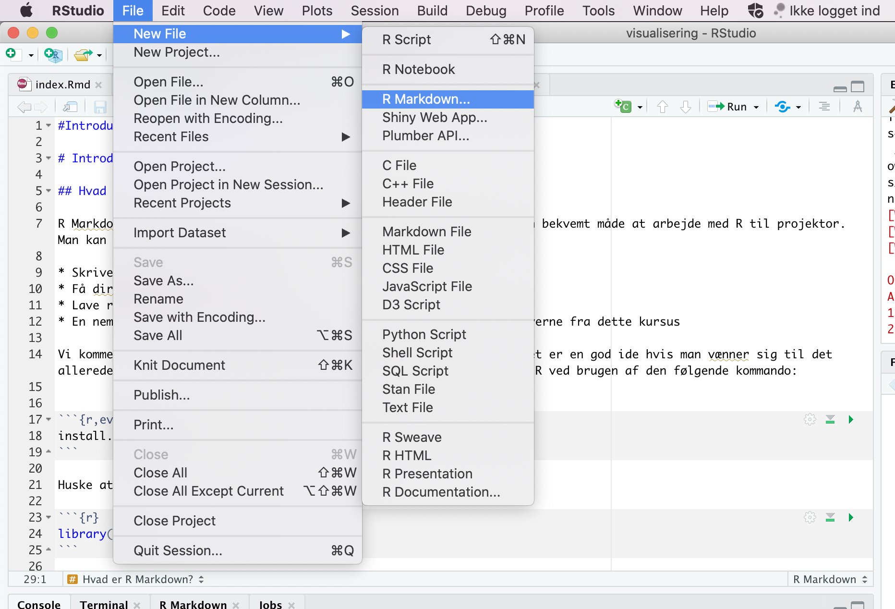
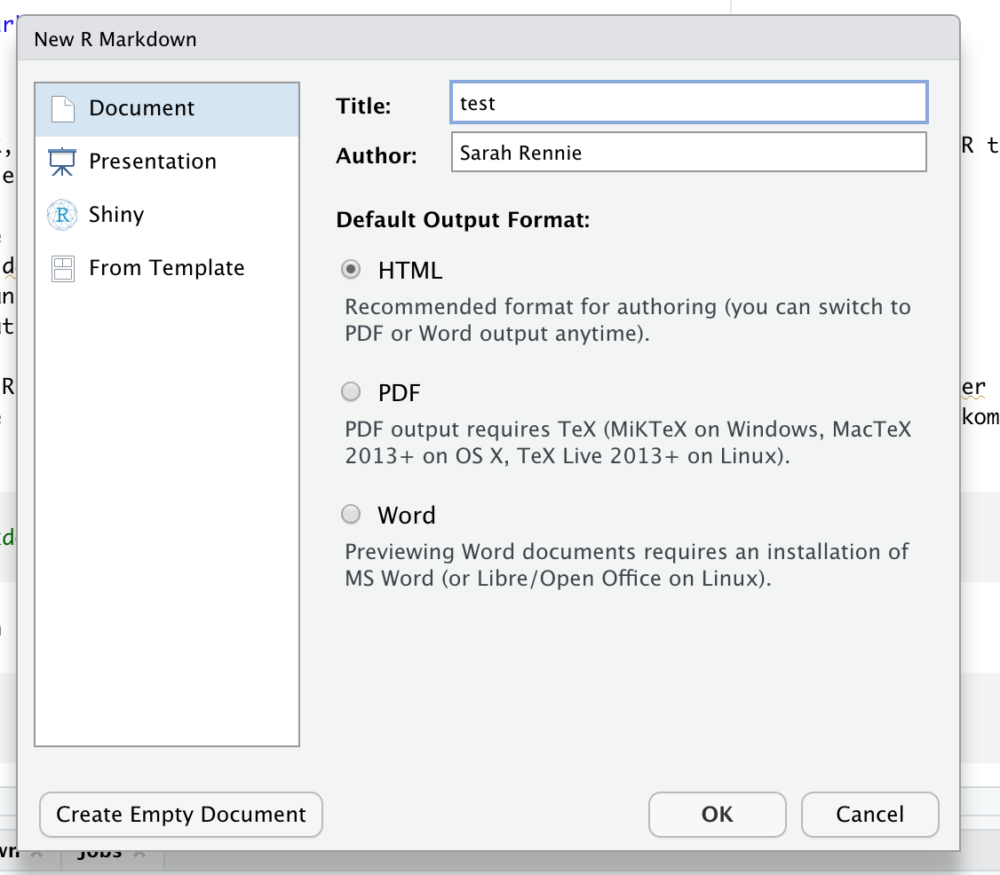
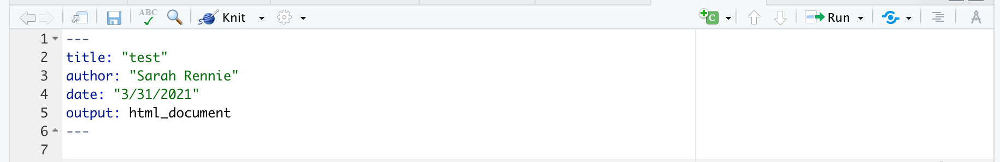
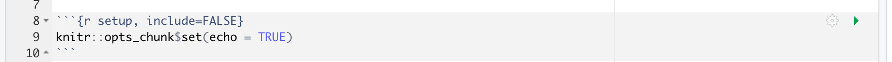

# Introduktion til R Markdown {#rmarkdown}


“Du kan aldrig krydse havet, før du har modet til at miste synet af kysten.” – Christopher Columbus

## Inledning til kapital

I dag starter vi med at arbejde med R Markdown. Emnet er kort og er designet til at hjælpe dig med at komme i gang med at bruge R Markdown i praksis. Notaterne inkluderer også nogle ekstra muligheder, så du kan indrette dit dokument efter eget ønske. Der er to videoer tilgængelige - den ene er en "quick-start guide" til at komme i gang, og den anden viser en simpel lineær regression i R Markdown. Hvis du ikke har brug for en genopfriskning, kan du stadig udforske mere af funktionaliteten i R Markdown.

Efter quizzerne og problemstillingerne er der en worksheet, hvor du kan øve dig yderligere med de typer opgaver, vi vil se i workshopperne. Fra næste gang (fredag) skifter vi emnet til visualiseringer i ggplot2, og vi vil fortsætte med at bruge R Markdown fremadrettet.

:::checklist

Checklist til Chapter 2: R Markdown

* Se videoerne
* Lav quiz (på Absalon)
* Lav problemstillinger
* Lave mini-workshop opgave (på Absalon)
:::

## Hvad er R Markdown?

R Markdown er en nem og fleksibel måde at arbejde med R i projekter på. Her kan du kombinere din R-kode, output og tekst i samme dokument og generere et pænt HTML-dokument, som potentielt kan deles med andre. Jeg anbefaler, at du bruger R Markdown til alle opgaver i kurset. 

:::pin

**OBS: Ved eksamen forventer jeg, at du afleverer et HTML-dokument til mig med din "knittede" kode fra din analyse**.
:::

## Installere R Markdown

R Markdown er, ligesom R, gratis og ‘open source’. Den fungerer indenfor RStudio and kan installeres ved at bruge den følgende kommando:


```r
install.packages("rmarkdown")
```

## Videodemonstrationer

Jeg har lavet to videoer, som du kan se nedenfor:

### Video 1

I denne video viser jeg, hvordan du:

* opretter et nyt dokument i R Markdown
* skriver tekst i dokumentet
* bruger "knit" til at lave et HTML-dokument
* opretter og kører kodechunks.


```{=html}
<div class="vembedr">
<div>
<iframe class="vimeo-embed" src="https://player.vimeo.com/video/702416505" width="533" height="300" frameborder="0" webkitallowfullscreen="" mozallowfullscreen="" allowfullscreen="" data-external="1"></iframe>
</div>
</div>
```


### Video 2

I denne video viser jeg en kort lineær regression analyse:

* Hvordan man indlæser et datasæt og laver et plot af datasættet
* En lynhurtig gennemgang af ligningen for en ret linje
* Hvordan man anvender funktionen `lm()` til at fitte en lineær model
* Fortolkning af resultaterne af modellen og deres statistiske betydning.


```{=html}
<div class="vembedr">
<div>
<iframe class="vimeo-embed" src="https://player.vimeo.com/video/701240044" width="533" height="300" frameborder="0" webkitallowfullscreen="" mozallowfullscreen="" allowfullscreen="" data-external="1"></iframe>
</div>
</div>
```


## Oprette et nyt dokument i R Markdown

Man åbner et nyt R Markdown dokument i RStudio ved at klikke på "File" > "New File" > "R Markdown...". Alternativt kan man klikke på "+" knappen i øverste venstre hjørne af RStudio vinduet og vælge "R Markdown".



Dernæst angiver man en titel (som kan ændres senere hvis nødvendigt) og specificerer, at outputtet skal være i HTML-format. I dette kursus arbejder vi kun med HTML-dokumenter, men der er også andre muligheder, som du er velkommen til at prøve (PDF/Word/Shiny osv.).




<!-- YAML Header: Controls certain output settings that apply to the entire document. -->

### YAML

Den første sektion af dokument skrives i hvad der kaldes for 'YAML'. (Dette står for 'YAML Ain’t Markup Language'). YAML-sektionen bruges til at definere en række indstillinger og metadata for dokumentet, såsom titel, forfatter, dato og outputformat. Denne sektion indrammes typisk af tre bindestreger (---) øverst og nederst:



I dette eksempel angiver vi titlen på rapporten som "test", forfatterens navn, datoen og outputformatet (HTML-dokument). Du kan tilføje yderligere indstillinger og tilpasse outputformatet ved at ændre eller udvide YAML-headeren. I de fleste tilfælde nøjes vi dog med at bruge standard indstillinger. Hvis man gerne vil lære mere om de forskellige muligheder med YAML, kan man læse her:

https://bookdown.org/yihui/rmarkdown/html-document.html

Man kan også se en liste af muligheder her på dette cheatsheet:

https://www.rstudio.com/wp-content/uploads/2016/03/rmarkdown-cheatsheet-2.0.pdf

### Globale options

Der er også tekst som ser ud som følgende:



Ved at bruge funktionen `opts_chunk$set()` kan du angive globale indstillinger, der styrer udseendet af det endelige dokument. I dette tilfælde er de fleste parametre sat til deres 'default' eller standardværdier (da de ikke nævnes eksplicit), og echo er den eneste parameter, der har en værdi angivet. Når echo er sat til `TRUE`, betyder det, at når du "knitter" din kode (processen der omdanner R Markdown-filen til et HTML-dokument, som beskrevet nedenfor), vil både den udførte kode og dens output blive vist i det genererede HTML-dokument.

Funktionen `opts_chunk$set()` giver dig mulighed for at kontrollere adskillige aspekter af dit dokument på en global måde, såsom visning af advarsler og beskeder, cacheindstillinger og grafikindstillinger. For eksempel, advarsler og beskeder undertrykkes ved at sætte `warning = FALSE` og `message = FALSE` (du kan selv afprøve dette). Bemærk, at disse globale indstillinger kan overstyres for individuelle kodeblokke, hvis det er nødvendigt.

## Skrive baseret tekst

Her er nogle brugbare muligheder for at skrive tekst i opgaverne eller rapporter:


```r
*italic*   **bold**

_italic_   __bold__
```

*italic*   **bold**

_italic_   __bold__

### Headers

Man kan også lave sektioner:


```r
# Header 1

## Header 2

### Header 3
```


### liste


```r
* Item 1
* Item 2
    + Item 2a
    + Item 2b
```

* Item 1
* Item 2
    + Item 2a
    + Item 2b

## Knitte kode

Du bruger *Knit* til at omdanne R Markdown-filen til HTML-format. Når du trykker på *Knit*-knappen, bliver alle kodeblokke i filen udført, og et HTML-dokument genereres og vises. Bemærk, at __koden udføres på ny hver gang du knitter__, uafhængigt af indholdet i dit aktuelle RStudio-workspace. Det betyder, at hvis du for eksempel har indlæst pakken `tidyverse` i dit RStudio-arbejdsområde, men har glemt at inkludere `library(tidyverse)` eksplicit i begyndelsen af dit R Markdown-dokument, vil du modtage en fejlmeddelelse, hvis du bruger funktioner fra tidyverse andre steder i dokumentet.


## Kode chunks

Du skriver R-kode inden for såkaldte "chunks" i R Markdown-dokumenter. Du kan oprette en ny kodeblok på flere måder - enten ved at klikke på knappen *Insert a new code chunk* øverst i RStudio, eller ved at trykke på *Cmd+Option+I* på tastaturet (hvis du bruger en Mac) eller *Ctrl+Alt+I* (hvis du bruger Windows). Det er værd at huske denne shortcut/genvej, da det kan spare dig meget tid i det lange løb!

Her er et eksempel af en kodechunk:


```r
# This is a chunk, let's write som R code
x <- 1
x + 1
```

```
#> [1] 2
```


For at køre en chunk skal du trykke på den grønne pil øverst i højre hjørne af selve chunk'en (der hedder *Run Current Chunk* når du holder musen over den). Resultatet kan ses lige nedenunder, som vist ovenfor.

Bemærk, at når du arbejder med dit R Markdown dokument, er det generelt hurtigere at bruge den grønne pil / *Run Current Chunk* i stedet for at knitte hele dokumentet hver gang man vil køre kode. Det skyldes, at du her kun kører den enkelte chunk i stedet for hele dokumentet på ny (herunder indlæsning af pakker og eventuelle store filer), som er tilfældet med *Knit*.

### Et godt råd når man arbejder med chunks

For længere opgaver er det god praksis løbende at sikre, at du kan generere et HTML-dokument ved at knitte, selvom du kører din chunks lokalt, mens du udvikler din kode. Med andre ord skal du sørge for, at du ikke få alvorlige fejlmeddelelser, der forhindrer din kode i at blive knittet. 

:::pin

__Det er dit ansvar at sikre, at din kode fungerer som helhed, og at du dermed kan producere et HTML-dokument med din løsninger.__  

:::

### Chunk indstillinger

I R Markdown er der mange muligheder for at styre hver enkelt chunk i dit dokument - hvordan skal R håndtere koden med hensyn til evaluering og præsentation (især med hensyn til tabeller og plots) af en bestemt chunk i dit dokument? Det afhænger meget af, hvem du gerne vil viser dit dokument til. For eksempel, i de nuværende kursusnotater vil jeg gerne have generelt, at du ser al min kode (en global indstilling), men nogle gange vil jeg foretrække noget andet - en chunk, der viser noget, jeg ikke vil have kørt, eller ændre på størrelsen på et plotte i en bestemt chunk. For eksempel ser en chunk med indstillingen `eval=FALSE` sådan ud (fjern # symbolet)


```r
#```{r,eval=FALSE}
#
#```
```

Her er nogle muligheder (sektionen "Embed code with knitr syntax"):

https://www.rstudio.com/wp-content/uploads/2016/03/rmarkdown-cheatsheet-2.0.pdf

Her er seks populære muligheder:

* `include = FALSE` 
  + forhindrer både kode og resultater i at blive vist i den færdige fil. R Markdown kører stadig koden i kodeblokken, og resultaterne kan bruges af andre kodeblokke.
* `echo = FALSE`
  + forhindrer koden, men ikke resultaterne, i at blive vist i den færdige fil. Dette er en nyttig måde at integrere figurer på.
* `message = FALSE` 
  + forhindrer beskeder, der genereres af koden, i at blive vist i den færdige fil.
* `warning = FALSE` 
  + forhindrer advarsler, der genereres af koden, i at blive vist i den færdige fil.
* `fig.cap = "..."`
  + tilføjer en billedtekst til grafiske resultater.
* `eval = FALSE`
  + evaluerer ikke koden

## R beregninger inden for teksten i dokumentet ('inline code')

I nogle tilfælde ønsker man køre R kode "inline", det vil sige, direkte inden for teksten, for eksempel inden for en sætning. Dette gøres ved at skrive på følgende måde:


```r
Her er min `kode`
```

Ovenstående ser sådan ud, når det er skrevet direkte inden for teksten:

Her er min `kode` 

I dette tilfælde, er der ikke noget R kode, der er blevet kørt. Hvis man vil køre R kode inden for teksten, skriver man (for eksempel):


```r
Det gennemsnitlige antal af observationer er `r mean(c(5,7,4,6,3,3))`
```

Ovenstående ser sådan ud, når det er skrevet direkte inden for teksten:

Det gennemsnitlige antal observationer er 4.6666667

Bemærk, at hvis man glemmer 'r', bliver koden ikke kørt:


```r
Det gennemsnitlige antal af observationer er `mean(c(5,7,4,6,3,3))`
```

giver:

Det gennemsnitlige antal af observationer er `mean(c(5,7,4,6,3,3))`

At bruge kode inline kan være en stor fordel, når man gerne vil skrive noget om an analyse, hvor man referere til forskellige statistike beregninger, som man har udført i R (eksempelvis en middelværdi eller p-værdi). Hvis man skriver eller kopierer et tal direkte, og datasættet eller analysemetoden ændre sig af en eller anden grund, bliver beregningerne inden for teksten ikke opdateret, og så risikerer man at have en fejl i den endelige rapport. Ved at bruge inline code, så opdateres beregningerne automatisk, uden at man behøver at tænke over det.

## Working directory

Bemærk at måden man sætter en working directory er ændleredes i R Markdown i forhold til base-R. Hvis man bruger `setwd()` i en chunk, sætter man kun den working directory i den pågældende chunk og ikke i de efterfølgende chunks.

I R Markdown er standarden (default), at din working directory er mappen, hvor du gemmer din .Rmd fil. Hvis du genre vil bruge andet, kan du tilføje `knitr::opts_knit$set(root.dir = '/tmp')` til din globale indstillinger chunk øverst i din fil, hvor `'/tmp'` skal ændres til din ønskede mappe.


````md
```{r, setup, include=FALSE}
knitr::opts_knit$set(root.dir = '/tmp')
```
````

## Matematik

Man kan også skrive matematik (LaTeX) i R Markdown - for eksempel vil `$\int_0^5 x^2 dx$` se ud som $\int_0^5 x^2 dx$ i dit HTML-dokument. Jeg forventer ikke, at du lærer LaTeX, men det er af og til brugbart - for eksempel en retlinjet ligning er `$y = 3.4x + 2.1$` giver $y = 3.4x + 2.1$ eller en hypotese: `$H0: \mu = 0$` giver $H0: \mu = 0$. Det er op til dig, hvor meget du bruger matematik i dine egne dokumenter.

## Problemstillinger

1) Der er en kort __quiz__ i Absalon, som hedder "Quiz - R Markdown".


2) Opret et nyt R Markdown-dokument i RStudio. Prøv at lave en liste og nogle overskrifter i forskellige størrelser.

3) Klik nu på Knit-knappen og kontroller, at et HTML-dokument vises på din skærm.

4) Rediger titlen (som er en del af din YAML-header øverst i din fil) - kald dit dokument "My first R Markdown document" og klik på `Knit` igen for at se ændringen i dit HTML-dokument.

5) Opret en ny R-kodeblok og tilføj noget kode, for eksempel:


```r
x <- rnorm(20,1,2) #make a sample of normally distributed data
plot(x)
```

* Husk genvejen CMD+OPT+I eller CTRL+WIN+I når man oprette en chunk (det sparer tid)
* Klik på den grønne pil
* Prøv også at køre en linje ad gangen med CMD+Enter/CTRL+Enter
* Lav flere chunks med forskellig kode efter eget valg
* Klik på "knit" og bemærk, at det tager længere tid at "knit" hver gang du ændrer noget, end når du bare kører chunks individuelt indenfor dit dokument


6) Klik på "hjul"-knappen i øverste højre hjørne af en af dine chunks og prøv at ændre de forskellige chunk-indstillinger. Klik på "knit" for at se, hvad der sker.


7) Hver gang du knitter, laver du et HTML-dokument. Prøv nu at lave en anden type dokument i stedet for - erstat `html_document` med `word_document` i YAML (toppen af din .Rmd fil)
  
  * Se her for endnu flere muligheder: https://bookdown.org/yihui/rmarkdown/output-formats.html 


8) Tilføj følgende chunk til dit dokument og klik på "knit". Få du en fejlmeddelelse?


```r
data(mtcars)
mtcars %>% filter(cyl==6)
```

Bemærk, at du får en fejlmeddelelse, fordi du endnu ikke har indlæst den nødvendige pakke for at få koden til at virke. Det kan ske, selvom du måske har indlæst pakken i "Console" eller i fanebladet "Packages". 

* Prøv først at køre "library(tidyverse)" i Console og derfeter prøve at knitte dit dokument igen - du får stadig en fejlmeddelelse.
* Tilføj `library(tidyverse)` __øverst i din chunk__. Nu skulle dit dokument kunne knitte.


9) Erstat linjen `output: html_document` med følgende i din YAML metadata øverst i din .Rmd fil:

```yaml
output:
  html_document:
    code_folding: hide
```

Knit og se hvad, der sker. 

* Erstat `hide` med `show` og se forskellen. 

10) Brug `$ $` til at skrive en ligning ind i teksten i din .Rmd fil. Prøv for eksempel `$\bar{x}_{i} = \frac{1}{n}\sum_{i=1}^{n} x_{i}$` og knitte dit dokument for at tjekke, om du får formlen til middelværdien.

11) (**Worksheet**) På Absalon har jeg lagt en R Markdown (.Rmd) fil kaldet "R Markdown opgave", som du kan bruge til at starte med at arbejde med R Markdown-baserede opgaver. Det kombinerer koncepter fra det forudgående kapitel om grundlæggende ting i R og statistik.

## Færdig for i dag og næste gang

Husk at sende mig eventuelle spørgsmål, som jeg kan svare på enten direkte eller i forelæsning næste gang. Næste gang begynder vi at arbejde vi med R-pakken `ggplot2`, der bruges til at lave høj kvalitet visualiseringer fra datasæt.

## Ekstra links

* Her er en 'quick tour' https://rmarkdown.rstudio.com/authoring_quick_tour.html

* Handy R Markdown Cheatsheet: RStudio has published numerous cheatsheets for working with R, including a detailed cheatsheet on using R Markdown! The R Markdown cheatsheet can be accessed from within RStudio by selecting _Help > Cheatsheets > R Markdown Cheat Sheet_.
