# Visualisering - ggplot2 dag 1 {#visual1}


"Visualisering giver dig svar på spørgsmål, du ikke vidste, du havde." -- Ben Schneiderman

<!-- Local vs global aes -->

## Læringsmålene og videoer

Dette kapitel giver en introduktion til, hvordan man visualiserer data med R-pakken **ggplot2**. Du skal være i stand til at:

:::goals
-   Forstå hvad "Grammar of Graphics" betyder og sammenhængen med den **ggplot2**-pakke
-   Lære at bruge funktionen `ggplot` og den relevante **geoms** (`geom_point()`, `geom_bar()`, `geom_histogram()`, `geom_boxplot()`, `geom_density()` `geom_line()`)
-   Lave en 'færdig' figur med en titel og korrekte etiketter på akserne
-   Begynde at arbejde med farver og temaer
:::

### Hvad er **ggplot2**?

De fleste i kurset har brugt funktionen `plot()`, som er den standard base-R funktion til at lave et plot. Man kan fortsætte med at bruge plotfunktioner fra base-pakken, men det kan være meget tidskrævende, især når man vil lave mere komplekse og pænere plots.

En alternativ løsning er pakken **ggplot2**, som står for "Grammar of Graphics" (se nærmere forklaring nedenfor). **ggplot2** er den mest populær pakke fra **tidyverse**. Som vi vil se i dette kapitel, har den en ret logisk tilgang, hvor man opbygger et plot i forskellige komponenter. Det kan virke uoverskueligt i starten, men når man først har lært det, er det faktisk meget intuitivt. Det nyttige i at lære **ggplot2** kan også ses når man begynder at integrere de andre **tidyverse**-pakker fra kapitel 4.

### Brugen af materialerne

Jeg har optaget videoer, hvor jeg viser nogle 'quick-start' type eksempler i min RStudio. Videoerne er ikke designet til at indeholde alle detaljer, men til at fungere som udgangspunkt for at komme i gang med øvelserne. Vær opmærksom på, at al kode, der vises i videoerne, også kan findes i kursusnotaterne, hvis du selv vil afprøve den. Jeg anbefaler, at du bruger kursusnotaterne som en reference gennem kurset, når man arbejder på opgaverne. Vær også opmærksom på, at jeg nogle gange introducerer nye ting i selve øvelserne.

:::checklist
Checklist til Kapitel 3: ggplot2

* Se videoerne
* Kig igennem kursusnotaterne
* Lav quiz "ggplot2 - dag 1"
* Lav problemstillingerne
:::

### Video ressourcer

<!-- Link her hvis det ikke virker nedenunder: https://player.vimeo.com/video/544299069 -->

<!-- ```{r,echo=FALSE} -->

<!-- library("vembedr") -->

<!-- embed_url("https://vimeo.com/544299069") -->

<!--      embed_url("https://vimeo.com/544299069") #2022 -->

<!-- ``` -->

-   I video 1 demonstrerer jeg, hvordan man lave sit første plot med `ggplot2`.


```{=html}
<div class="vembedr">
<div>
<iframe class="vimeo-embed" src="https://player.vimeo.com/video/701245598" width="533" height="300" frameborder="0" webkitallowfullscreen="" mozallowfullscreen="" allowfullscreen="" data-external="1"></iframe>
</div>
</div>
```

-   I video 2 dækker vi boxplots.


```{=html}
<div class="vembedr">
<div>
<iframe class="vimeo-embed" src="https://player.vimeo.com/video/701245695" width="533" height="300" frameborder="0" webkitallowfullscreen="" mozallowfullscreen="" allowfullscreen="" data-external="1"></iframe>
</div>
</div>
```

<!-- OBS: jeg sagde i videoen at `alpha=0.5` gøre punkterne mere markant, men jeg mente selvfølgelige mindre markant ;) -->

-   I video 3 demonstrerer jeg barplots.


```{=html}
<div class="vembedr">
<div>
<iframe class="vimeo-embed" src="https://player.vimeo.com/video/704025240" width="533" height="300" frameborder="0" webkitallowfullscreen="" mozallowfullscreen="" allowfullscreen="" data-external="1"></iframe>
</div>
</div>
```

-   Video 4: Histogram og density plots


```{=html}
<div class="vembedr">
<div>
<iframe class="vimeo-embed" src="https://player.vimeo.com/video/703699213" width="533" height="300" frameborder="0" webkitallowfullscreen="" mozallowfullscreen="" allowfullscreen="" data-external="1"></iframe>
</div>
</div>
```

## Transition fra base R til ggplot2

Vi starter som udgangspunkt med base-R og viser, hvordan man laver et lignende plot med **ggplot2**. Til dette formål bruger vi det indbyggede datasæt, der hedder `iris`. Datasættet er meget berømt, og det er næsten sikkert, at du allerede er stødt på det uden for dette kurus, enten på nettet eller i forbindelse med andre kurser, som handler om R. Datasættet var oprindeligt samlet af statistikeren og biologen Ronald Fisher i 1936 og indeholder 50 stikprøver, der dækker forskellige målinger for hver af tre arter af planten iris (Iris setosa, Iris virginica og Iris Versicolor).


Som vi også så i grundlæggende R, kan man indlæse et indbyggede datasæt med hjælp af funktionen `data()`.


```r
data(iris)
```

Først vil vi have et overblik over datasættet. Til at gøre dette bruger vi `summary()`:


```r
summary(iris)
```

```
#>   Sepal.Length    Sepal.Width     Petal.Length    Petal.Width   
#>  Min.   :4.300   Min.   :2.000   Min.   :1.000   Min.   :0.100  
#>  1st Qu.:5.100   1st Qu.:2.800   1st Qu.:1.600   1st Qu.:0.300  
#>  Median :5.800   Median :3.000   Median :4.350   Median :1.300  
#>  Mean   :5.843   Mean   :3.057   Mean   :3.758   Mean   :1.199  
#>  3rd Qu.:6.400   3rd Qu.:3.300   3rd Qu.:5.100   3rd Qu.:1.800  
#>  Max.   :7.900   Max.   :4.400   Max.   :6.900   Max.   :2.500  
#>        Species  
#>  setosa    :50  
#>  versicolor:50  
#>  virginica :50  
#>                 
#>                 
#> 
```

Forestil, at vi gerne vil lave et plot, som viser sammenhængen mellem længden og bredden af sepal (bægerblad), eller specifikt er vi interesseret i kolonnerne `iris$Sepal.Length` og `iris$Sepal.Width`. Lad os starte med at visualisere variablerne i base-R, ved at bruge `plot`:


```r
plot(iris$Sepal.Length, iris$Sepal.Width)
```

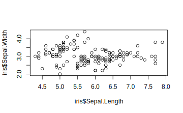

Man kan gøre det meget pænere eksempelvis ved at bruge forskellige farver til at betegne de forskellige arter, eller ved at give en hensigtsmæssig overskrift eller aksenavne.

## Vores første ggplot

Vi vil imidlertid fokusere på at lave et lignende plot med pakken `ggplot2`. Hvis man ikke allerede har gjort det, så husk at indlæse pakken i R for at få nedenstående koder til at virke.


```r
#install.packages("ggplot2") #hvis ikke allerede installeret
library(ggplot2)
```

For at lave et plot med `ggplot2` tager man altid udgangspunkt i funktionen `ggplot()`. Først specificerer vi vores data - altså at vi gerne vil bruge dataframe `iris`. Dernæst angiver vi indenfor funktionen `aes()` (som sidder indenfor `ggplot()`), at x-aksen skal være `Sepal.Length` og y-aksen `Sepal.Width`. Det ser sådan ud:


```r
ggplot(iris, aes(x=Sepal.Length, y=Sepal.Width))
```

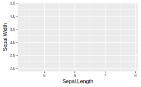

Koden fungerer, men bemærk, at plottet er helt tomt og derfor ikke særligt brugbart. Men der er skabt et grundlag (se aksenavne osv.). Det er tomt fordi vi endnu ikke har specificeret, hvilken plottype det skal være - for eksempel søljediagram/barplot, histogram, punktplot/scatter plot (jeg vælge de engelske begreber herfra for at skabe den bedste sammenhæng med koden). Vi vil gerne bruge et scatter plot, som i **ggplot2** er angivet med funktionen `geom_point()`. Vi tilslutter derfor funktionen `geom_point()` til den `ggplot()` funktion, som vi allerede har specificeret. Husk altid, at man bruger `+` til at forbinde de to "komponenter" (altså `ggplot()` og `geom_point()`) af plottet (ellers få vi fortsat et tomt plot).

Koden er således:


```r
ggplot(iris, aes(x=Sepal.Length, y=Sepal.Width)) +
  geom_point()
```

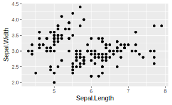

Bemærk, at vi ikke har skrevet noget indeni de runde parenteser i funktionen `geom_point()`. Det betyder, at vi accepterer alle standard- eller 'default' parametre, som funktionen tager. Hvis vi vil have noget andet end de standard parametre, kan vi godt specificere det. For eksempel kan vi gøre punkterne lidt større end ved standarden (prøve at tjekke `?geom_point()` for at se en list overfor de mulige parametre, som man kan justere):


```r
ggplot(iris, aes(x=Sepal.Length, y=Sepal.Width)) +
  geom_point(size=3)
```

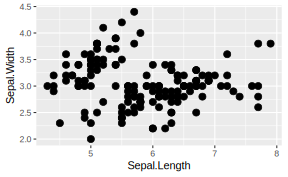

Vi har nu et plot, som vi kan sammenligne med det ovenstående plot, vi lavet i base-pakken. Ligesom i base-pakken vil vi gerne tilføje nogle ting for at gøre vores plot til vores *færdige figur*.. Her i **ggplot2** gøres det ved at tilføje flere komponenter ovenpå, med brugen af `+`, ligesom vi gjorde da vi tilføjede `geom_point()` til `ggplot()`. Første vil jeg gerne skrive nogle orde om **ggplot2** generelt, og filosofien bag.

## Lidt om ggplot2

### Syntax

Som vi har lige set, `ggplot()` tager altid udgangspunkt i en dataframe, som vi specificerer først. I `ggplot()` indeholder den dataframe variablerne vi skal bruge til at få lavet figuren. Til at gøre det til noget mere konkret, lad os sammenligne koden mellem base-pakken og `ggplot()` til vores `iris` data. I base-R angav vi direkte vektorer `iris$Sepal.Length` og `iris$Sepal.Width` som parametre `x` og `y`, der tager henholdsvis først og anden-plads i funktionen `plot()`. Til gengæld i `ggplot()`, specificerer man først den hele dataramme i den første plads, og så bagefter med brugen af `aes()` angav vi hvordan x-aksen og y-aksen ser ud.


```r
#baseplot solution
plot(iris$Sepal.Length, iris$Sepal.Width) 

#ggplot2 solution
ggplot(iris, aes(x=Sepal.Length, y=Sepal.Width)) +
  geom_point()
```

En anden fordel af `ggplot2()` er, at man kan fortsætte med at forbedre plottet ved at tilføje ting ovenpå det eksisterende plot, i hvilket kan beskrives som en lagbaseret tilgang. Dette gøres intuitivt ved at bruge "+". Man kan derfor starte med noget simpelt, og gradvist opbygge det noget mere kompleks. Dette er uafhængigt af den type plot, vi laver.

### Hvad betyder egentlig grammar of graphics?

Den `gg` i `ggplot2` står for *grammar of graphics*, og filosofien er, at man skal definere en *sætningsstruktur* til de figurer, man laver. Med andre ord består vores figur af forskellige komponenter, som man forbinder med "+"..


Her er en beskrivelse af de forskellige komponenter, som bruges til at opbygge et plot:

-   Data: Datarammer tages altid som udgangspunkt.
-   Aesthetics: Variabler til x-aksen eller y-aksen, farve, form eller størrelse
-   Scale: Skalering af værdier eller repræsentation af flere værdier
-   Geometries: Også kaldet geoms - bestemmer hvilken type plot, der skal laves, som f.eks. søjler, punkter, linjer osv.
-   Statistics: Tilføjer f.eks. mean, median eller kvartiler, som beskriver dataene.
-   Facets: Opretter subplots baseret på flere dimensioner.
-   Coordinate system: Transformerer akser og ændrer afstanden for de viste data.

### Globale versus lokale æstetik

I de fleste tilfælde bruger man funktionen `aes()` indenfor `ggplot()`, hvilket betyder, at variablerne, der er specificeret inden for `aes()`, gælder globalt over alle komponenter i plottet. Man kan faktisk også skrive en lokal `aes()` inden for selve `geom`-funktionen, som i følgende eksempel:


```r
ggplot(iris) +
  geom_point(aes(x=Sepal.Length, y=Sepal.Width))
```


Vi får det samme plot som før, men det er kun `geom_point()`, der er påvirket af specificeringen inden for `aes()`. I simple situationer som dette er der ingen forskel, men når man har mange forskellige komponenter i spil, kan det nogle gange give mening at bruge lokale æstetik.

## Specificere etiketter og titel

Vi tager udgangspunkt i plottet, som vi har lavet i ovenstående, og prøver at gøre det bedre ved at tilføje nye etiketter og en titel. I `ggplot` kan man opdatere y-akse og x-akse etiketter ved at bruge henholdsvis `ylab` og `xlab`:


```r
ggplot(iris, aes(x=Sepal.Length, y=Sepal.Width)) +
  geom_point(size=3) +
  xlab("Sepal Length") +
  ylab("Sepal Width")
```


Vi tilføjer en titel med funktionen `ggtitle()`:


```r
ggplot(iris, aes(x=Sepal.Length, y=Sepal.Width)) +
  geom_point(size=3) +
  xlab("Sepal Length") +
  ylab("Sepal Width") +
  ggtitle("Scatter plot of Sepal Width vs Sepal Length")
```

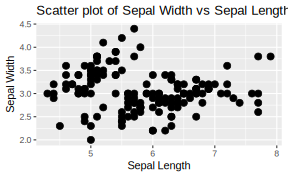

## Ændre farver

I `ggplot2` kan man bruge "automatisk" farver for at skelne mellem de tre forskellige `Species` i datasættet `iris`. I den næste lektion vil vi dække, hvordan man kan være mere fleksibel ved at sætte farver manuelt, men ofte vil vi bare bruge den nemme løsning som udgangspunkt og eventuelt rette op på det senere med en ny komponent, hvis der er behov for det. Vi skriver `color=Species` indenfor `aes()`, som i følgende eksempel. Bemærk, at der kommer en 'legend' med, der fortæller os, hvilken art, der får hvilken farve.


```r
ggplot(iris, aes(x=Sepal.Length, y=Sepal.Width,color=Species)) +
  geom_point(size=3) +
  xlab("Sepal Length") +
  ylab("Sepal Width") +
  ggtitle("Scatter plot of Sepal Width vs Sepal Length")
```

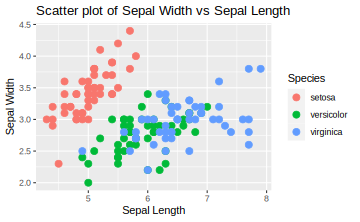

## Ændre tema

Det standard tema har en grå baggrund og "grid" linjer, men man kan godt vælge noget andet. For eksempel kan man tilføje `theme_minimal()` som i nedenstående eksempel. Her får vi en hvid baggrund i stedet, mens man stadig får grid linjer. Man kan afprøve forskellige temaer (for eksempel `theme_classic()`, `theme_bw()`), og se, hvilket tema, der fungerer bedst i det enkelte plot.


```r
ggplot(iris, aes(x=Sepal.Length, y=Sepal.Width,color=Species)) +
  geom_point(size=3) +
  xlab("Sepal Length") +
  ylab("Sepal Width") +
  ggtitle("Scatter plot of Sepal Width vs Sepal Length") +
  theme_minimal()
```

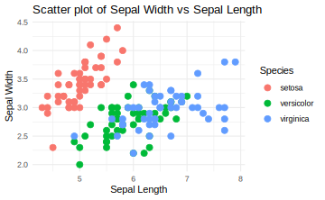

Her er nogle eksempler på mulige temaer, som du kan bruge i dine plotter (det er dog generelt op til dig).

| tema              |
|-------------------|
| `theme_grey()`    |
| `theme_classic()` |
| `theme_bw()`      |
| `theme_dark()`    |
| `theme_minimal()` |
| `theme_light()`   |
| `theme_clean()`   |

Se også her, hvis du er interesseret i flere temaer: <https://r-charts.com/ggplot2/themes/>

## Forskellige geoms

Indtil videre har vi kun arbejdet med `geom_point()` for at lave et scatter plot, men der er også andre "geoms", som kan bruges til forskellige typer af plots. Her er en liste over nogle af de mest almindelige `geoms`:

| geom               | plot         |
|--------------------|--------------|
| `geom_point()`     | scatter plot |
| `geom_bar()`       | barplot      |
| `geom_boxplot()`   | boxplot      |
| `geom_histogram()` | histogram    |
| `geom_density()`   | density      |

For at lave disse `geoms`, skal man tilføje dem til `ggplot()`-kommandoen ved at bruge `+`, på samme måde som vi gjorde med `geom_point()`. Der kan dog være specifikke overvejelser, der er værd at have i tankerne for nogle plot-typer, før man bruger dem.

### Boxplot (`geom_box`)

For at lave et boxplot af `Sepal.Length` opdelt efter `Species`, angiver vi `Species` på x-aksen og `Sepal.Length` på y-aksen. Vi vil også have, at hver art få sin egen farve, så bruger vi `fill=Species`.


```r
ggplot(data=iris, aes(x=Species, y=Sepal.Length,fill=Species)) + 
  geom_boxplot() + 
  ylab("Sepal Length") + 
  ggtitle("Boxplot") +
  theme_minimal()
```

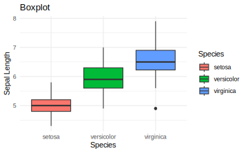

**Lave punkter ovenpå**

Det kan ofte være nyttigt at plotte de faktiske datapunkter oven på et boxplot, så man kan se både fordelingen i dataene samt de rå data. En løsning er at benytte `geom_point()` ved at tilføje det som komponent over vores eksisterende kode.


```r
ggplot(data=iris, aes(x=Species, y=Sepal.Length,fill=Species)) + 
  geom_boxplot() + 
  geom_point() + 
  ylab("Sepal Length") + 
  ggtitle("Boxplot with points overlayed") + 
  theme_minimal()
```

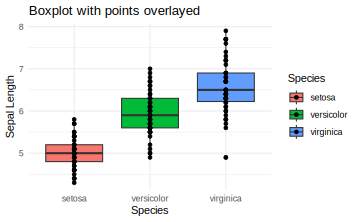

Man kan dog se, at det ikke er særlig informativt, da alle punkter er på den samme lodrette linje. Hvis der er mange punkter med samme eller næsten samme værdier, kan man ikke se de fleste af dem i plottet. En bedre løsning er at indføre noget tilfældighed i punkterne langs x-aksen, så at man tydeligere kan se dem. Dette kaldes "jitter", og man specificere jitter ved at bruge `geom_jitter()` i stedet for `geom_point()`.


```r
ggplot(data=iris, aes(x=Species, y=Sepal.Length,fill=Species)) + 
  geom_boxplot() + 
  geom_jitter() +
  ylab("Sepal Length") + 
  ggtitle("Boxplot with jitter") + 
  theme_minimal()
```

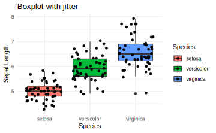

Man kan også specificere `alpha`, som gøre punkterne mere gennemsigtige og mindre markante. Man kan også ændre på `width`, som kontrollerer deres spredning langs x-axsen.


```r
ggplot(data=iris, aes(x=Species, y=Sepal.Length,fill=Species)) + 
  geom_boxplot() + 
  geom_jitter(alpha=0.5,width=0.2) +
  ylab("Sepal Length") + 
  ggtitle("Boxplot with jitter and transparency") + 
  theme_minimal()
```

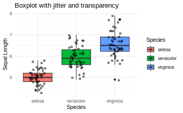

**Fjerne legend hvis unødvendige**

<!-- ### this doesn't work great - find out why  -->

Man kan se, at når man specificerer farver, får man en legende på højre side af plottet. I dette tilfælde er det faktisk ikke nødvendigt, da man kan se uden legende, hvad de tre boxplots refererer til. Derfor fjerner vi legenden fra plottet ved at bruge `theme(legend.position="none")`.


```r
ggplot(data=iris, aes(x=Species, y=Sepal.Length,fill=Species)) + 
  geom_boxplot() + 
  geom_jitter() +
  ylab("Sepal Length") + 
  ggtitle("Boxplot with jitter and no legend") +
  theme(legend.position="none")
```

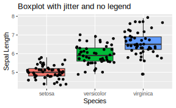

Man kan, som alternativ til ovenstående, fjerne legend ved at tilføje `show.legend = FALSE` som indstilling i den `geom`, der generere den. Være opmærksomme på, at i dette tilfælde skal man skrive `show.legend = FALSE` i både `geom_boxplot()` og `geom_jitter()` funktioner for at få legenden helet fjernet.


```r
ggplot(data=iris, aes(x=Species, y=Sepal.Length,fill=Species)) + 
  geom_boxplot(show.legend = FALSE) + 
  geom_jitter(show.legend = FALSE) +
  ylab("Sepal Length") + 
  ggtitle("Boxplot with jitter and no legend") 
```

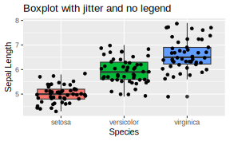

### Barplot (`geom_bar`)

Med `ggplot()` kan man repræsentere data i et barplot ved at bruge `geom_bar()`. Her vil vi gerne tælle antallet af observationer for hver art (variablen `Species`) og visualisere dem som søjler. Indenfor `geom_bar()` specificerer vi derfor `stat="count"`.

Vi bruger også `fill=Species` for at lave en forskellig farve automatisk for hver af de tre arter. Bemærk, at det var color=Species i det forudgående plot, når vi anvendte `geom_point()`. Det skyldes, at `color` bruges til punkter og linjer, mens `fill` er til større områder, der bliver udfyldt, såsom søjler og histogrammer.


```r
ggplot(iris, aes(x=Species,fill=Species)) + 
  geom_bar(stat = "count") +
  ggtitle("Number of observations by species") +
  theme_minimal()
```

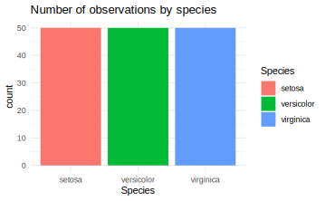

**Barplot: stack vs dodge**

Hvis man har flere katagoriske variabler, kan man lave barplots på forskellige måder. Da der er en ekstra katagorisk variabel i datasættet, laver jeg én, der hedder `Sepal.Group`, der skelne imellem `Long` og `Short` værdier af variablen `Sepal.Length`. Her specificerer jeg bare (med funktionen `ifelse()`), at hvis `Sepal.Length` er længere end den gennemsnitlige `Sepal.Length`, så er det betragtet `Long`, ellers er det `Short`, som i følgende:


```r
iris$Sepal.Group <- 
  ifelse(iris$Sepal.Length>mean(iris$Sepal.Length),  #test
         "Long",                                     #if TRUE
         "Short")                                    #if FALSE
```

Når jeg laver en barplot med de to variabler, tilføjer jeg `Sepal.Group` med `fill`, og `ggplot` splitter antal observationer efter `Sepal.Group` med farver som repræsenterer `Sepal.Group`, og tilføjer en tilsvarende legende.


```r
ggplot(iris, aes(x=Species, fill=Sepal.Group)) + 
  geom_bar(stat = "count") +
  ggtitle("Number of observations by species") +
  theme_minimal()
```

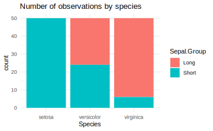

Mange gange foretrækker man at få søjlerne stående ved siden af hinanden i stedet for at overlappe. Dette kan opnås ved blot at tilføje `position="dodge"` ind i `geom_bar()`.


```r
ggplot(iris, aes(x=Species, fill=Sepal.Group)) + 
  geom_bar(stat = "count", position = "dodge") +
  ggtitle("Number of observations by species") +
  theme_minimal()
```

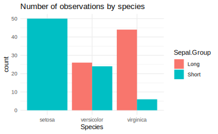

Som et eksempel på fleksibiliteten i pakken `ggplot2`, kan jeg nævne, at det kan være irriterende, når bredden af søjlen for arten setosa i et barplot er dobbelt så bred som de andre søjler, fordi der ikke er nogen observationer i setosa-gruppen med en "Long" værdi i variablen `Sepal.Group`. En løsning på dette kan findes ved at tilføje `position=position_dodge2(preserve = "single")` i `geom_bar()`. Denne parameter gør bredden på alle søjler ens, uanset om der er data i alle kategorier eller ej.


```r
ggplot(iris, aes(x=Species, fill=Sepal.Group)) + 
  geom_bar(stat = "count", position = position_dodge2(preserve = "single")) +
  ggtitle("Number of observations by species") +
  theme_minimal()
```

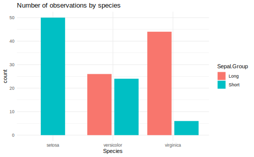

### Histogram (`geom_histogram`)

<!-- Her præsenterer jeg to yderligere brugbart plot typer. -->

Et histogram bruges til at give et overblik over, hvordan dataene fordeler sig. Med `ggplot2` kan man lave et histogram med `geom_histogram()`. Den x-akse variabel skal være en kontinuerlig variabel. Her specificerer vi, at vi gerne vil have et histogram for hver art (Species).


```r
ggplot(data=iris, aes(x=Sepal.Length, fill=Species)) + 
  geom_histogram() + 
  xlab("Sepal Length") + 
  ggtitle("Iris histogram") + 
  theme_minimal()
```

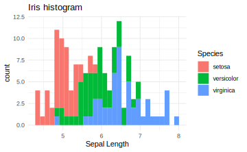

Man kan også gøre det nemmere at skelne mellem de tre arter ved at sætte `alpha=0.5` inden for `geom_histogram` og ved at angive en linje farve som mulighed ind i `geom_histogram()`.


```r
ggplot(data=iris, aes(x=Sepal.Length, fill=Species)) + 
  geom_histogram(alpha=0.5,color="black") + 
  xlab("Sepal Length") + 
  ggtitle("Iris histogram") + 
  theme_minimal()
```

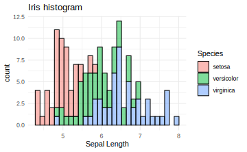

### Density (`geom_density`)

Med et density plot kan man, ligesom med et histogram, se fordelingen af dataene i form af en glat eller "smooth" kurve.


```r
ggplot(data=iris, aes(x=Sepal.Length, color=Species)) + 
  geom_density() + 
  xlab("Sepal Length") + 
  ggtitle("Density plot") +
  theme_minimal()
```

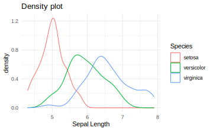

**Density plot med fill og gennemsigtig farver**

Vi kan angive en værdi for `alpha` indenfor `geom_density()`. Den parameter `alpha` specificerer gennemsigtigheden af de density kurver i plottet.


```r
ggplot(data=iris, aes(x=Sepal.Length, fill=Species)) + 
  geom_density(alpha=0.5) + 
  xlab("Sepal Length") + 
  ggtitle("Density plot with alpha=0.5") +
  theme_minimal()
```

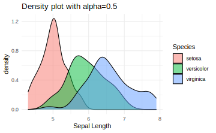

**Tilføje middelværdi linjer**

Vi bruger funktionen `tapply()` til at beregne middelværdierne af `Sepal.Length` for hver af de tre `Species`. Vi kan derefter tilføje dem som lodrette linjer til vores plot. Her bruger vi `geom_vline()` (OBS det er `geom_hline()`, hvis man vil have en vandret linje) og fortæller, at `xintercept` skal være lig med de middelværdier, som vi har beregnet. Parameteren `lty=2` betyder, at vi gerne vil have en stiplede ("dashed") linje.


```r
means <- tapply(iris$Sepal.Length,iris$Species,median)

ggplot(data=iris, aes(x=Sepal.Length, color=Species)) + 
  geom_density(alpha=0.5) + 
  xlab("Sepal Length") + 
  ggtitle("Density plot with alpha=0.5") + 
  geom_vline(xintercept = means,lty=2) + 
  theme_minimal()
```

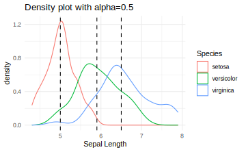

### Line plot (`geom_line()`)

`geom_line()` kan bruges til at lave linjediagrammer. Her indlæser jeg datasættet population og laver en delmængde til landene i Skandinavien.


```r
library(tidyr)
data(population)
population_scand <- population[population$country %in% c("Denmark","Sweden","Norway","Finland"),]
head(population_scand)
```

```
#> # A tibble: 6 × 3
#>   country  year population
#>   <chr>   <dbl>      <dbl>
#> 1 Denmark  1995    5232582
#> 2 Denmark  1996    5254383
#> 3 Denmark  1997    5276683
#> 4 Denmark  1998    5298680
#> 5 Denmark  1999    5319410
#> 6 Denmark  2000    5338283
```

Når tallene i variablen `population` er ret store, kan det være en god idé at normalisere, så de betegner befolkningsstørrelser i millioner.


```r
population_scand$population <- population_scand$population/1e06
```

Her laver jeg et plot med `geom_line()`, så vi kan se udviklingen i befolkningsstørrelserne over tid. For at få det til at virke, skal man huske at angive `group` inden for `aes()`, udover at man specificerer farven med `colour`:


```r
ggplot(data = population_scand, aes(x = year, y = population, group = country, colour = country)) +
  geom_line() +
  labs(title = "Populations in Scandinavia over time", x = "År", y = "Befolkningsstørrelse i millioner") +
  theme_minimal()
```

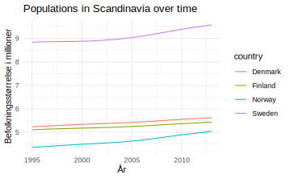

## Troubleshooting

Her er blot en lille liste over nogle ting, der kan forårsage fejl, når man kører kode med `ggplot2`. Jeg tilføjer også andre ting, som kan opstå i vores lektion :).

:::pin
* `ggplot(data=iris, aes(....))`: Husk her, at `data=iris` er korrekt og **ikke** `Data=iris` (R skelner mellem store og små bogstaver). Man kan også undlade at bruge `data=` og skrive bare `iris` i stedet for.

* Forkert stavning: Dobbelttjek, at du har stavet variabel- eller funktionsnavne korrekt.

* Glemt `+`-symbol: For at forbinde komponenterne i plottet skal man huske at tilføje `+` i slutningen af en linje og skrive de næste komponenter bagefter (man behøver ikke at skrive hver komponent på en ny linje, men det gør det nemmere at læse koden).

* Skrev `%>%`-symbolet i stedet for `+`: De øvrige pakker fra **tidyverse** bruger `%>%`.

* Glemt parentes: Her har man glemt den sidste parentes, der skal være `fill=Species))` og **ikke** `fill=Species)`. Man får bare en `+`, fordi R forventer, at man fortsætter med at skrive mere kode.


```r
> ggplot(data=iris, aes(x=Sepal.Length, fill=Species)
+ 
```

* `fill` og `colour` - indenfor `aes()` refererer `fill` til at man fylder fk. bars eller regioner med farver, og `colour` referere til farven af linjer eller punkter.
:::

## Problemstillinger

**1)** Quiz på Absalon - den hedder `Quiz - ggplot2 part 1`.

*OBS: Husk at lave følgende øvelser i R Markdown. Det er god praksis at sikre, at jeres dokument kan knitte - i selve eksamen afleverer du et html dokument.*

-   *Lav et nyt R Markdown-dokument og fjern eksempelkoden. Husk at oprette en ny chunk ved at trykke på "Insert" ny chunk" eller bruge genvejstastene CMD+ALT+I eller CTRL+ALT+I. Jeg anbefaler at oprette en ny chunk for hver plot, I laver.*

Vi bruger datasættet `diamonds`. Husk at først indlæse dataene:


```r
data(diamonds)
```

Her er beskrivelsen af `diamonds`:

*Prices of over 50,000 round cut diamonds:* a dataset containing the prices and other attributes of almost 54,000 diamonds.

Se også `?diamonds` for en beskrivelse af variablerne.

**2)** Brug datasættet `diamonds` til at lave et scatter plot (`geom_point()`):

-   `caret` på x-aksen
-   `price` på y-aksen

Så at du har noget at sammenligne med, skal dit plot se sådan ud:


**3)** Tilføj følgende komponenter til dit plot fra **2)**:

-   En x-akse label (`xlab()`) og en y-akse label (`ylab()`)
-   En titel (`ggtitle()`)
-   Et tema som hedder `theme_bw()`
-   Husk at forbinde komponenterne med `+` og skriv de nye komponenter på deres egen linje.

Det skal se sådan ud:


**4)** Ændr temaet på dit plot til `theme_classic()` eller `theme_minimal()` i stedet for `theme_bw()` og se på resultatet.

-   Hvis man (måske ved et uheld) skriver **to** temaer på samme tid (f.eks. `+ theme_bw() + theme_classic()`), hvilket tema vil så blive anvendt i plottet?
-   Valgfri ekstra: her er nogle flere temaer, du kan prøve: <https://ggplot2.tidyverse.org/reference/ggtheme.html>

**5)** Lav det samme plot som i **3)**, og skriv `color=color` ind i `aes()`. Den første `color` refererer til punkt farver og den anden til variablen `color` i dataframen.

-   Nu fjern `color=color` fra funktionen `aes()` og i stedet tilføj `aes(color=color)` i funktionen `geom_point()`. Får du så samme resultat?

<!-- * Tilføj også `x=depth` til din nye lokale `aes()` funktion indenfor `geom_point()` - hvad får du på x-aksen? Passer etiketten på x-aksen?   -->

-   Bemærk at det er lige meget om man bruger britisk eller amerikansk stavning i `ggplot2` - fk. `colour` eller `color` ind i `aes()` giver samme resultat.

**6)** Bemærk at `diamonds` er en ret stort datasæt. Tjek, hvor mange observationer datasættet har, og dernæst prøve følgende:

- Anvend `sample()`-funktionen til at udtrække kun 1000 række tilfædigvis fra datasættet og lav dit punkt-plot igen (OBS se Kapitel 1 hvis du er usikker om brugen af `sample()`).

- En mulig løsning, der bruger hele datasættet men uden at have mange punkter på plottet, er at lave en contour plot ved at erstatte `geom_point()` med  `geom_density_2d()` i stedet for. Prøv det.

Det ser sådan ud (OBS: jeg bruger indstilling `bins=50` ind i `geom_density_2d()` men prøv gerne at justere på antallet af bins).

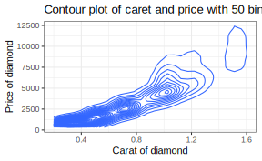
Som ekstra kan du som alternativ prøve indstilling `geom = "polygon"` ind i `stat_density_2d`.  [Der er andre muligheder here](https://r-charts.com/correlation/contour-plot-ggplot2/)

**7)** Brug stadig `diamonds`, til at lave et boxplot:

-   `cut` på x-aksen (giv x-aksen label `Cut`)
-   `price` på y-aksen (giv y-aksen label `Price of diamond`)
-   bruge `fill` til at give forskellige farver til de mulige værdier af `cut`.
-   bruge temaet `theme_bw()`

Det skal se sådan ud:

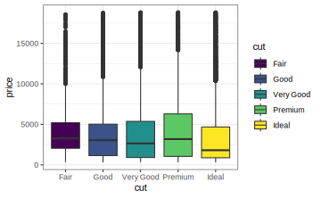

-   Hvordan ser det ud, hvis man bruger `colour` i stedet for `fill`? Eller hvis man specificerer begge to?

**8)** Lav følgende ekstra ændringer til din boxplot fra ovenstående:

-   Tilføj `geom_jitter()` til din boxplot
-   fjern legend ved at tilføj `theme(legend.position="none")`
-   Man kan også tilføj `show.legend=FALSE` til både `geom_boxplot()` og `geom_jitter()` i stedet for - prøv det i stedet for at bruge `theme(legend.position="none")`. Er det nok at tilføje `show.legend=FALSE` til kun én af de to geoms?

Det skal se sådan ud:


-   Man kan også prøve at forbedre plottet ved at give nogle indstillinger ind i `geom_jitter()`, for eksempel kan man prøve `geom_jitter(size=.2,color="grey",alpha=0.5)` for at gøre punkter mindre overbelastende i plottet (eller kan man overvejer at fjerne dem).

Leg med de tre indstillinger `size`, `color` og `alpha` og se på forskellen. Her er en note om `alpha`:

*Alpha refers to the opacity of a geom. Values of alpha range from 0 to 1, with lower values corresponding to more transparent colors.* <https://ggplot2.tidyverse.org/reference/aes_colour_fill_alpha.html>

-   Prøv at skifte rækkefølgerne af `geom_jitter()` og `geom_boxplot()` i dit plot kommando og se - gøre det en forskel til, hvordan plottet ser ud?

**9)** Lav en barplot med indstillingen `stat="count"`:

-   Variablen `clarity` på x-aksen
-   Forskellige farver til gruppevariablen `cut`
-   Specificer `position="dodge"` for at få bars ved siden af hinanden
-   Brug også indstillingen `color="black"` og noter effekten
-   Tilføj et tema.

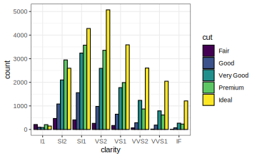

**10)** Lav en histogram

-   Variablen `depth` på x-aksen
-   Forskellige farver til gruppevariablen `cut`
-   Brug indstilling `alpha` til at ændre gennemsigtigheden af søljerne
-   Giv søjlerne en sort ramme
-   Tilføj et tema osv.

Det ser sådan ud:

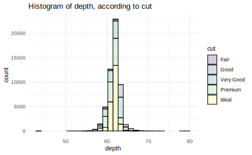

-   Nu får du en advarsel - gør hvad advarselen siger og ændre på parameteren `bins` ind i `geom_histogram()`-funktionen.

**11)** Lav et density plot:

-   Det kan være svært at sammenligne fordelingerne i de tidligere oprettede histograms.
-   Erstat `geom_histogram` med `geom_density` i din kode fra **9)**.
-   Er det nu lettere at sammenligne fordelingerne efter de forskellige niveauer af `cut`?
-   Tilføj lodrette linjer med beregnede medianværdier af variablen `depth` for hver af de `cut`-niveauer.
    -   Hint: Brug `tapply` til at beregne medianværdierne og `geom_vline` til at tilføje lodrette linjer.

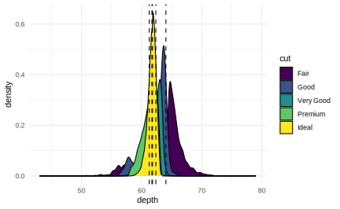

**12)** Lav et line plot.

Åbn datsættet `BOD`:


```r
data(BOD)
#BOD: This dataset contains the biochemical oxygen demand (BOD) of water samples taken at different time points.
```

Lav et line plot (`geom_line()`)

-   variablen `Time` på x-aksen
-   variablen `demand` på y-aksen
-   vælg selv ettiketter, title og tema


**13** Lav et line plot (`geom_line()`)

Åbn datasættet `CO2`:


```r
data(CO2)
```

Lav en delmængde til typen "Quebec" (variablen `Type`):


```r
CO2_subset <- CO2[CO2$Type=="Quebec",]
```

Brug din delmængde til at lave et line plot med variablen `conc` på x-aksen, variablen `uptake`. Dit plot bør have seks linjer (en til hver `Plant`) og linjerne farves efter behandlingsmetode (variablen `Treatment`).


**14)** En ekstra øvelse: Leg frit med at lave andre plots fra `diamonds` med ggplot2. For eksempel:

-   Boxplots med `carat` opdelt efter `clarity`.
-   Barplots for de forskellige farver (variable `color`).
-   Et scatter plot af `depth` vs `price`.

I alle tilfælde, tilføj akse-labels, en titel, et tema osv.

## Næste gang

Efter at have lavet disse øvelser vil man kunne se, at der er rigtig meget fleksibilitet involveret i at lave et plot med `ggplot2`. Næste lektion vil vi fortsætte med andre plot-typer og lære, hvordan man manuelt kan vælge farver.
