# Visualisering - ggplot2 dag 2 {#visual2}


## Læringsmål og videoer

I det nuværende emne udvider du værktøjskassen af kommandoer i pakken __ggplot2__, så at du kan opnå større fleksibilitet og appel i dine visualiseringer. Jeg anbefaler, at du bruger notaterne som en form for reference samtidig at du arbejder med problemstillingerne.

:::goals
Du skal være i stand til at:

* Arbejde fleksibelt med koordinatsystemer - transformere, modificere og "flip" x- og y-aksen.
* Udvide brugen af farver og former.
* Tilføje tekst direkte på plottet ved hjælpe af `geom_text()` og `geom_text_repel()`.
* Bruge `facet_grid()` eller `facet_wrap()` til at opdele plots efter en katagorisk variabel.
:::


:::checklist
Checklist til Kapitel 4: ggplot2 (dag 2)

* Se videoerne
* Kig igennem kursusnotaterne
* Lav quiz "ggplot2 - dag 2"
* Lav problemstillingerne
:::

### Video ressourcer

* Video 1: Koordinat systemer


```{=html}
<div class="vembedr">
<div>
<iframe class="vimeo-embed" src="https://player.vimeo.com/video/544201985" width="533" height="300" frameborder="0" webkitallowfullscreen="" mozallowfullscreen="" allowfullscreen="" data-external="1"></iframe>
</div>
</div>
```

* Video 2: Farver og punkt former 


```{=html}
<div class="vembedr">
<div>
<iframe class="vimeo-embed" src="https://player.vimeo.com/video/544218153" width="533" height="300" frameborder="0" webkitallowfullscreen="" mozallowfullscreen="" allowfullscreen="" data-external="1"></iframe>
</div>
</div>
```

* Video 3: Labels - `geom_text()` og `geom_text_repel()`


```{=html}
<div class="vembedr">
<div>
<iframe class="vimeo-embed" src="https://player.vimeo.com/video/939254856" width="533" height="300" frameborder="0" webkitallowfullscreen="" mozallowfullscreen="" allowfullscreen="" data-external="1"></iframe>
</div>
</div>
```


* Video 4 - Facets


```{=html}
<div class="vembedr">
<div>
<iframe class="vimeo-embed" src="https://player.vimeo.com/video/704140333" width="533" height="300" frameborder="0" webkitallowfullscreen="" mozallowfullscreen="" allowfullscreen="" data-external="1"></iframe>
</div>
</div>
```


## Koordinat systemer

Her arbejder vi videre med koordinater i pakken __ggplot2__.

### Zoom (`coord_cartesian()`, `expand_limits()`)

Man kan bruge funktionen `coord_cartesian()` til at zoome ind på et bestemt område på plottet. __Indenfor__ `coord_cartesian()` angives `xlim()` og `ylim()`, som specificerer de øvre og nedre grænser langs henholdsvis x-aksen og y-aksen. Man kan også bruge `xlim()` og `ylim()` uden om `coord_cartesian()`, men i dette tilfælde bliver punkterne, som ikke kan ses i plottet (fordi deres koordinater ligger udenfor de angivne grænser), smidt væk (med en advarsel). Med `coord_cartesian()` beholder man til gengæld samtlige data, og man får således ikke en advarsel.

Nedenfor ses vores oprindelige scatter plot:


```r
ggplot(iris, aes(x = Sepal.Length, y = Sepal.Width,color = Species)) +
  geom_point() + 
  theme_minimal() 
```


Og her anvender jeg funktionen `coord_cartesian()` med `xlim()` og `ylim()` indenfor til at zoome ind på et ønsket område på plottet.


```r
ggplot(iris, aes(x = Sepal.Length, y = Sepal.Width,color = Species)) +
  geom_point() + 
  coord_cartesian(xlim = c(4,6), ylim = c(2.2,4.5)) +
  theme_minimal() 
```

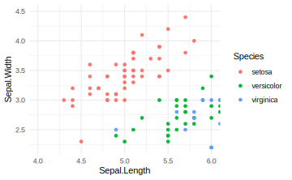

Du kan også zoome ud ved at bruge `expand_limits()`. For eksempel, hvis jeg gerne vil have punkterne $x = 0$ og $y = 0$ (`c(0,0)`, eller "origin") med i selve plottet:


```r
ggplot(iris, aes(x=Sepal.Length, y=Sepal.Width,col=Species)) +
  geom_point() + 
  expand_limits(x = 0, y = 0) +
  theme_minimal() 
```


Det kan være brubart i situationer, hvor man for eksempel har flere etiketter omkring punkterne i selve plottet, som bedre kan ses, hvis man tillader lidt ekstra plads i plottets område.  

### Transformering af akserne - log, sqrt osv (`scale_x_continuous`).

Nogle gange kan det være svært at visualisere visse variabler på grund af deres fordeling. Hvis der er mange outliers i variablen, vil de fleste punkter samles i et lille område i plottet. Transformering af x-aksen og/eller y-aksen med enten `log` eller `sqrt` er især en populær tilgang, så dataene kan ses på en mere informativ måde.


```r
ggplot(iris, aes(x=Sepal.Length, y=Sepal.Width,col=Species)) +
  geom_point(size=3) + 
  scale_x_continuous(trans = "log2") +
  scale_y_continuous(trans = "log2") +
  theme_minimal() 
```

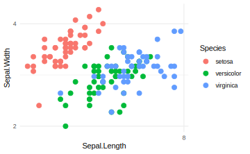

Man kan også prøve at bruge "sqrt" i stedet for "log2". Formålet er, at hvis dataene fordeler sig mere normalt, kan de nemmere visualiseres i et plot ved at transformere dem med enten "sqrt" eller "log2".

Det er dog vigtigt at bemærke, at dette er forskelligt fra at transformere selve dataene, som bruges i plottet. Jeg kan for eksempel opnå det samme resultat ved at ændre datasættet, før jeg anvender `ggplot2`. Her behøver jeg ikke at bruge `scale_x_continuous(trans = "log2")`, men jeg bemærker, at tallene på akserne reflekterer de transformerede data og ikke de oprindelige værdier. Beslutningen afhænger af, hvad man gerne vil opnå med analysen af dataene.


```r
iris$Sepal.Length <- log2(iris$Sepal.Length)
iris$Sepal.Width <- log2(iris$Sepal.Width)
ggplot(iris, aes(x=Sepal.Length, y=Sepal.Width,col=Species)) +
  geom_point(size=3) +
  theme_minimal() 
```

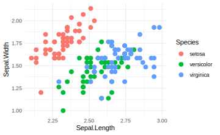


### Flip coordinates (`coord_flip`)

Vi kan bruge `coord_flip()` til at spejle x-aksen på y-aksen og omvendt (det svarer til at drejer plottet 90 grader). Se følgende eksempel, hvor jeg først opretter variablen `Sepal.Group`, laver en barplot og anvender `coord_flip` for at få søjlerne til at stå vandret.


```r
#Sepal.Group defineret som i går
iris$Sepal.Group <- ifelse(iris$Sepal.Length>mean(iris$Sepal.Length),"Long","Short")

ggplot(iris,aes(x=Species,fill=Sepal.Group)) + 
  geom_bar(stat="count",position="dodge",color="black") +
  coord_flip() +
  theme_minimal()
```


Man kan ændre rækkefølgen af de tre `Species` ved at bruge funktionen `scale_x_discrete()` og angive den nye rækkefølge med indstillingen `limits`:


```r
ggplot(iris,aes(x=Species,fill=Sepal.Group)) + 
  geom_bar(stat="count",position="dodge",color="black") +
  coord_flip() +
  scale_x_discrete(limits = c("virginica", "versicolor","setosa")) +
  theme_minimal()
```


## Mere om farver og punkt former

Der er flere måder at specificere farver på i `ggplot2`. Man kan nøjes med den automatiske løsning, som er hurtig (og effektiv i mange situationer), eller man kan bruge den manuelle løsning, som tager lidt længere tid at kode, men er brugbar, hvis man gerne vil lave et plot til at præsentere for andre.

### Automatisk farver

Vi i det sidste emne, at man automatisk kan få forskellige farver ved at benytte `colour=Species` indenfor `aes()` i den `ggplot()` funktion.


```r
#automatisk løsning
ggplot(iris, aes(x=Sepal.Length, y=Sepal.Width, colour=Species)) +
  geom_point() +
  theme_minimal() 
```


### Manuelle farver

Hvis man foretrækker at bruge sine egne farver, kan man gøre det ved at benytte funktionen `scale_colour_manual()`. Her angiver man stadig `colour=Species` indenfor `aes()`, men man angiver derefter, hvilke bestemte farver de forskellige arter skal have indenfor `scale_colour_manual`, med indstillingen `values`.


```r
#manuelt løsning
ggplot(iris, aes(x=Sepal.Length, y=Sepal.Width, colour=Species)) +
  scale_colour_manual(values=c("purple", "yellow","pink")) +
  geom_point() +
  theme_minimal() 
```


En fantastisk pakke er `RColorBrewer`. Pakken indeholder mange forskellige "colour palettes", det vil sige grupper af farver, der passer godt sammen. Man kan derfor slippe for selv at skulle sammensætte en farvekombination, der passer til plottet. Nogle af farvepaletterne tager også hensyn til, om man er farveblind, eller om man ønsker en farvegradient eller et sæt diskrete farver, som ikke ligner hinanden.

I følgende eksempel indlæser jeg pakken `RColorBrewer` og anvender funktionen `scale_colour_brewer` med indstillingen `palette="Set1"`:


```r
#install.packages("RColorBrewer")
library(RColorBrewer)

#manuelt løsning
ggplot(iris, aes(x=Sepal.Length, y=Sepal.Width, colour=Species)) +
  scale_colour_brewer(palette="Set1") +
  geom_point() +
  theme_minimal() 
```

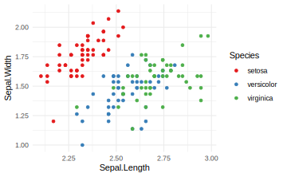

Bemærk, at både `scale_color_manual()` og `scale_color_brewer()` bruges til at sætte farver på punkter og linjer, mens man i sammenhænge med boxplots eller barplots bruger `scale_fill_manual()` eller `scale_fill_brewer()` til at sætte farver på de udfyldte områder. For eksempel vil jeg i følgende eksempel gerne sætte farver på de udfyldte områder i en boxplot:


```r
ggplot(iris,aes(x=Species,y=Sepal.Length,fill=Species)) + 
  geom_boxplot() +
  scale_fill_brewer(palette="Set2")  + 
  theme_minimal()
```


Her er en oversigt over de fire funktioner:

Funktion | Beskrivelse
--- | ---
`scale_fill_manual(values=c("firebrick3","blue"))` | Bruges til manuelle farver i forbindelse med boxplots og barplots mv.
`scale_color_manual(values=c("darkorchid","cyan4"))` | Bruges til manuelle farver i forbindelse med punkter og linjer mv.
`scale_fill_brewer(palette="Dark2")` | Bruger farvepaletter fra `RColorBrewer` i forbindelse med boxplots, barplots mv.
`scale_color_brewer(palette="Set1")` | Bruger farvepaletter fra `RColorBrewer` i forbindelse med punkter og linjer mv.

Der er også andre muligheder, hvis man har behov for dem - for eksempel kan man google efter `scale_fill_gradient` til kontinuerte data.


***Farver i RColourBrewer***

Her er en nyttig reference, der viser de forskellige farver tilgængelige i pakken `RColourBrewer`.


### Punkt former


Ligesom man kan lave forskellige farver, kan man også lave forskellige punktformer. Vi starter med den automatiske løsning ligesom vi gjorde med farver. Når det er en variabel, vi angiver, skal variabelnavnet skrives indenfor `aes()`. Her, da `shape` er en parameter, der er meget specifik for `geom_point`, vælger jeg at skrive en ny `aes()` indenfor `geom_point()` i stedet for indenfor funktionen `ggplot()`. Husk, at man i funktionen `ggplot()` specificerer globale ting, der gælder for hele plottet, mens man i funktionen `geom_point()` angiver ting, der kun gælder for `geom_point()`. Se følgende eksempel:


```r
ggplot(data=iris, aes(x = Sepal.Length, y = Sepal.Width)) +
  scale_color_brewer(palette="Set2") +
  geom_point(aes(shape=Species)) + 
  theme_minimal()
```


Nu har jeg fået både en farve og en punkt form til hver art i variablen `Species`.

***Sætte punkt form manuelt***

Hvis vi ikke kan lide de tre automatiske punktformer, kan vi ændre dem ved at bruge `scale_shape_manual`. Her vælger jeg for eksempel `values=c(1,2,3)`, men der er en reference nedenfor, hvor du kan se, mappingen mellem de numeriske tal og punktformer, så du kan vælge dine egne.


```r
ggplot(data=iris, aes(x = Sepal.Length, y = Sepal.Width, colour=Species)) +
  geom_point(aes(shape=Species)) + 
  scale_color_brewer(palette="Set2") +
  scale_shape_manual(values=c(1,2,3)) +
  theme_minimal()
```


***Reference for punkt former***

Her er reference-tabellen for forskellige punktformer i `ggplot2`:


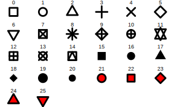

## Annotations (`geom_text`)

### Tilføjelse af labels direkte på plottet.

Man kan bruge `geom_text()` til at tilføje tekst på punkterne direkte på plottet. Her skal man fortælle, hvad teksten skal være - i dette tilfælde specificerer vi navnene på biler fra datasættet `mtcars`. Plottet er et scatterplot mellem variablerne `mpg` og `wt`.


```r
data(mtcars)

mtcars$my_labels <- row.names(mtcars) #take row names and set as a variable

ggplot(mtcars,aes(x=mpg,y=wt)) + 
  geom_point() +
  geom_text(aes(label=my_labels)) + 
  theme_minimal()
```


For at gøre det nemmere at læse kan man også fjerne selve punkterne:


```r
ggplot(mtcars,aes(x=mpg,y=wt)) + 
  #geom_point() +
  geom_text(aes(label=my_labels)) + 
  theme_minimal()
```


Teksten på plottet kan stadig være svær at læse. En god løsning kan være at bruge R-pakken `ggrepel`, som vist i følgende eksempel:

### Pakken `ggrepel` for at tilføje tekst labeller


```r
#install.packages(ggrepel) #installere hvis nødvendeigt
```

For at anvende pakken `ggrepel` på datasættet `mtcars`, skal man blot erstatte `geom_text()` med `geom_text_repel()`:


```r
library(ggrepel)
ggplot(mtcars,aes(x=mpg,y=wt)) + 
  geom_point() +
  geom_text_repel(aes(label=my_labels)) + 
  theme_minimal()
```


Nu kan vi se, at der ikke er nogen labels, som sidder lige overfor hinanden, fordi `ggrepel()` har været dygtig nok til at placere dem tæt på deres tilhørende punkter, og ikke ovenpå hinanden. Der er også nogle punkter, hvor funktionen har tilføjet en linje for at gøre det klart, hvilken punkt teksten refererer til.

Vi har dog fået en advarsel i ovenstående kode. Hvis vi vil undgå denne advarsel, kan vi specificere `max.overlaps = 20`.


```r
library(ggrepel)
ggplot(mtcars,aes(x=mpg,y=wt)) + 
  geom_point() +
  geom_text_repel(aes(label=my_labels),max.overlaps = 20) +
  theme_minimal()
```

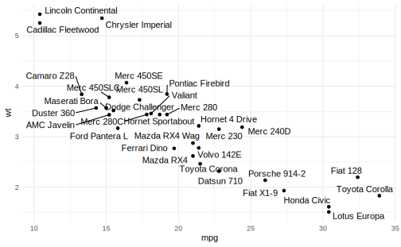

Nu kan du se, at du ikke længere får en advarsel, og der er tilføjet tekst til alle punkterne.

### Tilføjelse af rektangler i regioner af interesse (`annotate`)

Hvis man gerne vil fremhæve et bestemt område i plottet, kan man bruge funktionen `annotate()`. Prøv selv at regne ud, hvad de indstillinger inden for `annotate()` betyder i følgende eksempel:


```r
ggplot(mtcars,aes(x=mpg,y=wt)) + 
  geom_point() +
  geom_text_repel(aes(label=my_labels)) +
  annotate("rect",xmin=18,xmax=23,ymin=2.5,ymax=3,alpha=0.2,fill="orange") +
  theme_minimal()
```

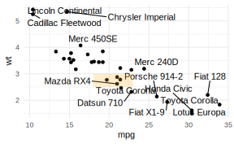

Man kan også benytte den samme funktion til at tilføje tekst på et bestemt sted:


```r
ggplot(mtcars,aes(x=mpg,y=wt)) + 
  geom_point() +
  geom_text_repel(aes(label=my_labels)) +
  annotate("rect",xmin=18,xmax=23,ymin=2.5,ymax=3,alpha=0.2,fill="orange") +
  annotate("text",x=25,y=2.75,label="Cars of interest",col="orange") + 
  theme_minimal()
```

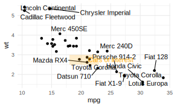


## Adskille plots med facets (`facet_grid`/`facet_wrap`) 

En stor fordel ved at bruge `ggplot` er evnen til at bruge funktionerne `facet_grid()` og `facet_wrap()` til at adskille efter en kategorisk variabel over flere plots. I følgende kode viser jeg et density plot, hvor de tre kurver, der tilhører de tre arter, ligger oven på hinanden i det samme plot:


```r
ggplot(iris,aes(x=Sepal.Length,fill=Species)) + 
  geom_density(alpha=0.5) + 
  theme_minimal()
```


Med funktionerne `facet_grid()` eller `facet_wrap()` bruger vi `~` (tilde) til at angive, hvordan vi gerne vil visualisere de forskellige plots. Vi skal angive, om vi ønsker at opdele dem over rækker (variablerne venstre for `~`) eller over kolonner (variablerne til højre for `~`).


```r
#notrun
variable(s) to split into row-wise plots ~ variables(s) to split into column-wise plots
```

Ovenstående density plots af `Sepal.Length` kan adskilles efter `Species`, således at man får tre plots med en kolonne til hver af de tre arter ved hjælp af `facet_wrap()` funktionen:


```r
ggplot(iris,aes(x=Sepal.Length,fill=Species)) + 
  geom_density(alpha=0.5) + 
  facet_grid(~Species) + #split Species into different column-wise plots
  theme_minimal()
```

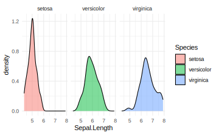

Man kan også vælge at adskille plotsne over rækkerne ved hjælp af `facet_wrap()`. Her skal man dog huske at bruge en `.` efter `~` for at betegne, at man kun vil adskille plots over rækkerne, mens man af en eller anden grund kan droppe `.` hvis man kun vil adskille over kolonner som i det foregående eksempel.


```r
ggplot(iris,aes(x=Sepal.Length,fill=Species)) + 
  geom_density(alpha=0.5) + 
  facet_grid(Species~.) + #split Species into different column-wise plots
  theme_minimal()
```


Her angives `Sepal.Group ~ Species`, hvilket betyder, at plotterne bliver adskilt efter både `Sepal.Group` og `Species` - `Sepal.Group` over rækkerne og `Species` over kolonnerne - ved hjælp af `facet_grid()` funktionen:


```r
ggplot(iris,aes(x=Sepal.Length,fill=Species)) + 
  geom_density(alpha=0.5) + 
  facet_grid(Sepal.Group~Species) + #split Species into different column-wise plots
  theme_minimal()
```

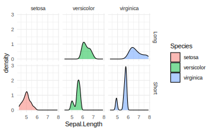


Bemærk forskellen mellem `facet_grid()` og `facet_wrap()`:


```r
#same plot, replace facet_grid with facet_wrap
ggplot(iris,aes(x=Sepal.Length,fill=Species)) + 
  geom_density(alpha=0.5) + 
  facet_wrap(Sepal.Group~Species) + 
  theme_minimal()
```


I `facet_grid()` bliver man tvunget til at få et "grid" layout. Vi har således 6 plot i en 2 x 3 grid (2 niveauer for variablen `Sepal.Group` og 3 niveauer for variablen `Species`), og det sker selvom den ene af dem ikke har nogen data - der findes altså ikke observationer, hvor `Species` er "Setosa" og `Sepal.Group` er "Long", men vi får et plot alligevel for at bevare strukturen. Med `facet_wrap()` bliver plot uden data droppet, og i dette tilfælde får man 5 plot i, hvad der kaldes en "ribbon".

Med `facet_wrap()` kan man også angive antallet af rækker og kolonner man vil have for plotterne. For eksempel kan man angive `nrow = 1` eller `ncol = 5` for at få alle fem plots på en række.


```r
ggplot(iris,aes(x=Sepal.Length,fill=Species)) + 
  geom_density(alpha=0.5) + 
  facet_wrap(Sepal.Group~Species,nrow = 1) + 
  theme_minimal()
```


Til sidst kan det være, at jeg gerne vil frigøre skalaen på y-aksen. På den måde har ikke alle plot de samme maksimale y-værdier, og de enkelte plot benytter i stedet egne værdier til at bestemme skalaen. Det kan være brugbart, hvis man inddrager forskellige målinger, men vær dog opmærksom på, hvad der bedst giver mening - hvis man direkte vil sammenligne to af plotterne, så er det bedre, at de deler samme y-akseskala.


```r
#same plot, replace facet_grid with facet_wrap
ggplot(iris,aes(x=Sepal.Length,fill=Species)) + 
  geom_density(alpha=0.5) + 
  facet_wrap(Sepal.Group~Species,ncol = 5,scales = "free") + 
  theme_minimal()
```


Jeg håber, det er klart, at disse funktioner er meget brugbare, og selvom de opnår stort set samme resultat, er der små forskelle mellem dem, som det er værd at huske.

## Gemme dit plot

Her bruger vi R Markdown til at lave en rapport, som indeholder vores plots, men det kan også være, at man gerne vil gemme sit plot som en fil på computeren. Til at gemme et plot kan man bruge kommandoen `ggsave()`:


```r
ggsave(myplot, "myplot.pdf")
```


Figuren vil blive gemt i din _working directory_ (eller den mappe, hvor din .Rmd fil ligger). Filtypen `.pdf` kan erstattes med andre formater, f.eks. `.png` eller `.jpeg`. Hvis man gerne vil redigere sit plot (f.eks. i Adobe Illustrator eller Inkscape), vil jeg anbefale at gemme det som `.pdf`.

Man må gerne ændre højden og bredden på det gemt plot med `width` og `height`:


```r
ggsave(myplot, "myplot.pdf", width = 4, height = 4)
```


## Problemstillinger

__Problem 1__) Lav quiz - "Quiz - ggplot2 part 2"

- - -

__Problem 2__) (*Øvelse med factorer og plots*)
 
 __a__) Åbn datasættet `mtcars` og lav en barplot:

* Brug variablen `cyl` på x-aksen og tildele forskellige farver til de forskellige niveauer af samme variablen.
* Fungerer din kode godt? 
* Tjek x-aksen - variablen er numerisk, men bør fortolkes som en faktor. Lav variablen om til en faktor (eller bare skriv `as.factor(cyl)` i selve plottet) og lav dit plot igen.


  __b__) Opdel søjlerne ved nu at angive farver efter variablen `gear` i dit plot (søjlerne skal sidde ved siden af hinanden). Vær igen OBS på, hvordan R fortolker variablen.


```r
ggplot(data = mtcars, aes(x = cyl,fill = (gear))) +
  geom_bar(stat="count",position="dodge") + 
  theme_minimal()
```

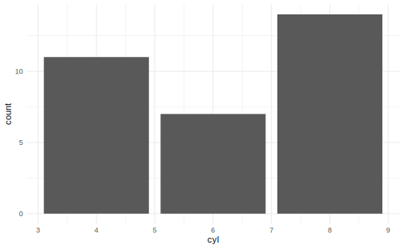


- - -

I følgende spørgsmål arbejder du med datasættet `Palmer Penguins`. Pakken `palmerpenguins` skal installeres hvis du ikke har brugt datasættet før.

Data beskrivelse: *The palmerpenguins data contains size measurements for three penguin species observed on three islands in the Palmer Archipelago, Antarctica.*


```r
#install.packages("palmerpenguins") #køre hvis ikke allerede installeret
library(palmerpenguins)
library(ggplot2)
library(tidyverse)
head(penguins)
```

```
FALSE # A tibble: 6 × 8
FALSE   species island    bill_length_mm bill_depth_mm flipper_length_mm body_mass_g
FALSE   <fct>   <fct>              <dbl>         <dbl>             <int>       <int>
FALSE 1 Adelie  Torgersen           39.1          18.7               181        3750
FALSE 2 Adelie  Torgersen           39.5          17.4               186        3800
FALSE 3 Adelie  Torgersen           40.3          18                 195        3250
FALSE 4 Adelie  Torgersen           NA            NA                  NA          NA
FALSE 5 Adelie  Torgersen           36.7          19.3               193        3450
FALSE 6 Adelie  Torgersen           39.3          20.6               190        3650
FALSE # ℹ 2 more variables: sex <fct>, year <int>
```

Man kan altid anvende `?penguins` for at se flere detaljer om variablenavner.

*Vi skal starte med at rydde op lidt i datasættet. Køre følgende for at fjerne al rækker som har `NA` (manglende) værdier (her skal man have tidyverse-pakken indlæste):*


```r
penguins <- drop_na(penguins)
```

- - -


__Problem 3__) *Manuelt farver og punkter* 

__a__) Lav et scatter plot med `ggplot()`-funktionen: 

* `bill_length_mm` på x-aksen
* `bill_depth_mm` på y-aksen 
*  giv hver art (variablen `species`) sin egen farve (brug den automatiske løsning)
*  sæt et tema


__b__) Lav følgende ændringer til dit plot fra __a__):

* Ændr farver manuelt - prøv både at angive farver med `scale_color_manual()` og afprøve også løsningen med pakken `RColorBrewer` (husk at installere/indlæse pakken, hvis nødvendigt).
* Brug forskellige punkt-former til hver art i variablen `species`.
* Prøv også at vælge nogle punkt-former fra listen (i kursusnotaterne) og specificer dem manuelt.

<div class="figure" style="text-align: center">
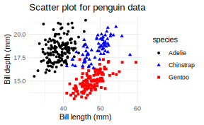
<p class="caption">(\#fig:unnamed-chunk-48)Min løsning</p>
</div>


- - -

__Problem 4__) *Koordinatsystemer* 

Tag udgangspunkt i overstående scatter plot fra __3__) og 

__a__) brug `coord_cartesian()`, så kun pingviner med en bill længde (variablen `bill_length_mm`) mellem 40 og 50 og en bill depth (variablen `bill_depth_mm`) mellem 16 og 19 er medtaget på plottet.
__b__) brug pakken `ggrepel` (husk at installere/indlæse) og tilføj navnene på de forskellige øer som tekst labels direkte på plottet 
__c__) nu lav en delmængde af datasættet `penguins` efter samme betingelser som i __a__) og brug din nye dataframe som parameteren `data` indenfor  `geom_text_repel()`-funktionen. Dette undgår, at tekst bliver plottet for punkter udenfor området angivet med `coord_cartesian()`.

<div class="figure" style="text-align: center">
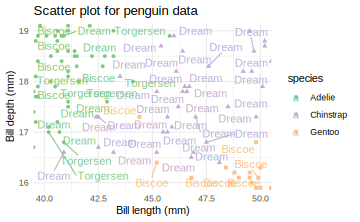
<p class="caption">(\#fig:unnamed-chunk-49)Min løsning</p>
</div>

__Problem 5__) *Histogram med facets*

Lav et histogram:

* Variablen `flipper_length_mm` på x-aksen
* Anvend `facet_grid` for at adskille dit plot i tre efter variablen `species`
* Giv også en forskellig farve til hver art i `species`
* Hvis nødvendigt, ændr parameteren `bins` til noget andet indenfor `geom_histogram()`.

Her er min løsning:

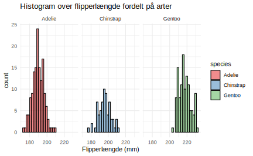


- - -

__Problem 6__) __a)__ Lav et density plot af `body_mass_g`.

* Anvend funktionen `facet_grid` til at lave tre plots, en til hver art i variablen `species`
* Brug også `fill` til at opdele hver af dine tre density kurver efter variablen `sex` (dvs. du har stadig 3 plots, og hvert plot har to density kurver)
* Gør dine density plots gennemsigtige
* Skriv en sætning om forskellen i `body_mass_g` mellem "females" og "males".

<!-- * Hvorfor tror du, at disse densities har flere topper? -->


__b__) Nu udvikl din `facet_grid` kommando til at adskille plots yderligere således at du har en "grid" struktur med de forskellige øer (variablen `island`) på rækkerne og de tre arter (variablen `species`) på kolonnerne.


__c__) Kan du forklare, hvorfor der er blanke plots i din grid? Eksperimenter med `facet_wrap` i stedet for `facet_grid`. 


<!-- __b)__ Vi vil gerne adskille vores densities yderligere, efter `species`. -->

<!-- * Nu tilføj linjen `facet_grid(~species)` til dit plot og opdag, hvad der sker.  -->
<!-- * Skriv endnu en sætning, som beskriver forskellen i `body_mass_g` mellem de to køn over de tre `species`. -->

<!-- ```{r,echo=FALSE,eval=FALSE} -->
<!-- ggplot(data=penguins,aes(x=body_mass_g,fill=sex)) + -->
<!--   geom_density(alpha=0.5) + -->
<!--   facet_grid(~species) + -->
<!--   theme_minimal() -->
<!-- ``` -->

- - -

__Problem 7__) *Koordinatsystemer* 

Lav et søjlediagram af antallet for `species` opdelt efter `sex`. 

* Anvend en 'coordinate flip' for at få den til at være vandret/horizontal.
* Vælg nogle farver - jeg benytter `palette = "Accent"` fra `RColorBrewer` løsningen


* Ændr rækkefølgen af de tre søjler, således at arten med flest observationer er øverst, og arten med færrest er nederst.
* Prøv også at tilføje `scale_y_reverse()` og kig på resultatet.

Her er min løsning:

<div class="figure" style="text-align: center">
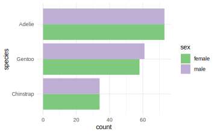
<p class="caption">(\#fig:unnamed-chunk-55)Min løsning</p>
</div>


- - -


__Problem 8__) Lav boxplots af `body_mass_g` opdelt efter `species`.

* Tilføj "jitter" punkter ovenpå boksplot.
* Specificer nogle farver manuelt for både bokse og punkterne (en farve til hver art)
* Giv det en passende titel og nogle akse-etiketter
* Tilføj en ny variabel `island_binary` til `penguins`, som er "Biscoe" hvis `island` er 'Biscoe' og "not Biscoe" hvis ikke.
* Adskil plotterne ved at opdele efter `island_binary`.


* Ekstra: prøv `?geom_violin` som erstatning for `geom_boxplot`.


- - -

__Problem 9__) *Annotationer og linjer*. 

__a__) Lav et scatterplot af `bill_length_mm` vs `bill_depth_mm`.

* Anvend passende titel/etiketter/tema
* Anvend forskellige farver for de tre `species`.
* Tjek funktionen `?annotate` og brug den med `geom="text"` og passende x- og y-akse værdier til at tilføje `species` navne som tekst direkte på plottet (se eksempel nedenfor for at se, hvad jeg mener).
* Udforsk, hvordan man gør teksten større, som jeg har gjort i min løsning.
* Fjern legenden med `show.legend = FALSE` indenfor `geom_point()`

Her er min løsning:


__b__) Vi vil gerne tilføje nogle lodrette og vandrette linjer til plottet, som viser gennemsnitsværdierne for variablerne for de tre arter.

* Først skal du bruge `tapply` til at beregne de gennemsnitlige værdier for henholdsvis `bill_length_mm` og `bill_depth_mm` opdelt efter `species` (gem dem som henholdsvis `mean_length` og `mean_depth`).
* Brug `mean_length` og `mean_depth` til at tilføje linjer til plottet med den relevante funktion.


__c__) Kan du tilpasse linjerne så deres farver matcher punkterne for deres respektive art (se min løsning nedenfor)? Der er sikkert mange måder at gøre det på, men hvis du har brug for en hint, kan du kigge nedenunder:

* Hint: start med følgende dataframe, der bruger dine beregnede værdier:


```r
mydf <- data.frame("species"=names(mean_length), "mlength"=mean_length, "mdepth"=mean_depth)
mydf
```

```
#>             species  mlength   mdepth
#> Adelie       Adelie 38.82397 18.34726
#> Chinstrap Chinstrap 48.83382 18.42059
#> Gentoo       Gentoo 47.56807 14.99664
```

* Angiv parameteren `data` til at være ovenstående dataframe i `geom_vline()` og brug lokal æstetik (`aes()`) til at angive parametre til linjerne.
* Gør det samme for `geom_hline()`
* Specificer også "stiplede" linjer

Her er min løsning:


<div class="figure" style="text-align: center">
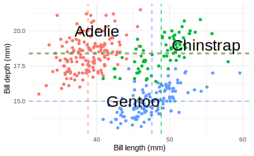
<p class="caption">(\#fig:unnamed-chunk-60)min løsning</p>
</div>

- - -

__Problem 10__) *Ekstra*. Kig på "cheatsheet" for ggplot2 (klik på "Help" > "Cheatsheets" og vælg den for ggplot2) og afprøv nogle af de ting, som ikke er blevet dækket i kurset indtil videre! Jeg vil gerne høre, hvis du finder noget meget nyttigt for dig, som ellers er blevet glemt i notaterne.


