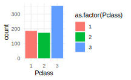
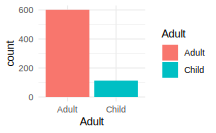

# Bearbejdning dag 1 {#data}


## Hvad er Tidyverse?

**Tidyverse** er en samling af pakker i R, som man bruger til at bearbejde datasæt. Formålet er ikke nødvendigvis at erstatte funktionaliteten af base-pakken, men til at bygge videre på den. Som vi vil se i detaljer, deler **tidyverse**  faktisk mange af de samme principper som **ggplot2** - men i stedet for at bruge `+` til at opbygge komponenter i et plot, bruger man `%>%` (udtales 'pipe') til at kæde forskellige funktioner sammen.

{width=45%}

__Læringsmål og checklist__

:::goals
I skal være i stand til at:

* Beskrive generelt, hvad R-pakken `Tidyverse` kan bruges til.
* Beskrive en **tibble** og genkende når et datasæt er betragtet som "tidy".
* Benytte nogle vigtige `Tidyverse`-verbs til at bearbejde data (`filter()`,`select()`, `mutate()`, `rename()`, `arrange()`, `recode()`).
* Bruge `%>%` til at forbinde `Tidyverse`-verber sammen og at overføre data til et plot.
:::


:::checklist
Checklist til Kapitel 5: bearbejdning med tidyverse (dag 1)

* Læs "Principper for tidy data" og "Lidt om tibbles"
* Se videoerne
* Kig igennem kursusnotaterne
* Lav quiz "ggplot2 - dag 2"
* Lav problemstillingerne
:::

## Video ressourcer

<!-- * Video 1 - introduktion til uge, hvad er den `tidyverse`-pakke? Hvad er en tibble? -->

<!-- Link her hvis det ikke virker nedenunder: https://player.vimeo.com/video/547107062 -->
<!-- ```{r,echo=FALSE} -->
<!-- library("vembedr") -->

<!-- embed_url("https://vimeo.com/547107062") -->
<!-- ``` -->

* __Begynd med at læse "Principper for 'tidy data'" og "Lidt om tibbles" nedenfor og derefter se følgende videoer.

* __Video 1__ - rydde op i datasættet `titanic` med `select()` og `drop_na()`


```{=html}
<div class="vembedr">
<div>
<iframe class="vimeo-embed" src="https://player.vimeo.com/video/706266697" width="533" height="300" frameborder="0" webkitallowfullscreen="" mozallowfullscreen="" allowfullscreen="" data-external="1"></iframe>
</div>
</div>
```


<!-- * Video 3 - introduktion til `%>%`  -->


<!-- Link her hvis det ikke virker nedenunder: https://player.vimeo.com/video/546910781 -->
<!-- ```{r,echo=FALSE} -->
<!-- library("vembedr") -->

<!-- embed_url("https://vimeo.com/546910781") -->
<!-- ``` -->


* __Video 2__ - `tidyverse` verber: `select` og `filter`


```{=html}
<div class="vembedr">
<div>
<iframe class="vimeo-embed" src="https://player.vimeo.com/video/705136725" width="533" height="300" frameborder="0" webkitallowfullscreen="" mozallowfullscreen="" allowfullscreen="" data-external="1"></iframe>
</div>
</div>
```


* __Video 3__ - flere `tidyverse` verber
  + Lave en ny kolon med `mutate()`
  + Ændre variabelnavne med `rename()`
  + Ændre på værdierne med `recode()` 
  + Ændre rækkefølgen af observationerne med `arrange()`
  + Bruge tidyverse kommandoer som input i `ggplot2()`


```{=html}
<div class="vembedr">
<div>
<iframe class="vimeo-embed" src="https://player.vimeo.com/video/706266885" width="533" height="300" frameborder="0" webkitallowfullscreen="" mozallowfullscreen="" allowfullscreen="" data-external="1"></iframe>
</div>
</div>
```

## Oversigt over pakker

Lad os starte med at indlæse pakken **tidyverse**. Vær opmærksom på, at hvis du ikke allerede har pakken på din computer, kan det tage lidt tid at installere den da **tidyverse** er afhængig af mange andre pakker, som også skal installeres eller opdateres. __Hvis du allerede har pakken installeret, men oplever problemer, skal du tjekke, om du har det seneste version af pakkerne og R på dit system.__


```r
#install.packages("tidyverse)
library(tidyverse)
```

Du kan se, at der faktisk ikke kun er én, men otte pakker, der er blevet indlæst. Det er muligt at indlæse hver pakke individuelt ved at bruge fx `library(dplyr)`, men det er meget bekvemt at indlæse dem alle på én gang ved at bruge `library(tidyverse)`. Her er en kort beskrivelse af hver pakke:

Pakke | Kort beskrivelse
--- | ---
`readr` | Indlæsning af data
`ggplot2` | Plotning af data
`tibble` | Oprettelse af "tibbles" - ***tidyverse***'s svar på datarammer (data.frame).
`tidyr` | Transformation af data til forskellige formater (fx fra 'long' til 'wide' format eller omvendt)
`purrr` | Functional programming, gentagelse
`dplyr` | Manipulation af tibbles - udvælgelse af undergrupper, oprettelse af nye variabler, beregning af oversigtsstatistikker osv.
`stringr` | Manipulation af strenge (ikke brugt i dette kursus)
`forcats` | Håndtering af faktorvariabler (også kaldet "categories")


## Principper for 'tidy data'

Idéen bag __tidyverse__ er, at hvis alle datasæt følger præcis den samme struktur, så er det enkelt at bearbejde dem præcis som vi ønsker det. Datasæt med denne struktur kaldes "tidy data". For at betragte et datasæt som "tidy" skal det opfylde tre kriterier:

* Hver variabel i datasættet har sin egen kolonne
* Hver observation i datasættet har sin egen række
* Hver værdi i datasættet har sin egen celle

Et godt eksempel på et datasæt i **tidy format** er Iris-datasættet:


```r
data(iris)
head(iris)
```

```
#>   Sepal.Length Sepal.Width Petal.Length Petal.Width Species
#> 1          5.1         3.5          1.4         0.2  setosa
#> 2          4.9         3.0          1.4         0.2  setosa
#> 3          4.7         3.2          1.3         0.2  setosa
#> 4          4.6         3.1          1.5         0.2  setosa
#> 5          5.0         3.6          1.4         0.2  setosa
#> 6          5.4         3.9          1.7         0.4  setosa
```

I datasættet har hver variabel (`Sepal.Length`, `Sepal.Width`, `Petal.Length`, `Petal.Width` og `Species`) sin egen kolonne, og hver observation (fx observation 1, 2, 3, osv.) har sin egen række. Derudover har hver celle sin egen værdi, hvilket gør datasættet meget læsbart og let at forstå ved blot at kigge på det.

{width=100%}

Det er tilfældet, at de fleste datasæt i dette kursus hører til kategorien "tidy data", især i disse notater, hvor vi bruger en del af de indbyggede datasæt. Nogle gange er det dog nødvendigt at transformere et datasæt til "tidy data". R-pakkerne **dplyr** og **tidyr** er velegnede til at hjælpe med at transformere et datasæt til "tidy data", og derefter kan man analysere datasættet på sædvanlig vis. Bemærk dog, at bare fordi et datasæt er "tidy", betyder det ikke nødvendigvis, at det er klar til analyse, da der stadig kan være behov for yderligere bearbejdning med pakkerne **dplyr** og **tidyr**.

## Lidt om `tibbles`

En `tibble` er ***tidyverse***'s svar på en `data.frame` fra base-R. De ligner meget hinanden, og derfor behøver man ikke tænke så meget over forskellen. Men der er nogle opdaterede aspekter i en `tibble`. For eksempel bruger en `tibble` ikke `row.names`, og når man visualiserer en `tibble` i R Markdown, får man lidt ekstra oplysninger såsom dimensioner og datatyper. Det er vigtigt at bemærke, at de fleste `tidyverse`-funktioner fungerer lige så godt, uanset om man bruger en `tibble` eller en `data.frame`. Det er dog vigtigt at bemærke, at jeg vil bruge ordet "data frame" inden for almindelig tekst.

Man kan oprette sin egen `tibble` på samme måde som en `data.frame`.


```r
tibble(x = 1:3, y = c("a", "b", "c"))
```

```
#> # A tibble: 3 × 2
#>       x y    
#>   <int> <chr>
#> 1     1 a    
#> 2     2 b    
#> 3     3 c
```

Man kan også oprette en `tribble`, som er den samme som en `tibble`, men har en lidt anderledes måde at indsætte data på. For eksempel svarer følgende til den tidligere `tibble`:


```r
tribble(~x, ~y,
       1, "a",
       2, "b",
       3, "c")
```

```
#> # A tibble: 3 × 2
#>       x y    
#>   <dbl> <chr>
#> 1     1 a    
#> 2     2 b    
#> 3     3 c
```

Man kan omdanne en `data.frame` til en `tibble` ved at bruge funktionen `as_tibble()`, som vist nedenfor:


```r
as_tibble(iris)
```

```
#> # A tibble: 150 × 5
#>    Sepal.Length Sepal.Width Petal.Length Petal.Width Species
#>           <dbl>       <dbl>        <dbl>       <dbl> <fct>  
#>  1          5.1         3.5          1.4         0.2 setosa 
#>  2          4.9         3            1.4         0.2 setosa 
#>  3          4.7         3.2          1.3         0.2 setosa 
#>  4          4.6         3.1          1.5         0.2 setosa 
#>  5          5           3.6          1.4         0.2 setosa 
#>  6          5.4         3.9          1.7         0.4 setosa 
#>  7          4.6         3.4          1.4         0.3 setosa 
#>  8          5           3.4          1.5         0.2 setosa 
#>  9          4.4         2.9          1.4         0.2 setosa 
#> 10          4.9         3.1          1.5         0.1 setosa 
#> # ℹ 140 more rows
```

## Transition fra base-R til tidyverse

Jeg introducerer **tidyverse** med et meget berømt datasæt kaldet **Titanic**. Det er ikke biologisk data, men det er stadig ret interessant og sjovt at arbejde med.

**Titanic**-datasættet er blevet brugt som en del af en åben konkurrence på Kaggle, hvor mindst 31.000 personer hidtil har arbejdet på at lave den bedste model til at forudsige, hvem der overlever katastrofen. Du kan læse mere om baggrunden for datasættet og konkurrencen på dette link: https://www.kaggle.com/c/titanic.

### Om **Titanic** datasættet

Man kan downloade datasættet, der hedder `titanic_train`, direkte fra Kaggle. Men der er faktisk en R-pakke kaldet `titanic`, som gør det mere bekvemt:


```r
#install.packages("titanic") #hvis ikke allerede installerede
library(titanic)
```

Her er beskrivelsen for pakken:

_**titanic** is an R package containing data sets providing information on the fate of passengers on the fatal maiden voyage of the ocean liner "Titanic", summarized according to economic status (class), sex, age and survival. These data sets are often used as an introduction to machine learning on Kaggle._

Vi vil gerne bruge `titanic_train`-datasættet, fordi det er det datasæt, der bliver brugt på Kaggle til at træne maskinlæringsmodeller (som derefter bliver testet på `titanic_test`-datasættet for at evaluere, hvor god modellen er). For at gøre tingene nemmere, vil vi blot omdøbe `titanic_train` til `titanic` og bruge funktionen `glimpse()` fra `dplyr`-pakken til at se på datasættet.


```r
titanic <- as_tibble(titanic_train)
glimpse(titanic)
```

```
#> Rows: 891
#> Columns: 12
#> $ PassengerId <int> 1, 2, 3, 4, 5, 6, 7, 8, 9, 10, 11, 12, 13, 14, 15, 16, 17,…
#> $ Survived    <int> 0, 1, 1, 1, 0, 0, 0, 0, 1, 1, 1, 1, 0, 0, 0, 1, 0, 1, 0, 1…
#> $ Pclass      <int> 3, 1, 3, 1, 3, 3, 1, 3, 3, 2, 3, 1, 3, 3, 3, 2, 3, 2, 3, 3…
#> $ Name        <chr> "Braund, Mr. Owen Harris", "Cumings, Mrs. John Bradley (Fl…
#> $ Sex         <chr> "male", "female", "female", "female", "male", "male", "mal…
#> $ Age         <dbl> 22, 38, 26, 35, 35, NA, 54, 2, 27, 14, 4, 58, 20, 39, 14, …
#> $ SibSp       <int> 1, 1, 0, 1, 0, 0, 0, 3, 0, 1, 1, 0, 0, 1, 0, 0, 4, 0, 1, 0…
#> $ Parch       <int> 0, 0, 0, 0, 0, 0, 0, 1, 2, 0, 1, 0, 0, 5, 0, 0, 1, 0, 0, 0…
#> $ Ticket      <chr> "A/5 21171", "PC 17599", "STON/O2. 3101282", "113803", "37…
#> $ Fare        <dbl> 7.2500, 71.2833, 7.9250, 53.1000, 8.0500, 8.4583, 51.8625,…
#> $ Cabin       <chr> "", "C85", "", "C123", "", "", "E46", "", "", "", "G6", "C…
#> $ Embarked    <chr> "S", "C", "S", "S", "S", "Q", "S", "S", "S", "C", "S", "S"…
```

Jeg har også kopieret de variable beskrivelser her:

* PassengerId: unique index for each passenger
* Survived: Whether or not the passenger survived. 0 = No, 1 = Yes.
* Pclass: Ticket class: 1 = 1st Class, 2 = 2nd Class, 3 = 3rd Class.
* Name: A character string containing the name of each passenger.
* Sex: Character strings for passenger sex ("male"/ "female").
* Age: Age in years.
* SibSp: The number of siblings/spouses aboard the titanic with the passenger
* Parch: The number of parents/children aboard the titanic with the passenger
* Ticket: Another character string containing the ticket ID of the passenger.
* Fare: The price paid for tickets in pounds Sterling (Keep in mind that unskilled workers made around 1 pound a week - these were expensive tickets!)
* Cabin: The cabin number of the passengers (character).
* Embarked: Where passengers boarded the titanic. C = Cherbourg, Q = Queenstown, S = Southampton).

### Titanic: Rengøring

Før vi kan fortsætte med analysen, er der nogle oprydninger, der skal foretages i datasættet. Vi kan se fra `glimpse(titanic)`-kommandoen, at der er 891 observationer. De fleste passagerer (687) har faktisk intet oplyst i variablen `Cabin`:


```r
sum(titanic$Cabin == "") # antal observationer med ingenting for variablen 'Cabin'
```

```
#> [1] 687
```

Andre passagerer har mere end én cabin. Det ser ikke særlig **tidy** ud, og det er heller ikke særlig relevant for analysen, så vi vælger at fjerne hele kolonnen med funktionen `select()`:


```r
titanic_no_cabin <- select(titanic, -Cabin) 
```

`select()` er en af de grundlæggende funktioner i **tidyverse**. Her angiver vi, hvilke kolonner vi ønsker at beholde eller fjerne fra datasættet. I dette tilfælde har vi specificeret `-Cabin`, hvilket betyder, at vi ikke ønsker at medtage variablen `Cabin`, men vi ønsker at beholde resten af kolonnerne. Prøv selv at køre `select(titanic, Cabin)` i stedet - så vil vi kun have variablen `Cabin` og fjerne resten af vores variabler.


```r
glimpse(titanic_no_cabin)
```

```
#> Rows: 891
#> Columns: 11
#> $ PassengerId <int> 1, 2, 3, 4, 5, 6, 7, 8, 9, 10, 11, 12, 13, 14, 15, 16, 17,…
#> $ Survived    <int> 0, 1, 1, 1, 0, 0, 0, 0, 1, 1, 1, 1, 0, 0, 0, 1, 0, 1, 0, 1…
#> $ Pclass      <int> 3, 1, 3, 1, 3, 3, 1, 3, 3, 2, 3, 1, 3, 3, 3, 2, 3, 2, 3, 3…
#> $ Name        <chr> "Braund, Mr. Owen Harris", "Cumings, Mrs. John Bradley (Fl…
#> $ Sex         <chr> "male", "female", "female", "female", "male", "male", "mal…
#> $ Age         <dbl> 22, 38, 26, 35, 35, NA, 54, 2, 27, 14, 4, 58, 20, 39, 14, …
#> $ SibSp       <int> 1, 1, 0, 1, 0, 0, 0, 3, 0, 1, 1, 0, 0, 1, 0, 0, 4, 0, 1, 0…
#> $ Parch       <int> 0, 0, 0, 0, 0, 0, 0, 1, 2, 0, 1, 0, 0, 5, 0, 0, 1, 0, 0, 0…
#> $ Ticket      <chr> "A/5 21171", "PC 17599", "STON/O2. 3101282", "113803", "37…
#> $ Fare        <dbl> 7.2500, 71.2833, 7.9250, 53.1000, 8.0500, 8.4583, 51.8625,…
#> $ Embarked    <chr> "S", "C", "S", "S", "S", "Q", "S", "S", "S", "C", "S", "S"…
```

Næste skridt er at undersøge, om der er manglende værdier (`NA`) i datasættet. `NA` er, hvordan R betegner manglende værdier. Som det fremgår af følgende kode, har de fleste variabler ikke `NA`-værdier, men variablen `Age` har 177 `NA`-værdier.


```r
colSums(is.na(titanic_no_cabin))
```

```
#> PassengerId    Survived      Pclass        Name         Sex         Age 
#>           0           0           0           0           0         177 
#>       SibSp       Parch      Ticket        Fare    Embarked 
#>           0           0           0           0           0
```

I dette tilfælde vælger jeg at fjerne alle passagerer, der mangler aldersoplysninger (`NA`) i stedet for at estimere eller imputere deres alder. Til dette formål bruger jeg funktionen `drop_na`, som fjerner alle observationer, der har `NA` i mindst én variabel.


```r
titanic_clean <- drop_na(titanic_no_cabin)
colSums(is.na(titanic_clean))
```

```
#> PassengerId    Survived      Pclass        Name         Sex         Age 
#>           0           0           0           0           0           0 
#>       SibSp       Parch      Ticket        Fare    Embarked 
#>           0           0           0           0           0
```

Nu kan vi tjekke, hvor mange observationer og variabler, der er tilbage.


```r
glimpse(titanic_clean)
```

```
#> Rows: 714
#> Columns: 11
#> $ PassengerId <int> 1, 2, 3, 4, 5, 7, 8, 9, 10, 11, 12, 13, 14, 15, 16, 17, 19…
#> $ Survived    <int> 0, 1, 1, 1, 0, 0, 0, 1, 1, 1, 1, 0, 0, 0, 1, 0, 0, 0, 1, 1…
#> $ Pclass      <int> 3, 1, 3, 1, 3, 1, 3, 3, 2, 3, 1, 3, 3, 3, 2, 3, 3, 2, 2, 3…
#> $ Name        <chr> "Braund, Mr. Owen Harris", "Cumings, Mrs. John Bradley (Fl…
#> $ Sex         <chr> "male", "female", "female", "female", "male", "male", "mal…
#> $ Age         <dbl> 22, 38, 26, 35, 35, 54, 2, 27, 14, 4, 58, 20, 39, 14, 55, …
#> $ SibSp       <int> 1, 1, 0, 1, 0, 0, 3, 0, 1, 1, 0, 0, 1, 0, 0, 4, 1, 0, 0, 0…
#> $ Parch       <int> 0, 0, 0, 0, 0, 0, 1, 2, 0, 1, 0, 0, 5, 0, 0, 1, 0, 0, 0, 0…
#> $ Ticket      <chr> "A/5 21171", "PC 17599", "STON/O2. 3101282", "113803", "37…
#> $ Fare        <dbl> 7.2500, 71.2833, 7.9250, 53.1000, 8.0500, 51.8625, 21.0750…
#> $ Embarked    <chr> "S", "C", "S", "S", "S", "S", "S", "S", "C", "S", "S", "S"…
```

Vi har beholdt 714 observationer og 11 variabler, og datasættet opfylder kravene for at være **tidy**.

### Pipe

Man kan faktisk opnå det samme som i ovenstående eksempel ved at bruge pipe `%>%`:


```r
titanic_clean <- titanic %>% # vi tager titanic-datasættet
    select(-Cabin) %>% # udvælger de ønskede kolonner
    drop_na() # fjerner alle observationer med manglende værdier
```

Man bruger pipe `%>%` til at kombinere adskillige Tidyverse-funktioner i samme kommando. Linjen slutter med `%>%`, som fortæller, at vi skal bruge resultatet fra den foregående linje som input i den næste linje. Logikken er således, at vi starter med en dataframe, gør én ting ad gangen og slutter med en ny dataframe (som vi kan gemme med `<-`).

Bemærk, at denne proces ligner den, man bruger i **ggplot2**, men forskellen er, at man bruger `%>%` i stedet for `+` i denne sammenhæng. Bemærk også, at jeg som i **ggplot2** skriver koden over flere linjer. Det er ikke et krav, men det gør det nemmere at læse og forstå koden.

For at illustrere logikken kan man se, at følgende to linjer er tilsvarende:


```r
#tag x og anvend en funktion f
f(x)    #traditionelt tilgang
x %>% f #tidyverse tilgang
```

I begge tilfælde starter vi med `x` og anvender derefter funktionen `f` på `x`. En stor fordel ved den **tidyverse**-tilgangen er, at når man har flere funktioner, undgår man at skulle bruge mange parenteser, og rækkefølgen, som funktionerne anvendes i, læses fra venstre mod højre i stedet for omvendt, som i følgende eksempel:


```r
#tag x, anvend f, så g og til sidst h
h(g(f(x)))          #traditionelt tilgang
x %>% f %>% g %>% h #tidyverse tilgang
```

På samme måde som i vores oprydning af `titanic` kan man både inkludere funktionen `select()` i `drop_na()` eller bruge **tidyverse**-tilgangen, som i følgende eksempel - de to giver samme resultat: Først fjerner vi kolonnen `Cabin` ved hjælp af `select()`, og derefter fjerner vi alle rækker, som har mindst én `NA` ved hjælp af `drop_na()`.


```r
titanic_clean <- drop_na(select(titanic,-Cabin))

titanic_clean <- titanic %>% 
    select(-Cabin) %>%
    drop_na() 
```


## Bearbejdning af data: `dplyr`

Pakken `dplyr` er nok den mest brugbare pakke til at bearbejde dataframes. Jeg gennemgår nogle af de mest almindelige muligheder med pakken, og der er også en "cheatsheet" som du kan downloade som reference: https://github.com/rstudio/cheatsheets/raw/master/data-transformation.pdf. Jeg tager afsæt i følgende funktioner, og dækker flere gennem de forskellige øvelser og øvrige emner.

dplyr verbs | beskrivelse
--- | ---
`select()` | udvælge kolonner (_variabler_) 
`filter()` | udvælge rækker (_observationer_)
`arrange()` | sortere rækker
`mutate()` | tilføje eller ændre eksisterende kolonner
`rename()` | ændre variablers navne
`recode()` | ændre selve data
`group_by()` | dele datasættet op efter en variabel
`summarise()` | aggregere rækker, findes ofte tilknyttet til `group_by()` 

Bemærk, at alle disse funktioner tager udgangspunkt i en dataframe, og man får altid en ny dataframe som output. Ved at kunne bruge disse funktioner og kombinere dem (ved hjælp af `%>%`), har man godt styr på bearbejdningen af datarammer.

###  dplyr verbs: `select()`

Som vi lige har set ovenfor, kan man med `select()` udvælge bestemte __variabler__ i en dataframe. Vi kan vælge at beholde, fjerne eller ændre rækkefølgen af variablerne. Som et eksempel kan vi beholde kun variablerne `Name` og `Age` i `titanic_clean`-dataframen ved at bruge følgende kode:


```r
titanic_clean %>% 
  select(Name, Age) %>%
  glimpse()
```

```
#> Rows: 714
#> Columns: 2
#> $ Name <chr> "Braund, Mr. Owen Harris", "Cumings, Mrs. John Bradley (Florence …
#> $ Age  <dbl> 22, 38, 26, 35, 35, 54, 2, 27, 14, 4, 58, 20, 39, 14, 55, 2, 31, …
```

Hvis vi ønsker at fjerne en variabel fra en dataframe, kan vi bruge et minustegn. I nedenstående eksempel fjerner vi `Name` og `Age` fra `titanic_clean`-dataframen:


```r
titanic_clean %>% 
  select(-Name, -Age) %>%
  glimpse()
```

```
#> Rows: 714
#> Columns: 9
#> $ PassengerId <int> 1, 2, 3, 4, 5, 7, 8, 9, 10, 11, 12, 13, 14, 15, 16, 17, 19…
#> $ Survived    <int> 0, 1, 1, 1, 0, 0, 0, 1, 1, 1, 1, 0, 0, 0, 1, 0, 0, 0, 1, 1…
#> $ Pclass      <int> 3, 1, 3, 1, 3, 1, 3, 3, 2, 3, 1, 3, 3, 3, 2, 3, 3, 2, 2, 3…
#> $ Sex         <chr> "male", "female", "female", "female", "male", "male", "mal…
#> $ SibSp       <int> 1, 1, 0, 1, 0, 0, 3, 0, 1, 1, 0, 0, 1, 0, 0, 4, 1, 0, 0, 0…
#> $ Parch       <int> 0, 0, 0, 0, 0, 0, 1, 2, 0, 1, 0, 0, 5, 0, 0, 1, 0, 0, 0, 0…
#> $ Ticket      <chr> "A/5 21171", "PC 17599", "STON/O2. 3101282", "113803", "37…
#> $ Fare        <dbl> 7.2500, 71.2833, 7.9250, 53.1000, 8.0500, 51.8625, 21.0750…
#> $ Embarked    <chr> "S", "C", "S", "S", "S", "S", "S", "S", "C", "S", "S", "S"…
```

#### Hjælper funktioner til `select()`

Hjælpefunktioner til funktionen `select()` kan være nyttige, hvis man vil udvælge bestemte variabler efter visse kriterier. Nedenfor har jeg samlet nogle (men ikke alle mulige!) hjælpefunktioner og inddrager eksempler i problemstillingerne.

select hjælpefunktion | beskrivelse
--- | ---
`starts_with()` | starter med et præfiks
`ends_with()` | slutter med et præfiks
`contains()` | indeholder en tekststreng
`matches()` | matcher et regulært udtryk
`num_range()` | et numerisk interval såsom x01, x02, x03
`one_of()` | variabler i en karaktervektor
`everything()` | alle variabler
`where()` | tager en funktion og returnerer alle variabler, hvor funktionen returnerer TRUE

For eksempel:


```r
titanic_clean %>% select(starts_with("P"))
```

```
#> # A tibble: 714 × 3
#>    PassengerId Pclass Parch
#>          <int>  <int> <int>
#>  1           1      3     0
#>  2           2      1     0
#>  3           3      3     0
#>  4           4      1     0
#>  5           5      3     0
#>  6           7      1     0
#>  7           8      3     1
#>  8           9      3     2
#>  9          10      2     0
#> 10          11      3     1
#> # ℹ 704 more rows
```

Specielt brugbar i statistiske metoder, der kræver kun numeriske variabler, er `where()`, når den kombineres med `is.numeric`. For eksempel, i følgende kode udvælger man kun numeriske variabler fra datasættet `titanic_clean`:


```r
titanic_clean %>% select(where(is.numeric))
```

```
#> # A tibble: 714 × 7
#>    PassengerId Survived Pclass   Age SibSp Parch  Fare
#>          <int>    <int>  <int> <dbl> <int> <int> <dbl>
#>  1           1        0      3    22     1     0  7.25
#>  2           2        1      1    38     1     0 71.3 
#>  3           3        1      3    26     0     0  7.92
#>  4           4        1      1    35     1     0 53.1 
#>  5           5        0      3    35     0     0  8.05
#>  6           7        0      1    54     0     0 51.9 
#>  7           8        0      3     2     3     1 21.1 
#>  8           9        1      3    27     0     2 11.1 
#>  9          10        1      2    14     1     0 30.1 
#> 10          11        1      3     4     1     1 16.7 
#> # ℹ 704 more rows
```

### dplyr verbs: `filter()`

Med funktionen `select()` udvælger man bestemte **variabler**. Til gengæld anvender man funktionen `filter()` til at udvælge bestemte **observationer** (rækker) fra en dataframe. I nedenstående eksempel beholder vi kun rækkerne, hvor variablen `Age` er lig med 50. Bemærk, at vi bevarer alle variabler i dataframe.


```r
titanic_clean %>% 
  filter(Age == 50) %>%
  glimpse()
```

```
#> Rows: 10
#> Columns: 11
#> $ PassengerId <int> 178, 260, 300, 435, 459, 483, 527, 545, 661, 724
#> $ Survived    <int> 0, 1, 1, 0, 1, 0, 1, 0, 1, 0
#> $ Pclass      <int> 1, 2, 1, 1, 2, 3, 2, 1, 1, 2
#> $ Name        <chr> "Isham, Miss. Ann Elizabeth", "Parrish, Mrs. (Lutie Davis)…
#> $ Sex         <chr> "female", "female", "female", "male", "female", "male", "f…
#> $ Age         <dbl> 50, 50, 50, 50, 50, 50, 50, 50, 50, 50
#> $ SibSp       <int> 0, 0, 0, 1, 0, 0, 0, 1, 2, 0
#> $ Parch       <int> 0, 1, 1, 0, 0, 0, 0, 0, 0, 0
#> $ Ticket      <chr> "PC 17595", "230433", "PC 17558", "13507", "F.C.C. 13531",…
#> $ Fare        <dbl> 28.7125, 26.0000, 247.5208, 55.9000, 10.5000, 8.0500, 10.5…
#> $ Embarked    <chr> "C", "S", "C", "S", "S", "S", "S", "C", "S", "S"
```

Man kan også vælge intervallet af en variabel - for eksempel hvis man vil vælge alle, der er i halvtredserne.


```r
titanic_clean %>% 
  filter(Age >= 50 & Age < 60) %>%
  head()
```

```
#> # A tibble: 6 × 11
#>   PassengerId Survived Pclass Name          Sex     Age SibSp Parch Ticket  Fare
#>         <int>    <int>  <int> <chr>         <chr> <dbl> <int> <int> <chr>  <dbl>
#> 1           7        0      1 "McCarthy, M… male     54     0     0 17463  51.9 
#> 2          12        1      1 "Bonnell, Mi… fema…    58     0     0 113783 26.6 
#> 3          16        1      2 "Hewlett, Mr… fema…    55     0     0 248706 16   
#> 4          95        0      3 "Coxon, Mr. … male     59     0     0 364500  7.25
#> 5         125        0      1 "White, Mr. … male     54     0     1 35281  77.3 
#> 6         151        0      2 "Bateman, Re… male     51     0     0 S.O.P… 12.5 
#> # ℹ 1 more variable: Embarked <chr>
```

Man kan også kombinere betingelser fra forskellige kolonner, for eksempel i nedenstående eksempel vælger vi alle personer, som er kvinder **og** som rejste i første klasse.


```r
titanic_clean %>% 
    filter(Sex == 'female' & Pclass == 1) %>%
    head()
```

```
#> # A tibble: 6 × 11
#>   PassengerId Survived Pclass Name          Sex     Age SibSp Parch Ticket  Fare
#>         <int>    <int>  <int> <chr>         <chr> <dbl> <int> <int> <chr>  <dbl>
#> 1           2        1      1 Cumings, Mrs… fema…    38     1     0 PC 17…  71.3
#> 2           4        1      1 Futrelle, Mr… fema…    35     1     0 113803  53.1
#> 3          12        1      1 Bonnell, Mis… fema…    58     0     0 113783  26.6
#> 4          53        1      1 Harper, Mrs.… fema…    49     1     0 PC 17…  76.7
#> 5          62        1      1 Icard, Miss.… fema…    38     0     0 113572  80  
#> 6          89        1      1 Fortune, Mis… fema…    23     3     2 19950  263  
#> # ℹ 1 more variable: Embarked <chr>
```

Vi kan også kombinere flere betingelser med forskellige symboler. For eksempel i nedenstående eksempel vælger vi personer, som er kvinder **og** som rejste i **enten** første eller anden klasse **og** som er **i** trediverne. Husk at tilføje runde parenteser omkring de to `Pclass` - prøv selv at fjerne dem og se, hvad der sker.


```r
titanic_clean %>% 
    filter(Sex == 'female' & (Pclass == 1 | Pclass == 2) & Age %in% c(30:39)) %>%
    glimpse()
```

```
#> Rows: 43
#> Columns: 11
#> $ PassengerId <int> 2, 4, 62, 99, 191, 212, 216, 219, 231, 258, 259, 270, 310,…
#> $ Survived    <int> 1, 1, 1, 1, 1, 1, 1, 1, 1, 1, 1, 1, 1, 1, 1, 1, 1, 0, 1, 1…
#> $ Pclass      <int> 1, 1, 1, 2, 2, 2, 1, 1, 1, 1, 1, 1, 1, 1, 2, 1, 2, 2, 1, 2…
#> $ Name        <chr> "Cumings, Mrs. John Bradley (Florence Briggs Thayer)", "Fu…
#> $ Sex         <chr> "female", "female", "female", "female", "female", "female"…
#> $ Age         <dbl> 38, 35, 38, 34, 32, 35, 31, 32, 35, 30, 35, 35, 30, 31, 30…
#> $ SibSp       <int> 1, 1, 0, 0, 0, 0, 1, 0, 1, 0, 0, 0, 0, 0, 0, 0, 0, 0, 1, 0…
#> $ Parch       <int> 0, 0, 0, 1, 0, 0, 0, 0, 0, 0, 0, 0, 0, 2, 0, 0, 0, 0, 0, 0…
#> $ Ticket      <chr> "PC 17599", "113803", "113572", "231919", "234604", "F.C.C…
#> $ Fare        <dbl> 71.2833, 53.1000, 80.0000, 23.0000, 13.0000, 21.0000, 113.…
#> $ Embarked    <chr> "C", "S", "", "S", "S", "S", "C", "C", "S", "S", "C", "S",…
```


### Sammenligningsoperatorer

Her er en tabel over sammenligningsoperatorer, som kan bruges i både `filter()` og i baseR (fordi konceptet bag er det samme, bare tilgangen er anderledes).

Sammenligningsoperator | Beskrivelse
--- | ---
`<` | mindre end
`>` | større end
`<=` | mindre end eller lig med
`>=` | større end eller lig med
`==` | lig med
`!=` | forskellig fra
`&` | og
`%in%` | inkluderet i
`|` | eller


### Kombinere `filter()` og `select()`

Man kan også kombinere både `filter()` og `select()` i samme kommando, som i følgende eksempel:


```r
titanic_clean %>% 
    filter(Sex == 'female' & (Pclass == 1 | Pclass == 2) & Age %in% c(30:39)) %>%
    select(Name, Fare)  %>% 
    glimpse()
```

```
#> Rows: 43
#> Columns: 2
#> $ Name <chr> "Cumings, Mrs. John Bradley (Florence Briggs Thayer)", "Futrelle,…
#> $ Fare <dbl> 71.2833, 53.1000, 80.0000, 23.0000, 13.0000, 21.0000, 113.2750, 7…
```

Bemærk at man skal være opmærksom på rækkefølgen, som man anvender de forskellige funktioner. Hvis man bytter rundt på `filter()` og `select()` i ovenstående eksempel, vil der opstå en advarsel. Prøv selv at køre følgende kode:


```r
##virker ikke!!!!!#####
titanic_clean %>% 
    select(Name, Fare)  %>% 
    filter(Sex == 'female' & (Pclass == 1 | Pclass == 2) & Age %in% c(30:39)) %>%
    glimpse()
```

Det skyldes, at hvis man først vælger at beholde variablerne `Name` og `Age`, så er de andre variabler ikke længere tilgængelige i den resulterende dataframe, som dernæst bruges i funktionen `filter()`. Derfor kan man ikke bruge funktionen `filter()` på variablerne `Pclass`,`Sex` og `Age`.

### dplyr verbs: `mutate()`

Man kan bruge funktionen `mutate()` til at tilføje en ny variabel til en dataframe. I nedenstående eksempel tilføjer jeg en ny variabel med navnet `Adult`, der angiver om personen kan betragtes som voksen (hvis vedkommende er mindst 18 år gammel).


```r
titanic_with_Adult <- titanic_clean %>% 
    mutate(Adult = Age>=18)

titanic_with_Adult %>% select(Adult) %>% glimpse()
```

```
#> Rows: 714
#> Columns: 1
#> $ Adult <lgl> TRUE, TRUE, TRUE, TRUE, TRUE, TRUE, FALSE, TRUE, FALSE, FALSE, T…
```

Så kan man se, at der er 601 voksne og 113 børn som passagerere på skibet.

Bemærk, at jeg gemmer resultatet som en ny dataframe, der hedder `titanic_with_Adult`, og derefter bruger jeg `glimpse()` på det nye objekt `titanic_with_Adult` for at se, hvordan min nye dataframe ser ud. I forudgående eksempler havde jeg ikke gemt resultatet - jeg havde bare brugt `glimpse()` for at se resultatet på skærmen. Hvis du gerne vil bruge din resulterende dataframe videre, så skal du huske at gemme den (ved brug af `<-`-tegnet).

__funktionen `ifelse()` indenfor `mutate()`__

Jeg kan oprette variablen `Adult` på en mere informativ måde end bare med `TRUE` eller `FALSE`. Jeg bruger funktionen `ifelse()`, som giver mulighed for at angive, at jeg gerne vil have teksten "adult", hvis udsagnet `Age>=18` er sandt, og hvis det er falsk, vil jeg have teksten "child":


```r
ifelse(Age>=18,"adult","child")
```

Funktionen `ifelse()` bruges inden for `mutate()`-funktionen, fordi vi er i gang med at oprette en ny variabel, `Adult` - `ifelse()` giver os mulighed for at fortælle, hvordan den nye variabel skal se ud.

<!-- mere informativ Adult kolonne -->

```r
titanic_clean %>% 
    mutate(Adult = ifelse(Age>=18,"adult","child")) %>%
    select(Age,Adult) %>%
    glimpse()
```

```
#> Rows: 714
#> Columns: 2
#> $ Age   <dbl> 22, 38, 26, 35, 35, 54, 2, 27, 14, 4, 58, 20, 39, 14, 55, 2, 31,…
#> $ Adult <chr> "adult", "adult", "adult", "adult", "adult", "adult", "child", "…
```

Så er variablen lidt mere informativ end før.

___Opret nye variabler ud fra andre variabler___

Man kan også oprette nye kolonner baseret på kombinationer af nogle af de eksisterende kolonner. For eksempel, lad os forestille os, at vi gerne vil have en ny kolonne, der viser summen af variablene `Fare` og `Age`, en der viser gennemsnittet af de to variabler, og en der hedder "Fare_per_year". Det vises i følgende eksempel:


```r
titanic_clean %>% 
  mutate("Fare_Age_sum" = Fare + Age,
         "Fare_Age_mean" = Fare_Age_sum / 2,
         "Fare_per_year" = Fare / Age) %>%
  select(Age, Fare, Fare_Age_sum, Fare_Age_mean, Fare_per_year) %>%
  glimpse()
```

```
#> Rows: 714
#> Columns: 5
#> $ Age           <dbl> 22, 38, 26, 35, 35, 54, 2, 27, 14, 4, 58, 20, 39, 14, 55…
#> $ Fare          <dbl> 7.2500, 71.2833, 7.9250, 53.1000, 8.0500, 51.8625, 21.07…
#> $ Fare_Age_sum  <dbl> 29.2500, 109.2833, 33.9250, 88.1000, 43.0500, 105.8625, …
#> $ Fare_Age_mean <dbl> 14.62500, 54.64165, 16.96250, 44.05000, 21.52500, 52.931…
#> $ Fare_per_year <dbl> 0.3295455, 1.8758763, 0.3048077, 1.5171429, 0.2300000, 0…
```

Det er klart, at fortolkningen af `Fare_Age_mean` måske ikke er særlig interessant, men der ville være mange situationer, hvor man gerne vil kombinere kolonner for at lave en bestemt beregning.

### `rename()`

Man kan bruge `rename()` til at ændre navnet på en eller flere variable i datasættet. Som et eksempel bruger jeg `rename()` til at give en variabel navnet `Years` i stedet for `Age` (bemærk, at variablen `Age` ikke findes længere).


```r
titanic_clean %>%
  rename(Years = Age) %>%
  glimpse()
```

```
#> Rows: 714
#> Columns: 11
#> $ PassengerId <int> 1, 2, 3, 4, 5, 7, 8, 9, 10, 11, 12, 13, 14, 15, 16, 17, 19…
#> $ Survived    <int> 0, 1, 1, 1, 0, 0, 0, 1, 1, 1, 1, 0, 0, 0, 1, 0, 0, 0, 1, 1…
#> $ Pclass      <int> 3, 1, 3, 1, 3, 1, 3, 3, 2, 3, 1, 3, 3, 3, 2, 3, 3, 2, 2, 3…
#> $ Name        <chr> "Braund, Mr. Owen Harris", "Cumings, Mrs. John Bradley (Fl…
#> $ Sex         <chr> "male", "female", "female", "female", "male", "male", "mal…
#> $ Years       <dbl> 22, 38, 26, 35, 35, 54, 2, 27, 14, 4, 58, 20, 39, 14, 55, …
#> $ SibSp       <int> 1, 1, 0, 1, 0, 0, 3, 0, 1, 1, 0, 0, 1, 0, 0, 4, 1, 0, 0, 0…
#> $ Parch       <int> 0, 0, 0, 0, 0, 0, 1, 2, 0, 1, 0, 0, 5, 0, 0, 1, 0, 0, 0, 0…
#> $ Ticket      <chr> "A/5 21171", "PC 17599", "STON/O2. 3101282", "113803", "37…
#> $ Fare        <dbl> 7.2500, 71.2833, 7.9250, 53.1000, 8.0500, 51.8625, 21.0750…
#> $ Embarked    <chr> "S", "C", "S", "S", "S", "S", "S", "S", "C", "S", "S", "S"…
```

Man kan også ændre navnene på flere kolonner på én gang. For eksempel i følgende kode laver jeg nogle oversættelsesarbejde:

<!-- Ændre navne på flere kolonner på én gang -->

```r
titanic_clean_dansk <- titanic_clean %>%
  rename(Overlevede = Survived,
         Navn = Name,
         Klasse = Pclass)
```

Så du kan se, at jeg har ændret variablenes navne. Jeg kalder den nye dataframe for `titanic_clean_dansk`, så min danske version er blevet gemt et sted.

Man kan også gøre sådan, at alle bogstaver i variablernes navne er små bogstaver. Jeg benytter den danske version, og jeg anvender `rename_with()` og specificerer `tolower`.

<!-- Ændre navne til små bogstaver -->

```r
titanic_clean_dansk %>%
  rename_with(tolower) %>% # alle variablernes navne er kun små bogstaver
  glimpse()
```

```
#> Rows: 714
#> Columns: 11
#> $ passengerid <int> 1, 2, 3, 4, 5, 7, 8, 9, 10, 11, 12, 13, 14, 15, 16, 17, 19…
#> $ overlevede  <int> 0, 1, 1, 1, 0, 0, 0, 1, 1, 1, 1, 0, 0, 0, 1, 0, 0, 0, 1, 1…
#> $ klasse      <int> 3, 1, 3, 1, 3, 1, 3, 3, 2, 3, 1, 3, 3, 3, 2, 3, 3, 2, 2, 3…
#> $ navn        <chr> "Braund, Mr. Owen Harris", "Cumings, Mrs. John Bradley (Fl…
#> $ sex         <chr> "male", "female", "female", "female", "male", "male", "mal…
#> $ age         <dbl> 22, 38, 26, 35, 35, 54, 2, 27, 14, 4, 58, 20, 39, 14, 55, …
#> $ sibsp       <int> 1, 1, 0, 1, 0, 0, 3, 0, 1, 1, 0, 0, 1, 0, 0, 4, 1, 0, 0, 0…
#> $ parch       <int> 0, 0, 0, 0, 0, 0, 1, 2, 0, 1, 0, 0, 5, 0, 0, 1, 0, 0, 0, 0…
#> $ ticket      <chr> "A/5 21171", "PC 17599", "STON/O2. 3101282", "113803", "37…
#> $ fare        <dbl> 7.2500, 71.2833, 7.9250, 53.1000, 8.0500, 51.8625, 21.0750…
#> $ embarked    <chr> "S", "C", "S", "S", "S", "S", "S", "S", "C", "S", "S", "S"…
```

Prøv også at erstatte `tolower` med `toupper`.

### dplyr verbs: `recode()`

Med `recode()` kan man ændre hvordan en variable ser ud. For eksempel kan man ændre "male"/"female" til 0/1, som vist i følgende eksempel:


```r
 titanic_clean %>%
   mutate(Sex = recode(Sex,  "male" = 0, "female" = 1)) %>%
   select(PassengerId,Name,Sex) %>% glimpse()
```

```
#> Rows: 714
#> Columns: 3
#> $ PassengerId <int> 1, 2, 3, 4, 5, 7, 8, 9, 10, 11, 12, 13, 14, 15, 16, 17, 19…
#> $ Name        <chr> "Braund, Mr. Owen Harris", "Cumings, Mrs. John Bradley (Fl…
#> $ Sex         <dbl> 0, 1, 1, 1, 0, 0, 0, 1, 1, 1, 1, 0, 0, 1, 1, 0, 1, 0, 0, 1…
```

Bemærk, at funktionen `recode()` er blevet brugt indenfor funktionen `mutate()`. Jeg lavede en ny variable af samme navn, men med ændret værdier indenfor variablen.

Hvis man ønsker at ændre tilbage fra 0/1 til "male"/"female", skal man skrive ``1`` / ``0`` for at specificere, at man har talværdier, og man ønsker at kalde dem for noget andet ("male"/"female" i dette tilfælde):


```r
#recodes variable Sex and then recodes it back to original form again
 titanic_clean %>%
   mutate(Sex = recode(Sex,  male = 1, female = 0)) %>%
   mutate(Sex = recode(Sex,  `1` = "male", `0` = "female")) %>% #note use of `` in the numbers 
   select(PassengerId,Name,Sex) %>% glimpse()
```

```
#> Rows: 714
#> Columns: 3
#> $ PassengerId <int> 1, 2, 3, 4, 5, 7, 8, 9, 10, 11, 12, 13, 14, 15, 16, 17, 19…
#> $ Name        <chr> "Braund, Mr. Owen Harris", "Cumings, Mrs. John Bradley (Fl…
#> $ Sex         <chr> "male", "female", "female", "female", "male", "male", "mal…
```


Bemærk brugen af `` i tallene.


###  dplyr verbs: `arrange()`

Man anvender `arrange()` for at vælge rækkefølgen på observationerne. I nedenstående eksempel tager vi datarammen `titanic_clean` og arrangerer observationer efter variablen `Fare`. Det betyder, at personer, der har betalt mindst, vil være øverst i den resulterende dataramme, mens personer, der har betalt mest, vil være nederst.


```r
# Arrange by increasing Fare
titanic_clean %>%
  arrange(Fare) %>%
  glimpse()
```

```
#> Rows: 714
#> Columns: 11
#> $ PassengerId <int> 180, 264, 272, 303, 598, 807, 823, 379, 873, 327, 844, 819…
#> $ Survived    <int> 0, 0, 1, 0, 0, 0, 0, 0, 0, 0, 0, 0, 0, 0, 0, 0, 0, 1, 0, 0…
#> $ Pclass      <int> 3, 1, 3, 3, 3, 1, 1, 3, 1, 3, 3, 3, 3, 3, 3, 3, 3, 3, 3, 3…
#> $ Name        <chr> "Leonard, Mr. Lionel", "Harrison, Mr. William", "Tornquist…
#> $ Sex         <chr> "male", "male", "male", "male", "male", "male", "male", "m…
#> $ Age         <dbl> 36.0, 40.0, 25.0, 19.0, 49.0, 39.0, 38.0, 20.0, 33.0, 61.0…
#> $ SibSp       <int> 0, 0, 0, 0, 0, 0, 0, 0, 0, 0, 0, 0, 0, 1, 0, 0, 0, 0, 1, 0…
#> $ Parch       <int> 0, 0, 0, 0, 0, 0, 0, 0, 0, 0, 0, 0, 0, 0, 0, 0, 0, 0, 0, 0…
#> $ Ticket      <chr> "LINE", "112059", "LINE", "LINE", "LINE", "112050", "19972…
#> $ Fare        <dbl> 0.0000, 0.0000, 0.0000, 0.0000, 0.0000, 0.0000, 0.0000, 4.…
#> $ Embarked    <chr> "S", "S", "S", "S", "S", "S", "S", "C", "S", "S", "C", "S"…
```

Hvis man gerne vil have det omvendt - at personer som har betalt mest, skal være øverst i datarammen, kan man bruge `desc()` omkring `Fare`, som i nedenstående:


```r
# Arrange by decreasing Fare
titanic_clean %>%
  arrange(desc(Fare)) %>%
  glimpse()
```

```
#> Rows: 714
#> Columns: 11
#> $ PassengerId <int> 259, 680, 738, 28, 89, 342, 439, 312, 743, 119, 300, 381, …
#> $ Survived    <int> 1, 1, 1, 0, 1, 1, 0, 1, 1, 0, 1, 1, 1, 1, 0, 1, 1, 1, 1, 1…
#> $ Pclass      <int> 1, 1, 1, 1, 1, 1, 1, 1, 1, 1, 1, 1, 1, 1, 1, 1, 1, 1, 1, 1…
#> $ Name        <chr> "Ward, Miss. Anna", "Cardeza, Mr. Thomas Drake Martinez", …
#> $ Sex         <chr> "female", "male", "male", "male", "female", "female", "mal…
#> $ Age         <dbl> 35.00, 36.00, 35.00, 19.00, 23.00, 24.00, 64.00, 18.00, 21…
#> $ SibSp       <int> 0, 0, 0, 3, 3, 3, 1, 2, 2, 0, 0, 0, 1, 0, 0, 0, 0, 0, 0, 1…
#> $ Parch       <int> 0, 1, 0, 2, 2, 2, 4, 2, 2, 1, 1, 0, 0, 0, 2, 1, 0, 1, 2, 1…
#> $ Ticket      <chr> "PC 17755", "PC 17755", "PC 17755", "19950", "19950", "199…
#> $ Fare        <dbl> 512.3292, 512.3292, 512.3292, 263.0000, 263.0000, 263.0000…
#> $ Embarked    <chr> "C", "C", "C", "S", "S", "S", "S", "C", "C", "C", "C", "C"…
```


## Visualisering: bruge som input i ggplot2

Efter man har udført bearbejdning med `tidyverse`-kommandoer, kan man specificere den resulterende dataramme som data i funktionen `ggplot()`. Man benytter `%>%`-operatoren til at forbinde `dplyr`-kommandoerne med `ggplot`-funktionen, og i dette tilfælde behøver man ikke at angive navnet på datarammen inde i `ggplot`-funktionen. I nedenstående eksempel tager jeg udgangspunkt i `titanic_clean` og laver et søjlediagram, som viser antallet af passagerer, der rejste i hver af de tre klasser.

<!-- Tag titanic_clean og lave et barplot -->

```r
titanic_clean %>% 
  ggplot(aes(x=Pclass,fill=as.factor(Pclass))) + 
  geom_bar(stat="count") +
  theme_minimal()
```



Jeg gør det lidt mere kompliceret i følgende eksempel, hvor jeg tager udgangspunkt i `titanic_clean`, laver en ny kolonne kaldet `Adult` ved at bruge `mutate()`, og derefter bruger jeg den resulterende dataframe i `ggplot()` funktionen til at lave et plot, hvor jeg tæller antallet af voksne og børn:

<!-- Lave Adult kolon og lave et barplot -->

```r
titanic_clean %>% 
   mutate(Adult = ifelse(Age>=18,"Adult","Child")) %>% 
   ggplot(aes(x=Adult,fill=Adult)) + 
   geom_bar(stat="count") + 
   theme_minimal()
```



Så kan man se, at der var 600 voksne og lidt over 100 børn ombord på skibet.


## Misc funktioner som er nyttige at vide

### Pull

I tidyverse arbejder vi meget med dataframes. Tilgangen er, at man tager udgangspunkt i en dataframe, får en dataframe som resultat, og så arbejder videre på den dataframe. Nogle gange kan det dog være, at man gerne vil udtrække en variabel som en vektor fra en dataframe, fx hvis man gerne vil bruge den i en bestemt statistisk metode.

Her er et eksempel, hvor man udtrækker variablen `Age` for "male" og "female" (variablen `Sex`) og bruger de resulterende vektorer i en t-test:


```r
ages_male <- titanic_clean %>% filter(Sex=="male") %>% pull(Age)
ages_female <- titanic_clean %>% filter(Sex=="female") %>% pull(Age)
t.test(ages_male,ages_female)
```

```
#> 
#> 	Welch Two Sample t-test
#> 
#> data:  ages_male and ages_female
#> t = 2.5259, df = 560.05, p-value = 0.01181
#> alternative hypothesis: true difference in means is not equal to 0
#> 95 percent confidence interval:
#>  0.6250732 4.9967983
#> sample estimates:
#> mean of x mean of y 
#>  30.72664  27.91571
```

Så kan man se, at mænd og kvinder i gennemsnit har signifikant forskellige aldre (hvor mændene er ældre end kvinderne).

### Slice

Med funktionen `slice` kan man vælge specifikke observationer i en dataframe. Følgende eksempel viser de to passagerer, der har betalt mest for deres billet (variabeln `Fare`).


```r
titanic %>% 
  arrange(desc(Fare)) %>%
  select(Name,Age) %>% 
  slice(1,2)
```

```
#> # A tibble: 2 × 2
#>   Name                                 Age
#>   <chr>                              <dbl>
#> 1 Ward, Miss. Anna                      35
#> 2 Cardeza, Mr. Thomas Drake Martinez    36
```
Se udvidet muligheder her: https://dplyr.tidyverse.org/reference/slice.html

## Problemstillinger

__Problem 1__) Lav quizzen på Absalon - "Quiz - tidyverse - part 1"

---

*Vi øver os med datasættet Titanic. Indlæs datasættet og udfør den overstående oprydning med følgende kode:*


```r
library(tidyverse)
library(titanic)
titanic <- as_tibble(titanic_train)

titanic_clean <- titanic %>% 
    select(-Cabin) %>% 
    drop_na() %>% 
    mutate(Adult = ifelse(Age>=18,"adult","child")) %>%
    mutate(Survived = recode(Survived,  `1` = "yes", `0` = "no")) 
    
glimpse(titanic_clean) #take a look!
```

<!-- `count()` Tæller op observationer. -->

<!-- ```{r} -->
<!-- titanic %>% -->
<!--   filter(Sex %in% c("female","male")) %>% -->
<!--   count(Sex) %>% -->
<!--   head() -->
<!-- ``` -->

---

__Problem 2__) `select()`. Tag udgangspunkt i `titanic_clean` og fjern variablen `Name` (du behøver ikke at gemme din nye dataframe).


```r
titanic_clean %>% 
    select(...) #redigere her
```


* Tilføj også `glimpse()` for at se et overblik (man kan også bruge `head()`)

---

__Problem 3__) `select()`. Lav en ny dataframe ud fra `titanic_clean` med kun variabler `Name`, `Pclass` og `Fare` (du behøver ikke at gemme den).


* Gør det nogen forskel, i hvilken rækkefølge man skriver `Name`, `Pclass` og `Fare`?

---

__Problem 4__) _`select()` og hjælper funktioner_. Tag udgangspunkt i `titanic_clean`. Hvad sker der, når man skriver `starts_with("S")` i stedet for at specificere bestemte kolonnenavne inden for `select()`?


* Prøv også `contains("ar")`


* Prøv også `-any_of(c("Survived","Pclass","FavouriteColour"))` og `-all_of(c("Survived","Pclass","FavouriteColour"))`
  + Hvis man bruger `all_of()`, så skal alle variable i vektoren `c("Survived","Pclass","FavouriteColour")` findes i datasættet, ellers vil man få en advarsel.
  + Hvis man bruger `any_of()`, så vil alle variable fra vektoren `c("Survived","Pclass","FavouriteColour")`, som findes i datasættet, blive inkluderet, mens de andre variable vil blive ignoreret.


* Prøv også `matches("^S[i|u]")` - kan du gætte hvad det betyder (se nedenunder)?


---

<!-- __Problem 5__) `filter()`. Lave en ny dataframe fra `titanic_clean` med alle personer som er `male` __og__ over 30 år gammel. -->


<!-- ```{r,echo=FALSE,eval=FALSE} -->
<!-- titanic_clean %>%  -->
<!--   filter(Sex=="male" & Age>30) %>% -->
<!--   glimpse() -->
<!-- ``` -->


<!-- --- -->


__Problem 5__) `filter()`. Opret en ny dataframe ud fra `titanic_clean` med alle passagerer, der er mellem 10 og 15 år gammel og har rejst i enten første eller anden klasse (du behøver ikke at gemme den).


* Prøv at tilføje `%>% count()` til kommandoen - Hvor mange observationer er der i din nye dataframe?


---
    
__Problem 6__) *`filter()` og `select()` : kombinering med `%>%`* 

Opret en ny dataframe ud fra `titanic_clean` med alle passagerer, der er "male" og har overlevet (variablen `Survived` er "yes"), og vælg kun kolonnerne `Name`, `Age` og `Fare`.


---

__Problem 7__) *`filter()` og `select()` kombinering med `%>%`* 

Opret en ny dataframe ud fra `titanic_clean` med kun variabler `Name` og `Age` og dernæst specificere kun de passagerer som er over 60.


* Få du så den samme sæt observationer hvis du skriver dine `select()` og `filter()` funktionerne omvendt? Hvorfor?


---

__Problem 8__) *`Mutate()`*. Ud fra `titanic_clean` opret en ny kolonne, som hedder `FareRounded` og viser `Fare` rundet til det nærmest integar (hint: benyt funktionen `round()`).


---


__Problem 9__) *`Mutate()`*. Ud fra `titanic_clean` opret en ny kolonne, som hedder `Mean_ID_Age` og viser gennemsnittet af variablen `PassengerId` og variablen `Age` (se sektion ***Opret nye variabler ud fra andre variabler*** i kursusnotaterne hvis du er i tvivl).


---


__Problem 10__) *`mutate()`* og *`ifelse()`*. Opret en ny dataramme ud fra `titanic_clean` med en ny kolon som hedder `Family` som angiver `TRUE` hvis `Parch` er ikke nul, ellers `FALSE`.


* Anvend funktionen-`ifelse()` til at gøre variablen mere intuitiv - "Family" og "Not family".

---

__Problem 11__) *`Mutate()`* og *`ifelse()`*

Kig en gang til på beskrivelsen af følgende to variabler i datasættet:

_`SibSp`: The number of siblings/spouses aboard the titanic with the passenger_

_`Parch`: The number of parents/children aboard the titanic with the passenger_

* Tag udgangspunkt i `titanic_clean` og lav en ny variabel `Solo`, som viser "Ja", hvis passageren rejste alene, og "Nej", hvis passageren rejste med andre.
* Brug `mutate()` igen til at omdanne den nye variabel til en faktor.
* Gem også din nye dataframe, så du kan bruge din nye variabel videre i næste spørgsmål.


```r
titanic_clean <- titanic_clean %>%  ... 
```


---

__Problem 12)__ *pull() og t.test()* Betalt passagererne, der rejste alene (variablen `Solo` fra sidste opgave), i gennemsnit det samme for deres billet (variablen `Fare`) som passagererne, der ikke rejste alene? Lav en t-test (anvend `filter()` og så `pull()` to gange til at udtrække passende vektorer og bruger dem i `t.test()`-funktionen - se også eksempel i kursusnoterne hvis du er usikker).


__Problem 13__) *`Recode()`* I variablen `Embarked`:

* C står for Cherbourg
* Q står for  Queenstown
* S står for Southampton

__a__) Anvend `recode` (indenfor `mutate`) til at ændre værdierne i variablen `Embarked` således at man får de fulde navne af de steder folk gik ombord skibet, i stedet for kun den første bogstav. Gem også dit output (som `titanic_clean` igen) så du kan bruge din nye variable videre. 


__b__) Erstat `recode`-funktionen med `recode_factor`-funktionen og sammenlign datatypen af variablen `Embarked` i din nye dataframe.

__c__) Prøv at tilføje funktionen `count()` for at optælle hvor mange gik om bord i de forskellige steder.

* Prøv også med to variabler indenfor `count()` - `Solo` og `Embarked`

Resultatet ser sådan ud:


```
#> # A tibble: 7 × 3
#>   Solo  Embarked          n
#>   <fct> <fct>         <int>
#> 1 No    "Southampton"   229
#> 2 No    "Queenstown"      9
#> 3 No    "Cherbourg"      72
#> 4 Yes   "Southampton"   325
#> 5 Yes   "Queenstown"     19
#> 6 Yes   "Cherbourg"      58
#> 7 Yes   ""                2
```

__d__) Man kan se, at der er to passagerer hvor der ikke er noget skrevet i `Embarked`.

  + Rejste de alene?
  + Gem din dataframe med de to passagerer fjernet.

---

__Problem 14__) *`Arrange()`*. Lav en ny dataramme ud fra `titanic_clean` med observationerne arrangerede således at de yngst er på toppen og ældste er på bunden. Kig på resultatet - hvad kan du fortælle om den yngste passager ombord skibet Titanic?


* Hvad kan du fortælle om den ældste passager ombord skibet? Overlevede de? Hvad med de andre ældste passagerer?


---

__Problem 15__)  *`Arrange()` og kombinering med andre verber*. Lav en ny dataramme fra `titanic_clean` med kun personer med `SibSp>0` og som gik ombord skibet i Southampton, arrangere de resulterende observationer efter `Fare` (højeste på toppen) og udvælg kun kolonnerne `Name`, `Age` og `Fare`.


---

__Problem 16__) *Rename()*. Fra `titanic_clean` udvælg kun variabler `Survived`,`Ticket`, og `Name` og ændre deres navne til `Overlevede`, `Billet` og `Navn`.  

* Gør variabler navne til store bogstaver ved at anvende `rename_with()`.

---


__Problem 17__) *Lave et plot*. Fra `titanic_clean` bruge `filter()` til at lave en ny dataramme kun med personer under 30 og bruge den til at lave et barplot som viser antallet af personer opdelt efter Pclass. Bruge følgende struktur for koden:


```r
titanic_clean %>% 
  filter(...) %>% #rediger linjen
  ggplot(aes(...)) + .... #tilføj plot
```

---

__Problem 18__) *Lave et plot*. Fra `titanic_clean`, bruge `mutate()` til at lave et nyt kolon der hedder `with_siblings_spouses` der er `TRUE` hvis `SibSp` ikke er nul. Brug den til at lave boxplots som viser `Fare` på y-aksen og `with_siblings_spouses` på x-aksen.


* Ekstra: Ændre skalen på y-aksen for at gøre plottet klarer at fortolke.

## Kommentarer

* `matches("^S[i|u]")` betyder
  + `^S` variabel navn skal starter med en S
  + `[i|u]` den næste bogstav i variabel navnet skal være enten i eller u
* OBS det er ikke vigtigt at lære pattern matching i kurset men det er meget brugbart i andre sammenhænge!

Næste gange arbejder vi videre med tidyverse.

* Group_by kombinerede med Summarise
* Pivot_Longer/Pivot_Wider
* Join funktionerne
