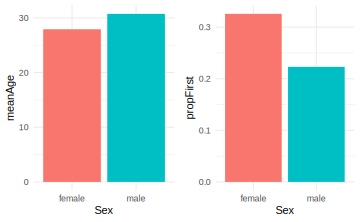
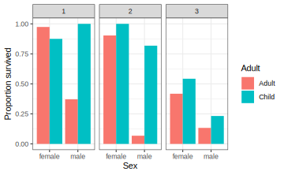
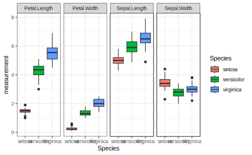
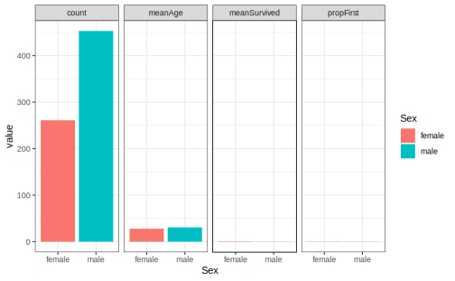
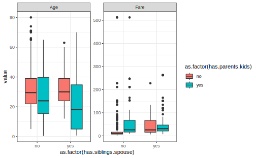

# Bearbejdning dag 2


"Fejl ved brug af utilstrækkelige data er meget mindre end dem, der ikke bruger nogen data overhovedet." -- Charles Babbage


## Indledning og læringsmålene

I dag fortsætter vi arbejdet med `tidyverse`, især fokusere vi på pakkerne `dplyr` og `tidyr`, som kan bruges til at ændre strukturen af et datasæt, så det passer til den krævede struktur for at kunne lave plots med `ggplot2`.

I biologi er det ofte tilfældet, at dataene er i en dataframe, mens yderligere oplysninger om prøverne er i en anden dataframe. Derfor vil vi gerne lære, hvordan man forbinder disse to dataframes i R, så vi kan bruge de ekstra oplysninger, når vi laver plots af dataene.

### Læringsmålene

:::goals
Du skal kunne:

* Bruge kombinationen af `group_by()` og `summarise()`.
* Forstå forskellen mellem `wide` og `long` data og bruge `pivot_longer()` til at lette plotting.
* Bruge `left_join()` eller andre join-funktioner til at tilføje prøveinformation til datasættet.
:::

:::checklist
* Se videoerne
* Lav quiz på Absalon ('tidyverse - dag 2') 
* Lav problemstillingerne
:::

### Videoer

* Video 1 - vi skal kigge lidt nærmere på `group_by()` + `summarise()` og forbinde `tidyverse` kode og `ggplot2` kode sammen med %>%/+.


```{=html}
<div class="vembedr">
<div>
<iframe class="vimeo-embed" src="https://player.vimeo.com/video/546910681" width="533" height="300" frameborder="0" webkitallowfullscreen="" mozallowfullscreen="" allowfullscreen="" data-external="1"></iframe>
</div>
</div>
```

---

* Video 2 - wide/long data forms og `pivot_longer()` og bruge den i ggplot2


```{=html}
<div class="vembedr">
<div>
<iframe class="vimeo-embed" src="https://player.vimeo.com/video/707081191" width="533" height="300" frameborder="0" webkitallowfullscreen="" mozallowfullscreen="" allowfullscreen="" data-external="1"></iframe>
</div>
</div>
```

---

* Video 3 - eksempel med titanic summary statistics


```{=html}
<div class="vembedr">
<div>
<iframe class="vimeo-embed" src="https://player.vimeo.com/video/707223997" width="533" height="300" frameborder="0" webkitallowfullscreen="" mozallowfullscreen="" allowfullscreen="" data-external="1"></iframe>
</div>
</div>
```

---

* Video 4: `left_join()` for at forbine tables med ekstra oplysning


```{=html}
<div class="vembedr">
<div>
<iframe class="vimeo-embed" src="https://player.vimeo.com/video/707082269" width="533" height="300" frameborder="0" webkitallowfullscreen="" mozallowfullscreen="" allowfullscreen="" data-external="1"></iframe>
</div>
</div>
```


## `group_by()` med `summarise()` i dplyr-pakken


Ved at kombinere `group_by()` og `summarise()` kan man finde numeriske svar på spørgsmålet: Havde mænd eller kvinder en højere sandsynlighed for at overleve tragedien?

Lad os starte med at se på en løsning med `tapply`, hvor vi udregner proportionen af mænd og kvinder, der overlevede. Følgende kode opdeler variablen `Survived` efter den kategoriske variabel `Sex` og tager middelværdien. Derved får vi proportionen af overlevende efter køn (da `Survived` er kodet sådan, at 1 betyder, at man overlevede, og `0` betyder, at man ikke overlevede).


```r
titanic_clean <- titanic %>% 
    select(-Cabin) %>%
    drop_na()

#tapply løsning 
tapply(titanic_clean$Survived,titanic_clean$Sex,mean)
```

```
#>    female      male 
#> 0.7547893 0.2052980
```

Nu skifter vi over til en `tidyverse`-løsning. Lad os tage udgangspunkt i `summarise()`-funktionen. Som et eksempel på, hvordan man bruger funktionen, vil vi beregne en variabel, som hedder "medianFare", og som er lig med `median(Fare)`.


```r
titanic_clean %>%
  summarise("medianFare"=median(Fare))
```

```
#> # A tibble: 1 × 1
#>   medianFare
#>        <dbl>
#> 1       15.7
```

Vi får faktisk en ny dataramme her, med kun den variabel, som vi lige har specificeret. Vi er dog interesseret i proportionen af overlevende, så vi tager middelværdien af variablen `Survived`. Lad os gøre det med `summarise()`:


```r
titanic_clean %>%  
  summarise(meanSurvived = mean(Survived))
```

```
#> # A tibble: 1 × 1
#>   meanSurvived
#>          <dbl>
#> 1        0.406
```

For at besvare spørgsmålet er vi også nødt til at opdele efter kolonnen `Sex`. Vi kan bruge kombinationen af `group_by()` og `summarise()`. Vi opdeler efter `Sex` ved at anvende funktionen `group_by()` og derefter bruger vi `summarise()` til at oprette en kolonne, der hedder `meanSurvived`, som viser proportionen af overlevende for både kvinder og mænd.


```r
#tidyverse løsning
titanic_clean %>%
    group_by(Sex) %>%
    summarise(meanSurvived = mean(Survived))
```

```
#> # A tibble: 2 × 2
#>   Sex    meanSurvived
#>   <chr>         <dbl>
#> 1 female        0.755
#> 2 male          0.205
```

Lad os tage resultatet fra ovenstående og visualisere det i et barplot, som vist nedenfor:


```r
titanic_clean %>%  
  group_by(Sex) %>% 
  summarise(meanSurvived = mean(Survived)) %>%
  ggplot(aes(x=Sex,y=meanSurvived,fill=Sex)) + 
  geom_bar(stat="identity",show.legend = FALSE) + theme_minimal()
```


### Reference af `summarise()`-funktioner

Her er nogle funktioner, som man ofte bruger med `summarise()` (der er mange andre muligheder).

Funktion | Beskrivelse
--- | ---
`mean()` | giver os middelværdien af en variabel.
`sd()` | giver os standardafvigelsen af en variabel.
`min()` | giver os den laveste værdi af en variabel.
`max()` | giver os den højeste værdi af en variabel.
`n()` | giver os antallet af observationer i en variabel og mange flere.
`first()` | giver os de første værdier.

### Flere summeringsstatistikker på én gang

Vi kan også lave flere summeringsstatistikker på én gang. For eksempel kan vi anvende funktionen `group_by` med Sex igen, men beregne flere forskellige summeringsstatistikker:


```r
titanic_clean_summary_by_sex <- titanic_clean %>%  
  group_by(Sex) %>% 
  summarise(count = n(),                    #count
            meanSurvived = mean(Survived),  #middelværdi survived
            meanAge = mean(Age),            #middelværdi age
            propFirst = sum(Pclass==1)/n()) #proportionen i første klass
titanic_clean_summary_by_sex
```

```
#> # A tibble: 2 × 5
#>   Sex    count meanSurvived meanAge propFirst
#>   <chr>  <int>        <dbl>   <dbl>     <dbl>
#> 1 female   261        0.755    27.9     0.326
#> 2 male     453        0.205    30.7     0.223
```


Denne summeringstabel kan igen bruges som et datasæt til at lave et plot med `ggplot2`. Bemærk, at her bruger vi `stat="identity"`, fordi vi ikke skal tælle observationerne op, men blot plotte præcis de tal, der er i datarammen, på y-aksen. I nedenstående eksempel laver vi barplots for `meanAge` og `propFirst`. De er plottet ved hjælp af to forskellige `ggplot`-kommandoer, og bemærk, at de er plottet ved siden af hinanden ved hjælp af en funktion kaldet `grid.arrange()` fra R-pakken `gridExtra`.
 

```r
plotA <- ggplot(data=titanic_clean_summary_by_sex,aes(x=Sex,y=meanAge,fill=Sex)) + 
  geom_bar(stat="identity",show.legend = FALSE) + 
  theme_minimal()

plotB <- ggplot(data=titanic_clean_summary_by_sex,aes(x=Sex,y=propFirst,fill=Sex)) + 
  geom_bar(stat="identity",show.legend = FALSE) + 
  theme_minimal()

library(gridExtra)
grid.arrange(plotA,plotB,ncol=2) #plot both together
```


 
Vi kan se, at kvinder i gennemsnit var lidt yngre end mænd og havde en højere sandsynlighed for at være i første klasse. Et interessant spørgsmål er, hvordan man kan lave de ovenstående plots uden at bruge to forskellige `ggplot`-kommandoer. Med andre ord, hvordan man kan lave en automatisk løsning, hvor vi kan plotte flere summeringsstatistikker med kun én `ggplot`-kommando. Vi vil se, hvordan det kan gøres ved først at konvertere datasættet til long-form.

### Mere avanceret `group_by()`

 Lad os også beregne, hvor mange passagerer der var, efter både deres klasse og hvor de gik om bord på skibet:


```r
titanic_clean %>%
   group_by(Embarked, Pclass) %>% # Grupper efter flere variable... 
   summarise(count = n())
```

```
#> # A tibble: 10 × 3
#> # Groups:   Embarked [4]
#>    Embarked Pclass count
#>    <chr>     <int> <int>
#>  1 ""            1     2
#>  2 "C"           1    74
#>  3 "C"           2    15
#>  4 "C"           3    41
#>  5 "Q"           1     2
#>  6 "Q"           2     2
#>  7 "Q"           3    24
#>  8 "S"           1   108
#>  9 "S"           2   156
#> 10 "S"           3   290
```

Man kan se, at størstedelen gik ombord i Southampton (S), men der var også forholdsvis mange førsteklasses-passagerer, der gik ombord i Cherbourg (C). Lad os fortsætte med vores `Survived`-eksempel og beregne proportionen af overlevende efter de tre variable `Adult`, `Sex` og `Pclass`.


```r
titanic_clean_summary_survived <- titanic_clean %>%  
  mutate(Adult = ifelse(Age>=18,"Adult","Child")) %>%
  group_by(Adult,Sex,Pclass) %>% 
  summarise(meanSurvived = mean(Survived))
titanic_clean_summary_survived
```

```
#> # A tibble: 12 × 4
#> # Groups:   Adult, Sex [4]
#>    Adult Sex    Pclass meanSurvived
#>    <chr> <chr>   <int>        <dbl>
#>  1 Adult female      1       0.974 
#>  2 Adult female      2       0.903 
#>  3 Adult female      3       0.418 
#>  4 Adult male        1       0.371 
#>  5 Adult male        2       0.0682
#>  6 Adult male        3       0.133 
#>  7 Child female      1       0.875 
#>  8 Child female      2       1     
#>  9 Child female      3       0.543 
#> 10 Child male        1       1     
#> 11 Child male        2       0.818 
#> 12 Child male        3       0.233
```

Og så kan vi også bruge resultatet i en `ggplot`, hvor vi kombinerer de tre variable og opdeler det i tre plots efter `Pclass`:


```r
ggplot(titanic_clean_summary_survived,aes(x=Sex,y=meanSurvived,fill=Adult)) +
  geom_bar(stat="identity",position = "dodge") + 
  facet_grid(~Pclass) + 
  ylab("Proportion survived") +
  theme_bw()
```




### Funktionen `ungroup()`

Nogle gange, når man er færdig med en proces, men gerne vil arbejde videre med et datasæt, er det nyttigt at anvende `ungroup()` på datasættet igen. Det er mest relevant i længere projekter. Som et eksempel kan vi se på følgende kode, hvor der står "Groups: Adult [2]" øverst i den nye dataramme med summeringsstatistikker:


```r
titanic_clean_summary <- titanic_clean %>%  
  mutate(Adult = ifelse(Age>=18,"Adult","Child")) %>%
  group_by(Adult,Sex) %>% 
  summarise(meanSurvived = mean(Survived))

titanic_clean_summary
```

```
#> # A tibble: 4 × 3
#> # Groups:   Adult [2]
#>   Adult Sex    meanSurvived
#>   <chr> <chr>         <dbl>
#> 1 Adult female        0.772
#> 2 Adult male          0.177
#> 3 Child female        0.691
#> 4 Child male          0.397
```
Bemærk, at vi først brugte `group_by()` på både `Adult` og `Sex`. Men hver gang man laver en beregning, fjernes én opdeling - i dette tilfælde opdeles der ikke længere efter `Sex`, men der opdeles stadig efter `Adult`. Det er ikke et problem, hvis vi ikke vil arbejde videre med datarammen. Men forestil dig, at vi gerne vil vide, hvad den maksimale chance for overlevelse er, ud fra de fire beregnede tal. Hvis vi ikke vil opdele efter en kategorisk variabel, dropper vi `group_by()`:


```r
titanic_clean_summary %>% 
  summarise("maxChance" = max(meanSurvived))
```

```
#> # A tibble: 2 × 2
#>   Adult maxChance
#>   <chr>     <dbl>
#> 1 Adult     0.772
#> 2 Child     0.691
```


Man kan dog se, at outputtet er blevet opdelt efter variablen `Adult`. For at undgå dette skal man først anvende `ungroup()`, så effekten af `group_by()` fjernes.


```r
titanic_clean_summary %>% 
  ungroup() %>%
  summarise("maxChance" = max(meanSurvived))
```

```
#> # A tibble: 1 × 1
#>   maxChance
#>       <dbl>
#> 1     0.772
```


## `pivot_longer()`/`pivot_wider()` med Tidyr-pakken

__Tidy data__ findes i to former: wide data og long data. Det kan være nyttigt at transformere datarammen fra den ene form til den anden, f.eks. for at lave et bestemt plot med `ggplot2`-pakken. Inden for pakken `tidyr` er der funktioner, der kan bruges til at lave disse transformationer.

Før vi begynder at se lidt nærmere på `tidyr`, skal vi beskrive, hvad long data og wide data betyder.

<div class="figure" style="text-align: center">

<p class="caption">(\#fig:unnamed-chunk-20)source: https://www.garrickadenbuie.com/project/tidyexplain/</p>
</div>


__Wide data__: Her har man én kolonne for hver variabel og én række for hver observation. Dette gør dataene lette at forstå, og denne datatype findes ofte indenfor biologi - for eksempel, hvis man har forskellige prøver (behandlinger, kontroller, betingelser osv.) som variabler.

__Long data__: Med long data har man værdier samlet i en enkelt kolonne og en kolonne som en slags nøgle, der også angiver, hvilken variabel hver værdi hørte til i det wide format. Datasættet betragtes stadig som __tidy__, men informationen opbevares på en anden måde. Det er lidt sværere at læse, men nemmere at arbejde med, når man analyserer dataene.

Når man transformerer data fra wide til long eller omvendt, kaldes det for __reshaping__.


### Tidyr pakke - oversigt

Her er en oversigt over de fire vigtigste funktioner fra R-pakken `tidyr`. Vi fokuserer mest på `pivot`-funktionerne, men det kan være nyttigt at bruge `separate` og `unite` en gang imellem.

`tidyr` funktion | Beskrivelse
--- | ---
`pivot_longer()` | wide til long
`pivot_wider()` | long til wide
`separate()` | opdele strenge fra én kolonne til to
`unite()` | føje strenge sammen fra to til én kolonne

### Wide -> Long med `pivot_longer()`

Lad os arbejde med datasættet `Iris`. Man får Iris i long format med følgende kommando. Her vil man gerne tage alle numeriske kolonner og placere deres værdier i en enkelt kolonne `value` (med en nøglekolonne `name` til at skelne imellem de forskellige variabler).


```r
iris %>% pivot_longer(cols = where(is.numeric))
```

```
#> # A tibble: 600 × 3
#>    Species name         value
#>    <fct>   <chr>        <dbl>
#>  1 setosa  Sepal.Length   5.1
#>  2 setosa  Sepal.Width    3.5
#>  3 setosa  Petal.Length   1.4
#>  4 setosa  Petal.Width    0.2
#>  5 setosa  Sepal.Length   4.9
#>  6 setosa  Sepal.Width    3  
#>  7 setosa  Petal.Length   1.4
#>  8 setosa  Petal.Width    0.2
#>  9 setosa  Sepal.Length   4.7
#> 10 setosa  Sepal.Width    3.2
#> # ℹ 590 more rows
```

At beholde numeriske kolonner svarer i dette tilfælde til, at man ikke vil have variablen `Species` med i den enkelte kolonne: 


```r
iris %>%
  pivot_longer(cols = -Species)
```

```
#> # A tibble: 600 × 3
#>    Species name         value
#>    <fct>   <chr>        <dbl>
#>  1 setosa  Sepal.Length   5.1
#>  2 setosa  Sepal.Width    3.5
#>  3 setosa  Petal.Length   1.4
#>  4 setosa  Petal.Width    0.2
#>  5 setosa  Sepal.Length   4.9
#>  6 setosa  Sepal.Width    3  
#>  7 setosa  Petal.Length   1.4
#>  8 setosa  Petal.Width    0.2
#>  9 setosa  Sepal.Length   4.7
#> 10 setosa  Sepal.Width    3.2
#> # ℹ 590 more rows
```

Her er et billed, der illustrerer wide- og long-form med datasættet `iris`:

<div class="figure" style="text-align: center">

<p class="caption">(\#fig:unnamed-chunk-23)wide til long med Iris</p>
</div>


Til venstre har vi målingerne i datasættet fordelt over fire forskellige kolonner kaldet `Sepal.Length`, `Sepal.Width`, `Petal.Length` og `Petal.Width`, samt en ekstra kolonne, der skelner mellem de tre `Species`. Til højre har vi samlet alle målingerne i en enkelt kolonne kaldet `values`, og så bruger vi en anden 'nøgle' kolonne kaldet `name` til at fortælle os, om det er en måling for `Sepal.Length` eller `Sepal.Width` osv.

Jeg kan ændre kolonnenavne for målingerne og nøglen til nogle andre end standardnavnene. For eksempel, i nedenstående eksempel skal målingerne hedde `measurements` og nøglen hedde `trait`.


```r
iris.long <- iris %>% pivot_longer(cols = -Species,
                                    names_to = "trait",
                                    values_to = "measurement")
```


Man kan for eksempel bruge den long form til at visualisere samtlige mulige boxplots opdelt efter `Species` og `trait` på samme plot:


```r
ggplot(iris.long,aes(y=measurement,x=Species,fill=Species)) + 
  geom_boxplot() + 
  facet_grid(~trait) +
  theme_bw()
```




### `separate()`

Funktionen `separate()` fra pakken `tidyr` kan bruges til at opdele to forskellige dele, som eksisterer i samme kolonne. For eksempel, i `iris` har vi variabler med navne `Sepal.Width`, `Sepal.Length` osv. - man kan forestille sig at opdele disse navne over to kolonner i stedet for én - fx "Sepal" og "Width" i tilfældet af `Sepal.Width`. I nedenstående kan man se, hvordan man anvender `separate()`.


```r
iris %>%
  pivot_longer(cols = -Species, names_to = "trait", values_to = "measurement") %>%
  separate(col = trait, into = c("part", "measure"), sep = "\\.") %>% 
  head()
```

```
#> # A tibble: 6 × 4
#>   Species part  measure measurement
#>   <fct>   <chr> <chr>         <dbl>
#> 1 setosa  Sepal Length          5.1
#> 2 setosa  Sepal Width           3.5
#> 3 setosa  Petal Length          1.4
#> 4 setosa  Petal Width           0.2
#> 5 setosa  Sepal Length          4.9
#> 6 setosa  Sepal Width           3
```

Man specificerer variablen `trait` og angiver, at den skal opdeles til to variabler `part` og `measure`. Vi angiver `sep = "\\."`, hvilket betyder, at vi gerne vil have `part` som delen af `trait` foran '.' og `measure` som delen af `trait` efter `.`. Vi bruger "\\." for at fortælle, at vi er interesseret i punktummet og ikke en "anonym karakter", som punktum normalt betyder i "streng"-sprog. Man behøver faktisk ikke at specificere `sep = "\\."` i dette tilfælde - som standard kigger funktionen efter 'non-character' tegn og bruger dem til at lave opdelingen.

Samme resultat:


```r
iris %>%
  pivot_longer(cols = -Species, names_to = "trait", values_to = "measurement") %>%
  separate(col = trait, into = c("part", "measure")) %>% 
  head()
```

```
#> # A tibble: 6 × 4
#>   Species part  measure measurement
#>   <fct>   <chr> <chr>         <dbl>
#> 1 setosa  Sepal Length          5.1
#> 2 setosa  Sepal Width           3.5
#> 3 setosa  Petal Length          1.4
#> 4 setosa  Petal Width           0.2
#> 5 setosa  Sepal Length          4.9
#> 6 setosa  Sepal Width           3
```


Bruger resultatet i et plot:


```r
iris %>%
  pivot_longer(cols = -Species, names_to = "trait", values_to = "measurement") %>%
  separate(col = trait, into = c("part", "measure")) %>%
  ggplot(aes(y=measurement,x=part,fill=part)) + 
  geom_boxplot() + 
  facet_grid(~measure) +
  theme_bw()
```


Se også `unite()` som gøre det modsatte til `separate()`.

## Eksempel: Titanic opsummeringsstatistikker

Her er et eksempel med datasættet `titanic`, der inddrager mange af de tidyverse-koncepter, vi har lært indtil videre.

* `group_by()` og `summarise()`

Vi laver vores opsummeringsstatistikker som i ovenstående.


```r
titanic_clean_summary_by_sex <- titanic_clean %>%
  group_by(Sex) %>%
  summarise(count = n(),
            meanSurvived = mean(Survived),
            meanAge = mean(Age),
            propFirst = sum(Pclass == 1) / n())
titanic_clean_summary_by_sex
```

```
#> # A tibble: 2 × 5
#>   Sex    count meanSurvived meanAge propFirst
#>   <chr>  <int>        <dbl>   <dbl>     <dbl>
#> 1 female   261        0.755    27.9     0.326
#> 2 male     453        0.205    30.7     0.223
```

* `pivot_longer()`

Vi transformerer eller __reshaper__ datarammen fra wide data til long data. Vi vil samle kun de numeriske opsummeringsstatistikker i en enkelt kolonne, så variablen `Sex` skal ikke indgå i den enkelte kolonne.


```r
titanic_clean_summary_by_sex %>% pivot_longer(cols=-Sex)
```

```
#> # A tibble: 8 × 3
#>   Sex    name           value
#>   <chr>  <chr>          <dbl>
#> 1 female count        261    
#> 2 female meanSurvived   0.755
#> 3 female meanAge       27.9  
#> 4 female propFirst      0.326
#> 5 male   count        453    
#> 6 male   meanSurvived   0.205
#> 7 male   meanAge       30.7  
#> 8 male   propFirst      0.223
```

* `ggplot()` med `facet_grid()`

Vi kombinerer `pivot_longer()` med et plot af vores opsummeringsstatistikker og benytter `facet_grid()` til at adskille de forskellige statistikker.


```r
titanic_clean_summary_by_sex %>% 
  pivot_longer(cols = -Sex) %>%
  ggplot(aes(x = Sex, y = value, fill = Sex)) + 
  geom_bar(stat = "identity") + 
  facet_grid(~name) +
  theme_bw()
```



* `facet_wrap()`

Vi laver det samme som ovenstående, men specificerer `facet_wrap()` i stedet for `facet_grid()`. Indenfor `facet_wrap()` kan man bruge indstillingen `scales="free"`, som gør, at de fire plots får hver deres egne aksegrænser.


```r
titanic_clean_summary_by_sex %>% 
  pivot_longer(cols=-Sex) %>%
  ggplot(aes(x=Sex,y=value,fill=Sex)) + 
  geom_bar(stat="identity") + 
  facet_wrap(~name,scales="free",ncol=4) +  
  theme_bw()
```


### Demonstration af `pivot_wider()`

Det er også brugbart at kende måden at man skifter fra long form til wide form.

* Wide -> Long


```r
titanic_summary_long <- titanic_clean_summary_by_sex %>% 
  pivot_longer(cols=-Sex)
```

* Long -> Wide


```r
titanic_summary_long %>%
  pivot_wider(names_from = "name",values_from = "value")
```

```
#> # A tibble: 2 × 5
#>   Sex    count meanSurvived meanAge propFirst
#>   <chr>  <dbl>        <dbl>   <dbl>     <dbl>
#> 1 female   261        0.755    27.9     0.326
#> 2 male     453        0.205    30.7     0.223
```

Parametre er:

* `names_from` - nøglekolonne, som skal udgøre flere kolonner i den nye dataframe
* `values_from` - selve værdier, som skal være i de nye kolonner i den wide form


## `left_join()`: forbinde dataframes

Vi tager udgangspunkt i følgende to dataframes:


```r
gene_table <- as_tibble(read.table("https://www.dropbox.com/s/6ll8ezrskly8joi/mouse_2gene_expr.txt?dl=1",header=T))
coldata <- as_tibble(read.table("https://www.dropbox.com/s/jlrszakmqlnmu2m/bottomly_phenodata.txt?dl=1"))
```

Lad os først kigge på datasættet `gene_table`, som viser genekspressionsmålinger over forskellige prøver fra mus.


```r
gene_table
```

```
#> # A tibble: 3 × 22
#>   gene     SRX033480 SRX033488 SRX033481 SRX033489 SRX033482 SRX033490 SRX033483
#>   <chr>        <dbl>     <dbl>     <dbl>     <dbl>     <dbl>     <dbl>     <dbl>
#> 1 ENSMUSG…      158.      182.     119.       155.     167.      164.       180.
#> 2 ENSMUSG…      143.      118.      91.6      106.     157.       95.1      131.
#> 3 ENSMUSG…      132.      117.     100.       116.      88.1     125.       124.
#> # ℹ 14 more variables: SRX033476 <dbl>, SRX033478 <dbl>, SRX033479 <dbl>,
#> #   SRX033472 <dbl>, SRX033473 <dbl>, SRX033474 <dbl>, SRX033475 <dbl>,
#> #   SRX033491 <dbl>, SRX033484 <dbl>, SRX033492 <dbl>, SRX033485 <dbl>,
#> #   SRX033493 <dbl>, SRX033486 <dbl>, SRX033494 <dbl>
```

Man kan se, at der er 22 kolonner i datasættet - én der refererer til et gen-navn og 21, der er forskellige prøver fra eksperimentet. Men det er ikke klart, hvad den enkelte prøve egentlig er. Lad os derfor kigge på de prøveoplysninger, som kan være nyttige at inddrage i vores analyse/plots for at undersøge eventuelle batcheffekter osv.


```r
coldata
```

```
#> # A tibble: 21 × 5
#>    sample    num.tech.reps strain   batch lane.number
#>    <chr>             <int> <chr>    <int>       <int>
#>  1 SRX033480             1 C57BL.6J     6           1
#>  2 SRX033488             1 C57BL.6J     7           1
#>  3 SRX033481             1 C57BL.6J     6           2
#>  4 SRX033489             1 C57BL.6J     7           2
#>  5 SRX033482             1 C57BL.6J     6           3
#>  6 SRX033490             1 C57BL.6J     7           3
#>  7 SRX033483             1 C57BL.6J     6           5
#>  8 SRX033476             1 C57BL.6J     4           6
#>  9 SRX033478             1 C57BL.6J     4           7
#> 10 SRX033479             1 C57BL.6J     4           8
#> # ℹ 11 more rows
```

Man kan se forskellige oplysninger om de 21 prøver, blandt andet den stamme af mus, hver prøve stammer fra, og den batch. Her refererer `batch` til de forskellige omstændigheder eller tidspunkter, hvor prøverne blev samlet. Hvis man er interesseret i, om der er en forskel i ekspressionsniveau mellem de to stammer (strains), kan det være nødvendigt at kontrollere efter batch for at sikre, at forskellen skyldes `strain` og ikke tekniske effekter på grund af `batch`.

### Funktionen `left_join()` fra dplyr-pakken

Funktionen `left_join()` er en del af pakken `dplyr`, som vi har arbejdet meget med indtil videre i kurset.

funktion | Beskrivelse (kopieret)
--- | ---
`left_join()` | Tilføj matchende rækker fra den anden tabel til den første
`right_join()` | Tilføj matchende rækker fra den første tabel til den anden
`inner_join()` | Sammenføj to tabeller og returner alle rækker, der er til stede i begge
`full_join()` | Sammenføj data med alle mulige rækker til stede

Vi fokuserer her på funktionen `left_join()` fordi den er mest brugbar i biologiske dataanalyser, men vi kigger også på de øvrige funktioner gennem problemstillingerne nedenfor. Her er en grafisk demonstration af `left_join()` (kilde: https://mgimond.github.io/ES218/Week03c.html):


Det særlige ved `left_join` i forhold til de andre funktioner er, at `left_join` bevarer samtlige data i dataframen, man tager udgangspunkt i - det vil sige `df` i ovenstående billede, selvom `d` ikke matcher med en frugt i `dj`. I ovenstående genekspressionseksempel betyder det, at man bevarer alle målinger i `gene_table`, uanset om der er oplysninger om deres pågældende prøver.

### Anvend `left_join()` for vores datasæt.

Ligesom man matcher kolonnen `y` i `df` og `dj` i ovenstående eksempel, skal vi også have en kolonne, vi kan matche. Vi vil gerne bruge kolonnen `sample` fra `sample_info` til at sammenligne med de forskellige prøvenavne i `gene_table`, men først er vi nødt til at lave `gene_table` om til long-form, således at prøvenavne fremgår i en enkelt kolonne, `sample` (der kan bruges i `left_join`).


```r
gene_table_long <- gene_table %>% 
  pivot_longer(cols = -gene,
               names_to = "sample",
               values_to = "expression") 
gene_table_long
```

```
#> # A tibble: 63 × 3
#>    gene               sample    expression
#>    <chr>              <chr>          <dbl>
#>  1 ENSMUSG00000006517 SRX033480       158.
#>  2 ENSMUSG00000006517 SRX033488       182.
#>  3 ENSMUSG00000006517 SRX033481       119.
#>  4 ENSMUSG00000006517 SRX033489       155.
#>  5 ENSMUSG00000006517 SRX033482       167.
#>  6 ENSMUSG00000006517 SRX033490       164.
#>  7 ENSMUSG00000006517 SRX033483       180.
#>  8 ENSMUSG00000006517 SRX033476       263.
#>  9 ENSMUSG00000006517 SRX033478       276.
#> 10 ENSMUSG00000006517 SRX033479       328.
#> # ℹ 53 more rows
```

Dernæst kan vi tilføje oplysningsdata fra `sample_info`. Her angiver vi `by = "sample"` fordi det er navnet på kolonnen, som vi gerne vil bruge til at forbinde de to datarammer - altså, det er med i begge datarammer, så `left_join()` kan bruge det som en slags nøgle til at vide, hvor alle de forskellige oplysninger skal tilføjes.


```r
data_join <- gene_table_long  %>% left_join(coldata, by="sample")
```

Nu, hvor vi har fået forbundet de to datarammer, kan man inddrage de ekstra oplysninger vi har fået i et plot. Her laver vi et plot med en farve til hver stamme og et plot med en farve til hver batch.


```r
gg2 <- data_join %>% 
  ggplot(aes(y=expression,x=as.factor(strain),fill=gene)) + 
  geom_boxplot() + 
  facet_wrap(~gene,scales="free") +
  theme_minimal() +
  theme(legend.position = "none") + 
  ggtitle("Expression split according to strain")
gg2
```


```r
gg1 <- data_join %>% 
  ggplot(aes(y=expression,x=as.factor(batch),fill=gene)) + 
  geom_boxplot() + 
  facet_wrap(~gene,scales="free") +
  theme_minimal() +
  theme(legend.position = "none") +
  ggtitle("Expression split according to batch")

gg1
```


## Problemstillinger

__Problem 1__ Lav quizzen - "Quiz - tidyverse - part 2".

---

*Vi øver os videre med datasættet Titanic. Indlæs datasættet og udfør oprydning med følgende kode:*


```r
library(tidyverse)
library(titanic)
titanic <- as_tibble(titanic_train)

titanic_clean <- titanic %>% 
    select(-Cabin) %>% 
    drop_na()
```

---

__Problem 2__ Fra `titanic_clean` datasættet, beregn den gennemsnitlige alder af alle passagerer ombord på skibet.


```r
titanic_clean %>%
    summarise(....) #rediger her
```

* I samme kommando, beregn også den maksimale alder og den minimale alder, samt proportionen af passagerer, der er under 18 (for den sidste, se mit eksempel med `Pclass` tidligere i sektion **6.2.2**). Dataframen skal se sådan ud:


```
#> # A tibble: 1 × 4
#>   mean_alder max_alder min_alder under_18p
#>        <dbl>     <dbl>     <dbl>     <dbl>
#> 1       29.7        80      0.42     0.158
```

---

__Problem 3__ 

__a)__ Beregn samme opsummeringsstatistikker som i sidste problem, men brug `group_by()` til først at opdele efter variablen `Pclass`.


__b)__ Brug din nye dataframe med dine opsummeringsstatistikker til at lave et søjlediagram med `stat="identity"` (i stedet for `stat="count"` som er standarden), der viser den gennemsnitlige alder på y-aksen og er opdelt efter `Pclass` på x-aksen (vær opmærksom på datatypen for `Pclass` med hensyn til farverne/x-aksen).


__c)__ Anvend `pivot_longer()` på din dataframe med dine opsummeringsstatistikker (brug indstillingen `cols = -Pclass` i funktionen).

__d)__ Brug din long-form dataframe af dine opsummeringsstatistikker til at lave plots af alle opsummeringsstatistikker med én `ggplot` kommando (adskil dem ved at benytte `facet_wrap` så du har et plot til hvert opsummeringsstatistik og opdele efter `Pclass` indenfor hvert plot, ligesom i følgende).


---

__Problem 4__ 

__a)__ Beregn de samme opsummeringsstatistikker som i __2__), men anvend `group_by()` for først at opdele efter **både** variablerne `Pclass` og `Sex`.

  * OBS: Du får en advarsel "`summarise()` has grouped output by 'Pclass' ...", fordi din dataframe stadig betragtes som opdelt efter `Pclass`. Dette skal tages i betragtning, hvis du foretager yderligere beregninger på den.
  * Brug til sidst `ungroup()` på din nye dataframe for at sikre, at den ikke længere er opdelt efter nogen variabel.


__b)__ Brug `pivot_longer()`-funktionen til at omdanne datasættet til long-form med dine opsummeringsstatistikker i en enkelt kolonne. Nøglekolonnen skal hedde `stat`, og kolonnen med værdierne skal hedde `values`.


__c)__ Lav et plot af alle opsummeringsstatistikker, som er i long-format og ligner følgende plot.


---


__Problem 5__ *`group_by()` med tre variabler og `summarise()`*. Prøv en kombination med tre forskellige variabler (vælg selv) indenfor `group_by()` og brug `summarise()` til at beregne middelværdien for variablen `Fare`.

* Anvend `ungroup()` når du er færdig med at opsummere
* Lav et plot for at visualisere `meanFare`. Idé: som en mulighed, kan man tilføje variabler til `facet_grid()` - for eksempel `facet_grid(~Var1 + Var2)`.


---


__Problem 6__ *`pivot_longer()`* Først skal du lave to nye variabler ud fra `SibSp` og `Parch`, hvor der står "yes", hvis værdien er større end 0. Anvend derefter `select()` på `Fare`, `Age` og dine to nye variabler. Lav derefter følgende plot:





---

__Problem 7__ *`Pivot_wider()`* Vi har en `tribble`, som jeg har kopieret fra https://r4ds.had.co.nz/index.html.


```r
people <- tribble(
  ~name,             ~names,  ~values,
  #-----------------|--------|------
  "Phillip Woods",   "age",       45,
  "Phillip Woods",   "height",   186,
  "Jessica Cordero", "age",       37,
  "Jessica Cordero", "height",   156,
  "Brady Smith",     "age",       23,
  "Brady Smith",     "height",   177
)
```

Brug `pivot_wider()` på `people` for at får datasættet i wide-form således at `age` og `height` hver har deres egne kolonner.


---

__Problem 8__ *`left_join()` øvelse*. Kør følgende kode med to tribbles:


```r
superheroes <- tribble(
       ~name, ~alignment,  ~gender,          ~publisher,
   "Magneto",      "bad",   "male",            "Marvel",
     "Storm",     "good", "female",            "Marvel",
  "Mystique",      "bad", "female",            "Marvel",
    "Batman",     "good",   "male",                "DC",
     "Joker",      "bad",   "male",                "DC",
  "Catwoman",      "bad", "female",                "DC",
   "Hellboy",     "good",   "male", "Dark Horse Comics"
  )

publishers <- tribble(
  ~publisher, ~yr_founded,
        "DC",       1934L,
    "Marvel",       1939L,
     "Image",       1992L
  )
```

Vi har to dataframes - `superheroes` og `publishers`. Hvilken kolon kan man bruge til at forbinde de to dataframes? Brug `left_join()` til at tilføje oplysninger __fra__ `publishers` __til__ datarammen `superheroes`.


* Får man alle observationerne fra dataframen `superheroes` med i din nye dataframe?
* Benyt `inner_join()` til at forbinde `publishers` til `superheroes` - få man så nu alle observationer med denne gang?
* Benyt  `full_join()` til at forbinde `publishers` til `superheroes` - hvor mange observationer få man med nu? Hvorfor?


---

__Problem 9__ *`left_join()` øvelse*. Kør nedenstående kode, hvor der er to dataframes - `iris2` og `sample_table`. Dataframen `iris2` er ikke særlig informativ med hensyn til, hvad de forskellige prøver egentlig er, men oplysningerne om dem findes i `sample_table`. Brug `left_join()` til at tilføje `sample_table` til `iris2` for at få en dataramme, som indeholder både data og oplysninger om prøverne.


```r
data(iris)
iris2 <- as_tibble(iris)
names(iris2) <- c("sample1","sample2","sample3","sample4","Species")

samp_table <- tribble(
                      ~sample, ~part, ~measure,
                      #------|-------|--------#
                      "sample1", "Sepal", "Length",
                      "sample2", "Sepal", "Width",
                      "sample3", "Petal", "Length",
                      "sample4", "Sepal", "Width"
                     )


iris2 %>% glimpse()
```

```
#> Rows: 150
#> Columns: 5
#> $ sample1 <dbl> 5.1, 4.9, 4.7, 4.6, 5.0, 5.4, 4.6, 5.0, 4.4, 4.9, 5.4, 4.8, 4.…
#> $ sample2 <dbl> 3.5, 3.0, 3.2, 3.1, 3.6, 3.9, 3.4, 3.4, 2.9, 3.1, 3.7, 3.4, 3.…
#> $ sample3 <dbl> 1.4, 1.4, 1.3, 1.5, 1.4, 1.7, 1.4, 1.5, 1.4, 1.5, 1.5, 1.6, 1.…
#> $ sample4 <dbl> 0.2, 0.2, 0.2, 0.2, 0.2, 0.4, 0.3, 0.2, 0.2, 0.1, 0.2, 0.2, 0.…
#> $ Species <fct> setosa, setosa, setosa, setosa, setosa, setosa, setosa, setosa…
```

```r
samp_table %>% glimpse()
```

```
#> Rows: 4
#> Columns: 3
#> $ sample  <chr> "sample1", "sample2", "sample3", "sample4"
#> $ part    <chr> "Sepal", "Sepal", "Petal", "Sepal"
#> $ measure <chr> "Length", "Width", "Length", "Width"
```


---

__Problem 10__ *`Separate()` øvelse* 

* Tag udgangspunkt i datasættet `titanic_clean` og benyt funktionen `separate()` til at opdele variablen `Name` i to variabler, "Surname" og "Rest" (Godt råd: brug `sep=", "` for at undgå, at man får et unødvendigt mellemrum lige før "Rest").
* Anvend `separate()` en gang til, men for at opdele variablen `Rest` i to variabler, "Titel" og "Names". Hvad bruger man som `sep`? (Hint: brug "\\\\" foran en punktum).
* Beregn opsummeringsstatistikker for hver "Titel" - antal passagerer, gennemsnitsalder, andelen der overlevede og andelen der rejste i første klasse.
* Arrangér din nye dataframe efter, hvor mange personer der er for hver "Titel" - flest øverst og færrest nederst.


---

__Problem 11__ *Ekstra pivot_longer() øvelse* Åbn datasættet `airquality` (`data(airquality)`) og lav følgende plot: 


--------

__Problem 12__ Åbn `table2` (data(table2)) og gør den til at ser sådan ud:


```
#> # A tibble: 6 × 4
#>   country      year  cases population
#>   <chr>       <dbl>  <dbl>      <dbl>
#> 1 Afghanistan  1999    745   19987071
#> 2 Afghanistan  2000   2666   20595360
#> 3 Brazil       1999  37737  172006362
#> 4 Brazil       2000  80488  174504898
#> 5 China        1999 212258 1272915272
#> 6 China        2000 213766 1280428583
```


--------

__Problem 13__ Tag udgangspunkt i `my_tibble`


```r
cause <- rep(c("Communicable diseases","Injuries","Non-communicable diseases"),each=4)
year <- rep(c(1990,2017),times=6)
sex <- rep(c("Female","Female","Male","Male"),times=3)
deaths_millions <- c(7.30,4.91,8.06,5.47,1.41,1.42,2.84,3.05,12.80,19.15,13.91,21.74)

my_tibble <- tibble(cause,year,sex,deaths_millions)
```

Og gør den til at ser sådan ud (tip: Google efter `unite()` for at se, hvordan man bruger den)


```
#> # A tibble: 3 × 5
#>   cause                     Female_1990 Female_2017 Male_1990 Male_2017
#>   <chr>                           <dbl>       <dbl>     <dbl>     <dbl>
#> 1 Communicable diseases            7.3         4.91      8.06      5.47
#> 2 Injuries                         1.41        1.42      2.84      3.05
#> 3 Non-communicable diseases       12.8        19.2      13.9      21.7
```


__Problem 14__ Valgfri ekstra: lav en ny dataramme med alle passagerer, der hedder "Alice" eller "Elizabeth" (brug Google her).


---

## Ekstra links

Cheatsheet: https://github.com/rstudio/cheatsheets/blob/master/data-import.pdf


