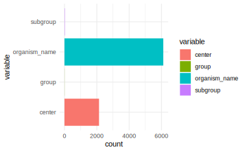
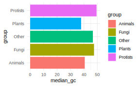
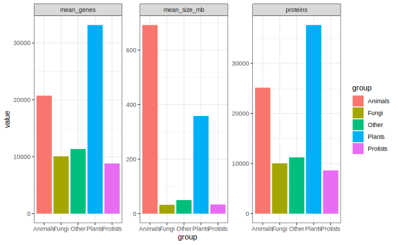
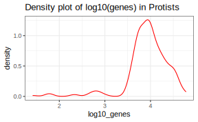

# Functional programming med purrr-pakken


## Inledning og læringsmålene

Emnet omhandler, hvordan man kan integrere funktioner for at forbedre reproducibilitet og gennemsigtighed i dine analyser. Det er ofte tilfældet i biologi, at man arbejder med flere datasæt eller variabler, der henviser til fx forskellige prøver, replikater eller batches, og ønsker at udføre den samme proces på dem alle samtidig.

I dette emne beskæftiger du dig med især pakken `Purrr` og `map()` funktioner, som kan benyttes til at lave gentagne baserende analyser i `R`.

### Læringsmål

Du skal være i stand til at:

* Anvende `map()`-funktioner til at udføre beregninger iterativt over flere kolonner.
* Bruge `group_by()` og `nest()` til at gennemføre reproducerbare analyser over forskellige dele af datasættet.
* Kombinere `map()` og `map2()` med brugerdefinerede funktioner for at øge fleksibiliteten i analyserne.

### Videorressourcer

* Video 1: Introduktion til `map()`-funktioner for iteration over kolonner

Link her hvis det ikke virker nedenunder: https://player.vimeo.com/video/549630848

```{=html}
<div class="vembedr">
<div>
<iframe class="vimeo-embed" src="https://player.vimeo.com/video/549630848" width="533" height="300" frameborder="0" webkitallowfullscreen="" mozallowfullscreen="" allowfullscreen="" data-external="1"></iframe>
</div>
</div>
```


* Video 2: Introduction to custom functions and combining them with map

Link her hvis det ikke virker nedenunder: https://player.vimeo.com/video/549630825

```{=html}
<div class="vembedr">
<div>
<iframe class="vimeo-embed" src="https://player.vimeo.com/video/549630825" width="533" height="300" frameborder="0" webkitallowfullscreen="" mozallowfullscreen="" allowfullscreen="" data-external="1"></iframe>
</div>
</div>
```


* Video 3: Introduction to nest functions for breaking data into sections

Link her hvis det ikke virker nedenunder: https://player.vimeo.com/video/549630798

```{=html}
<div class="vembedr">
<div>
<iframe class="vimeo-embed" src="https://player.vimeo.com/video/549630798" width="533" height="300" frameborder="0" webkitallowfullscreen="" mozallowfullscreen="" allowfullscreen="" data-external="1"></iframe>
</div>
</div>
```


## Iterative processer med `map()` funktioner

Når man udfører en iterativ proces, vil man ofte gentage den samme handling flere gange. Det kan for eksempel være, at vi har ti variabler, og vi ønsker at beregne middelværdien for hver variabel. Vi arbejder med datasættet `eukaryotes`, som indeholder oplysninger om forskellige organismer, der tilhører eukaryoter - for eksempel deres navne, grupper, undergrupper, antal proteiner/gener, genomstørrelse, og så videre. Du kan indlæse dataene med følgende kommando og se en liste over de forskellige kolonnenavne nedenfor.


```r
eukaryotes <- read_tsv("https://www.dropbox.com/s/3u4nuj039itzg8l/eukaryotes.tsv?dl=1")
```

Vi tager udgangspunkt i kun fire variabler. For at gøre tingene mere overskuelige har jeg brugt `select()` til kun at få de fire variabler `organism_name`, `center`, `group` og `subgroup` ind i en dataframe.


```r
#eukaryotes_full <- eukaryotes
eukaryotes_subset <- eukaryotes %>% select(organism_name, center, group, subgroup)
eukaryotes_subset %>% glimpse()
```

```
#> Rows: 11,508
#> Columns: 4
#> $ organism_name <chr> "Pyropia yezoensis", "Emiliania huxleyi CCMP1516", "Arab…
#> $ center        <chr> "Ocean University", "JGI", "The Arabidopsis Information …
#> $ group         <chr> "Other", "Protists", "Plants", "Plants", "Plants", "Plan…
#> $ subgroup      <chr> "Other", "Other Protists", "Land Plants", "Land Plants",…
```

Lad os antage, at vi gerne vil beregne antallet af unikke organismer (variablen `organism_name`). Der er en funktion, der hedder `n_distinct()`, som beregner antallet af unikke værdier i en vektor/variabel. Her vælger vi variablen `organism_name`, og tilføjer så `n_distinct()`-funktionen.


```r
eukaryotes_subset %>% 
  select(organism_name) %>% 
  n_distinct()
```

```
#> [1] 6111
```


Lad os forestille os, at vi også er interesseret i antallet af unikke værdier i variablerne `center`, `group` og `subgroup` - som er de tre andre kolonner i datasættet. Vi har forskellige muligheder:

* Vi kan skrive dem ud - men hvad nu hvis vi havde 100 variabler at håndtere?


```r
eukaryotes_subset %>% select(organism_name) %>% n_distinct()
eukaryotes_subset %>% select(center) %>% n_distinct()
eukaryotes_subset %>% select(group) %>% n_distinct()
eukaryotes_subset %>% select(subgroup) %>% n_distinct()
```

```
#> [1] 6111
#> [1] 2137
#> [1] 5
#> [1] 19
```

* Vi har brug for en mere automatiseret løsning på dette. Vi bruger ikke tid på det her, men der er den traditionelle programmeringsløsning: en for-løkke, som også fungerer i R:


```r
col_names <- names(eukaryotes_subset)

for(column_name in col_names)
{
  print(eukaryotes_subset %>% 
          select(column_name) %>% 
          n_distinct())
}
```

```
#> [1] 6111
#> [1] 2137
#> [1] 5
#> [1] 19
```


Man kan i teorien nøjes med for-løkker, men jeg vil gerne præsentere `tidyverse`-løsningen, som bliver mere intuitiv og lettere at læse, når man først er blevet vant til den (den integrerer også bedre med de andre `tidyverse`-pakker).

### Introduktion til `map()` funktioner

`Tidyverse`-løsningen er de såkaldte `map()`-funktioner, som er en del af `purrr`-pakken. Jeg introducerer dem her frem for base-R-løsningerne, ikke kun fordi de er en del af `tidyverse`, men også fordi de er en meget fleksibel og letforståelig tilgang, når man først er blevet vant til dem.

Jeg vil vise, hvordan de fungerer ved hjælp af `eukaryotes`-datasættet, og derefter introducere dem i konteksten af brugerdefinerede funktioner og `nest()`, som kan bruges til at opdele datasættet i forskellige dele (oveni hvilke man kan gentage den samme proces).

Man anvender `map()` ved at angive funktionsnavnet `n_distinct` inden i `map()`, og `map()` beregner så `n_distinct()` for hver kolonne i datasættet.


```r
eukaryotes_subset %>% map(n_distinct) #do 'n_distinct' for every single column
```

```
#> $organism_name
#> [1] 6111
#> 
#> $center
#> [1] 2137
#> 
#> $group
#> [1] 5
#> 
#> $subgroup
#> [1] 19
```

Så kan man se, at vi har fået en `list` tilbage, der indeholder tal, som viser antallet af unikke værdier for hver af de fire kolonner. Det fungerer lidt som base-R funktionen `apply`, men med `apply` skal man bruge `2` på anden pladsen for at angive, at vi gerne vil iterere over kolonnerne.


```r
apply(eukaryotes_subset,2,n_distinct)
```

```
#> organism_name        center         group      subgroup 
#>          6111          2137             5            19
```

Bemærk, at vi her har fået en vektor af tal tilbage, men med `map` har vi fået en `list`. Der er faktisk andre varianter af `map`, som kan benyttes til at returnere resultatet i forskellige datatyper. For eksempel, kan man bruge `map_dbl()` til at få en double `dbl` tilbage - en vektor af tal, ligesom vi fik med `apply` i ovenstående. 


```r
# Apply n_distinct to all variables, returning a double
eukaryotes_subset %>% map_dbl(n_distinct)
```

```
#> organism_name        center         group      subgroup 
#>          6111          2137             5            19
```

Man kan også bruge `map_df()` for at få en dataramme (`tibble`) tilbage - det er særligt nyttigt for os, da vi altid tager udgangspunkt i en dataramme, når vi skal lave et plot.


```r
# Apply n_distinct to all variables, returning a dataframe
eukaryotes_subset %>% map_df(n_distinct)
```

```
#> # A tibble: 1 × 4
#>   organism_name center group subgroup
#>           <int>  <int> <int>    <int>
#> 1          6111   2137     5       19
```

For eksempel, kan man tilføje de tal fra `map_df` direkte ind i et ggplot.


```r
eukaryotes_subset %>% 
  map_df(n_distinct) %>% 
  pivot_longer(everything(), names_to = "variable", values_to = "count") %>%
  ggplot(aes(x = variable, y = count,fill = variable)) +
  geom_col() +
  coord_flip() + 
  theme_minimal()
```




<!-- ### Map funktion med arguments -->

<!-- En ting som er vigtig at husk - hvis man gerne vil tilføje arguments indenfor de funktioner de specificer med `map()` så skal man tilføj `~` som i følgende: -->

<!-- ```{r} -->
<!-- eukaryotes_subset %>% map_df(n_distinct) -->
<!-- ``` -->

<!-- ```{r} -->
<!-- eukaryotes_subset %>% map_df(~.x %>% n_distinct(na.rm=TRUE)) -->
<!-- ``` -->


### Reference for de forskellige map-funktioner

Dette er en kort oversigt over de forskellige `map`-funktioner i R og hvilken type data, de returnerer.

Funktion    | Beskrivelse
----------- | -----------------
`map_lgl()` | returnerer en logisk vektor
`map_int()` | returnerer en integervektor
`map_dbl()` | returnerer en doublevektor
`map_chr()` | returnerer en karaktervektor
`map_df()`  | returnerer en dataramme


## Brugerdefinerede funktioner

Vi kan lave vores egne funktioner og benytte dem indenfor `map()`-funktionen for at yderligere øge fleksibiliteten i R. For eksempel, kan det være, at vi har en bestemt metode, vi gerne vil bruge til at normalisere vores data, og der eksisterer ikke en relevant funktion i R i forvejen. Ved at lave vores egne funktioner kan vi skræddersy vores dataanalyse til specifikke behov.

### Simple funktioner

Vi starter med en simpel funktion fra base-R og forklarer derefter dens struktur i tabellen nedenfor. Vi benytter oftest en anden form for funktioner i __tidyverse__, som vi ser på næste gang, men konceptet er det samme.


```r
my_function <- function(.x)
{
  return(sum(.x)/length(.x))
}
```

Kode                 | Beskrivelse
-------------------- | -----------------------------
`my_function_name`   | funktionens navn
`<- function(.x)`    | fortæller R, at vi laver en funktion, der tager data `.x` som input
`sum(.x)/length(.x)` | beregner gennemsnittet af data `.x`
`return()`           | det output, som funktionen skal give - her gennemsnittet

Lad os også afprøve vores nye funktion ved at beregne den gennemsnitlige værdi for `Sepal.Length` i datasættet `iris`.


```r
my_function(iris$Sepal.Length)
mean(iris$Sepal.Length)
```

```
#> [1] 5.843333
#> [1] 5.843333
```


### Brugerdefinerede funktioner med mapping

Inden for `tidyverse` skriver man funktioner på en lidt anden måde. Her er et eksempel på, hvordan den samme funktion kan skrives.


```r
my_function <- ~ sum(.x)/length(.x)
```

* `~` betyder, at vi definerer en funktion.
* `.x` repræsenterer de data, som vi anvender funktionen på (for eksempel variablen `Sepal.Length` fra `iris`). Man bruger symbolet `.x` konsekvent, og R forstår automatisk, hvad det repræsenterer.

Vi kan bruge `my_function` inden for `map()` for at beregne den gennemsnitlige værdi for alle variabler (uden Species), og vi kan se, at vi får et resultat, der svarer til funktionen `mean()`:


```r
iris %>% 
  select(-Species) %>% 
  map_df(my_function)

iris %>% 
  select(-Species) %>% 
  map_df(mean)
```

```
#> # A tibble: 1 × 4
#>   Sepal.Length Sepal.Width Petal.Length Petal.Width
#>          <dbl>       <dbl>        <dbl>       <dbl>
#> 1         5.84        3.06         3.76        1.20
#> # A tibble: 1 × 4
#>   Sepal.Length Sepal.Width Petal.Length Petal.Width
#>          <dbl>       <dbl>        <dbl>       <dbl>
#> 1         5.84        3.06         3.76        1.20
```

Man kan også placere funktionen direkte inden for `map_df`, i stedet for at oprette og henvise til den ved navn (f.eks. `my_function`):


```r
iris %>%
  select(-Species) %>%
  map_df(~ sum(.x)/length(.x)) #for hver datakolonne, beregn summen og divider med længden
```

```
#> # A tibble: 1 × 4
#>   Sepal.Length Sepal.Width Petal.Length Petal.Width
#>          <dbl>       <dbl>        <dbl>       <dbl>
#> 1         5.84        3.06         3.76        1.20
```


Vi kan også specificere andre funktioner. 


```r
iris %>%
  map_df(~nth(.x,10)) #tag hver kolonne, kald den for .x og find den 10. værdi
```

```
#> # A tibble: 1 × 5
#>   Sepal.Length Sepal.Width Petal.Length Petal.Width Species
#>          <dbl>       <dbl>        <dbl>       <dbl> <fct>  
#> 1          4.9         3.1          1.5         0.1 setosa
```

eller når `nth` er en __tidyverse__ funktion, kan vi bruge `%>%`:


```r
iris %>%
  map_df(~.x %>% nth(10)) #tag hver kolonne, kald den for .x og find den 10. værdi
```

```
#> # A tibble: 1 × 5
#>   Sepal.Length Sepal.Width Petal.Length Petal.Width Species
#>          <dbl>       <dbl>        <dbl>       <dbl> <fct>  
#> 1          4.9         3.1          1.5         0.1 setosa
```

Antallet af distinkte værdier, som ikke er `NA`:


```r
#tag hver kolonne, kald den for .x og beregn n_distinct
iris %>%
  map_df(~.x %>% n_distinct(na.rm = TRUE)) #n_dinstict er fra tidyverse
```

```
#> # A tibble: 1 × 5
#>   Sepal.Length Sepal.Width Petal.Length Petal.Width Species
#>          <int>       <int>        <int>       <int>   <int>
#> 1           35          23           43          22       3
```

Bemærk, at hvis det er en indbygget funktion og vi benytter standardparametre (altså na.rm = FALSE i ovenstående), kan man blot skrive:


```r
iris %>%
  map_df(n_distinct)
```

```
#> # A tibble: 1 × 5
#>   Sepal.Length Sepal.Width Petal.Length Petal.Width Species
#>          <int>       <int>        <int>       <int>   <int>
#> 1           35          23           43          22       3
```

Et andet eksempel: læg 3 til og kvadrer resultatet:


```r
iris %>%
  select(-Species) %>%
  map_df(~(.x + 3)^2) %>% head()
```

```
#> # A tibble: 6 × 4
#>   Sepal.Length Sepal.Width Petal.Length Petal.Width
#>          <dbl>       <dbl>        <dbl>       <dbl>
#> 1         65.6        42.2         19.4        10.2
#> 2         62.4        36           19.4        10.2
#> 3         59.3        38.4         18.5        10.2
#> 4         57.8        37.2         20.2        10.2
#> 5         64          43.6         19.4        10.2
#> 6         70.6        47.6         22.1        11.6
```

Jo mere kompleks en funktion bliver, desto mere mening giver det at definere den uden for `map()`-funktionen:


```r
my_function <- ~(.x - mean(.x))^2 + 0.5*(.x - sd(.x))^2 #en lang, meningsløs funktion

iris %>%
  select(-Species) %>%
  map_df(my_function) #beregn my_function for hver kolonne og output en dataramme 
```

```
#> # A tibble: 150 × 4
#>    Sepal.Length Sepal.Width Petal.Length Petal.Width
#>           <dbl>       <dbl>        <dbl>       <dbl>
#>  1         9.68        4.89         5.63       1.16 
#>  2         9.18        3.29         5.63       1.16 
#>  3         8.80        3.84         6.15       1.16 
#>  4         8.66        3.55         5.13       1.16 
#>  5         9.41        5.30         5.63       1.16 
#>  6        10.6         6.71         4.24       0.705
#>  7         8.66        4.51         5.63       0.916
#>  8         9.41        4.51         5.13       1.16 
#>  9         8.46        3.06         5.63       1.16 
#> 10         9.18        3.55         5.13       1.43 
#> # ℹ 140 more rows
```


### Effekten af `map` på andre datatyper

I det ovenstående fokuserede jeg på `map` i forhold til dataframes. I `group_by` + `nest` anvender man `map()` på en liste af dataframes, kaldet `data`, hvilket tillader os at arbejde med hvert datasæt individuelt. Det er derfor værd at bruge lidt tid på at se, hvordan `map()` håndterer forskellige datatyper.

__Input: vektor__

* `.x` refererer til en værdi i vektoren. Hvis man tager heltallet `1:10` og anvender `map`, så tager man hvert tal for sig og beregner en funktion med det - i det følgende simulerer man et tal fra den normale fordeling med parameteren `mean=.x`:


```r
c(1:10) %>% map_dbl(~rnorm(1,mean=.x))
```

```
#>  [1]  0.3016283  2.5094404  4.1276167  4.8632014  5.4518661  5.7523298
#>  [7]  7.1535601  8.9206574  8.7487530 10.5228057
```

__Input: dataframe__

* `.x` refererer til en variabel fra dataframe. I det ovenstående er den første variabel `int1`, og i `map` tager man det første element med funktionen `pluck(1)`. 


```r
tibble("int1"=1:10,"int2"=21:30) %>% map(~.x %>% pluck(1))
```

```
#> $int1
#> [1] 1
#> 
#> $int2
#> [1] 21
```

Med `nest` ser vi på muligheden for at lave `map` over en liste, der er skabt med funktionen `nest()`. 

__Input: liste__

* `.x` refererer til et element i listen - i det nedenstående er det første element `c(1,2)`, så hvis man anvender funktionen `max`, så finder man den højeste værdi (`2` i dette tilfælde).


```r
list(c(1,2),c(2,3),c(3,4)) %>% map(~max(.x))
```

```
#> [[1]]
#> [1] 2
#> 
#> [[2]]
#> [1] 3
#> 
#> [[3]]
#> [1] 4
```

Bemærk, at hvis der kun kommer et tal som resultat, kan man bruge `map_dbl` i stedet for `map` - så får man en vektor som output, selvom inputtet er en liste.


```r
list(c(1,2),c(2,3),c(3,4)) %>% map_dbl(~max(.x))
```

```
#> [1] 2 3 4
```

__Liste af dataframes__

* `.x` refererer til et datasæt - så kan man referere til de forskellige variabler i `.x`, som man plejer i tidyverse.

Det følgende er ligesom tilfældet med konceptet "nesting" i den næste sektion. Man tager en liste af tibbles og vælger det første tal fra variablen `int`. 


```r
list(tibble("int"=1:10),tibble("int"=1:10),tibble("int"=1:10)) %>% 
  map_int(~.x %>% pluck("int",1))
```

```
#> [1] 1 1 1
```

## Nesting med `nest()`

Vi vil i den næste lektion se, at det er meget nyttigt at bruge funktionen `nest()` til at besvare en række statistiske spørgsmål. Det kan for eksempel være:

* Vi har udført 10 eksperimenter under lidt forskellige betingelser og ønsker at udføre nøjagtig den samme analyse på alle 10.
* Vi har 5 forskellige typer bakterier med 3 replikater hver, og vi ønsker at transformere data på samme måde for hver type bakterie og replikat.

Funktionen `nest()` kan virke lidt abstrakt i starten, men konceptet er faktisk ret simpelt. Vi kan opdele vores datasæt (som indeholder vores forskellige betingelser/replikater osv.) med `group_by()` og derefter bruge `nest()` til at gemme de opdelte "underdatasæt" i en liste. Disse gemmes indenfor en kolonne i en `tibble`, hvilket gør det bekvemt at arbejde med de forskellige datasæt på samme tid (med hjælp fra `map()`).


Lad os opdele `eukaryotes_subset` efter variablen 'group' og anvende `nest()`:


```r
eukaryotes_subset_nested <- eukaryotes_subset %>% 
  group_by(group) %>% 
  nest()

eukaryotes_subset_nested
```

```
#> # A tibble: 5 × 2
#> # Groups:   group [5]
#>   group    data                
#>   <chr>    <list>              
#> 1 Other    <tibble [51 × 3]>   
#> 2 Protists <tibble [888 × 3]>  
#> 3 Plants   <tibble [1,304 × 3]>
#> 4 Fungi    <tibble [6,064 × 3]>
#> 5 Animals  <tibble [3,201 × 3]>
```

Vi kan se, at vi har to variabler - `group` og `data`. Variablen `data` indeholder faktisk fem datarammer (tibbles). For eksempel indeholder det første datasæt kun observationer, hvor `group` er lig med "Other", det andet datasæt har kun observationer, hvor `group` er lig med "Protists", osv.

Vi kan kontrollere dette ved at kigge på det første datasæt. Her er to måder at gøre det på:


```r
first_dataset <- eukaryotes_subset_nested$data[[1]] 
first_dataset <- eukaryotes_subset_nested %>% pluck("data",1)
first_dataset %>% head()
```

```
#> # A tibble: 6 × 3
#>   organism_name                         center                          subgroup
#>   <chr>                                 <chr>                           <chr>   
#> 1 Pyropia yezoensis                     Ocean University                Other   
#> 2 Thalassiosira pseudonana CCMP1335     Diatom Consortium               Other   
#> 3 Guillardia theta CCMP2712             JGI                             Other   
#> 4 Cyanidioschyzon merolae strain 10D    National Institute of Genetics… Other   
#> 5 Galdieria sulphuraria                 Galdieria sulphuraria Genome P… Other   
#> 6 Phaeodactylum tricornutum CCAP 1055/1 Diatom Consortium               Other
```

Hvis vi ønsker at vende tilbage til vores oprindelige datasæt, kan vi bruge `unnest()` og specificere kolonnen `data`:


```r
eukaryotes_subset_nested %>% 
  unnest(data) %>% 
  head()
```

```
#> # A tibble: 6 × 4
#> # Groups:   group [1]
#>   group organism_name                         center                    subgroup
#>   <chr> <chr>                                 <chr>                     <chr>   
#> 1 Other Pyropia yezoensis                     Ocean University          Other   
#> 2 Other Thalassiosira pseudonana CCMP1335     Diatom Consortium         Other   
#> 3 Other Guillardia theta CCMP2712             JGI                       Other   
#> 4 Other Cyanidioschyzon merolae strain 10D    National Institute of Ge… Other   
#> 5 Other Galdieria sulphuraria                 Galdieria sulphuraria Ge… Other   
#> 6 Other Phaeodactylum tricornutum CCAP 1055/1 Diatom Consortium         Other
```

Spørgsmålet er så: hvordan kan vi inkorporere "nested" data i vores analyser?

### Anvendelse af map() med nested data

De fleste gange vi arbejder med nested data, er fordi vi ønsker at udføre den samme operation på hvert af de "sub" datasæt. Derfor er det her, funktionen `map()` kommer ind i billedet. Den typiske proces er:

* Tag det nestede datasæt
* Tilføj en ny kolonne med `mutate()`, hvor vi:
* Tager hvert datasæt fra kolonnen `data` og bruger `map()`, i det nedenstående eksempel til at finde antallet af rækker.


```r
eukaryotes_subset_nested %>% 
  mutate(n_row = map_dbl(data,nrow))
```

```
#> # A tibble: 5 × 3
#> # Groups:   group [5]
#>   group    data                 n_row
#>   <chr>    <list>               <dbl>
#> 1 Other    <tibble [51 × 3]>       51
#> 2 Protists <tibble [888 × 3]>     888
#> 3 Plants   <tibble [1,304 × 3]>  1304
#> 4 Fungi    <tibble [6,064 × 3]>  6064
#> 5 Animals  <tibble [3,201 × 3]>  3201
```

Vi kan også bruge en brugerdefineret funktion. I det nedenstående eksempel beregner vi antallet af unikke organismer fra variablen `organism_name` i datasættet. Husk:

* `~` betyder, at vi laver en funktion, som kommer til at fungere for alle fem datasæt.
* Tag et datasæt og kald det for `.x` - det refererer til et bestemt datasæt fra en af de fem datasæt, som hører under kolonnen `data` i det nestede datasæt.
* Vælg variablen `organism_name` fra `.x`
* Beregn `n_distinct`


```r
n_distinct_organisms <- ~ .x %>% #tag data
  select(organism_name) %>%  #vælg organism_name
  n_distinct #returner antallet af unikke værdier
```


```r
# Gentag funktionen for hver af de fem datasæt:
eukaryotes_subset_nested %>% 
  mutate(n_organisms = map_dbl(data, n_distinct_organisms))
```

```
#> # A tibble: 5 × 3
#> # Groups:   group [5]
#>   group    data                 n_organisms
#>   <chr>    <list>                     <dbl>
#> 1 Other    <tibble [51 × 3]>             35
#> 2 Protists <tibble [888 × 3]>           490
#> 3 Plants   <tibble [1,304 × 3]>         673
#> 4 Fungi    <tibble [6,064 × 3]>        2926
#> 5 Animals  <tibble [3,201 × 3]>        1987
```

Her er et andet eksempel. Her handler det om `eukaryotes` data (ikke subsettet), som har oplysninger om fx GC-indholdet med variablen `gc`. Her bruger vi `pull` i stedet for `select` - det er næsten det samme, men med `pull()` får vi en vektor, som fungerer med `median`, som er en base-R-funktion. 


```r
# func_gc <- ~ .x %>% 
#   pull(gc) %>%       # ligesom select, men vi har brug for en vektor for at beregne median
#   median(.x,na.rm=T) # `na.rm` fjerner `NA` værdier)

func_gc <- ~median(.x %>% pull(gc),na.rm=T) 

ekaryotes_gc_by_group <- eukaryotes %>% 
  group_by(group) %>% 
  nest() %>% 
  mutate("median_gc"=map_dbl(data, func_gc))
ekaryotes_gc_by_group
```

```
#> # A tibble: 5 × 3
#> # Groups:   group [5]
#>   group    data                  median_gc
#>   <chr>    <list>                    <dbl>
#> 1 Other    <tibble [51 × 18]>         46.7
#> 2 Protists <tibble [888 × 18]>        49.4
#> 3 Plants   <tibble [1,304 × 18]>      37.9
#> 4 Fungi    <tibble [6,064 × 18]>      47.5
#> 5 Animals  <tibble [3,201 × 18]>      40.6
```

Og jeg kan bruge resultatet i et plot, ligesom vi plejer:


```r
ekaryotes_gc_by_group %>% 
  ggplot(aes(x=group,y=median_gc,fill=group)) + 
  geom_bar(stat="identity") + 
  coord_flip() +
  theme_minimal() 
```




__flere statistik på en gang__

Lave funktionerne:


```r
func_genes <-       ~median(.x %>% pull(genes),   na.rm=T) 
func_proteins <-    ~median(.x %>% pull(proteins),na.rm=T) 
func_size <-        ~median(.x %>% pull(size_mb), na.rm=T) 
```

Anvende `nest()`:


```r
eukaryotes_nested <- eukaryotes %>% 
  group_by(group) %>% 
  nest() 
```

Tilføje resultatet over de fem datasæt med `mutate()`:


```r
eukaryotes_stats <- eukaryotes_nested %>%
  mutate(mean_genes = map_dbl(data,func_genes),
         proteins = map_dbl(data,func_proteins),
         mean_size_mb = map_dbl(data,func_size))
```

Husk at fjerne kolonnen `data` før man anvende `pivot_longer()` (ellers får man en advarsel):


```r
eukaryotes_stats %>% 
  select(-data) %>%
  pivot_longer(-group) %>%
  ggplot(aes(x=group,y=value,fill=group)) + 
  geom_bar(stat="identity") + 
  facet_wrap(~name,scales="free",ncol=4) + 
  theme_bw()
```




## Andre brugbar purrr

### `map2()` funktion for flere inputs

Funktionen `map2()` kan bruges ligesom `map()`, men tager to "inputs" i stedet for kun én. I det følgende eksempel angiver jeg to kolonner fra datasættet `eukaryotes_stats`, `mean_genes` og `proteins`, og beregner `sum()`, som bliver gemt takket være funktionen `mutate` i kolonnen `colstat`. 


```r
eukaryotes_stats %>% mutate(colstat = map2_dbl(mean_genes,proteins,sum))
```

```
#> # A tibble: 5 × 6
#> # Groups:   group [5]
#>   group    data                  mean_genes proteins mean_size_mb colstat
#>   <chr>    <list>                     <dbl>    <dbl>        <dbl>   <dbl>
#> 1 Other    <tibble [51 × 18]>        11354.   11240.         49.7  22594 
#> 2 Protists <tibble [888 × 18]>        8813     8628.         33.5  17442.
#> 3 Plants   <tibble [1,304 × 18]>     33146.   37660         358.   70806.
#> 4 Fungi    <tibble [6,064 × 18]>     10069    10034          32.2  20103 
#> 5 Animals  <tibble [3,201 × 18]>     20733    25161         692.   45894
```

Bemærk, at præcis det samme resultat kan opnås ved blot at lægge de to kolonner sammen:


```r
eukaryotes_stats %>% mutate(colstat2 = mean_genes + proteins)
```

```
#> # A tibble: 5 × 6
#> # Groups:   group [5]
#>   group    data                  mean_genes proteins mean_size_mb colstat2
#>   <chr>    <list>                     <dbl>    <dbl>        <dbl>    <dbl>
#> 1 Other    <tibble [51 × 18]>        11354.   11240.         49.7   22594 
#> 2 Protists <tibble [888 × 18]>        8813     8628.         33.5   17442.
#> 3 Plants   <tibble [1,304 × 18]>     33146.   37660         358.    70806.
#> 4 Fungi    <tibble [6,064 × 18]>     10069    10034          32.2   20103 
#> 5 Animals  <tibble [3,201 × 18]>     20733    25161         692.    45894
```

Der er dog mange indviklet situationer hvor man ikke kan gå udenom `map2`: 


```r
eukaryotes_stats_with_plots <- eukaryotes_stats %>% 
  mutate(log10_genes = map(data,~log10(.x %>% pull(genes)))) %>% 
  mutate(myplots = map2(group,log10_genes,
                        ~ tibble("log10_genes"=.y) %>% 
                          ggplot(aes(x=log10_genes)) +
                          geom_density(colour="red",alpha=0.3) + 
                          theme_bw() + ggtitle(paste("Density plot of log10(genes) in",.x))))
```


```r
eukaryotes_stats_with_plots %>% pluck("myplots",2)
```



Der er flere `map` funktion der tager flere `input` fk. `pmap` - jeg har ikke tid til at dække dem  men du kan godt læse om dem hvis du har bruge for dem: https://purrr.tidyverse.org/reference/map2.html

### Transformering af numeriske variabler

Som en sidste bemærkning, her er en nyttig variant af `map` - her kan man udføre en operation på kun bestemte variabler - for eksempel anvender jeg i det følgende funktionen `log2()` på alle numeriske variabler. Bemærk, at man er nødt til at anvende `as_tibble()` igen bagefter (som kun fungerer, hvis alle variabler stadig har samme længde efter `map_if()`):


```r
eukaryotes %>% map_if(is.numeric,~log2(.x)) %>% as_tibble()
```

```
#> # A tibble: 11,508 × 19
#>    organism_name taxid bioproject_accession bioproject_id group subgroup size_mb
#>    <chr>         <dbl> <chr>                        <dbl> <chr> <chr>      <dbl>
#>  1 Pyropia yezo…  11.4 PRJNA589917                  19.2  Other Other       6.75
#>  2 Emiliania hu…  18.1 PRJNA77753                   16.2  Prot… Other P…    7.39
#>  3 Arabidopsis …  11.9 PRJNA10719                   13.4  Plan… Land Pl…    6.90
#>  4 Glycine max    11.9 PRJNA19861                   14.3  Plan… Land Pl…    9.94
#>  5 Medicago tru…  11.9 PRJNA10791                   13.4  Plan… Land Pl…    8.69
#>  6 Solanum lyco…  12.0 PRJNA119                      6.89 Plan… Land Pl…    9.69
#>  7 Hordeum vulg…  16.8 PRJEB34217                   19.1  Plan… Land Pl…   12.1 
#>  8 Oryza sativa…  15.3 PRJNA12269                   13.6  Plan… Land Pl…    8.55
#>  9 Triticum aes…  12.2 PRJNA392179                  18.6  Plan… Land Pl…   13.9 
#> 10 Zea mays       12.2 PRJNA10769                   13.4  Plan… Land Pl…   11.1 
#> # ℹ 11,498 more rows
#> # ℹ 12 more variables: gc <dbl>, assembly_accession <chr>, replicons <chr>,
#> #   wgs <chr>, scaffolds <dbl>, genes <dbl>, proteins <dbl>,
#> #   release_date <date>, modify_date <date>, status <chr>, center <chr>,
#> #   biosample_accession <chr>
```

## Problemstillinger

__Problem 1)__ Lave Quiz på Absalon "Quiz - functional programming"

___

__Problem 2)__ *Basis øvelser med `map()`* Indlæse `diamonds` med `data(diamonds)`.

Eksempel:


```r
diamonds %>% select(cut,color,depth) %>% map_df(n_distinct)
```

```
#> # A tibble: 1 × 3
#>     cut color depth
#>   <int> <int> <int>
#> 1     5     7   184
```

Husk også referencen med de forskellige varianter af `map()` som kan bruges for at få en anden output type.

Brug `map()` funktioner til at beregne følgende:

__a)__ Andvend `select` for at udvælge variabler `cut`, `color` og `clarity`, og dernæst beregn antallet af unikke værdier til hver (`n_distinct`-funktionen). Dit resultat skal være en list (`lst` - anvende standard `map()` funktion).

__b)__ Udvalg variablerne som er numeriske og dernæst beregne gennemsnittet til hver. Dit resultat skal være en double (`dbl`).

__c)__ Beregne datatypen (anvend funktionen `typeof()`) til alle variabler. Resultatet skal være en dataframe.


<!-- __d)__ Beregn variansen for hver numeriske variabel i `iris` datasættet ved hjælp af en passende `map()`-funktion. -->

<!-- ```{r} -->
<!-- data(iris) -->
<!-- iris %>% select(where(is.numeric)) %>% map_dbl(var) -->
<!-- ``` -->


___

__Problem 3__) *`map()` øvelse med brugerdefinerede funktioner*  Indlæse `diamonds` med `data(diamonds)`. 

Husk, at når man inddrager nogle data `.x`, for eksempel når man vil bruge en custom funktion eller specificer ikke-standard indstillinger såsom `na.rm=TRUE` (for at fjerne `NA` værdier i beregningen) i funktionen, skal man angiv `~` i starten:


```r
diamonds %>% map_df(n_distinct) #specificere funktion unden instillinger
diamonds %>% map_df(~n_distinct(.x,na.rm = TRUE)) #custom funktion - skal have ~ og .x
```

__a__) Afprøve følgende kode linjer og beskrive hvad der sker (`nth(.x,1)` angiver den første værdi fra `.x`) :


```r
diamonds %>% select(carat, depth, price) %>% map_df(~mean(.x,na.rm=T))
diamonds %>% select(carat, depth, price) %>% map_df(~ifelse(.x>mean(.x),"big_value","small_value"))
diamonds %>% filter(cut=="Ideal") %>% select("color","clarity") %>% map(~nth(.x,100)) 
```

__b__) Brug brugerdefinerede funktioner inden for `map()` til at beregne følgende:

* Vælg variablerne `carat`, `depth`, `table` og `price`, og for hver kolonne, læg tre til værdierne og kvadrer derefter resultatet (`^2`). Det endelige resultat skal være en dataramme.
* Vælg de numeriske variabler og returner `TRUE`, hvis den første værdi i kolonnen (angivet med `nth(.x,1)`) er større end medianværdien i samme kolonne. Hvis ikke, returner `FALSE`. Det endelige resultat skal være en logisk værdi.


---

__Problem 4)__ *Brug af map på forskellige datatyper* Vi har set, at når vi anvender `map()` på en dataframe, anvendes en funktion på hver kolonne. Lad os se, hvad der sker, når vi har forskellige datatyper:

__a__) (_En vektor af tal_) 

* Kør det følgende og bemærk, at funktionen i `map()` anvendes til hvert tal i vectoren.


```r
c(1:10) %>% map_dbl(~.x*2)
c(1:10) %>% map_dbl(~rnorm(1,mean=.x,sd=1))
```

* Tag udgangspunkt i `c(1:10)` og brug `map_dbl` til at beregne `log()` for hvert tal i vektoren (angiv indstillingen `base=5`):


```r
c(1:10) %>% ???
```


__b__) Omdan `c(1:10)` til en liste ved at bruge `as.list(c(1:10))`. Anvend de samme funktioner som i __a__) på listen. Bemærk, at funktionerne denne gang anvendes på hvert element i listen. Disse elementer kan også være dataframes - ligesom i det næste spørgsmål.

<!-- __b__) (_En list af tibbles_)  -->

<!-- ```{r,echo=T,eval=T} -->
<!-- my_list_of_tibbles <- list( tibble("letter" = c("a","a","a"), "number" = c(1,3,3)), -->
<!--                             tibble("letter" = c("a","b","b"), "number" = c(3,3,1)), -->
<!--                             tibble("letter" = c("a","b","a"), "number" = c(2,3,3))) -->
<!-- ``` -->


<!-- * Kør følgende kode, der tager den første `tibble` i listen `my_list_of_tibbles`, udvælger observationer hvor `letter` = "a", og beregner dernæst middelværdien af "number". -->

<!-- ```{r,echo=T,eval=F} -->
<!-- my_list_of_tibbles %>% pluck(1) %>% filter(letter=="a") %>% summarise(mn = mean(number)) -->
<!-- ``` -->

<!-- * Da min kode virker for den første `tibble`, kan jeg ændre den til en funktion og anvende den med `map()` for at udføre samme proces på alle dataframes i listen. Prøv at køre følgende: -->

<!-- ```{r,eval=F,echo=T} -->
<!-- my_list_of_tibbles %>% map(~.x %>% filter(letter=="a") %>% summarise(mn = mean(number))) -->
<!-- ``` -->

<!-- ```{r,eval=F,echo=T} -->
<!-- my_function <- ~.x %>% filter(letter=="a") %>% summarise(mn = mean(number)) -->

<!-- my_list_of_tibbles %>% map(my_function) -->
<!-- ``` -->


<!-- * Tag udgangspunkt i `my_list_of_tibbles`, og for hver tibble, vælg alle tilfælde, hvor variablen `number` er 3, og tæl dernæst, hvor mange `a` der er tilbage i variablen `letter`. Du kan afprøve på den første `tibble`, hvis det hjælper. -->

<!-- ```{r,echo=F,eval=F} -->
<!-- my_list_of_tibbles %>% map(~.x %>% filter(number==3) %>% summarise("no_a"=sum(letter=="a"))) -->

<!-- #my_list_of_tibbles %>% map(~.x %>% filter(number==3) %>% count(letter)) -->
<!-- ``` -->

___

__Problem 5__) *group_by/nest øvelse*

__a__) For datasættet `iris`, anvend `group_by(Species)` og tilføj dernæst `nest()`, og kigger på resultatet.


__b__) Tag udgangspunkt i dit nested dataframe fra __a__)

* tilføj `pull(data)` og se på resultatet
* fjern `pull(data)` og tilføj `pluck("data",1)` i stedet for, for at se den første dataramme.
* fjern `pluck("data",1)` og tilføj `unnest(data)` i stedet for og se på resultatet
* fjern `unnest(data)` og tilføj følgende i stedet for og prøve at forstå hvad der sker:
    + `mutate(new_column_nrow = map_dbl(data,nrow))`
    + `mutate(new_column_ratio = map(data,~(.x$Sepal.Width/.x$Sepal.Length)))`


---

__Problem 6__) Åbn datasættet `msleep` ved at bruge `data(msleep)`.

__a__) Bruge `map()`-funktionen for at beregn gennemsnitsværdierne for de numeriske variabler i `msleep`-datasættet (`data(msleep)`). Husk at anvende parameteren `na.rm=T` i `mean()`-funktionen for at fjerne manglende værdier i beregningen.


__b__) Foretag samme beregning som i __a__), men kun for observationerne, hvor variablen `vore` er "carni".


__c__) Brug funktionerne `group_by()` og `nest()` til at opdele datasættet efter variablen `vore`.


__d__) Tag udgangspunkt i din nestede dataframe fra __c__) og anvend `map()`-funktionen inden for `mutate()` for at oprette tre nye kolonner:

* `num_rows` - antallet af rækker i hver delmængde (resultat skal være heltal)
* `mean_sleep` - gennemsnitlig søvn (variablen `sleep_total`) i hver delmængde (bruge en brugerdefinerede funktion for at fjerne NA-værdierne i beregningen og an angiv resultat som en `dbl`)


__e__) tilføj også en kolonne til din dataframe fra __d__), der hedder `unique_genus` - som viser antal unikke værdier i kolonne `genus` i hver delmængde (hint: brug funktionenerne `length()` og `unique()`, samt `pull` for at trækker variablen `genus` fra datasættet `.x`). Resultat skal være `int`.


__f__) Tag udgangspunkt i dit resultat fra __d__) + __e__) og lav plots af dine opsummeringsstatistikker.


__f__) I dette tilfælde, kunne samme plots fra __e__) også opnås ved at bruge `group()` og `summarise()`-funktioner på den oprindelige datasæt `msleep`. Prøv det. 


---

__Problem 7__) __a__) Anvend `group_by` og `nest()` for at opdel `msleep` efter variablen `vore` og brug følgende funktion sammen med `map()` for at oprette en ny kolonne i din nested dataframe, der hedder `my_plots`.


Funktionen er:


```r
my_plot_func <- ~ggplot(.x,aes(brainwt,sleep_total)) + geom_point()
```


```r
msleep_nested <- msleep_nested %>% 
  ??? #opret ny kolonne her hvor du anvender funktionen
```


__b__) Brug funktionen `grid.arrange()` fra R-pakken `gridExtra` til at vise plottene fra din nye kolonne (angive at parameteren `grobs` skal være din nye kolonne). Gør din plots pænere ved at tilføje et tema/farver osv. til `my_plot_func` fra __a__).


---

__Problem 8__)  *Skift mellem long og wide form* Tag udgangspunkt i datasættet `iris`. OBS: vi tilføjer kolonnen `id` så at hver plante (række) kan identificeres når vi går fra long- til wide- form i __b__).


```r
#kør denne kode
data(iris)
iris <- iris %>% mutate(id=1:nrow(iris)) #tilføj en id
```

__a__) Anvend `group_by()` og `nest()` til at opdele datasættet efter `Species` 


__b__) Brug følgende funktion med `map()` for at tilføje en ny kolonne med navnet `new_column_long` til din nestede dataframe.


```r
#put data into long form
my_func_longer <- ~.x %>% pivot_longer(cols=-id)
```


__c__) Skriv en ny funktion og anvend den på kolonnen `new_column_long` (ikke `data`), der laver hvert (long-form) datasæt i kolonnen om til wide-form igen (lav ny kolonne `new_column_wide`). Her skal du bruge parameteren `id_cols=id` for at korrekte identificere de forskellige plante (uden `id` ved funktionen ikke, om eksempelvis en bestemt `Sepal.Length` værdi og en bestemt `Sepal.Width` værdi referere til præcis samme plante og derfor skal have samme række i wide-form).


```r
my_func_wider <- ??? #lave long data om til wide form (husk at angiv names_from,values_from,id_cols)
  
iris_nested %>% ???#anvend din funktion  
```


__d__) Anvend `pluck()`-funktionen på kolonnerne `new_column_long` og `new_column_wide` til at kigge på den første datasæt for at se, om du har outputtet i long/wide form som forventede.

---


__Problem 9__) *Forberedelse til næste lektion* For at bedre kunne se værdien af at bruge `group_by()`/`nest()` + `map()` kan vi gennemgå en simpel eksampel som indledning til vores næste lektion. 

__a__) Vi bruger følgende funktion:


```r
my_func <- ~ t.test(.x$Petal.Width,.x$Sepal.Length)
```

* anvend `group_by(Species)` og dernæst `nest()` på datasættet `iris`.
* tilføj `mutate()` til at lave en ny kolon som hedder `t_test` og bruge funktionen indenfor `map()` på kolonnen `data`.
* tilføj `pull(t_test)` til din kommando - man får de tre t-tests frem, som man lige har beregnet.
* prøv `unnest(t_test)` i stedet for `pull(t_test)` - man får en advarsel fordi de t-test resultater ikke er i en god form til at vise indenfor en dataramme. Vi vil gerne ændre deres output til tidy-form først.


__b__) Nu installer R-pakken `broom` (`install.packages("broom")`) og indlæs pakken. Vi vil gerne bruge funktionen `glance()`, der få statistikkerne fra `t.test()` ind i en pæn form.

* Lav samme som i __a__) men bruge følgende funktion i stedet for:


```r
library(broom)
my_func <- ~ t.test(.x$Petal.Width,.x$Sepal.Length) %>% glance()
```

* Tilføj `pull` eller `unnest` til din kommando som før og se på resultatet.
* Man får en pæn dataramme frem med alle de forskellige statistikker fra `t.test()`.


* Vælg en statistik og omsætte den til et plot.

---

__Problem 10__ *Kun ekstra hvis du vil øve mere* _group_by/nest + map_ på datasættet `mtcars` -->

__a)__ Åbn `mtcars` med `data(mtcars)` og anvende `group_by()`/`nest()` for at opdele datasættet i tre efter variablen `cyl`.

__b__) Lave nye kolonner med `map` og inddrage hensigtsmæssige funktioner, som beskriver dine tre datasæt, der er lagret i kolonne `data` (outputtet skal være `dbl`):

  * Antal observationer
  * Korrelationskoefficient mellem `wt` og `drat` (funktionen `cor`)
  * Antal unikke værdier fra variablen `gear`

__c__) Omsætte dine statistikke til et plot for at sammenligne de tre datasæt.


<!-- --- -->


<!-- __Problem 11__ -->

<!-- #nestby and map VS groupby and summarise -->

<!-- ```{r} -->
<!-- msleep_nested <- msleep %>% group_by(vore) %>% nest -->

<!-- msleep_nested <- msleep_nested %>% mutate("nrows" = map_int(data,nrow)) -->

<!-- msleep %>%  -->
<!--   group_by(vore) %>%  -->
<!--   summarise("max_sleep_rem" = max(sleep_rem,na.rm=T)) -->


<!-- #take a dataframe and calculate mean of the numeric columns -->
<!-- my_func <- ~.x %>% select(where(is.numeric)) %>% map(mean,na.rm=T) -->

<!-- msleep_nested <- msleep_nested %>%  -->
<!--   mutate("data_means" = map_df(data, my_func)) %>%  -->
<!--   unnest(data_means) -->

<!-- msleep_nested %>% select(-data) %>% pivot_longer(-vore) %>%  -->
<!--   ggplot(aes(x=vore,y=value,fill=vore)) +  -->
<!--   geom_bar(stat="identity",position="dodge") +  -->
<!--   facet_wrap(~name,scales="free") + -->
<!--   theme_bw() -->
<!-- ``` -->


## Ekstra notater og næste gang


https://r4ds.had.co.nz/iteration.html
https://sanderwuyts.com/en/blog/purrr-tutorial/

