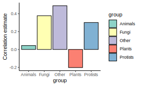
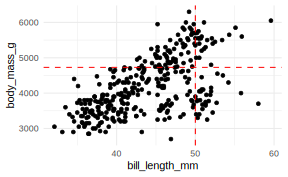
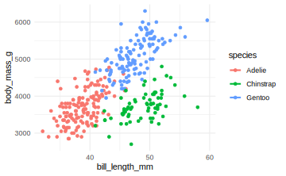
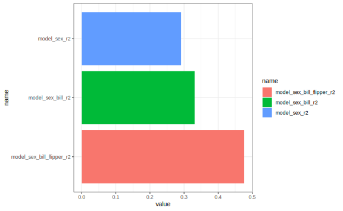
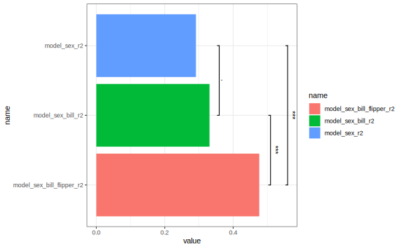

# Visualisering af trends


```r
#load following packages
library(ggplot2)
library(tidyverse)
library(broom)
library(glue)
library(ggsignif)
```


## Indledning

### Læringsmål

:::goals
Du skal være i stand til at

* Anvende `nest()` og `map()` strukturen til at gentage en korrelationsanalyse over flere forskellige datasæt.
* Bruge `ggplot` funktionen `geom_smooth()` til at visualisere lineær regression eller loess-kurver.
* Kombinere `map()`/`nest()` og `lm()` til at beregne regressionsstatistikker for flere lineære regressionsmodeller på samme tid og sammenligne dem med `anova()`.
:::


:::checklist
* Læs ekstra notat på Absalon
* Se videoerne
* Quizzen - visualisation of trends
* Lav problemstillingerne
:::


### Introduktion til kapitlet

I dette kapitel viser jeg flere eksempler på processen, hvor man anvender `group_by()` og `nest()` og dernæst `map()`-funktioner for at lave reproducerbare statistiske analyser. Vi fokuserer på eksempler med korrelationsanalyse og lineære regressionsmodeller, men den overordnede ramme kan anvendes i mange forskellige kontekster.

### Videoressourcer

OBS: Der er mange videoer til i dag, men de gentager samme proces fra sidste emner med `group_by`/`nest` og `map` mange gange (med forskellige statistiske metoder).

* Video 1: Korrelationskoefficient med `nest()` og `map()`
  + Jeg gennemgår processen langsomt med en korrelationsanalyse
  + Jeg introducerer `glance` til at lave outputtet fra statistiske metoder i pæn-format.

*OBS: Jeg sagde "antal gener" flere gange i videoen, men variablen `log10_size_mb` er faktisk genomstørrelse i megabaser.*

Link her hvis det ikke virker nedenunder: https://player.vimeo.com/video/709225323

```{=html}
<div class="vembedr">
<div>
<iframe class="vimeo-embed" src="https://player.vimeo.com/video/709225323" width="533" height="300" frameborder="0" webkitallowfullscreen="" mozallowfullscreen="" allowfullscreen="" data-external="1"></iframe>
</div>
</div>
```

---

* Video 2: Lineær regression linjer med ggplot2
  + Jeg viser hvordan man tilføjer regression linjer på et plot
  + Jeg sammenligne linjen med resultatet fra `lm()`

Link her hvis det ikke virker nedenunder: https://player.vimeo.com/video/709225203

```{=html}
<div class="vembedr">
<div>
<iframe class="vimeo-embed" src="https://player.vimeo.com/video/709225203" width="533" height="300" frameborder="0" webkitallowfullscreen="" mozallowfullscreen="" allowfullscreen="" data-external="1"></iframe>
</div>
</div>
```

---

* Video 3: Lineær regression med `nest()` og `map()`
  + Den proces igen fra Video 1 men anvendte på lineær regression

Link her hvis det ikke virker nedenunder: https://player.vimeo.com/video/709225158

```{=html}
<div class="vembedr">
<div>
<iframe class="vimeo-embed" src="https://player.vimeo.com/video/709225158" width="533" height="300" frameborder="0" webkitallowfullscreen="" mozallowfullscreen="" allowfullscreen="" data-external="1"></iframe>
</div>
</div>
```

---

* Video 4: Multiple linær regression model
  + Den samme process men med flere modeller og flere uafhængige variabler

Link her hvis det ikke virker nedenunder: https://player.vimeo.com/video/709225266

```{=html}
<div class="vembedr">
<div>
<iframe class="vimeo-embed" src="https://player.vimeo.com/video/709225266" width="533" height="300" frameborder="0" webkitallowfullscreen="" mozallowfullscreen="" allowfullscreen="" data-external="1"></iframe>
</div>
</div>
```

---

* Video 5: anova+map (OBS: muligvis mest udfordrende del i kurset)
  + Benyt funktionen `anova` for at sammenligne to modeller, beregnet på datasættet `penguins`, og få outputtet i "tidy"-format med funktionen `broom:::tidy()`
  + Lav en funktion med `anova`, der kan anvendes over alle arter med `map2()`
  + Omsæt p-værdier fra sammenligningerne til et plot og tilføj signifikansannotationer

Link her hvis det ikke virker nedenunder: https://player.vimeo.com/video/710108716

```{=html}
<div class="vembedr">
<div>
<iframe class="vimeo-embed" src="https://player.vimeo.com/video/710108716" width="533" height="300" frameborder="0" webkitallowfullscreen="" mozallowfullscreen="" allowfullscreen="" data-external="1"></iframe>
</div>
</div>
```


## `nest()` og `map()`: eksempel med korrelation

Man laver en korrelationsanalyse i R ved at benytte `cor.test()` (`cor()` fungerer også, hvis du kun ønsker at beregne koefficienten og ikke signifikans). Forestil dig, at du gerne vil finde ud af korrelationen mellem GC-indhold (variablen `gc`, procent G/C baser i genomet) og genomstørrelse (variablen `log10_size_mb`) i datasættet `eukaryotes` fra sidste lektion.

I det følgende plotter jeg en density mellem `gc` og den transformerede variabel `log10_size_mb`, som er log10 genomstørrelse (ikke antal gener, som jeg sagde i videoen).


```r
eukaryotes <- eukaryotes %>% 
  mutate(log10_size_mb = log10(size_mb))
```


```r
eukaryotes %>% 
  mutate(log10_size_mb = log10(size_mb)) %>%
  select(log10_size_mb,gc) %>% 
  pivot_longer(everything()) %>%
  ggplot(aes(x=value,fill=name)) + 
  geom_density(colour="black") +
  facet_wrap(~name,scales="free") +
  theme_bw()
```


Plottet ser ud til at have flere "peaks", og jeg mistænker, at der kan være nogle understrukturer indenfor dataene - eksempelvis på grund af de forskellige organismegrupper i variablen `Group` (Animals, Plants osv.). I det følgende benytter jeg alligevel `cor.test()` til at teste for korrelation mellem `gc` og `log10_size_mb` over hele datasættet:


```r
my_cor_test <- cor.test(eukaryotes %>% pull(gc),
                        eukaryotes %>% pull(log10_size_mb))
my_cor_test
```

```
#> 
#> 	Pearson's product-moment correlation
#> 
#> data:  eukaryotes %>% pull(gc) and eukaryotes %>% pull(log10_size_mb)
#> t = -15.678, df = 11118, p-value < 2.2e-16
#> alternative hypothesis: true correlation is not equal to 0
#> 95 percent confidence interval:
#>  -0.1652066 -0.1288369
#> sample estimates:
#>        cor 
#> -0.1470715
```

Outputtet fra `cor.test` (og mange andre metoder i R) er ikke særlig velegnet til at bruge indenfor en dataframe, så jeg introducerer en funktion, der hedder `glance()`, som findes i R-pakken `broom`. Funktionen `glance()` anvendes til at omdanne outputtet fra en statistisk test (f.eks. `cor.test()` eller `lm()`) til et __tidy__ dataframe. Det gør det nemmere, for eksempel til at lave et plot, eller til at samle statistikker fra forskellige tests.


```r
library(broom)
my_cor_test %>% glance()
```

```
FALSE # A tibble: 1 × 8
FALSE   estimate statistic  p.value parameter conf.low conf.high method    alternative
FALSE      <dbl>     <dbl>    <dbl>     <int>    <dbl>     <dbl> <chr>     <chr>      
FALSE 1   -0.147     -15.7 8.25e-55     11118   -0.165    -0.129 Pearson'… two.sided
```

Man kan se, at over hele datasættet, er der en signifikant negativ korrelation (estimate -0.147 og p-værdi 8.25054\times 10^{-55}) mellem de to variabler. Men jeg er imidlertid stadig mistænkelig over for eventuelle forskelle blandt de fem grupper fra variablen `group`. 

Jeg vil gerne gentage den samme analyse for de fem grupper fra variablen `group` hver for sig. En god tilgang til at undersøge det er at bruge rammen med `group_by()` og `nest()`, som vi lærte sidst.

### Korrelation over flere datasæt på en gang

Jeg tjekker først fordelingen af de to variabler opdelt efter variablen `group`:


```r
eukaryotes %>%
  select(log10_size_mb,gc,group) %>% 
  pivot_longer(-group) %>%
  ggplot(aes(x=value,fill=group)) + 
  geom_density(colour="black",alpha=0.5) +
  #geom_histogram(bins=40,alpha=0.5,colour="black") +
  scale_fill_brewer(palette = "Set1") +
  facet_wrap(~name,scales="free") +
  theme_bw()
```


Man kan se, at der er forskelle blandt de fem grupper, og der kan sagtens forekomme forskellige sammenhænge mellem de to variabler. I det følgende benytter jeg rammen `group_by()` + `nest()`, som blev introduceret i sidste lektion. 

__Trin 1: Benyt `group_by()` + `nest()`__

Jeg anvender `group_by()` på variablen `group` og derefter funktionen `nest()` for at opdele `eukaryotes` i fem forskellige datasæt (gemt i samme dataframe i en kolonne ved navn `data`):


```r
eukaryotes_nest <- eukaryotes %>% 
  group_by(group) %>% 
  nest()
eukaryotes_nest
```

```
#> # A tibble: 5 × 2
#> # Groups:   group [5]
#>   group    data                 
#>   <chr>    <list>               
#> 1 Other    <tibble [51 × 19]>   
#> 2 Protists <tibble [888 × 19]>  
#> 3 Plants   <tibble [1,304 × 19]>
#> 4 Fungi    <tibble [6,064 × 19]>
#> 5 Animals  <tibble [3,201 × 19]>
```


__Trin 2: Definer korrelationsfunktion__

Lad os definere korrelationstesten mellem `gc` og `log10_size_mb` i en funktion.

* Brug `~` lige i starten for at fortælle R, at man arbejder med en funktion.
* Specificer et bestemt datasæt (som er en delmængde af `eukaryotes`) indenfor `cor.test()` med `.x` 
* For det specifikke datasæt benytter jeg `.x %>% pull(gc)` og `.x %>% pull(size_mb)` til at udtrække de relevante vektorer for at udføre testen `cor.test`.


```r
cor_test <- ~cor.test(.x %>% pull(gc),
                      .x %>% pull(log10_size_mb))
```

Vi vil gerne få statistikkerne fra `cor.test()` i en pæn form, så vi tilføjer `glance()` til den ovenstående funktion: 


```r
library(broom) 
my_cor_test <- ~cor.test(.x$gc,log10(.x$size_mb)) %>% glance()
```


__Trin 3: Brug map() på det nestede datasæt__

Nu lad os køre vores funktion på det nestede dataframe. Vi bruger `map()` til at anvende funktionen `my_cor_test` på hvert af de fem datasæt. Det gøres ved at bruge funktionen `map()` indenfor funktionen `mutate()` til at oprette en ny kolonne, der hedder `test_stats`, hvor resultaterne fra hver af de fem tests gemmes.


```r
eukaryotes_cor <- eukaryotes_nest %>% 
  mutate(test_stats=map(data,my_cor_test))
eukaryotes_cor
```

```
#> # A tibble: 5 × 3
#> # Groups:   group [5]
#>   group    data                  test_stats      
#>   <chr>    <list>                <list>          
#> 1 Other    <tibble [51 × 19]>    <tibble [1 × 8]>
#> 2 Protists <tibble [888 × 19]>   <tibble [1 × 8]>
#> 3 Plants   <tibble [1,304 × 19]> <tibble [1 × 8]>
#> 4 Fungi    <tibble [6,064 × 19]> <tibble [1 × 8]>
#> 5 Animals  <tibble [3,201 × 19]> <tibble [1 × 8]>
```

__Trin 4: Anvend `unnest()` for at kunne se resultaterne__

For at kunne se statistikkerne bruger jeg funktionen `unnest()` på den nye variabel `test_stats`:


```r
eukaryotes_cor <- eukaryotes_cor %>%
  unnest(test_stats)
eukaryotes_cor
```

```
#> # A tibble: 5 × 10
#> # Groups:   group [5]
#>   group    data     estimate statistic   p.value parameter conf.low conf.high
#>   <chr>    <list>      <dbl>     <dbl>     <dbl>     <int>    <dbl>     <dbl>
#> 1 Other    <tibble>   0.489       3.80 4.22e-  4        46  0.238      0.679 
#> 2 Protists <tibble>   0.301       9.26 1.54e- 19       860  0.239      0.361 
#> 3 Plants   <tibble>  -0.203      -7.37 3.10e- 13      1267 -0.255     -0.149 
#> 4 Fungi    <tibble>   0.377      31.2  3.87e-198      5884  0.355      0.399 
#> 5 Animals  <tibble>   0.0437      2.42 1.57e-  2      3053  0.00825    0.0790
#> # ℹ 2 more variables: method <chr>, alternative <chr>
```

__Trin 5: Lav et plot fra statistikker__

Vi kan bruge det direkte i et plot. Jeg fokuserer på korrelationskoefficienten i variablen `estimate` og omsætter den til et plot som følger:


```r
cor_plot <- eukaryotes_cor %>%
  ggplot(aes(x=group,y=estimate,fill=group)) + 
  geom_bar(stat="identity",colour="black") +
  scale_fill_brewer(palette = "Set3") + 
  ylab("Correlation estimate") +
  theme_classic() 
cor_plot
```



Bemærk at den overordnede proces her med `cor.test` ligner processen, hvis man anvender andre metoder såsom `t.test`, `lm` osv. Jeg gennemgår lidt om lineær regression og visualisering, og dernæst anvender processen på et eksempel med funktionen `lm()` og datasættet `penguins`.

## Lineær regression - visualisering

### Lineære trends

Vi skifter over til datasættet `penguins`, som findes i pakken `palmerpenguins`. Man kan se i det følgende scatterplot mellem `bill_length_mm` og `body_mass_g`, at der er plottet en bedste rette linje gennem punkterne, som viser, at der er en positiv sammenhæng mellem de to variabler.


Husk, at den bedste rette linje har en formel $y = a + bx$, hvor $a$ er skæringspunktet, og $b$ er hældningen af linjen. Ideen med simpel lineær regression er, at man gerne vil finde de bedste mulige værdier for $a$ og $b$ for at plotte ovenstående linje således, at afstanden mellem linjen og punkterne bliver minimeret. Uden at gå i detaljer om, hvordan det beregnes, kan man bruge funktionen `lm()` som følger:


```r
mylm <- lm(body_mass_g~bill_length_mm,data=penguins)
mylm
```

```
#> 
#> Call:
#> lm(formula = body_mass_g ~ bill_length_mm, data = penguins)
#> 
#> Coefficients:
#>    (Intercept)  bill_length_mm  
#>         388.85           86.79
```

Skæringspunktet er således 388.85 og hældningen er 86.79. Det betyder, at hvis variablen `bill_length_mm` stiger med 1, så ville den forventede `body_mass_g` stige med 86.79. Man kan således bruge linjen til at lave forudsigelser. For eksempel, hvis jeg målte en ny pingvin og fandt ud af, at den havde en `bill_length_mm` på 50 mm, kunne jeg bruge min linje til at gætte dens `body_mass_g`:


```r
y <- mylm$coefficients[1] + mylm$coefficients[2]  * 50
y
```

```
#> (Intercept) 
#>    4728.433
```

Jeg forventer derfor, at en pingvin med en næblængde på 50 mm vil have en vægt omkring 4728.4331411 g:



### `geom_smooth()`: `lm` trendlinjer

Indbygget i `ggplot2` er en funktion kaldet `geom_smooth()`, som kan bruges til at tilføje den bedste rette linje til plottet. Man benytter den ved at specificere `+ geom_smooth(method="lm")` i plot-kommandoen:


```r
ggplot(penguins,aes(x=bill_length_mm,y=body_mass_g)) + 
  geom_point() + 
  theme_minimal() + 
  geom_smooth(method="lm",se=FALSE)
```


Det er nemt at bruge, og man kan tilføje et konfidensinterval, hvis man ønsker det. I ovenstående plot specificerede jeg `se=FALSE`, men hvis jeg angav `se=TRUE` (som er standard), ville jeg få følgende plot:


```r
ggplot(penguins,aes(x=bill_length_mm,y=body_mass_g)) + 
  geom_point() + 
  theme_minimal() + 
  geom_smooth(method="lm",se=TRUE)
```


### `geom_smooth()`: flere `lm` trendlinjer på samme plot

For at tilføje en bedste rette linje for hver af de tre `species` i stedet for alle dataene samlet, er det meget nemt i `ggplot2`: man angiver bare `colour=species` indenfor æstetik (`aes`):


```r
ggplot(penguins,aes(x=bill_length_mm,y=body_mass_g,colour=species)) + 
  geom_point() + 
  theme_minimal() + 
  geom_smooth(method="lm",se=FALSE)
```



Så kan vi se, at der faktisk er tre forskellige trends her, så det giver god mening at bruge de tre forskellige linjer i stedet for kun én.

### Trendlinjer med `method=="loess"`

I `ggplot` er vi ikke begrænset til `method="lm"` indenfor `geom_smooth()`. Lad os prøve med `method="loess"` i stedet:


```r
library(palmerpenguins)
penguins <- drop_na(penguins)
ggplot(penguins,aes(x=bill_length_mm,y=body_mass_g,colour=species)) + 
  geom_point() + 
  theme_minimal() + 
  geom_smooth(method="loess",se=FALSE)
```


På denne måde kan man fange trends, som ikke nødvendigvis er lineære - men bemærk, at det er mere ligetil at beskrive og fortolke en lineær trend (og beregne forudsigelser ud fra en lineær trend).

## Plot linear regresion estimates

For at finde vores estimates og tjekke signifikansen af en lineær trend, arbejder vi direkte med den lineære model funktion `lm()`:


```r
my_lm <- lm(body_mass_g~bill_length_mm,data=penguins)
summary(my_lm)
```

```
#> 
#> Call:
#> lm(formula = body_mass_g ~ bill_length_mm, data = penguins)
#> 
#> Residuals:
#>      Min       1Q   Median       3Q      Max 
#> -1759.38  -468.82    27.79   464.20  1641.00 
#> 
#> Coefficients:
#>                Estimate Std. Error t value Pr(>|t|)    
#> (Intercept)     388.845    289.817   1.342    0.181    
#> bill_length_mm   86.792      6.538  13.276   <2e-16 ***
#> ---
#> Signif. codes:  0 '***' 0.001 '**' 0.01 '*' 0.05 '.' 0.1 ' ' 1
#> 
#> Residual standard error: 651.4 on 331 degrees of freedom
#> Multiple R-squared:  0.3475,	Adjusted R-squared:  0.3455 
#> F-statistic: 176.2 on 1 and 331 DF,  p-value: < 2.2e-16
```

Husk, at de tal, der er vigtige her (se også emne 1 og 2):

* __p-værdien__: `<2e-16` - den uafhængige variabel `bill_length_mm` har en signifikant effekt/betydning for `body_mass_g`.
* __R-squared værdien__: - den viser den andel af variancen i `body_mass_g`, som `bill_length_mm` forklarer:
  + Hvis R-squared er tæt på 1, er der tæt på en perfekt korrespondance mellem `bill_length_mm` og `body_mass_g`. 
  + Hvis R-squared er tæt på 0, er der nærmest ingen korrespondance.
  
### Anvendelse af `lm()` over nestede datasæt

Vi kan benytte den samme proces som ovenpå i korrelationsanalysen. Vi bruger `group_by` til at opdele efter de tre `species` og så "nester" vi de tre datarammer:


```r
penguins_nest <- penguins %>% 
  group_by(species) %>%
  nest()
penguins_nest
```

```
#> # A tibble: 3 × 2
#> # Groups:   species [3]
#>   species   data              
#>   <fct>     <list>            
#> 1 Adelie    <tibble [146 × 7]>
#> 2 Gentoo    <tibble [119 × 7]>
#> 3 Chinstrap <tibble [68 × 7]>
```

Jeg definerer en funktion, hvor man kan lave lineær regression og tilføjer `glance()` for at få modelstatistikkerne i en pæn form.


```r
#husk ~ og skriv .x for data og IKKE penguins
lm_model_func <- ~lm(body_mass_g~bill_length_mm,data=.x) %>% glance()
```

Vi kører en lineær model på hver af de tre datasæt med `map()` og ved at specificere funktionen `lm_model_func`, som vi definerede ovenfor. Vi bruger `mutate()` ligesom før til at tilføje statistikkerne som en ny kolonne kaldet `lm_stats`:


```r
penguins_lm <- penguins_nest %>%
  mutate(lm_stats=map(data,lm_model_func))
penguins_lm
```

```
#> # A tibble: 3 × 3
#> # Groups:   species [3]
#>   species   data               lm_stats         
#>   <fct>     <list>             <list>           
#> 1 Adelie    <tibble [146 × 7]> <tibble [1 × 12]>
#> 2 Gentoo    <tibble [119 × 7]> <tibble [1 × 12]>
#> 3 Chinstrap <tibble [68 × 7]>  <tibble [1 × 12]>
```

Til sidst bruger vi funktionen `unnest()` på vores statistikker:


```r
penguins_lm <- penguins_lm %>%
  unnest(cols=lm_stats)
penguins_lm
```

```
#> # A tibble: 3 × 14
#> # Groups:   species [3]
#>   species data     r.squared adj.r.squared sigma statistic  p.value    df logLik
#>   <fct>   <list>       <dbl>         <dbl> <dbl>     <dbl>    <dbl> <dbl>  <dbl>
#> 1 Adelie  <tibble>     0.296         0.291  386.      60.6 1.24e-12     1 -1076.
#> 2 Gentoo  <tibble>     0.445         0.440  375.      93.6 1.26e-16     1  -873.
#> 3 Chinst… <tibble>     0.264         0.253  332.      23.7 7.48e- 6     1  -490.
#> # ℹ 5 more variables: AIC <dbl>, BIC <dbl>, deviance <dbl>, df.residual <int>,
#> #   nobs <int>
```

Nu kan vi se, at vi har fået en dataramme med vores lineære modelstatistikker. Jeg tager `r.squared` og `p.value` og omsætter dem til et plot for at sammenligne dem over de tre `species` af pingviner.


```r
penguins_lm %>% 
  select(species,r.squared,p.value) %>%
  mutate("-log10pval" = -log10(p.value)) %>%
  select(-p.value) %>%
  pivot_longer(-species) %>%
  ggplot(aes(x=species,y=value,fill=species)) + 
  geom_bar(stat="identity") + 
  scale_fill_brewer(palette = "Set2") +
  facet_wrap(~name,scale="free",ncol=4) +
  coord_flip() +
  theme_bw()
```


### Funktionen `glue()` til at tilføje etiketter

Det kan være nyttigt at tilføje etiketter til vores plots, der indeholder de statistikker, vi netop har beregnet. For at gøre dette kan vi benytte følgende kode. Vi tager vores datasæt `penguins_lm` med vores beregnede statistikker og bruger det til at lave et datasæt, som kan benyttes i `geom_text()` i vores trend plot. Funktionen `glue()` (fra pakken `glue`) er en praktisk måde at sammensætte `r.squared` og `p.value` værdierne i en streng, der beskriver vores forskellige trends (lidt ligesom `paste` i base-R).


```r
library(glue)  # til at sammensætte værdierne i en etiket
label_data <- penguins_lm %>%
  mutate(
    rsqr = signif(r.squared, 2),  # afrunder til 2 signifikante cifre
    pval = signif(p.value, 2),
    label = glue("r^2 = {rsqr}, p-værdi = {pval}")
  ) %>%
  select(species, label)
label_data
```

```
FALSE # A tibble: 3 × 2
FALSE # Groups:   species [3]
FALSE   species   label                        
FALSE   <fct>     <glue>                       
FALSE 1 Adelie    r^2 = 0.3, p-værdi = 1.2e-12 
FALSE 2 Gentoo    r^2 = 0.44, p-værdi = 1.3e-16
FALSE 3 Chinstrap r^2 = 0.26, p-værdi = 7.5e-06
```

Vi kan tilføje vores etiketdata ved hjælp af `geom_text()`. `x` og `y` specificerer, hvor på plottet teksten skal placeres, og husk at angive `data=label_data` og `label=label` indenfor `aes()`, når det drejer sig om en variabel i `label_data`.


```r
ggplot(penguins, aes(body_mass_g, flipper_length_mm, colour=species)) + 
  geom_point() +
  geom_smooth(method = "lm", se = FALSE) +
  geom_text(
    x = 5500, 
    y = c(175,180,185),
    data = label_data, aes(label = label), #specificerer etiketdata fra ovenstående
    size = 4
  ) + 
  scale_color_brewer(palette = "Set2") +
  theme_minimal() 
```


## Multipel regression og model sammenligning

Vi kan også benytte samme ramme som ovenfor til at sammenligne forskellige modeller på tværs af de samme tre datasæt. Her definerer jeg `lm_model_func`, som kun har `sex` som den uafhængige variabel, og jeg bygger videre på denne model ved at definere `lm_model_func2` og `lm_model_func3`, hvor jeg tilføjer ekstra uafhængige variabler, `bill_length_mm` og `flipper_length_mm`. Jeg er interesseret i, hvor meget af variansen i `body_mass_g`, de tre variabler kan forklare tilsammen, og om der er forskelle mellem de tre arter i `species`.


```r
lm_model_func <-  ~lm(body_mass_g ~ sex                                      ,data=.x)
lm_model_func2 <- ~lm(body_mass_g ~ sex + bill_length_mm                     ,data=.x)
lm_model_func3 <- ~lm(body_mass_g ~ sex + bill_length_mm + flipper_length_mm ,data=.x)
```

Bemærk, at jeg endnu ikke har tilføjet `glance()` her, men jeg har planer om at gøre det lidt senere i processen for at undgå at få for mange statistikker i min dataframe med mine resultater. Jeg anvender først `group_by()` efter `species` og derefter `nest()`:


```r
penguins_nest <- penguins %>% 
  group_by(species) %>%
  nest()
penguins_nest
```

```
#> # A tibble: 3 × 2
#> # Groups:   species [3]
#>   species   data              
#>   <fct>     <list>            
#> 1 Adelie    <tibble [146 × 7]>
#> 2 Gentoo    <tibble [119 × 7]>
#> 3 Chinstrap <tibble [68 × 7]>
```

Her bruger jeg `map` tre gange indenfor den samme `mutate`-funktion for at konstruere de tre modeller for hver art (ni modeller i alt).


```r
penguins_nest_lm <- penguins_nest %>% 
  mutate(
    model_sex =              map(data,lm_model_func),
    model_sex_bill =         map(data,lm_model_func2),
    model_sex_bill_flipper = map(data,lm_model_func3))
penguins_nest_lm
```

```
#> # A tibble: 3 × 5
#> # Groups:   species [3]
#>   species   data               model_sex model_sex_bill model_sex_bill_flipper
#>   <fct>     <list>             <list>    <list>         <list>                
#> 1 Adelie    <tibble [146 × 7]> <lm>      <lm>           <lm>                  
#> 2 Gentoo    <tibble [119 × 7]> <lm>      <lm>           <lm>                  
#> 3 Chinstrap <tibble [68 × 7]>  <lm>      <lm>           <lm>
```

Nu vil jeg gerne trække nogle statistikker fra modellerne, så jeg kan sammenligne dem. Jeg vil gerne udføre samme proces på alle ni modeller - hvor jeg benytter funktionen `glance` til at få outputtet i en tidy-form, og så trække `r.squared` ud bagefter for at undgå at få for mange statistikker i min nye dataframe.


```r
get_r2_func <- ~.x %>% glance() %>% pull(r.squared)
```

Nu gælder det om at køre ovenstående funktion på alle mine modeller, som er gemt i tre kolonner, `model_sex`,`model_sex_bill` og `model_sex_bill_flipper`. Jeg gør dette indenfor `map`, så det også bliver udført for hver af de tre arter.


```r
penguins_nest_lm <-  penguins_nest_lm %>%
  mutate(model_sex_r2 =              map_dbl(model_sex,              get_r2_func),
         model_sex_bill_r2 =         map_dbl(model_sex_bill,         get_r2_func),
         model_sex_bill_flipper_r2 = map_dbl(model_sex_bill_flipper, get_r2_func))
penguins_nest_lm %>% select(species,model_sex_r2,model_sex_bill_r2,model_sex_bill_flipper_r2)
```

```
#> # A tibble: 3 × 4
#> # Groups:   species [3]
#>   species   model_sex_r2 model_sex_bill_r2 model_sex_bill_flipper_r2
#>   <fct>            <dbl>             <dbl>                     <dbl>
#> 1 Adelie           0.545             0.563                     0.602
#> 2 Gentoo           0.649             0.691                     0.716
#> 3 Chinstrap        0.291             0.331                     0.476
```

Omdann til et plot:


```r
penguins_nest_lm %>% 
  pivot_longer(cols=c("model_sex_r2","model_sex_bill_r2","model_sex_bill_flipper_r2")) %>%
  ggplot(aes(x=species,y=value,fill=name)) +
  geom_bar(stat="identity",position="dodge") +
  theme_minimal()
```


Man kan se i plottet, at `body_mass_g` for arten "Gentoo" bedst forklares af de tre variabler, og den laveste `r.squared` er i det tilfælde, hvor variablen `sex` er den eneste uafhængige variabel og `species` er "Chinstrap".

### `anova` til at sammenligne de forskellige modeller

Årsagen til, at jeg valgte at bruge `glance()` i en ny funktion til at udtrække `r.squared` værdier, var fordi jeg gerne ville bevare mine modeller i deres oprindelige form, så de kunne bruges indenfor `anova()`. Med `anova()` kan jeg direkte sammenligne to modeller og dermed få en p-værdi, der tester hypotesen om, at den ekstra variabel i den ene model signifikant forklarer den afhængige variabel (når man tager højde for de variabler, der er fælles for begge modeller).

I det følgende skriver jeg en funktion, hvor jeg kan sammenligne to modeller med `anova` og udtrække p-værdien:


```r
aov_func <- ~anova(.x,.y) %>% tidy() %>% pluck("p.value",2)
```

* ~ fordi det er en funktion (som jeg benytter for hver art og model sammenligning - i alt 9 gange!)
* `anova` for at sammenligne modellerne, der er angivet ved `.x` og `.y` (vi bruger `map2`, der tager to input i stedet for én, som i `map`)
* `tidy()` fungerer ligesom glance, men giver oversigt over statistikker og flere linjer - herunder p-værdien
* `pluck` - jeg vil kun have én statistik ("p.value") - og den er gemt på anden position.

Se følgende kode for anvendelse af `anova` og `tidy` på modellerne `model_sex` og `model_sex_bill` i arten "Adelie" (da jeg har brugt `pluck` med "1", hvilket betyder den første position i listen):


```r
myaov <- anova(penguins_nest_lm %>% pluck("model_sex",1),
               penguins_nest_lm %>% pluck("model_sex_bill",1))
myaov %>% tidy() #p.value for comparing the two models is in the second position
```

```
#> # A tibble: 2 × 7
#>   term                        df.residual    rss    df   sumsq statistic p.value
#>   <chr>                             <dbl>  <dbl> <dbl>   <dbl>     <dbl>   <dbl>
#> 1 body_mass_g ~ sex                   144 1.39e7    NA     NA      NA    NA     
#> 2 body_mass_g ~ sex + bill_l…         143 1.33e7     1 551805.      5.92  0.0162
```

Man kan se, at p-værdien er 0.016, som er signifikant, og det betyder, at den mere komplekse model, der også inddrager `bill_length_mm`, er den model, vi accepterer (dvs. effekten af variablen `bill_length_mm` på `body_mass_g` er signifikant i vores endelige model).

Man kan lave en lignende sammenligning mellem samtlige par af modeller for de tre arter:


```r
penguins_nest_lm <-  penguins_nest_lm %>%
  mutate(model_sex_vs_model_sex_bill =              map2_dbl(model_sex,model_sex_bill,aov_func),
         model_sex_vs_model_sex_bill_flipper =      map2_dbl(model_sex,model_sex_bill_flipper,aov_func),
         model_sex_bill_vs_model_sex_bill_flipper = map2_dbl(model_sex_bill,model_sex_bill_flipper,aov_func))
penguins_nest_lm %>% select(species,model_sex_vs_model_sex_bill,model_sex_vs_model_sex_bill_flipper,model_sex_bill_vs_model_sex_bill_flipper)
```

```
#> # A tibble: 3 × 4
#> # Groups:   species [3]
#>   species   model_sex_vs_model_s…¹ model_sex_vs_model_s…² model_sex_bill_vs_mo…³
#>   <fct>                      <dbl>                  <dbl>                  <dbl>
#> 1 Adelie                  0.0162               0.0000730               0.000273 
#> 2 Gentoo                  0.000142             0.00000592              0.00193  
#> 3 Chinstrap               0.0540               0.0000621               0.0000795
#> # ℹ abbreviated names: ¹​model_sex_vs_model_sex_bill,
#> #   ²​model_sex_vs_model_sex_bill_flipper,
#> #   ³​model_sex_bill_vs_model_sex_bill_flipper
```
Det kunne være nyttigt at inddrage p-værdierne i ovenstående plot med `r.squared` værdierne, for at se om der er en signifikant effekt, når man tilføjer flere variabler til modellen, samtidig med at `r.squared` stiger. I det følgende omsætter jeg `r.squared` statistikkerne for kun "Chinstrap" til et plot:


```r
library(ggsignif) 

stats_plot <- penguins_nest_lm %>% 
  filter(species=="Chinstrap") %>%
  pivot_longer(cols=c("model_sex_r2","model_sex_bill_r2","model_sex_bill_flipper_r2")) %>%
  ggplot(aes(x=name,y=value,fill=name)) +
  geom_bar(stat="identity",position="dodge")  +
  coord_flip() +
  theme_bw()
stats_plot
```



I det følgende tilføjer jeg funktionen `geom_signif` til plottet - den tillader mig at tilføje signifikanslinjer/annotationer til plottet - det vil sige, den viser, hvilke to modeller jeg sammenligner, og angiver stjerner i henhold til de beregnede p-værdier. Du er velkommen til at kopiere min kode og tilpasse den til dine egne behov.

* Når jeg sammenligner modellerne "model_sex" og "model_sex_bill" for "Chinstrap", er p-værdien over 0.05, så tilføjelsen af `bill_length_mm` i modellen var ikke signifikant - jeg tilføjer ingen stjerner men skriver "." for at matche outputtet i `lm`.
* Når jeg sammenligner modellerne "model_sex" og "model_sex_bill_flipper", kan jeg se, at p-værdien er under 0.05, så der er en signifikant effekt - `bill_length_mm` og `flipper_length_mm` forklarer den afhængige variabel `body_mass_g`, udover variablen `sex`. Jeg angiver "***", fordi p-værdien er under 0.001 (se signifikanskoder i `lm` summary).
* Indstillingen `y_position` angiver, hvor jeg vil placere linjerne.


```r
stats_plot +
  geom_signif(comparisons = list(c("model_sex_r2", "model_sex_bill_r2")), 
              annotations=".", y_position = 0.35, tip_length = 0.03) +
  geom_signif(comparisons = list(c("model_sex_bill_r2", "model_sex_bill_flipper_r2")), 
              annotations="***", y_position = 0.5, tip_length = 0.03) +
  geom_signif(comparisons = list(c("model_sex_r2", "model_sex_bill_flipper_r2")), 
              annotations="***", y_position = 0.55, tip_length = 0.03)
```



## Problemstillinger

__Problem 1__) Quizzen på Absalon.

--- 

Husk at have indlæste følgende:


```r
library(tidyverse)
library(broom)
data(msleep)
msleep %>% drop_na(vore) #
data(iris)
```


__Problem 2__) *Grundlæggende korrelationsøvelse*

* Brug `data(mtcars)` og `cor.test()` til at udføre en test af korrelationen mellem variablerne `qsec` og `drat`. 


* Tip: Hvis du foretrækker at undgå brugen af `$` til at specificere en kolonne indenfor `cor.test()`, kan du bruge `mtcars %>% pull(qsec)` i stedet for `mtcars$qsec`.
* Tilføj funktionen `glance()` til dit resultat fra `cor.test()` for at se statistikkerne i 
__tidy__ form (installer pakken `broom` hvis det er nødvendigt). Kan du genkende statistikkerne fra `cor.test()` i den resulterende dataramme?


---

__Problem 3)__ *Nesting øvelse*

For datasættet `msleep`, anvend `group_by()` og `nest()` for at skabe en nested dataframe, hvor datasættet er opdelt efter variablen `vore`. Kald det for `msleep_nest`.


* Tilføj en ny kolonne til `msleep_nest` med `mutate`, der hedder `n_rows` og viser antallet af rækker i hvert af de fire datasæt - husk følgende struktur:


```r
msleep_nest %>%
  mutate("n_rows" = map(???,???)) #erstat ??? her
```


* I dette tilfælde kan du ændre `map` til `map_dbl` - gør det.

---


__Problem 4)__ *Multiple korrelation*

Vi vil gerne beregne korrelationen mellem variablerne `sleep_total` og `sleep_rem` for hvert af de fire datasæt lagret i `msleep_nest`.

* Tilpas følgende funktion, så vi kan teste korrelationen mellem de to variabler.
* Tilføj `glance()` for at få vores data i __tidy__ form.


```r
cor_test <- ~cor.test(????,???) #erstat ??? og tilføj glance funktion
```


* Brug `map()` indenfor `mutate()` med din funktion for at beregne korrelationsstatistikkerne for hvert af de fire datasæt.
* Unnest din nye kolonne bagefter med `unnest()`-funktionen.


* Lav barplots af `estimate` og `-log10(p.value)` med den resulterende dataramme. 
* Prøv også at tilføje `%>% pluck("estimate",1)` til din `cor_test` funktion og se på resultatet.

---


__Problem 5)__ *Lineær regressionsøvelse*

Åbn `LungCapData` (inklusiv `Age.Groups`):


```r
LungCapData <- read.csv("https://www.dropbox.com/s/ke27fs5d37ks1hm/LungCapData.csv?dl=1")
glimpse(LungCapData) #se variabelnavne
```

```
#> Rows: 725
#> Columns: 6
#> $ LungCap   <dbl> 6.475, 10.125, 9.550, 11.125, 4.800, 6.225, 4.950, 7.325, 8.…
#> $ Age       <int> 6, 18, 16, 14, 5, 11, 8, 11, 15, 11, 19, 17, 12, 10, 10, 13,…
#> $ Height    <dbl> 62.1, 74.7, 69.7, 71.0, 56.9, 58.7, 63.3, 70.4, 70.5, 59.2, …
#> $ Smoke     <chr> "no", "yes", "no", "no", "no", "no", "no", "no", "no", "no",…
#> $ Gender    <chr> "male", "female", "female", "male", "male", "female", "male"…
#> $ Caesarean <chr> "no", "no", "yes", "no", "no", "no", "yes", "no", "no", "no"…
```

* Anvend `lm()` med `LungCap` som den afhængige variabel og `Age` som den uafhængige variabel. 


* Hvad er skæringstidspunktet og hældningen af den beregnede linje?
* Prøv at tilføje funktionen `glance()` til din `lm` funktion og angiv værdierne for `r.squared` og `p.value`.


---


__Problem 6__) Lav et scatterplot med Age på x-aksen og LungCap på y-aksen.

* Ændre linjen til `geom_smooth(method="lm")`
* Ændre linjen til `geom_smooth(method="lm",se=FALSE)`
* Specificer nu en forskellig farve baseret på `Gender`. Hvordan adskiller de to linjer sig?
* Specificer nu en forskellig farve baseret på `Smoke`. Hvordan adskiller de to linjer sig?


---


__Problem 7__) *Øvelse i lineær regression på flere datasæt*

Vi vil gerne udføre lineær regression med LungCap og Age, men opdelt efter variablen `Smoke`. *BEMÆRK: Vi følger den samme proces som i kursusnoterne, men med LungCapData i stedet for Penguins - se gerne kursusnoterne for inspiration*.

__a__) Brug `group_by()` og `nest()` for at opdele dit datasæt efter `Smoke`


__b__) Lav en funktion, `lm_model_func`, som beregner en lineær regression med `LungCap` som den afhængige variabel og `Age` som den uafhængige variabel. Tilføj `glance()` til `lm_model_func`.


__c__) Brug `map()` med din funktion inden i `mutate()` for at tilføje en ny kolonne kaldet `lm_stats` til din dataframe. Husk at `unnest` kolonnen `lm_stats` for at kunne se statistikkerne.


__d__) Fortolkning - er variablen `LungCap` bedre forklaret af variablen `Age` hos rygere eller ikke-rygere?

---

__Problem 8)__

Her er tre modeller, alle med `LungCap` som den afhængige variabel, og alle tager højde for `Age`:


```r
my_lm_func1 <-  ~lm(LungCap ~ Age                  ,data=.x)
my_lm_func2 <-  ~lm(LungCap ~ Age + Gender         ,data=.x)
my_lm_func3 <-  ~lm(LungCap ~ Age + Gender + Height,data=.x)
```

__a__) Brug `map` til at lave tre nye kolonner i `LungCapData_nest`, én til hver af de tre modeller (uden `glance()` her, så vi kan bruge vores `lm` objekter senere).


__b__) Skriv en funktion `my_r2_func`, der udtrækker "r.squared" værdierne fra dine modeller (her refererer `.x` i funktionen ikke til en dataframe, men til en beregnet model - hvad skal tilføjes?). Lav tre yderligere kolonner i `LungCapData_nest`, hvor du kører din funktion på dine modeller med `map` (outputtet skal være dbl).


```r
my_r2_func <- ...
```


```r
LungCapData_nest <- LungCapData_nest %>%
  mutate("Age_only_R2" = ...,
         "Age_Gender_R2" = ...,
         "Age_Gender_Height_R2"= ...)
```


__c)__ Omsæt dine beregnede r.squared værdier til et plot


---

__Problem 9__

__a__) Skriv en funktion hvor man anvende `anova()` til at sammenligne to modeller, `.x` og `.y` og dernæst udtrækker p-værdien (det er den samme funktion som i kursusnotaterne).


```r
my_aov_func <- ...
```


__b__) Anvend din funktion med `map2` til at sammenligne de tre modeller fra sidste spørgsmål.


__c__) Lav et plot med dine resultater.


__d__) Tilføj signifikans annotations på plottet med funktionen `geom_signif()` (tilpas gerne kode fra kursusnotaterne).


## Ekstra 

https://www.tidymodels.org/learn/statistics/tidy-analysis/

