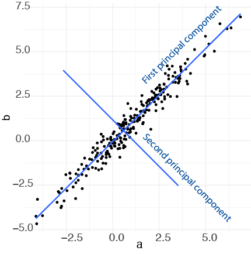
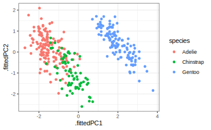
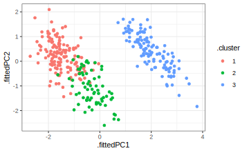

# Principal component analysis (PCA)

"At lære datalogi er som at lære at stå på ski. Man er nødt til at gøre det." -- Claudia Perlich


## Indledning og læringsmålene


### Læringsmålene

:::goals
Du skal være i stand til at

*Forstå koncepten bag principal component analysis (PCA)
*Benytte PCA i R og lave et plot af et datasæt i to dimensioner
*Vurdere den relative varians forklarede af de forskellige components
*Anvende PCA til at vurdere variablernes bidrag til de principal components
:::

:::checklist
* Se dagens forelæsning om Broom-pakken
* Se videoerne
* Læs 10.4.3 - lidt ekstra tekst om fortolkingen af rotation matrix
* Lav Quiz - Emne 10: PCA
* Lav problemstillingerne
:::

Næste lektion: Workshop 4 om clustering og principal component analyse

### Introduktion til kapitlet

Principal component analysis er en meget populær og ofte benyttet statistisk metode, der blandt andet kan anvendes til at visualisere data med et højt antal dimensioner i et enkelt scatterplot med to dimensioner. Det er meget nyttigt til at se den underliggende struktur i datasættet, og indenfor biologi er det meget brugt til blandt andet at visualisere, hvor de forskellige prøver eller replikater befinder sig i forhold til hinanden - for eksempel for at se, om kontrolprøverne og behandlingsprøverne fremtræder på samme steder i plottet (som indikerer, at de ligner hinanden).

### Videoressourcer


* Video 1 - hvad er PCA?
** Du kan beskrive en dataframe med mange dimensionerne i færre dimensioner.
** Du kan bruge den til at lave et plot med to dimensioner, der indfanger oplysning fra samtlige variabler i dataframen.


```{=html}
<div class="vembedr">
<div>
<iframe class="vimeo-embed" src="https://player.vimeo.com/video/556581604" width="533" height="300" frameborder="0" webkitallowfullscreen="" mozallowfullscreen="" allowfullscreen="" data-external="1"></iframe>
</div>
</div>
```


---

* Video 2 - hvordan man lave PCA i R og få output i tidy form


```{=html}
<div class="vembedr">
<div>
<iframe class="vimeo-embed" src="https://player.vimeo.com/video/556581588" width="533" height="300" frameborder="0" webkitallowfullscreen="" mozallowfullscreen="" allowfullscreen="" data-external="1"></iframe>
</div>
</div>
```

---

* Video 3 - hvordan man visualiserer de data (principal components, rotation matrix)


```{=html}
<div class="vembedr">
<div>
<iframe class="vimeo-embed" src="https://player.vimeo.com/video/556787141" width="533" height="300" frameborder="0" webkitallowfullscreen="" mozallowfullscreen="" allowfullscreen="" data-external="1"></iframe>
</div>
</div>
```

* Efter videoer - lidt ekstra læsning i 10.4.3 (bidragende af de forskellige variabler)

## Hvad er principal component analysis (PCA)?

I sidste lektion arbejdede vi med `penguins`, hvor vi så, at der faktisk var fire numeriske variabler - altså fire dimensioner - som blev brugt til at lave k-means clustering.


```r
library(palmerpenguins)
penguins <- penguins %>% 
  drop_na() %>%
  mutate(year=as.factor(year))

penguins %>% select(where(is.numeric)) %>% head()
```

```
#> # A tibble: 6 × 4
#>   bill_length_mm bill_depth_mm flipper_length_mm body_mass_g
#>            <dbl>         <dbl>             <int>       <int>
#> 1           39.1          18.7               181        3750
#> 2           39.5          17.4               186        3800
#> 3           40.3          18                 195        3250
#> 4           36.7          19.3               193        3450
#> 5           39.3          20.6               190        3650
#> 6           38.9          17.8               181        3625
```

Når man laver et plot for at vise de forskellige clusters, får man et problem - hvilke to variabler skal plottes? Man kan plotte hver eneste par af variabler. For eksempel kan man prøve en pakke, der hedder `GGally`, som automatisk kan plotte de forskellige par af numeriske variabler og beregner korrelationen mellem variablerne.


```r
require(GGally)
penguins %>% 
  ggscatmat(columns = 3:6 ,color = "species", corMethod = "pearson") + 
  scale_color_brewer(palette = "Set2") +
  theme_bw()
```


Problemet er, at så snart antallet af dimensioner i datasættet bliver større end 4, bliver plottet alt for komplekst og pladskrævende.

En løsning til problemet er at projicere datasættet ned til et mindre antal dimensioner (f.eks. kun 2 dimensioner). Disse dimensioner fanger oplysninger fra alle variablerne i datasættet, og derfor, når man laver et scatter plot, får man repræsenteret det hele datasæt i stedet for kun to udvalgte variabler. Metoden for at lave disse såkaldte 'projektioner' kaldes 'principal component analysis'.


### Simpelt eksempel med to dimensioner

Man kan forsøge at forstå, hvordan PCA fungerer, ved at kigge på et simpelt eksempel med 2 dimensioner:


```r
#simulerer data med en høj korrelation
a <- rnorm(250,1,2)
b <- a + rnorm(250,0,.5)
df <- tibble(a,b)
ggplot(df,aes(a,b)) + 
  geom_point() + 
  theme_minimal()
```


Vi kan se her, at der er en meget stor korrelation mellem a og b. Selvom datasættet er plottet i 2 dimensioner, kan det næsten forklares af én linje - en såkaldt bedste rette linje, der passer bedst gennem punkterne.


```r
df <- tibble(a,b)
ggplot(df,aes(a,b)) + 
  geom_point() + 
  theme_minimal() + 
  geom_smooth(method="lm",se=FALSE)
```


Med andre ord kan vi næsten forklare datasættet i blot én dimension - punkternes afstand langs linjen. Når man tager alle punkterne og beskriver dem langs én linje, der bedst beskriver variansen i datasættet, kaldes denne linje for den første principal component (PC1). Man kan dernæst beskrive en anden linje, der er vinkelret på PC1, og som bedst forklarer variancen i de data, der ikke blev fanget af PC1 - dette kaldes for den anden principal component (PC2).

Vi kan se her PC1 og PC2 plottet:



Når vi tager PC1 og PC2 og plotter dem som henholdsvis x-aksen og y-aksen, svarer det til en drejning af akserne i plottet (vi finder PC1 og PC2 fra funktionen `prcomp`, som jeg forklarer i næste sektion):


```r
dat <- augment(prcomp(df),df)
ggplot(dat,aes(x=.fittedPC1,y=.fittedPC2)) + 
  geom_point() + 
  theme_minimal() + 
  geom_smooth(method="lm")
```


Vi kan se her, at dataene fylder pladsen på plottet bedre end før (og bemærk at akseskalaen er blevet meget mindre på den nye y-akse, da dataene spreder sig meget mindre langs PC2 i forhold til PC1.)

Dette er kun et eksempel, hvor vores oprindelige data ligger i to dimensioner (to variabler), for at gøre det nemt at visualisere dem i et plot, men de fleste datasæt (fx penguins, iris osv.) har flere end to dimensioner. Vi kan godt lave den samme proces, hvor vi definerer PC1, som forklarer så meget af variansen i dataene som muligt, og dernæst PC2, som forklarer noget af variansen, der ikke blev fanget af PC1, og dernæst PC3 osv., alt efter hvor mange dimensioner dataene har. I mange praktiske situationer vælger man de første to komponenter, som er de vigtigste, da de forklarer mest af variansen i dataene i forhold til de andre komponenter.


"So to sum up, the idea of PCA is simple — reduce the number of variables of a data set, while preserving as much information as possible." https://builtin.com/data-science/step-step-explanation-principal-component-analysis

## Fit PCA to data in R


```r
library(broom)
```

Lad os skifte tilbage til nogle virkelige data for at benytte `prcomp`: datasættet `penguins`. Med `prcomp` fokuserer vi kun på numeriske variabler, så vi bruger `select` med `where(is.numeric)` og anvender derefter skalering ved at specificere `scale = TRUE` inde i funktionen `prcomp`.

<!-- ```{r} -->
<!-- biopsy <- read_csv("https://wilkelab.org/classes/SDS348/data_sets/biopsy.csv") -->
<!-- ``` -->


```r
pca_fit <- penguins %>%
  select(where(is.numeric)) %>% # behold kun numeriske kolonner
  prcomp(scale = TRUE) # udfør PCA på skaleret data

summary(pca_fit)
```

```
#> Importance of components:
#>                           PC1    PC2     PC3     PC4
#> Standard deviation     1.6569 0.8821 0.60716 0.32846
#> Proportion of Variance 0.6863 0.1945 0.09216 0.02697
#> Cumulative Proportion  0.6863 0.8809 0.97303 1.00000
```

`Proportion of Variance` indikerer, hvor meget af variansen i dataene, der blev forklaret af de forskellige komponenter. Vi kan se, at `PC1` forklarer omkring 69\% og de første to komponenter sammen forklarer 88\% af variansen i dataene. Derfor, hvis vi viser et plot af de første to komponenter, ved vi, at vi har fanget rigtig mange oplysninger om de fire variabler i datasættet.

## Integrering af PCA-resultater med broom-pakken

Der er flere ting, som kan være nyttige at gøre med vores PCA-resultater:

* Lave et plot af datasættet ud fra de første to principal components
* Se, hvor meget af variansen i datasættet der er forklaret af de forskellige komponenter
* Bruge rotationsmatricen til at se, hvordan variablerne forholder sig i forhold til hinanden

### Lave plot af principal componenets

For at lave vores plot af principal components kan vi benytte funktionen `augment()`, ligesom vi gjorde i vores sidste lektion med k-means clustering. Her får vi værdierne for hver af de fire principal components sammen med det oprindelige datasæt.


```r
pca_fit_augment <- pca_fit %>% 
  augment(penguins) # tilføj det originale datasæt igen

pca_fit_augment
```

```
#> # A tibble: 333 × 13
#>    .rownames species island    bill_length_mm bill_depth_mm flipper_length_mm
#>    <chr>     <fct>   <fct>              <dbl>         <dbl>             <int>
#>  1 1         Adelie  Torgersen           39.1          18.7               181
#>  2 2         Adelie  Torgersen           39.5          17.4               186
#>  3 3         Adelie  Torgersen           40.3          18                 195
#>  4 4         Adelie  Torgersen           36.7          19.3               193
#>  5 5         Adelie  Torgersen           39.3          20.6               190
#>  6 6         Adelie  Torgersen           38.9          17.8               181
#>  7 7         Adelie  Torgersen           39.2          19.6               195
#>  8 8         Adelie  Torgersen           41.1          17.6               182
#>  9 9         Adelie  Torgersen           38.6          21.2               191
#> 10 10        Adelie  Torgersen           34.6          21.1               198
#> # ℹ 323 more rows
#> # ℹ 7 more variables: body_mass_g <int>, sex <fct>, year <fct>,
#> #   .fittedPC1 <dbl>, .fittedPC2 <dbl>, .fittedPC3 <dbl>, .fittedPC4 <dbl>
```

Vi kan tage `pca_fit_augment` og lave et plot af de første to principal components:


```r
pca_fit_augment  %>% 
  ggplot(aes(x=.fittedPC1, y=.fittedPC2, color = species)) + 
  geom_point() +
  theme_bw()
```



Vi kan også integrere de clusters, som vi fik fra funktionen `kmeans()`, i vores PCA ved at anvende funktionen `augment()` på resultaterne fra `kmeans` og vores data, som allerede har resultaterne fra `pca`. Da både PCA og k-means fanger oplysninger om datastrukturen baseret på de fire numeriske variabler, kan man forvente en bedre sammenligning mellem de to (i forhold til at sammenligne clusters med et plot med kun to af variablerne).


```r
penguins_scaled <- penguins %>% select(where(is.numeric)) %>% scale

kclust <- kmeans(penguins_scaled,centers = 3)

kclust %>% augment(pca_fit_augment)  %>% 
  ggplot(aes(x=.fittedPC1, y=.fittedPC2, color = .cluster)) + 
  geom_point() +
  theme_bw()
```




### Forklarede variance

Næst vil vi se på variansen i datasættet, som er blevet fanget af hver af de forskellige komponenter. Man kan udtrække oplysningerne ved at benytte funktionen `tidy()` fra pakken `broom` og ved at angive `matrix = "eigenvalues"` inden for `tidy`.

Det kaldes "eigenvalues", fordi hvis man kigger på matematikken bag principal component analysis, tager man udgangspunkt i en covariance matrix. En covariance matrix beskriver sammenhængen eller korrelationen mellem de forskellige variabler. Man bruger denne covariance matrix til at beregne de såkaldte eigenvalues og deres tilsvarende eigenvectors.

Det er faktisk den største eigenvalue, der fortæller os om den første principal component - det fortæller os, hvor meget af variansen i datasættet den første principal component fanger - jo større den er i forhold til de andre eigenvalues, jo mere af variansen kan man forklare med den første principal component. Og den næststørste fortæller os om den anden principal component og så videre.


```r
pca_fit_tidy <- pca_fit %>%
  tidy(matrix = "eigenvalues")
pca_fit_tidy
```

```
#> # A tibble: 4 × 4
#>      PC std.dev percent cumulative
#>   <dbl>   <dbl>   <dbl>      <dbl>
#> 1     1   1.66   0.686       0.686
#> 2     2   0.882  0.195       0.881
#> 3     3   0.607  0.0922      0.973
#> 4     4   0.328  0.0270      1
```

Lad os visualisere disse tal som procenttal ved at specificere `labels = scales::percent_format()` inden for `scale_y_continuous` - så vi bare ændrer på de tal, der kan ses på y-aksen.


```r
pca_fit_tidy %>%
  ggplot(aes(x = PC, y = percent)) +
  geom_bar(stat="identity", fill="steelblue") +
  scale_y_continuous(
    labels = scales::percent_format(), #omdann labels til procentformat
  ) +
  theme_minimal()
```


På den ene side, hvis der er meget varians, der er forklaret af de første komponenter tilsammen, betyder det, at der er en del redundans i datasættet, fordi mange af variablerne har en tæt sammenhæng med hinanden. På den anden side, hvis der er en meget lille andel af variansen, der er forklaret af de første komponenter tilsammen, betyder det, at det er svært at beskrive datasættet i færre dimensioner (fordi der næsten ingen sammenhæng er mellem variablerne) - i dette tilfælde, hvor datasættet er mere komplekst, er PCA mindre effektiv.

### Rotationsmatrix: bidragene fra de forskellige variabler

Eigenvalues kan anvendes til at undersøge variansen i datasættet, men deres tilsvarende eigenvectors fortæller os om, hvordan de forskellige variabler kombineres for at opnå de endelige principal component værdier, som vi fx bruger i et scatter plot. Eigenvectors bruges til at lave en matrix, der kaldes en 'rotationsmatrix'. 

Jeg anvender funktionen `pivot_wider` for at gøre vores matrix mere overskuelig at se på. Vi kan se, at vi har variablerne her på rækkerne og de forskellige principal components i kolonnerne.


```r
pca_fit_rotate <- pca_fit %>%
  tidy(matrix = "rotation") %>% 
  pivot_wider(names_from = "PC", names_prefix = "PC", values_from = "value")
pca_fit_rotate
```

```
#> # A tibble: 4 × 5
#>   column               PC1      PC2    PC3    PC4
#>   <chr>              <dbl>    <dbl>  <dbl>  <dbl>
#> 1 bill_length_mm     0.454 -0.600   -0.642  0.145
#> 2 bill_depth_mm     -0.399 -0.796    0.426 -0.160
#> 3 flipper_length_mm  0.577 -0.00579  0.236 -0.782
#> 4 body_mass_g        0.550 -0.0765   0.592  0.585
```

Denne rotationsmatrix fortæller os, hvordan man beregner værdierne for de principal components for alle observationer. For eksempel tager vi vores første observation, beregner 0.45 gange bill length, og så minus 0.4 gange bill depth, og så plus 0.58 x flipper length og så plus 0.55 x body_mass. Og så har vi værdien for observationen langs den første principal component. 

Man kan lave et plot af hver af de principal components, der viser, hvordan hvert variable bidrage til componentens værdier:


```r
pca_fit %>%
  tidy(matrix = "rotation") %>%
  ggplot(aes(value, column,fill=as.factor(PC))) +
  geom_col() +
  facet_wrap(~PC,ncol=1) + 
  theme_bw() + 
  xlab("Contribution to principal component") +
  ylab("Variable") + 
  ggtitle("Rotation matrix values") + 
  scale_fill_brewer(palette="Set1")
```


Her er eksempelvis to fortolkinger ud fra ovenstående plot:

* Pingviner med en større flipper length ville være plottet på højre på den første principal component, men til venstre hvis man plotter din 4. principal componoent.
* Pingviner med en store bill_depth ville være plottet på venstre på både den første principal compenent og den anden principal component.

Vi kan anvende rotationsmatrixen til at se, hvordan de forskellige variabler relaterer til hinanden. Variabler, der er tæt på hinanden i plottet, ligner hinanden. Vi kan se, at `flipper_length_mm` og `body_mass_g` ligner hinanden ret meget i vores datasæt, mens `bill_depth_mm` befinder sig over til venstre langs den første principal component, hvilket indikerer, at den måske indeholder nogle oplysninger om pingvinerne, der ikke kunne fanges i de andre variabler.


```r
library(ggrepel)
pca_fit_rotate %>%
  ggplot(aes(x=PC1,y=PC2,colour=column)) + 
  geom_point(size=3) + 
  geom_text_repel(aes(label=column)) + 
  theme_minimal()
```


### Pakken `factoextra`

<!-- To save work making a plot manually, we can just plot this values directly from `pca_fit` using a package `factoextra`: -->

R-pakken `factoextra` kan anvendes til automatisk at lave et lignende plot fra rotationsmatrixen, og den arbejder oven på `ggplot2`, så man kan ændre temaet osv. Du kan se, hvordan det fungerer i følgende kode.

* Man får variansprocenten på akserne.
* Placeringen af pilhovederne kommer fra rotationsmatrixen.
* Jo mindre vinklen mellem to linjer er, og jo tættere de er på hinanden, jo større er sammenhængen mellem de to variable.
* Jo tættere pilhovederne er på cirklen, desto større indflydelse har den pågældende variabel på de principal components.


```r
library(factoextra)
fviz_pca_var(pca_fit, col.var="steelblue",repel = TRUE)+
  theme_minimal()
```


## Problemstillinger

__Problem 1__) Quiz på Absalon

---

Vi arbejder med en breast cancer datasæt. Here is the description from Kaggle https://www.kaggle.com/datasets/yasserh/breast-cancer-dataset:

* Breast cancer is the most common cancer amongst women in the world. It accounts for 25% of all cancer cases, and affected over 2.1 Million people in 2015 alone. It starts when cells in the breast begin to grow out of control. These cells usually form tumors that can be seen via X-ray or felt as lumps in the breast area.
* The key challenges against it’s detection is how to classify tumors into malignant (cancerous) or benign(non cancerous)_

Download følgende datasæt ved at køre følgende kode chunk:


```r
cancer <- read.csv(url("https://www.dropbox.com/s/4qa37itw9wtwtjg/breast-cancer.csv?dl=1")) %>% as_tibble() %>% select(-id)
cancer %>% glimpse()
```

```
#> Rows: 569
#> Columns: 31
#> $ diagnosis               <chr> "M", "M", "M", "M", "M", "M", "M", "M", "M", "…
#> $ radius_mean             <dbl> 17.990, 20.570, 19.690, 11.420, 20.290, 12.450…
#> $ texture_mean            <dbl> 10.38, 17.77, 21.25, 20.38, 14.34, 15.70, 19.9…
#> $ perimeter_mean          <dbl> 122.80, 132.90, 130.00, 77.58, 135.10, 82.57, …
#> $ area_mean               <dbl> 1001.0, 1326.0, 1203.0, 386.1, 1297.0, 477.1, …
#> $ smoothness_mean         <dbl> 0.11840, 0.08474, 0.10960, 0.14250, 0.10030, 0…
#> $ compactness_mean        <dbl> 0.27760, 0.07864, 0.15990, 0.28390, 0.13280, 0…
#> $ concavity_mean          <dbl> 0.30010, 0.08690, 0.19740, 0.24140, 0.19800, 0…
#> $ concave.points_mean     <dbl> 0.14710, 0.07017, 0.12790, 0.10520, 0.10430, 0…
#> $ symmetry_mean           <dbl> 0.2419, 0.1812, 0.2069, 0.2597, 0.1809, 0.2087…
#> $ fractal_dimension_mean  <dbl> 0.07871, 0.05667, 0.05999, 0.09744, 0.05883, 0…
#> $ radius_se               <dbl> 1.0950, 0.5435, 0.7456, 0.4956, 0.7572, 0.3345…
#> $ texture_se              <dbl> 0.9053, 0.7339, 0.7869, 1.1560, 0.7813, 0.8902…
#> $ perimeter_se            <dbl> 8.589, 3.398, 4.585, 3.445, 5.438, 2.217, 3.18…
#> $ area_se                 <dbl> 153.40, 74.08, 94.03, 27.23, 94.44, 27.19, 53.…
#> $ smoothness_se           <dbl> 0.006399, 0.005225, 0.006150, 0.009110, 0.0114…
#> $ compactness_se          <dbl> 0.049040, 0.013080, 0.040060, 0.074580, 0.0246…
#> $ concavity_se            <dbl> 0.05373, 0.01860, 0.03832, 0.05661, 0.05688, 0…
#> $ concave.points_se       <dbl> 0.015870, 0.013400, 0.020580, 0.018670, 0.0188…
#> $ symmetry_se             <dbl> 0.03003, 0.01389, 0.02250, 0.05963, 0.01756, 0…
#> $ fractal_dimension_se    <dbl> 0.006193, 0.003532, 0.004571, 0.009208, 0.0051…
#> $ radius_worst            <dbl> 25.38, 24.99, 23.57, 14.91, 22.54, 15.47, 22.8…
#> $ texture_worst           <dbl> 17.33, 23.41, 25.53, 26.50, 16.67, 23.75, 27.6…
#> $ perimeter_worst         <dbl> 184.60, 158.80, 152.50, 98.87, 152.20, 103.40,…
#> $ area_worst              <dbl> 2019.0, 1956.0, 1709.0, 567.7, 1575.0, 741.6, …
#> $ smoothness_worst        <dbl> 0.1622, 0.1238, 0.1444, 0.2098, 0.1374, 0.1791…
#> $ compactness_worst       <dbl> 0.6656, 0.1866, 0.4245, 0.8663, 0.2050, 0.5249…
#> $ concavity_worst         <dbl> 0.71190, 0.24160, 0.45040, 0.68690, 0.40000, 0…
#> $ concave.points_worst    <dbl> 0.26540, 0.18600, 0.24300, 0.25750, 0.16250, 0…
#> $ symmetry_worst          <dbl> 0.4601, 0.2750, 0.3613, 0.6638, 0.2364, 0.3985…
#> $ fractal_dimension_worst <dbl> 0.11890, 0.08902, 0.08758, 0.17300, 0.07678, 0…
```

I variablen `diagnosis`: M betyder 'Malignant' og B betyder 'Benign' - du kan overveje at ændre på variablen i dit indlæste datasæt for at gøre det mere klart. 

---

__Problem 2__)  Først vil vi gerne visualisere datasættet _uden at bruge principal component analyse_. Anvend funktionen `ggscatmat` fra pakken `GGally` til at lave et plot, hvor man sammenligne fem af variablerne. 

* Der er mange variabler, derfor kan man angive en tilfældig sample af fem variabler med `columns = sample(2:31,5)` som parameter indenfor funktionen `ggscatmat`(husk at installere og indlæse `GGally`-pakken).
* Giv farver efter factor variablen `diagnosis` og vælger "pearson" som parameteren `corMethod`.
* Prøv at køre din kode et par gange, så du får forskellige samplings af fem variabler. Opfatter du, at der er en del redundans i datasættet (dvs., er der stærke korrelationer mellem de forskellige variabler, der gør at hvis man ved en værdi fra den ene, kan man gætte på den tilsvarende værdi fra den anden)? 


---

__Problem 3__) Benyt funktionen `prcomp()` til at beregne en principal component analysis af datasættet:

* 1. Husk at det skal kun være numeriske variabler og angiv `scale=TRUE` inde i funktionen.
* 2. Anvend `augment()`-funktionen til at tilføje dit rå datasæt til ovenstående resultater fra `prcomp`.
* 3. Brug den til at lave et scatter plot af de første to principal components, hvor du giver farver efter variablen `diagnosis`
* 4. Skriv kort om man kan skelne imellem Malignant og Benign tumours (variablen `diagnosis`) ud fra de første to principal components.
* 5. Skriv også kort - hvilke af de to components er bedre til at skelne mellem Malignant og Benign tumours?


<!-- * Hvad er proportionen af variansen, der er forklaret af den første principal component? -->
<!-- * Hvad er proportionen af variansen, som er forklaret af de første to principal components tilsammen? -->


<!-- --- -->

<!-- __Problem 4__) *Augment og plot* Anvend `augment()`-funktionen til at tilføje dit rå datasæt til ovenstående resultater fra `prcomp`. -->

<!-- * Brug den til at lave et scatter plot af de første to principal components -->
<!-- * Giv farver efter variablen `diagnosis` -->
<!-- * Skriv kort om man kan skelne imellem Malignant og Benign tumours (variablen `diagnosis`) ud fra de første to principal components. -->
<!-- * Skriv også kort - hvilke af de to components er bedre til at skelne mellem Malignant og Benign tumours? -->

---

__Problem 4__) *Integrere kmeans clustering*. Lav et clustering med `kmeans` på datasættet, med to clusters (husk at udvælge numeriske variabler og scale inden du anvender funktionen `kmeans`), og:

* 1. Augment resultaterne af `kmeans` til dit datasæt, der allerede har `prcomp` resultater tilføjet. 
* 2. Lav et plot og give farver efter `.cluster` og former efter `diagnosis`.
* 3. Sammenligne dine to clusters med `diagnosis`.


---


__Problem 5__) *tidy form og variansen* Anvende `tidy(matrix = "eigenvalues")` på din PCA resultater til at få bidragen af de forskellige components til den overordnet varianse i datasættet.

* Lav et barplot som viser de components på x-aksen og `percent` på y-aksen.


---

__Problem 6__) *tidy form og rotation matrix* 

__a__) Anvende `tidy(matrix = "rotation")` til at få den rotation matrix og lav følgende:

* Anvend funktionen `pivot_wider` til at få den til wide form
* Lav et scatter plot som viser bidragerne af de forskellige variabler på den første og den anden principal components
* Anvend `geom_text_repel` til at give labels til de variabler (kan være en god idé at anvend `show.legend=F`)

__b__) Værdierne i den rotation matrix fortæller, hvordan en givet variabel bidrager til den endelige principal component beregning (dvs. værdierne som er plottet i __Problem 4__). Fk. variablen `radius_mean` har en positiv værdi i PC2, som gøre, at en højere værdi af `radius_mean` vil resultatere i en højere værdi på PC2 for en givet observation.

* Kig på placeringen af variablen `compactness_mean` på plottet. Bidrager den negativ eller positiv værdi til PC1? 
* Kig igen på dit plot i __Problem 4__) - hvad effekt ville en forhøjet værdi af `compactness_mean` have på den PC1-værdien til en givet tumour? Ville det gøre det mindre eller mere sandsynligt, at den er "benign"?  


---

__Problem 7)__  Udvidelse af __Problem 4)__: Fra din augmented resultater med både dine principal components og clusters: Beregne middelværdierne af din første to principal components for hver af de to clusters. Tilføj dine beregnede middelværdierne til plottet som "x". 


---

Åbn "world happiness data" og 


``` r
happiness <- read_csv("https://www.dropbox.com/scl/fi/6rt17anzk31mjyexm16o6/world_happiness_data.csv?rlkey=44qxe2voahqvaxnxlgy01i2ls&dl=1")
happiness %>% glimpse()
```

```
#> Rows: 146
#> Columns: 7
#> $ Country                   <chr> "Finland", "Denmark", "Iceland", "Switzerlan…
#> $ `GDP per capita`          <dbl> 1.892, 1.953, 1.936, 2.026, 1.945, 2.209, 1.…
#> $ `Social support`          <dbl> 1.258, 1.243, 1.320, 1.226, 1.206, 1.155, 1.…
#> $ `Healthy life expectancy` <dbl> 0.775, 0.777, 0.803, 0.822, 0.787, 0.790, 0.…
#> $ `Freedom of life choices` <dbl> 0.736, 0.719, 0.718, 0.677, 0.651, 0.700, 0.…
#> $ Generosity                <dbl> 0.109, 0.188, 0.270, 0.147, 0.271, 0.120, 0.…
#> $ `Corruption perception`   <dbl> 0.534, 0.532, 0.191, 0.461, 0.419, 0.388, 0.…
```

__Problem 8)__ Lav en principal component analyse på dataframen `happiness`:

* Lav et scatter plot af de first to principal components
* Giv hvert punkt sin egen label efter `Country`


---

__Problem 9)__ Lav barplots der viser bidragene af variablerne til hvert component og angiv en foltolking til en af variablerne.


---

__Problem 10)__ Har lande med et "Generosity" af mere end 0.15 signifikant højere værdier på den anden principal component? 

* 1. Opret en kolon, `is_generous` med dine to grupper ("Yes" hvis `Generosity` > 0.15 og "No" hvis ikke). 
* 2. Plotte de "generøs" lande med egen farve på din punkt plot, der viser de første to principal componenter.
* 3. Lav en passende test for at svarer på ovenstående spørgsmålet


---

__Problem 11__ EKSTRA: Kan du lav samme test til de andre principal components (OBS: der er 6 PCs - kan du komme frem til en løsning med funktionel programmering?)


---

__Problem 12)__ EKSTRA: Gå ind i Kaggle linket til breast cancer dataset (https://www.kaggle.com/datasets/yasserh/breast-cancer-dataset) og klik på "Code". I den "Search" klik på "Filters" til højre og vælge "R" som language. Kig på analyserne, som andre har lavet på samme datasæt.


## Ekstra læsning

Step by step explanation: https://builtin.com/data-science/step-step-explanation-principal-component-analysis

PCA tidyverse style fra claus wilke: https://clauswilke.com/blog/2020/09/07/pca-tidyverse-style/

More PCA in tidyverse framework: https://tbradley1013.github.io/2018/02/01/pca-in-a-tidy-verse-framework/
