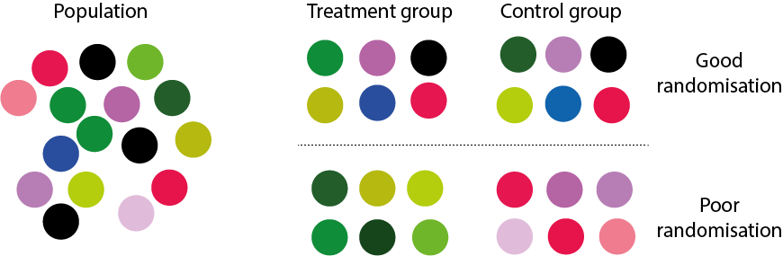
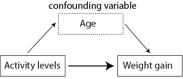

# Emner fra eksperimental design


"Amatører sidder og venter på inspiration, resten af os står bare op og går på arbejde." - Stephen King


## Inledning og læringsmålene


Formålet med dette kapitel er at spørge: Hvordan kan vi anvende de værktøjer, vi har lært i kurset, til at undersøge forskellige emner inden for eksperimentelt design? Dette er ikke en grundig introduktion til eksperimentelt design, men snarere en præsentation af nogle nyttige og interessante emner, der effektivt illustrerer, hvorfor det er vigtigt at lave passende visualiseringer af dine data. Forståelsen af, hvordan batch-effekter påvirker en analyse, er særlig vigtig inden for biologifaget, hvor mange store sekventeringsprojekter involverer data indsamlet eller sekventeret over forskellige batches, sekventeringsmaskiner eller forskellige forberedelsesmetoder.

:::goals
I skal være i stand til at

* Beskrive randomisering, replikation og blokering
* Beskrive Simpsons paradoks
* Beskrive Anscombes kvartet
* Undersøge for batch-effekter med PCA
:::

### Video ressourcer

* Part 1: randomisation, replikation, blocking + confounding
    + Ingen video: læs gerne notaterne nedenfor
    
---

* Part 2: Simpson's paradox 


```{=html}
<div class="vembedr">
<div>
<iframe class="vimeo-embed" src="https://player.vimeo.com/video/556581563" width="533" height="300" frameborder="0" webkitallowfullscreen="" mozallowfullscreen="" allowfullscreen="" data-external="1"></iframe>
</div>
</div>
```

---

* Part 3: Anscombe's quartet 


```{=html}
<div class="vembedr">
<div>
<iframe class="vimeo-embed" src="https://player.vimeo.com/video/556581540" width="533" height="300" frameborder="0" webkitallowfullscreen="" mozallowfullscreen="" allowfullscreen="" data-external="1"></iframe>
</div>
</div>
```

--- 

* Part 4: Batch effects and principal component analysis. 

<!-- _OBS Man kan selvfølgelige også anvende `map_if()` til at log-transformere._ -->

<!-- Der er også nogle esktra notater om heatmaps (hvis interesseret, frivilligt) -->


## Grundlæggende principper i eksperimentelt design 

### Randomisering og replikation

Man laver et __eksperiment__ for at få svar på et bestemt spørgsmål eller en hypotese. Eksperimentet designes ud fra principper, der gør det muligt at fortolke resultaterne fra analysen af datasættet efterfølgende. For at et eksperiment skal være gyldigt, skal det kunne demonstrere hensigtsmæssig __replikation__ og __randomisering__.

__Randomisering__

Målet er at udelukke, at konklusionerne simpelthen kan skyldes varians som følge af en faktor, der ikke direkte er interessant i eksperimentet. Derfor bruger man randomisering til at fordele disse faktorer over de forskellige behandlingsgrupper. Et eksempel kan være 'double-blinding' i kliniske eksperimenter - både lægen og patienten har ikke kendskab til, hvem der hører til de forskellige grupper, således at forskelsbehandling indenfor grupperne, som kan påvirke de endelige resultater, undgås.

__Replikation__ 

Dette sker, når man gentager et eksperiment flere gange - for eksempel ved at have flere patienter i hver behandlingsgruppe. Dette tillader os at beregne variabiliteten i data, som er nødvendig for at kunne konkludere om, der er en forskel mellem grupperne. Man kan altså ikke generalisere resultater, som kun er målt på én person.


<div class="figure" style="text-align: center">

<p class="caption">(\#fig:unnamed-chunk-6)randomisation og replikation</p>
</div>

I ovenstående figur er der 6 replikationer i hver gruppe, der enten er "behandling" eller "kontrol". I tilfældet "God randomisering" er objekter, som er taget tilfældigt fra populationen, godt matchet mellem de to grupper. I det andet tilfælde, "Dårlig randomisering", kan man se, at objekternes farver er godt matchet inden for de samme grupper. Dette gør det derfor umuligt at afgøre, om en eventuel forskel mellem "behandling" og "kontrol" i virkeligheden er resultatet af farven frem for de målinger, man gerne vil sammenligne.

__Forvekslingsvariabler__

Figuren nedenfor illustrerer alder som en forvekslingsvariabel i et eksperiment, hvor man prøver at forstå sammenhængen mellem aktivitetsniveau og vægtøgning. Det kan se ud som om, at et lavt aktivitetsniveau (afhængig variabel) forklarer vægtøgning (uafhængig variabel), men man er nødt til at tage andre variable i betragtning for at sikre, at sammenhængen ikke skyldes noget andet. For eksempel kunne gruppen med det høje aktivitetsniveau bestå af personer, der er yngre end personerne i gruppen med det lave aktivitetsniveau, og deres alder kan påvirke deres vægtøgning (måske på grund af forskelle i stressniveauer, kost osv.).




__Blokering__

Man kan forsøge at kontrollere for ekstra variable, som vi ikke er interesseret i, gennem "blokering". Blokering udføres ved først at identificere grupper af individer, der ligner hinanden så meget som muligt. Det kan for eksempel være, at tre forskellige forskere har medvirket til at udføre et stort eksperiment med mange patienter og forskellige behandlingsgrupper. Vi er interesseret i, om der er forskelle mellem behandlingsgrupperne, men ikke i, om der er en forskel i forskernes behandling af patienterne. Derfor vil vi gerne 'blokere' efter forsker - altså kontrollere for dem som en "batch" effekt. Man kan også blokere efter fx køn, for at sikre at forskellene i behandlingsgrupperne ikke skyldes forskelle mellem mænd og kvinder. Blokering udføres som en del af en lineær model, efter data er indsamlet, men det er nyttigt at tænke over det fra starten.

### Eksempel med datasættet `ToothGrowth`

Et godt eksempel på et veludført eksperimentelt design er datasættet `ToothGrowth`, som er baseret på marsvin - de fik forskellige kosttilskud og doser, og derefter blev længden af deres tænder målt.


``` r
data(ToothGrowth)
ToothGrowth <- ToothGrowth %>% tibble() %>% mutate(dose = as.factor(dose))
summary(ToothGrowth)
```

```
#>       len        supp     dose   
#>  Min.   : 4.20   OJ:30   0.5:20  
#>  1st Qu.:13.07   VC:30   1  :20  
#>  Median :19.25           2  :20  
#>  Mean   :18.81                   
#>  3rd Qu.:25.27                   
#>  Max.   :33.90
```

Her kan man se, at for hver gruppe (efter `supp` og `dose`) er der 10 marsvin - vi har således replikationer over grupperne, og hver `supp` (supplement) har hver af de tre mulige værdier for "dose". Hvis vi for eksempel ikke var interesseret i `supp` men kun i dosis, kunne vi 'blokere' efter `supp` for at afbøde forskelle i effekten af de to supplementer i `supp`.


``` r
ToothGrowth %>% dplyr::count(supp,dose) %>% 
  ggplot(aes(x=factor(dose),y=n,fill=factor(dose))) + 
    geom_bar(stat="identity") + 
    ylab("Antal marsvin") + 
    xlab("Dosering") +
    facet_grid(~supp) +
    theme_bw()
```


Man skal dog være opmærksom, fordi vi ved ikke, hvordan marsvinene blev tildelt til de forskellige grupper. For eksempel, hvis hanner og hunner ikke er tildelt tilfældigt, kan det forekomme, at supp "OJ" og dosis "0.5" kun har hanmarsvin, og supp "OJ" med dosis "1.0" kun har hunmarsvin. I sådanne tilfælde kunne vi ikke afgøre, om forskellen i dosis "0.5" versus "1.0" er resultatet af dosis eller køn.

## Case studies: Simpsons paradoks

(Se også videoressourcer Del 2).

Simpsons paradoks er et fascinerende statistisk fænomen, der er en vigtig påmindelse om, at korrelation ikke nødvendigvis indebærer kausalitet, og at det er afgørende at forstå de underliggende data og ikke kun de aggregerede statistikker. Simpsons paradoks opstår, når man drager to modsatte konklusioner fra det samme datasæt - på den ene side, når man kigger på dataene samlet, og på den anden side, når man tager visse grupper i betragtning. Vi kan visualisere Simpsons paradoks gennem eksemplet nedenfor - her har vi to variable `x` og `y`, som vi kan bruge til at lave et scatterplot, samt nogle forskellige grupper inden for variablen `group`.


``` r
#library(datasauRus)
simpsons_paradox <- read.table("https://www.dropbox.com/s/ysh3qpc7qv0ceut/simpsons_paradox_groups.txt?dl=1",header=T)
simpsons_paradox <- simpsons_paradox %>% tibble()
simpsons_paradox
```

```
FALSE # A tibble: 222 × 3
FALSE        x     y group
FALSE    <dbl> <dbl> <chr>
FALSE  1  62.2 70.6  D    
FALSE  2  52.3 14.7  B    
FALSE  3  56.4 46.4  C    
FALSE  4  66.8 66.2  D    
FALSE  5  66.5 89.2  E    
FALSE  6  62.4 91.5  E    
FALSE  7  38.9  6.76 A    
FALSE  8  39.4 63.1  C    
FALSE  9  60.9 92.6  E    
FALSE 10  56.6 45.8  C    
FALSE # ℹ 212 more rows
```

Hvis vi ignorerer `group` og kigger på dataene samlet, kan vi se, at der er en stærk positiv sammenhæng mellem x og y. Men når vi opdeler efter de forskellige grupper ved at skrive `colour = group`, opnår vi faktisk en negativ sammenhæng indenfor hver af grupperne.


``` r
p1 <- simpsons_paradox %>% 
  ggplot(aes(x,y)) + 
  geom_point() +
  geom_smooth(method="lm",se=FALSE) +
  theme_classic()

p2 <- simpsons_paradox %>% 
  ggplot(aes(x,y,colour=group)) + 
  geom_point() +
  geom_smooth(method="lm",aes(group=group),colour="black",se=FALSE) +
  theme_classic()

library(gridExtra)
grid.arrange(p1,p2,ncol=2)
```


Simpsons paradoks forekommer oftere end man skulle tro, og derfor er det vigtigt at overveje, hvilke andre variable man også er nødt til at tage i betragtning.

### Optagelse på Berkeley

Det mest berømte eksempel på Simpsons paradoks drejer sig om optagelsen på Berkeley Universitetet i 1973. Følgende tabel fra Wikipedia (https://en.wikipedia.org/wiki/Simpson%27s_paradox) viser statistikker over antallet af ansøgere samt procentdelen, der blev optaget på universitetet generelt, opdelt efter køn.

<div class="figure" style="text-align: center">

<p class="caption">(\#fig:unnamed-chunk-12)source: wikipedia</p>
</div>


Hvis vi laver et søjlediagram af tallene, kan man se, at der er en højere procentdel af mænd end kvinder, som blev optaget på universitetet (sagen medførte en retssag mod universitetet).


``` r
admissions_all <- tibble("sex"=c("all","men","women"),admitted=c("41","44","35"))

admissions_all %>% ggplot(aes(x=sex,y=admitted,fill=sex)) + 
  geom_bar(stat="identity") + 
  theme_minimal() + 
  ylab("Procent optaget") +
  scale_x_discrete(limits = c("women","men","all")) +
  coord_flip()
```


Da man dog kiggede lidt nærmere på de samme tal, men opdelte efter de forskellige fakulteter på universitetet, fik man et anderledes billede af situationen. I følgende tabel har vi optagelsestallene for mænd og kvinder på hver af de forskellige fakulteter (A til F).

<!-- optagelses statistik efter afdeling -->

``` r
admissions_separate <- tribble(
  ~department,   ~all,   ~men,  ~women,
  #------------|-------|-------|--------#
  "A",            64,     62,      82,
  "B",            63,     63,      68,
  "C",            35,     37,      34,
  "D",            34,     33,      35,
  "E",            25,     28,      24,
  "F",             6,      6,       7
)
```

Man kan se, at for de fleste af fakulteterne er der ikke en markant forskel mellem mænd og kvinder, og i nogle tilfælde havde kvinder faktisk en større sandsynlighed for at blive optaget.

<!-- lave et plot af de data opdelte efter afdeling -->

``` r
admissions_separate %>% 
  pivot_longer(-department,names_to="sex",values_to="admitted") %>%
  ggplot(aes(x=department,y=admitted,fill=sex)) + 
  ylab("Procent optaget") +
  geom_bar(stat="identity",position = "dodge",colour="black") + 
  theme_minimal()
```


Hvad skyldes denne sammenhæng? Det viste sig, at kvinder havde en tendens til at ansøge indenfor de fakulteter, som var sværest at komme ind på. For eksempel kan man se her, at fakultet E har en relativt lav optagelsesprocent. Det samme fakultet var dog et af dem, hvor betydeligt flere kvinder ansøgte end mænd.

<!-- lave et plot af ansøgelse statistik for afdeling E -->

``` r
applications_E <- tibble("sex"=c("all","men","woman"),applications=c("584","191","393"))


applications_E %>% ggplot(aes(x=sex,y=applications,fill=sex)) + 
  geom_bar(stat="identity") + 
  theme_minimal() + 
  ylab("Number of applications to dep. E") +
  scale_x_discrete(limits = c("woman","men","all")) +
  coord_flip()
```


Derfor, selvom kvinder ikke havde en lavere sandsynlighed for at blive optaget end mænd i deres fortrukne fag, var antallet af kvinder, der blev optaget i det hele taget på tværs af alle afdelinger, faktisk lavere end antallet af mænd. 

## Case studies: Anscombes kvartet

(Se også videoressourcer Del 3).

Anscombes kvartet (se også https://en.wikipedia.org/wiki/Anscombe%27s_quartet) er et meget nyttigt og berømt eksempel fra 1973, der fremhæver vigtigheden af at visualisere datasættet. Vi kan hente dataene fra linket nedenfor - der er x-værdier og y-værdier, som kan anvendes til at lave et scatterplot, og der er også `set`, der refererer til fire forskellige datasæt (derfor 'kvartet').


``` r
anscombe <- read.table("https://www.dropbox.com/s/mlt7crdik3eih9a/anscombe_long_format.txt?dl=1",header=T)
anscombe <- anscombe %>% tibble()
anscombe
```

```
#> # A tibble: 44 × 3
#>      set     x     y
#>    <int> <int> <dbl>
#>  1     1    10  8.04
#>  2     1     8  6.95
#>  3     1    13  7.58
#>  4     1     9  8.81
#>  5     1    11  8.33
#>  6     1    14  9.96
#>  7     1     6  7.24
#>  8     1     4  4.26
#>  9     1    12 10.8 
#> 10     1     7  4.82
#> # ℹ 34 more rows
```

Formålet med datasættet er, at vi gerne vil fitte en lineær regressionsmodel for at finde den forventede y-værdi afhængig af x (husk `lm(y ~ x)`). Da vi har fire datasæt, kan vi opdele datasættet efter `set` og anvende funktionerne `nest` og `map` (se Kapitel 7) til at fitte de fire lineære regressionsmodeller. Vi anvender også `tidy` og `glance` for at få resuméstatistikker fra de fire modeller:


``` r
my_func <- ~lm(y ~ x, data = .x)

tidy_anscombe_models <- anscombe %>% 
  group_nest(set) %>% 
  mutate(fit = map(data, my_func),
         tidy = map(fit, tidy),
         glance = map(fit, glance))
```

Vi kan anvende `unnest` på outputtet fra `tidy` og se på skæringspunktet og hældningen af de fire modeller. Man kan se, at de to parametre er næsten identiske for de fire modeller:


``` r
tidy_anscombe_models %>% unnest("tidy") %>% 
  pivot_wider(id_cols = "set",names_from = "term",values_from="estimate") 
```

```
#> # A tibble: 4 × 3
#>     set `(Intercept)`     x
#>   <int>         <dbl> <dbl>
#> 1     1          3.00 0.500
#> 2     2          3.00 0.5  
#> 3     3          3.00 0.500
#> 4     4          3.00 0.500
```

Hvad med de andre parametre fra modellen - lad os eksempelvis kigge på `r.squared` og `p.value` fra modellerne, som kan findes i outputtet fra `glance`. Her kan vi igen se, at de er næsten identiske.


``` r
tidy_anscombe_models %>% 
  unnest(cols = c(glance)) %>% 
  select(set, r.squared,p.value)
```

```
#> # A tibble: 4 × 3
#>     set r.squared p.value
#>   <int>     <dbl>   <dbl>
#> 1     1     0.667 0.00217
#> 2     2     0.666 0.00218
#> 3     3     0.666 0.00218
#> 4     4     0.667 0.00216
```

Hvad med korrelation? Den er også næsten den samme:


``` r
my_func <- ~cor(.x$x,.x$y)

anscombe %>% 
  group_nest(set) %>% 
  mutate(cor = map(data, my_func)) %>% 
  unnest(cor) %>% 
  select(-data)
```

```
#> # A tibble: 4 × 2
#>     set   cor
#>   <int> <dbl>
#> 1     1 0.816
#> 2     2 0.816
#> 3     3 0.816
#> 4     4 0.817
```

Kan vi så konkludere, at de fire datasæt, som underbygger de forskellige modeller, er identiske? Lad os lave et scatter plot af de fire datasæt (som vi faktisk burde have gjort i starten af vores analyse).


``` r
anscombe %>% 
  ggplot(aes(x = x, y = y,colour=factor(set))) +
  geom_point() + 
  facet_wrap(~set) +
  geom_smooth(method = "lm", se = FALSE) + 
  theme_minimal()
```


De fire datasæt er meget forskellige. Vi ved, at de alle har samme bedste tilpasning med rette linjer, men de underliggende data er slet ikke de samme. Det første datasæt ser egnet ud til en lineær regressionsanalyse, men vi kan se i datasæt nummer to, at der ikke engang er en lineær sammenhæng. Og de andre to har outlier værdier, hvilket gør, at den bedst tilpassede rette linje ikke passer særlig godt til punkterne.

## Undersøgelse af "batch-effekter"

(Se også videoressourcer Part 4).

En "batch-effekt" er en systematisk teknisk bias, der opstår, når målinger (f.eks. genekspression) udføres i flere omgange eller "batches". Dette kan potentielt føre til betydelige forvrængninger og fejlagtige konklusioner i dataanalyse, hvis det ikke tages højde for.

Forestil dig, at du udfører et eksperiment, hvor du sammenligner genekspressionen i sundt væv med kræftvæv. Du udfører dine eksperimenter over flere dage, og det viser sig, at alle dine sunde prøver blev behandlet på mandag, og alle dine kræftprøver blev behandlet på tirsdag. Hvis der er en systematisk forskel i, hvordan dine eksperimenter blev udført på de to dage (måske et reagens var lidt anderledes, eller instrumentet blev brugt på en anden måde), vil du se en stor forskel i genekspression mellem dine sunde og kræftprøver. Men denne forskel skyldes faktisk batch-effekten, ikke forskellen mellem sundt og kræftvæv.

Man kan også anvende visualiseringer til at undersøge eventuelle batch-effekter eller forvirrende variabler i datasættet. Dette er især vigtigt i store eksperimenter, hvor forskellige prøver eller dele af datasættet bliver indsamlet på forskellige tidspunkter, steder, eller af forskellige personer. Det er ofte tilfældet i sekvenseringsbaserede datasæt, at man ser batch-effekter, og det kan skyldes mange ting, bl.a.:

* Sekvenseringsdybde
* Grupper af prøver lavet på forskellige tidspunkter af forskellige individer
* Sekvenseringsmaskiner - prøver sekvenseret på forskellige maskiner eller 'lanes'. 

Lad os tage udgangspunkt i nogle genekspressionssekvenseringsdata fra mus (vi så også dette datasæt, da vi lærte om `pivot_longer` kombineret med `left_join`).


``` r
norm.cts <- read.table("https://www.dropbox.com/s/3vhwnsnhzsy35nd/bottomly_count_table_normalised.txt?dl=1")
coldata <- read.table("https://www.dropbox.com/s/el3sm9ncvzbq6xf/bottomly_phenodata.txt?dl=1")
coldata <- coldata %>% tibble()
norm.cts <- as_tibble(norm.cts[1:1000,],rownames="gene")
```

Jeg begynder med at vælge kun de rækker, der har mindst 50 counts, for at undgå gener med lave ekspressionsniveauer. Det næste jeg gør er at transformere dataene til logaritmisk form (funktion `map_if()`) for at opnå en bedre fordeling i datasættet.


``` r
#normalisere og filtrere dataene
norm.cts <- norm.cts %>% 
  filter(rowSums(norm.cts %>% select(-gene))>50) %>% 
  map_if(is.numeric,~log(.x+1)) %>% as_tibble()

norm.cts
```

```
#> # A tibble: 10,193 × 22
#>    gene    SRX033480 SRX033488 SRX033481 SRX033489 SRX033482 SRX033490 SRX033483
#>    <chr>       <dbl>     <dbl>     <dbl>     <dbl>     <dbl>     <dbl>     <dbl>
#>  1 ENSMUS…      6.35      6.32      6.21      6.29      6.31      6.27      6.30
#>  2 ENSMUS…      3.51      3.56      3.57      3.27      2.99      3.61      3.56
#>  3 ENSMUS…      3.19      3.50      3.08      3.21      3.14      3.09      3.22
#>  4 ENSMUS…      6.69      6.48      6.38      6.35      6.39      6.34      6.50
#>  5 ENSMUS…      6.05      6.37      6.17      6.26      6.16      6.06      6.13
#>  6 ENSMUS…      2.89      2.94      3.16      3.21      3.77      3.30      3.11
#>  7 ENSMUS…      3.42      3.12      3.86      4.36      3.77      3.99      4.24
#>  8 ENSMUS…      3.42      2.94      3.52      3.41      3.57      3.60      2.99
#>  9 ENSMUS…      5.02      4.98      4.49      4.27      4.67      4.35      4.81
#> 10 ENSMUS…      5.13      4.88      4.97      4.76      4.82      4.79      4.96
#> # ℹ 10,183 more rows
#> # ℹ 14 more variables: SRX033476 <dbl>, SRX033478 <dbl>, SRX033479 <dbl>,
#> #   SRX033472 <dbl>, SRX033473 <dbl>, SRX033474 <dbl>, SRX033475 <dbl>,
#> #   SRX033491 <dbl>, SRX033484 <dbl>, SRX033492 <dbl>, SRX033485 <dbl>,
#> #   SRX033493 <dbl>, SRX033486 <dbl>, SRX033494 <dbl>
```

Så der er omkring 10.000 gener i rækkerne, og der er 21 forskellige prøver, der spreder sig over kolonnerne. Vi har også nogle prøveoplysninger - der er to forskellige stammer af mus og også forskellige batches, som vi gerne vil undersøge nærmere.


``` r
coldata
```

```
#> # A tibble: 21 × 5
#>    column    num.tech.reps strain   batch lane.number
#>    <chr>             <int> <chr>    <int>       <int>
#>  1 SRX033480             1 C57BL.6J     6           1
#>  2 SRX033488             1 C57BL.6J     7           1
#>  3 SRX033481             1 C57BL.6J     6           2
#>  4 SRX033489             1 C57BL.6J     7           2
#>  5 SRX033482             1 C57BL.6J     6           3
#>  6 SRX033490             1 C57BL.6J     7           3
#>  7 SRX033483             1 C57BL.6J     6           5
#>  8 SRX033476             1 C57BL.6J     4           6
#>  9 SRX033478             1 C57BL.6J     4           7
#> 10 SRX033479             1 C57BL.6J     4           8
#> # ℹ 11 more rows
```

Vi kan se på, hvor mange prøver vi har for hver kombination af stamme og batch i datasættet:


``` r
table(coldata$strain, coldata$batch)
```

```
#>           
#>            4 6 7
#>   C57BL.6J 3 4 3
#>   DBA.2J   4 3 4
```

Så man kan se, at både stammen er repræsenteret med tre eller fire prøver i hver af de tre batches. Der er derfor _replikation_, og da vi har fået repræsenteret hver kombination af stamme og batch, kan vi eventuelt __blokere__ efter batch for at fjerne dens effekt. Her har vi ikke tid til at se på metoder til at fjerne batch-effekter, men det er vigtigt, at vi er i stand til at opdage dem.

### Principal component analyse

Man kan undersøge mulige batch-effekter via principal component analyse. 

Først skal vi lave en "transpose" af datasættet således at variablerne (samples) bliver i rækkerne og observationerne (genes) er som kolonnerne. Det er ikke helt ligetil i tidyverse, men her er en måde at gøre det på:


``` r
norm.cts.transpose <- as_tibble(t(norm.cts[,-1]))
colnames(norm.cts.transpose) <- norm.cts %>% pull(gene)
norm.cts.transpose %>% mutate(sample = colnames(norm.cts)[-1],.before=1)
```

```
#> # A tibble: 21 × 10,194
#>    sample    ENSMUSG00000000001 ENSMUSG00000000056 ENSMUSG00000000058
#>    <chr>                  <dbl>              <dbl>              <dbl>
#>  1 SRX033480               6.35               3.51               3.19
#>  2 SRX033488               6.32               3.56               3.50
#>  3 SRX033481               6.21               3.57               3.08
#>  4 SRX033489               6.29               3.27               3.21
#>  5 SRX033482               6.31               2.99               3.14
#>  6 SRX033490               6.27               3.61               3.09
#>  7 SRX033483               6.30               3.56               3.22
#>  8 SRX033476               6.03               3.69               2.83
#>  9 SRX033478               6.30               3.42               3.73
#> 10 SRX033479               5.88               3.98               3.24
#> # ℹ 11 more rows
#> # ℹ 10,190 more variables: ENSMUSG00000000078 <dbl>, ENSMUSG00000000088 <dbl>,
#> #   ENSMUSG00000000093 <dbl>, ENSMUSG00000000120 <dbl>,
#> #   ENSMUSG00000000125 <dbl>, ENSMUSG00000000126 <dbl>,
#> #   ENSMUSG00000000127 <dbl>, ENSMUSG00000000131 <dbl>,
#> #   ENSMUSG00000000149 <dbl>, ENSMUSG00000000167 <dbl>,
#> #   ENSMUSG00000000168 <dbl>, ENSMUSG00000000171 <dbl>, …
```

Heldigvis er der en pakke, som kan gøre processen meget hurtigere:


``` r
library(sjmisc)
norm.cts.transpose <- norm.cts %>% 
                          rotate_df(cn=TRUE,rn="sample")

norm.cts.transpose[1:6,1:5]
```

```
#>      sample ENSMUSG00000000001 ENSMUSG00000000056 ENSMUSG00000000058
#> 1 SRX033480           6.352707           3.514892           3.190250
#> 2 SRX033488           6.317191           3.560812           3.495351
#> 3 SRX033481           6.208840           3.571591           3.079332
#> 4 SRX033489           6.289602           3.265114           3.210200
#> 5 SRX033482           6.307351           2.989835           3.136775
#> 6 SRX033490           6.268945           3.613359           3.090954
#>   ENSMUSG00000000078
#> 1           6.689454
#> 2           6.477961
#> 3           6.377990
#> 4           6.345142
#> 5           6.389898
#> 6           6.337397
```

Nu kan vi udføre en principal component analyse:


``` r
pca_fit <- norm.cts.transpose %>%
  select(where(is.numeric)) %>% # behold kun numeriske kolonner
  prcomp(scale = TRUE) # udfør PCA på skalerede data
```

Så kan vi bruge vores standarde måde at visualisere principal components på:


``` r
library(ggrepel)

pca_fit_augment <- pca_fit %>% 
  augment(norm.cts.transpose)

pca_fit_augment %>% 
  ggplot(aes(x=.fittedPC1,y=.fittedPC2)) + 
  geom_point() + 
  geom_text_repel(aes(label=sample)) +
  theme_bw()
```


Anvend left_join til at få oplysningen med:


``` r
pca_fit_augment <- pca_fit_augment %>% 
  left_join(coldata %>% rename(sample = column),by="sample")
```


``` r
tail(colnames(pca_fit_augment))
```

```
#> [1] ".fittedPC20"   ".fittedPC21"   "num.tech.reps" "strain"       
#> [5] "batch"         "lane.number"
```


``` r
pca_fit_augment %>% 
  ggplot(aes(x=.fittedPC1,y=.fittedPC2,colour=as.factor(batch),shape=strain)) + 
  geom_point(size=3) + 
  geom_text_repel(aes(label=sample)) +
  theme_bw()
```


<!-- lave boxplot af PC1 og PC2 opdelt efter batch-->

``` r
p1 <- pca_fit_augment %>%
  ggplot(aes(x=factor(batch),y=.fittedPC1,fill=factor(batch))) + geom_boxplot(show.legend = F) + geom_jitter(show.legend = F) + theme_minimal() + ggtitle("Batches PC1")

p2 <- pca_fit_augment %>%
  ggplot(aes(x=factor(batch),y=.fittedPC2,fill=factor(batch))) + geom_boxplot(show.legend = F) + geom_jitter(show.legend = F) + theme_minimal() + ggtitle("Batch PC2")

library(gridExtra)
grid.arrange(p1,p2,ncol=2)
```


Man kan også lav en heatmap:


``` r
cor_mat <- cor(norm.cts[,-1])
row.names(cor_mat) <- coldata$batch
colnames(cor_mat) <- coldata$strain
heatmap(cor_mat)
```


### EKSTRA: Batch effect correction med ComBat()-funktionen

ComBat-pakken i R hjælper med at korrigere for batch-effekter, så forskelle mellem prøver skyldes biologisk variation og ikke tekniske forskelle. 


``` r
#if (!require("BiocManager", quietly = TRUE))
#    install.packages("BiocManager")

#BiocManager::install("sva")

library(sva)
corrected <- sva::ComBat(dat=norm.cts[1:100,] %>% select(-gene),batch=coldata %>% pull(batch))
corrected <- as_tibble(corrected) %>% mutate(gene = norm.cts[1:100,] %>% pull(gene),.before=1)
```


Så kan man lave præcis samme procedure som i ovenstående på den korrigede dataframe:


``` r
corrected.transpose <- corrected %>% 
                          rotate_df(cn=TRUE,rn="sample")

pca_fit <- corrected.transpose %>%
  select(where(is.numeric)) %>% # behold kun numeriske kolonner
  prcomp(scale = TRUE) # udfør PCA på skalerede data

pca_fit_augment <- pca_fit %>% 
  augment(corrected.transpose)

pca_fit_augment <- pca_fit_augment %>% 
  left_join(coldata %>% rename(sample = column),by="sample")

pca_fit_augment <- pca_fit_augment %>% mutate(batch=as.factor(batch))
```


Og så lav en plot:


``` r
PCA1 <- pca_fit_augment %>% 
  ggplot(aes(x=.fittedPC1,y=.fittedPC2,colour=batch,shape=strain)) + 
  geom_point(size=3) + 
  geom_text_repel(aes(label=sample)) +
  theme_bw()

PCA2 <- pca_fit_augment %>% 
  ggplot(aes(x=.fittedPC1,y=.fittedPC2,shape=batch,colour=strain)) + 
  geom_point(size=3) + 
  geom_text_repel(aes(label=sample)) +
  theme_bw()

grid.arrange(PCA1,PCA2,ncol=2)
```


<!-- Husk, at når man udfører en principal component analyse, får man rotationsmatricen, der anvendes til at se, hvor de forskellige prøver ligger i forhold til hinanden over de forskellige principal komponenter - dvs. at prøver, der ligner hinanden, vises på samme sted på plottet. Rotationsmatricen udtrækkes med funktionen `tidy()`: -->

<!-- ```{r} -->
<!-- rot_matrix <- pca_fit %>% -->
<!--   tidy(matrix = "rotation")  -->
<!-- ``` -->

<!-- Vi vil gerne lave et plot af rotationsmatricen, men først vil vi gerne tilføje prøveoplysningerne med `left_join`, så vi kan se de forskellige batches eller stammer. Begge dataframes har en kolonne, der hedder `column`, som refererer til prøvenavne, så jeg forbinder efter `column` her. -->

<!-- ```{r} -->
<!-- rot_matrix <- rot_matrix  %>%  -->
<!--   left_join(coldata,by="column") -->
<!-- ``` -->

<!-- Brug `pivot_wider()` til at få det i bred format, så vi kan plotte "PC1" og "PC2" i et scatter plot: -->

<!-- ```{r} -->
<!-- rot_matrix_wide <- rot_matrix %>%  -->
<!--   pivot_wider(names_from = "PC", names_prefix = "PC", values_from = "value") -->
<!-- rot_matrix_wide -->
<!-- ``` -->

<!-- Jeg tildeler farver og former efter de tre batches. Man kan se, at jeg har fået alle prøver fra batch nummer 2 på samme sted i plottet. -->


<!-- ```{r,fig.width=6,fig.height=4} -->
<!-- rot_matrix_wide %>% -->
<!--   ggplot(aes(PC1,PC2,shape=factor(batch),colour=factor(batch))) +  -->
<!--   geom_point(size=3) + -->
<!--   theme_minimal() -->
<!-- ``` -->

<!-- Jeg kan også tildele farver efter stamme, hvor man kan se, at der sandsynligvis er en forskel mellem de to stammer her. -->

<!-- ```{r,fig.width=6,fig.height=4} -->
<!-- rot_matrix_wide %>% -->
<!--   ggplot(aes(PC1,PC2,shape=factor(strain),colour=factor(strain))) +  -->
<!--   geom_point(size=3) + -->
<!--   theme_minimal() -->
<!-- ``` -->

<!-- Man kan også se på dataene på en anden måde ved at lave boksdiagrammer for de to første principale komponenter, opdelt efter batch. Vi får bekræftet vores observation om, at der er en markant forskel mellem batch 7 og de andre to batches langs den første principale komponent, og det er et problem, som muligvis skal korrigeres, før man foretager yderligere analyser af dataene. -->


<!-- <!-- lave boxplot af PC1 og PC2 opdelt efter batch--> -->
<!-- ```{r,comment=FALSE,message=FALSE} -->
<!-- p1 <- rot_matrix_wide %>%  -->
<!--   ggplot(aes(x=factor(batch),y=PC1,fill=factor(batch))) + geom_boxplot(show.legend = F) + geom_jitter(show.legend = F) + theme_minimal() -->

<!-- p2 <- rot_matrix_wide %>%  -->
<!--   ggplot(aes(x=factor(batch),y=PC2,fill=factor(batch))) + geom_boxplot(show.legend = F) + geom_jitter(show.legend = F) + theme_minimal() -->

<!-- library(gridExtra) -->
<!-- grid.arrange(p1,p2,ncol=2) -->
<!-- ``` -->


<!-- ### Ekstra: Pheatmap tilgang! -->

<!-- Det er også meget almindeligt at se "heatmaps" indenfor biologi fag. I en heatmap kan man visualisere korrelationerne i ekspressionen mellem de forskellige samples. Samples som har tætteste sammenhænge fremstå ved siden af hinanden på heatmappen ( ligesom i en dendrogram i hierarchical clustering, men med korrelation i stedet for afstand). -->

<!-- I følgende beregner jeg korrelationkoffeficient mellem de forskellige variabler: -->

<!-- ```{r} -->
<!-- norm.cts.cor <- norm.cts %>% select(-gene) %>% cor() -->
<!-- ``` -->

<!-- I følgende laver jeg en heatmap med funktionen `pheatmap` som findes i pakken `pheatmap`.  -->

<!-- ```{r,fig.width=6,fig.height=5} -->
<!-- library(pheatmap) #installer pakken hvis nødvendigt -->
<!-- pheatmap(norm.cts.cor) -->
<!-- ``` -->

<!-- Samme samples stå på både rækkerne og kolonnerne, og farverne representere hvor stærk korrelationen er mellem hver par samples. Hver sample har en korrelationskoefficient af 1 med sig selv, så man får en rød farve langt diagonelen, som betyder perfekt korrelation. Men det er svært at se, om der er en effekt pga. de forskellige batches. Hvordan kan vi gøre heatmappen mere informativ? -->

<!-- I følgende anvender jeg unite til at lave mere informativ navne i variablen "info_name": -->

<!-- ```{r} -->
<!-- info_new_names <- coldata %>%  -->
<!--   unite(strain,batch,lane.number,col = "info_name",remove = F) -->

<!-- info_new_names -->
<!-- ``` -->

<!-- Jeg ændrer navnerne på kolonnerne og rækkerne i min korrelation matrix og laver en ny heatmap: -->

<!-- ```{r,fig.width=6,fig.height=5} -->
<!-- colnames(norm.cts.cor) <- info_new_names %>% pull(info_name) -->
<!-- row.names(norm.cts.cor) <-  info_new_names %>% pull(info_name) -->

<!-- pheatmap(norm.cts.cor) -->
<!-- ``` -->

<!-- Det er bedre - jeg tilføjer også nogle flere annotations til at gøre det mere informativ: -->

<!-- ```{r,fig.width=6.75,fig.height=5} -->
<!-- annotations <- info_new_names %>%  -->
<!--   select(batch,lane.number,strain) %>%  -->
<!--   mutate(batch = as.factor(batch),lane.number=as.factor(lane.number)) %>% as.data.frame() -->

<!-- row.names(annotations) <- info_new_names$info_name -->


<!-- pheatmap(norm.cts.cor,annotation_col = annotations) -->
<!-- ``` -->


## Problemstillinger


__Problem 1__) Quiz på Absalon - experimental

---

Problem 2) Eksperimentelt design

Jeg udfører et eksperiment, hvor patienter modtager et af tre forskellige kosttilskud (Gruppe 1, 2 og 3). Der er 5 patienter i hver gruppe, og jeg ønsker at undersøge, om patienternes energiniveau i gennemsnit varierer mellem de tre grupper. Alderen på patienterne i hver af de tre grupper er:

Gruppe 1: 18, 23, 31, 25, 19

Gruppe 2: 24, 29, 35, 21, 30

Gruppe 3: 43, 52, 33, 39, 40

a) Hvad er problemet med det eksperimentelle design her? Lav boxplots for at illustrere fordelingen af alderne for hver af de tre grupper (du skal starte med at lave en __tibble__, der indeholder dataene).

b) Hvis man finder en signifikant forskel mellem de tre kosttilskud, kan man så stole på resultaterne?

c) Hvilke andre variabler end alder kunne være årsag til en eventuel forskel mellem de tre kosttilskud, og som muligvis skulle tages i betragtning?

d) Hvad kan man gøre for at løse problemet med det ovenstående eksperimentelle design?


---

__Problem 3__) *Simpsons paradoks* __Genbesøg af Lung Cap-data__

Indlæs `LungCapData` og tilføj den kategoriske variabel `Age.Group`:


``` r
LungCapData <- read.csv("https://www.dropbox.com/s/ke27fs5d37ks1hm/LungCapData.csv?dl=1")
LungCapData$Age.Group <- cut(LungCapData$Age,breaks=c(1,13,15,17,19),right=FALSE,include.lowest = TRUE)
levels(LungCapData$Age.Group) <- c("<13","13-14","15-16","17+")
```

__a__) Lav boxplots med `smoke` på x-aksen og `LungCap` på y-aksen.
    + Bemærk hvilken gruppe der har den højeste lungekapacitet.


__b__) Lav samme plot, men adskilt efter `Age.Group`, og beskriv, hvordan det er et eksempel på Simpsons paradoks.


 


__c)__ Lav et boxplot med `Age` på y-aksen og `Smoke` på x-aksen for at understøtte forklaringen på, hvorfor man ser Simpsons paradoks i dette datasæt.


---

__Problem 4__) *Anscombes analyse* Gentag Anscombes analyse med dinosaurdatasættet:


``` r
library(datasauRus) #installer denne pakke
data_dozen <- datasauRus::datasaurus_dozen
data_dozen
```

```
FALSE # A tibble: 1,846 × 3
FALSE    dataset     x     y
FALSE    <chr>   <dbl> <dbl>
FALSE  1 dino     55.4  97.2
FALSE  2 dino     51.5  96.0
FALSE  3 dino     46.2  94.5
FALSE  4 dino     42.8  91.4
FALSE  5 dino     40.8  88.3
FALSE  6 dino     38.7  84.9
FALSE  7 dino     35.6  79.9
FALSE  8 dino     33.1  77.6
FALSE  9 dino     29.0  74.5
FALSE 10 dino     26.2  71.4
FALSE # ℹ 1,836 more rows
```

__a__) Fit en lineær regressionsmodel for hvert af datasættene (brug `group_by`, `nest` og `map` i kombination med en custom funktion), hvor `y` er den afhængige variabel og `x` er den uafhængige variabel. Anvend også `tidy` og `glance` på alle modellerne.


__b__) Brug resultaterne fra `tidy` til at undersøge hældning og skæring med y-aksen for de forskellige modeller - ligner de hinanden?


__c__) Brug også resultaterne fra `glance` til at undersøge `r.squared` og `p.value`.


__d__)  Er de alle det samme datasæt? Lav et scatter plot opdelt efter de forskellige datasæt. Hvordan ser de bedste rette linjer ud på plottene?


---

__Problem 5__) Vi vil gerne undersøge eventuelle batcheffekter i det følgende datasæt. Det er simulerede "single cell"-sekvenserings count data (dataframen `cse50`) samt dataframen `batches`, som angiver hvilken batch hver af de 500 celler tilhører.


``` r
cse50 <- read.table("https://www.dropbox.com/s/o0wzojpcsekeg6z/cell_mix_50_counts.txt?dl=1")
batches <- read.table("https://www.dropbox.com/s/4t382bfgro46ka5/cell_mix_50_batches.txt?dl=1")
batches <- tibble("batch"=batches %>% pull(batch))
cse50 <- tibble(cse50)
```

__a__) Anvend `map_df` til at transformere disse data til log-skala (tilføj 1 først og tag logaritmen bagefter).
  

  
__b__) Udfør PCA på det transformeret datasæt.


__c__) Brug dine PCA-resultater til at få den rotation matrix


  
__d__) Tilføj oplysningerne fra dataframen `batches` til din rotation matrix (tilføj først en ny kolonne "column" til `batches`, der er lig med `names(cse50)`).
      


__e__) Brug `pivot_wider` og lav et plot af de første to principal komponenter, hvor du angiver farve efter `batch`.


__f__) Lav også boxplots for de første to prinpical components fordelt efter `batch` og kommenter kort på eventuelle batch effekts i datasættet.


---

__Problem 6__ _Yderligere Simpson's paradoks_

Kør følgende kode for at indlæse og bearbejde det følgende datasæt `airlines`.


``` r
airlines <- read.table("http://www.utsc.utoronto.ca/~butler/d29/airlines.txt",header=T)

airlines <- airlines %>% 
  pivot_longer(-airport) %>% 
  separate(name,sep="_",into = c("airline","status")) %>%
  mutate(airline = recode(airline, aa = "Alaska", aw = "American")) %>% 
  pivot_wider(names_from=status,values_from=value) %>% 
  mutate("ontime" = ontime + delayed) %>% 
  rename(flights = ontime)
```

__a__) Opsummer antallet af `flights` og antallet af `delayed` over de forskellige lufthavne for at få et samlet tal for hver flyselskab.


__b__) Beregn også andelen af flyvninger, der er forsinkede, i hvert flyselskab (igen samlet over alle lufthavne). Lav et søjlediagram for at vise proportionerne.


__c__) Denne gang, opsummer over de to flyselskaber for at få et samlet tal for hver lufthavn. Beregn også andelen af flyvninger, der er forsinkede, og lav et plot.


__d__) Denne gang, beregn andelen af flyvninger, der er forsinkede, for hver kombination af både lufthavn og flyselskab. Omsæt igen dette til et plot.


__e__) Kan du forklare dette? Hint: kig eksempelvis på rådataene og især lufthavnen "Phoenix".

## Yderligere læsning

Simpson's paradox og airlines: http://ritsokiguess.site/docs/2018/04/07/simpson-s-paradox-log-linear-modelling-and-the-tidyverse/

Batch effekt correction: https://en.wikipedia.org/wiki/Batch_effect#Correction


