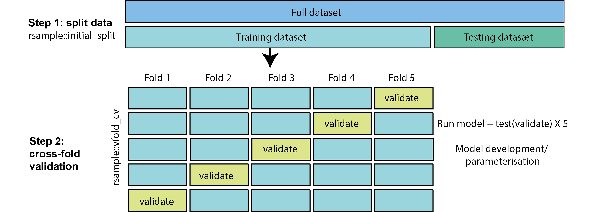
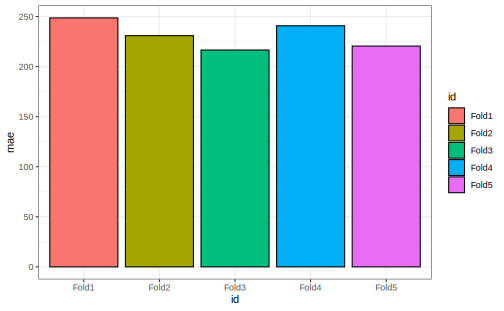
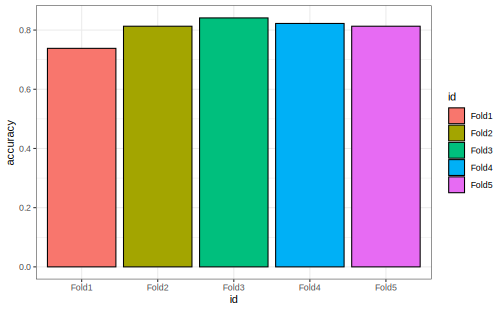
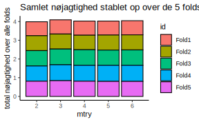
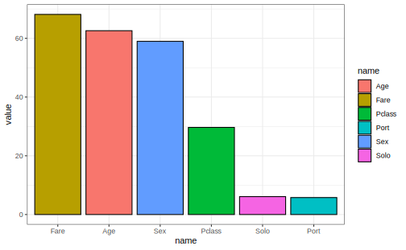

# Maskinslæring i tidyverse


"Absorber hvad der er nyttigt, afvis det, der er ubrugeligt, tilføj det, der specifikt er dit eget." - Bruce Lee


<div class="figure" style="text-align: center">

<p class="caption">(\#fig:unnamed-chunk-1)We don't use all these packages here but R/tidyverse has a good set of tools for machine learning</p>
</div>


Pakkerne vi bruger i emnet:


``` r
library(rsample) #install this
library(tidyverse)
library(ranger) #install this, random forest
library(palmerpenguins)
```


## Indledning og læringsmål

Her er en lynhurtig introduktion til koncepter inden for maskinlæring - emnet er i virkeligheden enormt stort, og jeg springer over mange detaljer her. Men jeg håber, at det giver et godt grundlag og forståelse for den overordnede ramme, og at det kan bidrage til at øge forståelsen af de mange artikler i det biologiske område, der benytter maskinlæringsmodeller, samt motivere dig til eventuelt at tage yderligere kurser i området.

I dag introducerer jeg den grundlæggende ramme, hvor man udvikler en model på træningsdata med cross-fold-validation, og dernæst vurderer modellen på testdata, som ikke var en del af selve træningsprocessen. Jeg inddrager også en klassifikationsmodel, som vi både optimerer ("tuner") og bruger til at forudsige, hvem der overlevede tragedien på Titanic!

Jeg har bestræbt mig på at arbejde så vidt muligt kun inden for tidyverse-rammen og bruge funktioner, vi allerede har dækket i kurset, hvilket gør det nemmere at forstå maskinlæringsprocessen uden at blive distraheret af mange nye pakker og funktioner. Processen kan virke lidt indviklet i starten, men den kan generaliseres meget og nemt udvides i mange kontekster og situationer - du kan nærmest tage dine egne data og bare tilpasse min kode fra enten regression- eller klassifikationsscenariet nedenunder.

<!-- En anvendelse af modellen kan være, at hvis der kommer nye observationer, så hvor godt kan vi bruge modellen til at beregne deres vægt? Det kan fortæller også om hvordan målingerne relatere til vægten, samt brugbar i situationer hvor man ikke kender pingviners vægt - mange lignende situationer opstå mange gange i biologi og medicin: -->

<!-- * Man har målinger om en patient og gerne vil beregne risiko for, at patienten udvikler en bestemt sygdomme ud fra målingerne -->
<!-- * Man har et billede fk. fra en biopsi og man gerne vil anvende mæskinlærings for at classificere status på patienten. -->

### Læringsmålene

Du skal være i stand til at:

* Kende anvendelsen af test- og træningsdatasæt og beskrive processen for krydsvalidering
* Anvende 5-fold krydsvalidering til at udvikle en model og beregne statistikker til evaluering af modellen
* Oprette en klassifikationsmodel til at forudsige, hvem der overlevede Titanic
* Finjustere en parameter og beslutte om en "endelig" model

## Videomateriale

* Video 1: Data splitting and cross-fold validation i en regression kontekst


```{=html}
<div class="vembedr">
<div>
<iframe class="vimeo-embed" src="https://player.vimeo.com/video/714090516" width="533" height="300" frameborder="0" webkitallowfullscreen="" mozallowfullscreen="" allowfullscreen="" data-external="1"></iframe>
</div>
</div>
```

---

* Video 2: Cross-fold validation i en classifcation contekst (random forest)


```{=html}
<div class="vembedr">
<div>
<iframe class="vimeo-embed" src="https://player.vimeo.com/video/714090621" width="533" height="300" frameborder="0" webkitallowfullscreen="" mozallowfullscreen="" allowfullscreen="" data-external="1"></iframe>
</div>
</div>
```

---

* Video 3: Tuning af parametre i classification og variabel importance


```{=html}
<div class="vembedr">
<div>
<iframe class="vimeo-embed" src="https://player.vimeo.com/video/714090572" width="533" height="300" frameborder="0" webkitallowfullscreen="" mozallowfullscreen="" allowfullscreen="" data-external="1"></iframe>
</div>
</div>
```


## Regressionsmodeller

Vi starter med at opbygge processen i en kontekst, som vi allerede er bekendt med - en lineær regressionsmodel. Til dette formål bruger vi endnu engang datasættet 'penguins', og målet er at forudsige variablen 'body_mass_g' for de forskellige pingviner.


``` r
penguins <- penguins %>% drop_na()
```

### Oprettelse af test- og træningssæt

Hvordan kan vi vide, om en model er god til at forudsige, hvad der vil ske med nye observationer? Med andre ord, fungerer modellen kun godt på de observationer, der blev brugt til at opbygge modellen (kaldet "overfitting"), eller kan modellen generalisere til andre lignende situationer? For at få svar på dette overvejer vi at opdele datasættet, inden vi opbygger modellen. Det betyder, at vi har et datasæt, som vi bruger til at opbygge modellen, og et andet datasæt, som vi kan bruge som "nye observationer" til at teste, hvor godt modellen faktisk er (fordi i dette datasæt kender vi de faktiske værdier, som vi kan sammenligne med vores forudsigelser fra modellen).


 
Pakken `rsample` har funktionen `initial_split`, der opdeler datasættet, således at 75% af observationerne tilhører træningssættet og 25% tilhører testssættet:


``` r
penguins_split <- initial_split(penguins, prop = 0.75)
penguins_split
```

```
#> <Training/Testing/Total>
#> <249/84/333>
```

Det betyder, at ud af de 333 observationer bliver 249 brugt til træning, og 84 er tilbageholdt som et testsæt. Derefter udtrækker jeg de to sæt for at få "penguins_training" og "penguins_test" som følger:


``` r
penguins_training <- penguins_split %>% training()
penguins_test <- penguins_split %>% testing()
```

Jeg vil gerne bruge 'penguins_training' til at opbygge modellen og derefter kun kigge på 'penguins_test' senere for at evaluere modellens evne til at lave forudsigelser.

### Krydsvalidering (cross-fold validation)

For at udvikle min model med mit træningssæt anvender jeg "5-fold krydsvalidering". Ved 5-fold krydsvalidering opdeles datasættet i 5 dele ("folds"). Derefter træner man en model på 4 af de 5 dele (folds) og tester den på den sidste del (der ofte kaldes "valideringssættet" og ikke selv var en del af datasættet, der blev brugt til at træne modellen). Man gentager træningsprocessen i alt fem gange, hvor hver del bruges præcis én gang som valideringssæt.




Tilgangen har mange fordele. Hvis der for eksempel kun var én testmængde, og ved tilfældighed indeholdt den observationer, der er særligt lette at forudsige, ville vi få en fejlagtig opfattelse af, at modellen er bedre end den egentlig er i virkeligheden. Ved at anvende 5 folds (forskellige valideringssæt), der dækker hele træningssættet, undgår vi dette. Vi kan dermed søge efter en kombination af parametre, der konsekvent giver en god model på tværs af alle valideringssæt. På den måde kan vi være mere sikre på at få en model, der fungerer godt på vores testmængde til sidst.

<!-- * Man kan få en fornemmelse af hvor meget hvors evne til at forudsige på nye data variare afhængig af observatiorene der ligger i enten testing eller træning sæt. -->
<!-- * Minimire "overfitting" modellen - det vil sige, at modellen er meget godt til at forstå hvad der sker i datasættet men dårlig til at forudsige hvad der forgår med hensyn til nye observationer. -->

Der er en nem funktion man kan bruge i `rsample`-pakken, der hedder `vfold_cv()` til at lave krydsvalidering. Her angiver jeg `v=5` for at vise, at jeg gerne vil have 5 folds.


``` r
cv_split <- vfold_cv(penguins_training, v = 5)
cv_split
```

```
#> #  5-fold cross-validation 
#> # A tibble: 5 × 2
#>   splits           id   
#>   <list>           <chr>
#> 1 <split [199/50]> Fold1
#> 2 <split [199/50]> Fold2
#> 3 <split [199/50]> Fold3
#> 4 <split [199/50]> Fold4
#> 5 <split [200/49]> Fold5
```

Så kan man se, at vi får en dataframe med 5 datasæt, som er lagret i kolonnen 'splits'. Jeg vil gerne udtrække de forskellige "træning" og "testning" (/ "validering") sæt og placere dem i deres egne kolonner ved at bruge 'map' inden for 'mutate', som vist nedenfor:


``` r
cv_data <- cv_split %>% 
  mutate(
    train = map(splits, ~.x %>% training), #extract training datasets
    validate = map(splits, ~.x %>% testing) #extract validation datasets
  )
cv_data
```

```
#> #  5-fold cross-validation 
#> # A tibble: 5 × 4
#>   splits           id    train              validate         
#>   <list>           <chr> <list>             <list>           
#> 1 <split [199/50]> Fold1 <tibble [199 × 8]> <tibble [50 × 8]>
#> 2 <split [199/50]> Fold2 <tibble [199 × 8]> <tibble [50 × 8]>
#> 3 <split [199/50]> Fold3 <tibble [199 × 8]> <tibble [50 × 8]>
#> 4 <split [199/50]> Fold4 <tibble [199 × 8]> <tibble [50 × 8]>
#> 5 <split [200/49]> Fold5 <tibble [200 × 8]> <tibble [49 × 8]>
```

### Opbygning af modellen og lave forudsigelser

Vi ønsker at opbygge en model for hvert af vores datasæt i kolonnen `train` individuelt og forudsige `body_mass_g` i hvert tilknyttet valideringssæt. Dette kan gøres ved hjælp af en brugerdefineret funktion som vist nedenfor:


``` r
my_lm_func <- ~lm(body_mass_g ~ ., data = .x) # . betyder alle variabler i .x er uafhængige untaget body_mass_g

cv_models_lm <- cv_data %>% 
  mutate(model = map(train, my_lm_func))

cv_models_lm
```

```
#> #  5-fold cross-validation 
#> # A tibble: 5 × 5
#>   splits           id    train              validate          model 
#>   <list>           <chr> <list>             <list>            <list>
#> 1 <split [199/50]> Fold1 <tibble [199 × 8]> <tibble [50 × 8]> <lm>  
#> 2 <split [199/50]> Fold2 <tibble [199 × 8]> <tibble [50 × 8]> <lm>  
#> 3 <split [199/50]> Fold3 <tibble [199 × 8]> <tibble [50 × 8]> <lm>  
#> 4 <split [199/50]> Fold4 <tibble [199 × 8]> <tibble [50 × 8]> <lm>  
#> 5 <split [200/49]> Fold5 <tibble [200 × 8]> <tibble [49 × 8]> <lm>
```

Nu vil vi gerne bruge datasættet i kolonnen `validate` til at lave en forudsigelse for hver af vores modeller. Til dette formål kan man bruge funktionen `predict()`. Man tager en model og et nyt datasæt (dvs. det tilsvarende datasæt i kolonnen `validate`), og får nogle forventede `body_mass_g` værdier ud fra modellen, anvendt på de nye data. I det følgende bliver disse forventede "predicted" værdier af `body_mass_g` gemt i kolonnen `validate_predicted`. Da vi faktisk kender de virkelige værdier af `body_mass_g` i vores valideringsdatasæt, laver jeg også en kolonne `validate_actual`, der indeholder disse virkelige værdier, som jeg kan sammenligne med mine forventede værdier.


``` r
cv_prep_lm <- cv_models_lm %>% 
  mutate(
    actual_mass = map(validate, ~.x %>% pull(body_mass_g)), #actual body_mass_g values for validation set
    predicted_mass = map2(.x = model, .y = validate, ~predict(.x, .y)) #predicted body_mass_g values for validation set
  )
```

### Evaluering af resultater på valideringssættet

Jeg vil gerne sammenligne mine nye forudsigelser direkte med de virkelige værdier for `body_mass_g`, hvilket kan give os en indikation af, hvor gode vores modeller faktisk er. I det følgende udvælger jeg `id`, `actual_mass` og `predicted_mass` fra dataframen `cv_prep_lm` og kombinerer dem i en ny dataframe `prediction_df`:


``` r
prediction_df <- cv_prep_lm %>% select(id, actual_mass, predicted_mass) %>% unnest(c(actual_mass, predicted_mass))
```

For hver af de fem folds beregner jeg statistikken "mean absolute error", der tager afstanden mellem de forventede værdier (`predicted_mass`) og de virkelige værdier (`actual_mass`) og tager herefter middelværdien (over deres absolutte værdier dvs. uden minus tegn). Jo mindre "mae" er, jo bedre er modellen. 


``` r
# mindre mae = bedre model
mae_df <- prediction_df %>% group_by(id) %>% summarise("mae" = mean(abs(actual_mass - predicted_mass)))
```

Her er et plot af statistikken "mae" for de forskellige folds. I gennemsnit er det 231.4934331, hvilket betyder, at vores forudsigelser i gennemsnit er ude/forkerte med knap 300 g - ikke dårligt, når den gennemsnitlige pingvin vejer 4207.06 g.


``` r
mae_df %>% 
  ggplot(aes(y=mae,x=id,fill=id)) + 
  geom_bar(stat="identity",colour="black") + 
  theme_bw()
```



### Test og evaluering af "final" model

Vi har lavet forudsigelser på de forskellige dele af vores træningssæt, men vi har endnu ikke lavet forudsigelser på vores testsæt `penguins_test`, som blev holdt ude af hele træningsprocessen. Efter cross-validation-processen skal man lave en "final" model, der bruger alle træningsdata på én gang (dvs. ikke bare én enkelt fold), da vi gerne vil opbygge den endelige model fra så mange data som muligt. Bemærk, at når det kun er ét datasæt, behøver vi ikke at bruge en brugerdefineret funktion.


``` r
model_final <- lm(body_mass_g ~ ., data = penguins_training)
```

Nu kan vi endelig anvende vores testdata (som vi holdt ude før cross-validation-processen): her anvender jeg min "final model" til at forudsige `body_mass_g` for pingvinerne i datasættet `penguins_test`. Dernæst sammenligner vi vores forudsigelser med de virkelige værdier, ligesom i det ovenstående (men her har jeg ikke forskellige folds at tage i betragtning).


``` r
prediction_df <- tibble("actual_mass"=penguins_test %>% pull(body_mass_g),
                       "predicted_mass"=predict(model_final,penguins_test))

prediction_df %>% summarise("mae" = mean(abs(actual_mass-predicted_mass)))
```

```
#> # A tibble: 1 × 1
#>     mae
#>   <dbl>
#> 1  241.
```

Man kan se, at vores endelige model laver forudsigelser, som i gennemsnit er 241.3 g væk fra pingvinernes virkelige vægt (det vil sige, at forudsigelsen kan være over eller under den virkelige værdi, men i gennemsnit er afstanden fra den virkelige værdi 230 g).

## Klassifikationsmodeller

I den ovenstående proces lavede vi en regressionsmodel, hvor den afhængige variabel er kontinuerlig (`body_mass_g`). I en klassifikationsmodel er den afhængige variabel kategorisk (fx "yes" eller "no" i forhold til variablen `Survived` i datasættet `titanic`). Vi viser her, at det er meget nemt at skifte fra den ene type model til en anden, og vi bruger stort set den samme kode (med kun små ændringer).

Den ovenstående ramme giver os også muligheden for at opbygge modeller, hvor der faktisk er forskellige parametre, der skal vælges. I det ovenstående eksempel med pingviner var der faktisk ikke meget "tuning", vi skulle gøre for at udvikle modellen. Jeg viser her, hvordan man kan "tune" en parameter inden for samme ramme i vores klassifikationsmodel.

Jeg åbner først Titanic-datasættet. Datasættet i `titanic`-pakken er allerede blevet opdelt efter træning og test, men lad os bare ignorere det og følge samme ramme som i det ovenstående.


``` r
library(titanic)

titanic <- titanic_train

titanic <- titanic %>% drop_na() %>% as_tibble() %>%
             mutate(Survived = factor(if_else(Survived == 1, "yes", "no"),levels=c("yes","no"))) %>%
             mutate(Pclass = recode(Pclass, `1`="first",`2`="second",`3`="third")) %>%
             mutate(Pclass = as_factor(Pclass),
                    Sex = as_factor(Sex),
                    Port = as_factor(Embarked),
                    Solo = if_else(SibSp + Parch == 0, "yes", "no")) %>%
 select(Survived, Pclass, Sex, Age, Solo, Port, Fare)

titanic
```

```
#> # A tibble: 714 × 7
#>    Survived Pclass Sex      Age Solo  Port   Fare
#>    <fct>    <fct>  <fct>  <dbl> <chr> <fct> <dbl>
#>  1 no       third  male      22 no    S      7.25
#>  2 yes      first  female    38 no    C     71.3 
#>  3 yes      third  female    26 yes   S      7.92
#>  4 yes      first  female    35 no    S     53.1 
#>  5 no       third  male      35 yes   S      8.05
#>  6 no       first  male      54 yes   S     51.9 
#>  7 no       third  male       2 no    S     21.1 
#>  8 yes      third  female    27 no    S     11.1 
#>  9 yes      second female    14 no    C     30.1 
#> 10 yes      third  female     4 no    S     16.7 
#> # ℹ 704 more rows
```

Her vil vi gerne forudsige, hvem der overlevede, og hvem der ikke overlevede. Det er et eksempel på et "klassifikations" problem, hvor der er to mulige svar ("yes" eller "no"), og man gerne vil beregne sandsynligheden for de to muligheder. Det er, hvad der kaldes for et "superviseret" problem, fordi når vi træner modellen, ved vi faktisk, hvem der overlevede i datasættet. Det er til forskel fra eksempelvis k-means clustering, hvor vi ikke har svaret på forhånd (men bare kan gætte, at de forskellige klynger relaterer til noget, for eksempel hvilken art en observation tilhører).

Før vi går i gang, her er et overblik over processen med at opbygge modellen med Titanic:


I følgende steps forklarer jeg processen med `titanic` i flere detaljer:

### Splitte datasættet og lave cross-validation dataframe


``` r
set.seed(333)
titanic_split <- initial_split(titanic, prop = 0.75)
titanic_training <- titanic_split %>% training()
titanic_test <- titanic_split %>% testing()
```

Vi anvender 5-fold cross validation på datasættet `titanic_training` og udtrækker de træning og testing sæt til de forskellige folds (og lagrer dem i henholdvis `train` og `validate` i dataframen `cv_data`):


``` r
set.seed(333)
cv_split <- vfold_cv(titanic_training, v = 5)

cv_data <- cv_split %>% 
  mutate(
    train = map(splits, ~.x %>% training()), 
    validate = map(splits, ~.x %>% testing())
  )

cv_data
```

```
#> #  5-fold cross-validation 
#> # A tibble: 5 × 4
#>   splits            id    train              validate          
#>   <list>            <chr> <list>             <list>            
#> 1 <split [428/107]> Fold1 <tibble [428 × 7]> <tibble [107 × 7]>
#> 2 <split [428/107]> Fold2 <tibble [428 × 7]> <tibble [107 × 7]>
#> 3 <split [428/107]> Fold3 <tibble [428 × 7]> <tibble [107 × 7]>
#> 4 <split [428/107]> Fold4 <tibble [428 × 7]> <tibble [107 × 7]>
#> 5 <split [428/107]> Fold5 <tibble [428 × 7]> <tibble [107 × 7]>
```

### Definere klassifikationsmodel

Dernæst vil vi gerne anvende en model på de fem træningssæt. Et godt eksempel på en klassifikationsmetode, der både er nem at bruge og meget kraftfuld, er "random forest". Her er det ikke nødvendigt at forstå alle detaljer, men helt kort - man opbygger beslutningstræer baseret på tilfældigt udvalgte delmængder af data. I et beslutningstræ laver man "splits" over de forskellige variable, som man bruger til at bestemme, om en passager overlevede eller ej (se billede). Når man gentager denne proces flere gange, for eksempel over 100 træer, der involverer 100 tilfældige delmængder af data, kan man tage et gennemsnit, som udgør de endelige beslutninger (forudsigelser eller predictions).


I det følgende anvender jeg funktionen `ranger()` (installer pakken `ranger`), der passer en random forest i R på datasættet. 


``` r
set.seed(333)
ranger_model <- ~ranger(formula = Survived ~ . ,  # . betyder alle variabler i datasættet er uafhængige
                                              data = .x,
                                              num.trees = 100)
```

Lidt om `ranger`-modellens parametre:

* Jeg angiver en formel - variablen `Survived` er afhængig, og alle andre variabler er uafhængige (betegnet ved "." for at spare tid).
* data er `.x` og refererer til et træningssæt for en af vores "folds" i vores cross-fold validation datasæt.
* `num.trees` fortæller, hvor mange træer jeg vil lave (jo flere, jo bedre, men der er en balance mellem tid/energi).

### Anvende modellen og lave predictions

Jeg laver mine modeller ved at oprette en ny kolonne `model` i dataframe `cv_data`, hvor jeg anvender min custom funktion med `map`:


``` r
cv_models_rf <- cv_data %>% 
  mutate(model = map(train, ranger_model))
cv_models_rf
```

```
#> #  5-fold cross-validation 
#> # A tibble: 5 × 5
#>   splits            id    train              validate           model   
#>   <list>            <chr> <list>             <list>             <list>  
#> 1 <split [428/107]> Fold1 <tibble [428 × 7]> <tibble [107 × 7]> <ranger>
#> 2 <split [428/107]> Fold2 <tibble [428 × 7]> <tibble [107 × 7]> <ranger>
#> 3 <split [428/107]> Fold3 <tibble [428 × 7]> <tibble [107 × 7]> <ranger>
#> 4 <split [428/107]> Fold4 <tibble [428 × 7]> <tibble [107 × 7]> <ranger>
#> 5 <split [428/107]> Fold5 <tibble [428 × 7]> <tibble [107 × 7]> <ranger>
```
Næste skridt er at lave forudsigelser over de fem `validate` datasæt med funktionen `predict()`. Det fungerer på samme måde som i ovenstående regressionsmodel, men med `ranger` er man nødt til at udtrække selve forudsigelserne ved at tilføje `$predictions`, ligesom i den følgende funktion `my_prediction_function`:


``` r
my_prediction_function <-  ~predict(.x, .y)$predictions

cv_prep_rf <- cv_models_rf %>% 
  mutate(
    actual = map(validate, ~.x %>% pull(Survived)), #de faktiske "yes" eller "no"
    predicted = map2(.x = model, .y = validate, my_prediction_function) #forudsigelserne af "yes" eller "no"
  )
```

Nu lad os kigge på vores forudsigelser ("yes" eller "no") sammenlignet med de virkelige værdier ("yes" eller "no") i variablen `Survived`, for hver af de fem valideringssæt:


``` r
predictions_df <- cv_prep_rf %>% select(id, actual, predicted) %>% unnest(c(actual, predicted)) 
predictions_df
```

```
#> # A tibble: 535 × 3
#>    id    actual predicted
#>    <chr> <fct>  <fct>    
#>  1 Fold1 yes    yes      
#>  2 Fold1 yes    yes      
#>  3 Fold1 no     no       
#>  4 Fold1 yes    yes      
#>  5 Fold1 no     no       
#>  6 Fold1 yes    yes      
#>  7 Fold1 yes    no       
#>  8 Fold1 no     no       
#>  9 Fold1 yes    yes      
#> 10 Fold1 yes    yes      
#> # ℹ 525 more rows
```

### Beregne nøjagtighed

Hvor mange fik vi rigtige? Vi beregner "accuracy", som måler andelen af korrekte forudsigelser (både `actual` og `predicted` er enige om, hvem der overlevede eller ikke overlevede). Da jeg har forudsigelser for 5 forskellige datasæt (valideringssæt for hver "fold"), anvender jeg `group_by(id)`, og dernæst `summarise` til at beregne andelen af tilfælde, hvor variablen `actual` er den samme som `predicted`.


``` r
my_accuracies <- predictions_df %>% 
  group_by(id) %>% 
  summarise("accuracy" = sum(actual==predicted)/n())

my_accuracies
```

```
#> # A tibble: 5 × 2
#>   id    accuracy
#>   <chr>    <dbl>
#> 1 Fold1    0.738
#> 2 Fold2    0.813
#> 3 Fold3    0.841
#> 4 Fold4    0.822
#> 5 Fold5    0.813
```

Jeg kan omsætte tallene til et plot:


``` r
my_accuracies %>% 
ggplot(aes(x=id,y=accuracy,fill=id)) +  
  geom_bar(stat="identity",colour="black") + 
  theme_bw()
```




### Parameterjustering

I funktionen `ranger` var der faktisk nogle parametre, der kan have indflydelse på modellens forudsigelser til sidst - én af dem er for eksempel `num.trees` - hvis man bruger fx. 100 træer, får man sandsynligvis bedre resultater end hvis man anvender kun et træ. En anden parameter, som vi angav som "default" i ovenstående analyse, er `mtry`. Den angiver hvor mange variabler vi skal inddrage i en enkelt beregning i træerne (det inddrager mere tilfældighed i algoritmen og undgår, at 1-2 variabler har for meget indflydelse på resultaterne). 
Vi vil gerne prøve de forskellige værdier for `mtry` i modellen og se, hvilken værdi der giver de bedste resultater. I `tidyr`-pakken er der en nyttig funktion `crossing`, der laver kopier af de forskellige folds datasæt, én til hver mulig værdi af `mtry`:


``` r
# Forbered justering af dine cross validation folds ved at variere mtry
cv_tune <- cv_data %>%
  crossing(mtry = c(2:6))

cv_tune
```

```
#> # A tibble: 25 × 5
#>    splits            id    train              validate            mtry
#>    <list>            <chr> <list>             <list>             <int>
#>  1 <split [428/107]> Fold1 <tibble [428 × 7]> <tibble [107 × 7]>     2
#>  2 <split [428/107]> Fold1 <tibble [428 × 7]> <tibble [107 × 7]>     3
#>  3 <split [428/107]> Fold1 <tibble [428 × 7]> <tibble [107 × 7]>     4
#>  4 <split [428/107]> Fold1 <tibble [428 × 7]> <tibble [107 × 7]>     5
#>  5 <split [428/107]> Fold1 <tibble [428 × 7]> <tibble [107 × 7]>     6
#>  6 <split [428/107]> Fold2 <tibble [428 × 7]> <tibble [107 × 7]>     2
#>  7 <split [428/107]> Fold2 <tibble [428 × 7]> <tibble [107 × 7]>     3
#>  8 <split [428/107]> Fold2 <tibble [428 × 7]> <tibble [107 × 7]>     4
#>  9 <split [428/107]> Fold2 <tibble [428 × 7]> <tibble [107 × 7]>     5
#> 10 <split [428/107]> Fold2 <tibble [428 × 7]> <tibble [107 × 7]>     6
#> # ℹ 15 more rows
```

Nu kan jeg bygge en model op til hver kombination af fold (variablen `id`) og mtry (variablen `mtry`). Bemærk, at jeg bruger `map2` her, fordi jeg gerne vil bruge to kolonner af min nestede dataframe - `mtry` (betegnet som .y i funktionen) og `train` (betegnet som .x i funktionen).


``` r
# Build a model for each fold & mtry combination
my_ranger_func <- ~ranger(formula = Survived~., data = .x, 
                              mtry = .y,
                              num.trees = 100)

cv_models_rf <- cv_tune %>% 
  mutate(model = map2(train, mtry, my_ranger_func))
```

Og udtrækker predictions med `predict` ligesom i ovenstående:


``` r
cv_prep_rf <- cv_models_rf %>% 
  mutate(
    actual = map(validate, ~.x$Survived),
    predicted = map2(.x = model, .y = validate, ~predict(.x, .y)$predictions)
  )
```

Nu laver jeg en dataframe ligesom i ovenstående som viser mine predictions - men denne gange har jeg predictions over både min folds og de forskellige værdier for "mtry":


``` r
predictions_df <- cv_prep_rf %>% select(id,mtry,actual,predicted) %>% unnest(cols=c(actual,predicted))
predictions_df
```

```
#> # A tibble: 2,675 × 4
#>    id     mtry actual predicted
#>    <chr> <int> <fct>  <fct>    
#>  1 Fold1     2 yes    yes      
#>  2 Fold1     2 yes    yes      
#>  3 Fold1     2 no     no       
#>  4 Fold1     2 yes    yes      
#>  5 Fold1     2 no     no       
#>  6 Fold1     2 yes    yes      
#>  7 Fold1     2 yes    no       
#>  8 Fold1     2 no     no       
#>  9 Fold1     2 yes    yes      
#> 10 Fold1     2 yes    yes      
#> # ℹ 2,665 more rows
```

Jeg anvender `group_by` efter både `mtry` og `id` for at beregne accuracy:


``` r
my_accuracies <- predictions_df %>% 
  group_by(mtry,id) %>% 
  summarise("accuracy" = sum(actual==predicted)/n()) %>% 
  ungroup(mtry)
```

I det følgende plot visualiseres den samlede nøjagtighed over alle folds, for hver mulige værdi af "mtry"-parameteren. Man kan se, at det ikke gør stor forskel, hvilken værdi af "mtry" jeg vælger i min endelige model, men den højeste samlede søjle hører til "mtry=3" - så jeg vælger 3 som min "mtry" parameter i min "endelige" model.


``` r
my_accuracies %>% ggplot(aes(fill=id,x=mtry,y=accuracy)) + 
  geom_bar(stat="identity",colour="black") + 
  ylab("total nøjagtighed over alle folds") + ggtitle("Samlet nøjagtighed stablet op over de 5 folds") +
  theme_classic()
```




### Oprette endelig model med titanic datasæt

I min endelige model anvender jeg de parametre, jeg valgte i min cross-validation proces, og træner jeg min model over hele `titanic_training` datasættet på én gang.


``` r
final_RF <- ranger(formula = Survived ~ . ,  data = titanic_training,
                                              mtry = 3, 
                                              num.trees = 100)
```

Nu kan jeg endelig anvende modellen til at lave forudsigelser over mit `titanic_test` datasæt. Så kan jeg få en "endelig" nøjagtighed, som fortæller hvor god min model er til at finde ud af, hvem der overlevede tragedien, baseret på de andre variable.


``` r
predictions <- tibble("actual"=titanic_test$Survived,
                      "predicted"=predict(final_RF,titanic_test)$predictions)

predictions %>% summarise("accuracy"=sum(actual==predicted)/n())
```

```
#> # A tibble: 1 × 1
#>   accuracy
#>      <dbl>
#> 1    0.821
```

Så kan man se, at vi er faktisk god til at forudsige hvem, der overlevede tradgedien (se også de forskellige scores og analyser på Kaggle).

### Variable importance

Det allersidste, som kan være nyttigt at vide, er hvilke variabler der var mest betydningsfulde for at kunne lave en nøjagtig forudsigelse af, hvem der overlevede. Man kan tilføje en indstilling kaldet `importance = "impurity"` til kommandoen i funktionen `ranger`, som i det følgende:


``` r
final_RF <- ranger(formula = Survived ~ . ,  data = titanic_training,
                                              importance = "impurity",
                                              mtry = 3, 
                                              num.trees = 100)
```


Til sidst vil vi gerne vide, bidraget fra de forskellige variabler i modellen:


``` r
mod <- t(final_RF$variable.importance) %>% as_tibble()
mod <- mod %>%
  pivot_longer(everything())
mod
```

```
#> # A tibble: 6 × 2
#>   name   value
#>   <chr>  <dbl>
#> 1 Pclass 29.7 
#> 2 Sex    59.0 
#> 3 Age    62.6 
#> 4 Solo    6.10
#> 5 Port    5.78
#> 6 Fare   68.1
```
Jo højere værdien er, jo vigtigere er variablen:


``` r
mod %>%
  ggplot(aes(x=name,y=value,fill=name)) + 
  geom_bar(stat="identity",colour="black") + 
  scale_x_discrete(limits=mod %>% arrange(desc(value)) %>% pull(name)) + 
  theme_bw()
```



Så kan man se, at variablen Fare er meget vigtig for at bestemme, hvem der overlevede, hvilket er i overensstemmelse med vores undersøgelser af Titanic fra tidligere emner!

## Problemstillinger


__Problem 1)__: Quiz - maskinslæring

---

__Classification med penguins__

I datasættet "penguins" vil vi gerne anvende en klassifikationsmodel for at forudsige "male" og "female" pingviner (variablen `sex`) baseret på de andre variabler i datasættet. Først åbner vi datasættet:


``` r
library(palmerpenguins)
penguins <- penguins %>% drop_na()
```


OBS: __Vi tilpasser koden tæt til ovenstående eksempel med datasættet `titanic` - i de følgende spørgsmål, følg koden fra Sektion 12.4__

---

Lad os begynde med at opdele datasættet i to, og bruge testdata til at lave en "nested" dataframe, som vi kan bruge til at lave 5-fold-cross-validation.

__Problem 2)__ _Oprettelse af cross-validation rammer_

__a)__ Opdel datasættet "penguins" i to, således at 80 procent af observationerne er i træningsdatasættet (og 20 procent er i testdatasættet). Kald dit resultat `penguins_split`. Hvor mange observationer er blevet tildelt trænings- og testdatasættene?


__b)__ Uddrag de to datasæt fra `penguins_split` og kald dem `penguins_training` og `penguins_test`.


Vi sætter datasættet `penguins_test` til side (vi får brug for det senere) og arbejder kun med datasættet `penguins_training` for at udvikle vores model.

__c__) Anvend `penguins_training` til at lave en 5-fold-cross-validation dataframe kaldet `cv_split`. 


__d)__ Uddrag de fem test- og træningsdatasæt fra kolonnen `splits` og gem dem i egne kolonner (kald deres kolonner henholdsvis `validate` og `train`). Kald din nye "nested" dataframe for `cv_data`.


---

Nu vil vi gerne lave den samme model 5 gange - en gang for hvert datasæt i kolonnen `train` i vores nye `cv_data` dataframe. Denne model skal være en 'klassifikations' model, da vi gerne vil forudsige "male" eller "female" pingviner (vores afhængige variabel er `sex`, som er kategorisk med to mulige værdier).

__Problem 3)__ _Oprettelse af modellen_

__a__) Lad os starte med det første datasæt og generalisere bagefter til en brugerdefineret funktion i __b__). Anvend `pluck` for at få adgang til det første datasæt i kolonnen `train`, og anvend derefter funktionen `ranger` for at lave en klassifikationsmodel med variablen `sex` som afhængig variabel, og alle de andre variabler som uafhængige variabler (betegnet med `~ .` i modellen). Angiv `num.trees=100` (vi ignorerer andre mulige parametre indtil videre).


__b__) Når vi har fået modellen med `ranger` til at virke på det første datasæt, laver vi en brugerdefineret funktion, der kan anvendes på alle datasæt i kolonnen `train` - tilpas din `ranger`-model fra __a)__ til en brugerdefineret funktion og kald den `ranger_function`.


__c__) Anvend `ranger_function` på samtlige datasæt i kolonnen "train" (opret en ny kolonne i `cv_data`, der hedder `model`, hvor dine fem modeller bliver gemt).


---

Nu har vi lavet en klassifikationsmodel til hvert træningssæt! Vi vil gerne vide, hvor gode modellerne er til at forudsige `sex` i de fem datasæt i kolonnen `validate` (husk at `validate` indeholder den del, der ikke blev brugt i træningen for den relevante `id`(fold)). Vi skal sammenligne to ting fra vores valideringssæt - hvad er vores forudsigelser ud fra modellerne ("male" eller "female" til hver pingvin), og hvad er de virkelige værdier for variablen `sex` (igen "male" eller "female").

__Problem 4)__ _Lav forudsigelser ud fra modellen_

__a__) Brug `map`/`map2` til at lave to nye kolonner i `cv_data`:

* `actual`, hvor du uddrager de virkelige værdier for variablen `sex`
* `prediction`, hvor du anvender `predict` med dine modeller (betegnet som .x) og dine valideringssæt (betegnet som .y)


__b__) Vælg `id`, `actual` og `prediction`, unnest og beregn "nøjagtighed" (proportion af svar, der er korrekte) for hver af de 5 folds.


__c__) Lav et søjlediagram for at se din nøjagtighed over de 5 folds.


---

_Nu har vi lavet 5-fold-cross validation til at træne en klassifikationsmodel. Vi vil gerne udvide processen lidt, fordi der er nogle parametre, der kan ændres i funktionen `ranger`. Det er gennem denne udviklingsproces, at vi begynder at forstå fordelen ved at bruge cross-fold-validation. Lad os prøve at ændre parameteren `mtry` for at se, om vi kan forbedre modellen. Igen følger vi meget tæt på de ovenstående kursusnotater._

__Problem 5)__ Finjuster parameteren `mtry`. 

__a__) Anvend funktionen `crossing` for at inddrage `mtry` (fra 2 til 6, som er antallet af uafhængige variabler) som en kolonne i `cv_data`. Kald din nye dataframe for `cv_tune`. Hvor mange datasæt er der nu i kolonnen `train`?


__b__) Tilpas din brugerdefinerede ranger funktion fra __Spørgsmål 3__, hvor du nu inddrager parameteren `mtry` (med værdi betegnet som `.y`) og anvender din model på de forskellige træningssæt i kolonnen `train` for hver mulig værdi af `mtry` (husk at bruge `map2` her).


__c__) Lav forudsigelser ud fra samtlige modeller og dine valideringssæt (kolonnen `validate`) og udtræk både dine "faktiske" og "forudsagte" værdier præcis som før.


__d__) Beregn nøjagtighed for samtlige sæt (alle kombinationer af `id` og `mtry`), lav et stablet søjlediagram og vælg den bedste mulige værdi for `mtry`.


---

_Nu, da vi har valgt en værdi for parameteren `mtry`, lad os gå videre og lave en "endelig" model! Når vi har lavet den endelige model, kan vi endelig kigge på vores `penguins_test` datasæt, som vi tidligere lagde til side. Husk, at valideringssættene blev brugt til at teste modellen undervejs i udviklingsprocessen, men de var stadig en del af `penguins_training`. Man kigger på testsættet kun én gang til sidst for at stille spørgsmålet - hvor god er vores endelige model?_

__Problem 6)__ _Lav en `endelig` model_

__a__) Anvend funktionen `ranger` for at lave en klassifikationsmodel på datasættet `penguins_training`. Angiv `num.trees=100` og din valgte værdi for parameteren `mtry`.


__b__) Lav forudsigelser med funktionen `predict`, hvor du angiver din "endelige" model samt dit "penguins_test" datasæt. Beregn nøjagtigheden fra din model ved at sammenligne de faktiske værdier for variablen `sex` i dit testsæt med dine beregnede værdier fra `predict()`.


---

_Nu, da vi er færdige med at lave og bedømme vores "endelige" model, er vi interesserede i - hvilke variabler havde den største indflydelse på vores forudsigelser af "male" og "female" pingviner?_

__Problem 7)__ _Variable importance_

__a__) Anvend din funktion på din "endelige" model og angiv indstillingen `importance = "impurity"` i funktionen. Kør modellen og udtræk din variable importance vektor med `final_RF$variable.importance`.


__b__) Omsæt dine importance scores til et søjlediagram, hvor du angiver rækkefølgen af søjlerne efter vigtigheden af de forskellige variabler (den mest vigtige til venstre).


---

__Problem 8)__ Gentag samme proces med et andet datasæt, men i en regressionskontekst:


``` r
LungCapData <- read.csv("https://www.dropbox.com/s/ke27fs5d37ks1hm/LungCapData.csv?dl=1")
glimpse(LungCapData)
```

```
#> Rows: 725
#> Columns: 6
#> $ LungCap   <dbl> 6.475, 10.125, 9.550, 11.125, 4.800, 6.225, 4.950, 7.325, 8.…
#> $ Age       <int> 6, 18, 16, 14, 5, 11, 8, 11, 15, 11, 19, 17, 12, 10, 10, 13,…
#> $ Height    <dbl> 62.1, 74.7, 69.7, 71.0, 56.9, 58.7, 63.3, 70.4, 70.5, 59.2, …
#> $ Smoke     <chr> "no", "yes", "no", "no", "no", "no", "no", "no", "no", "no",…
#> $ Gender    <chr> "male", "female", "female", "male", "male", "female", "male"…
#> $ Caesarean <chr> "no", "no", "yes", "no", "no", "no", "yes", "no", "no", "no"…
```

Følg processen fra Sektion 12.3 igennem med datasættet `LungCapData`: 

  * forudsig `LungCap` som afhængig variabel og alle andre variabler som uafhængige variabler
  * Del datasættet (75% træning, 25% test) og anvend 10-fold cross-validation på dit træningsdatasæt
  * Beregn "mean absolute error" for dine forskellige folds
  * Lav en endelig model og beregn "mean absolute error"


## Yderligere kommentarer og pakker

Jeg spang over mange nyttige pakker og funktioner, der kan bruges til at lave maskinslæring processer i R

* `Yardstick`-pakken er til metrics - fk. accuracy/precesion/recall osv. man kan også lave ROC curves osv. Jeg anvendte kun accuracy i kurset (til at vise processen/iden men begrænser overordnet læs i emnet) men man plejer at anvende forskellige metrics i virkeligheden.
* `Tidymodels`-pakken er en generel pakke, hvor man få en "fælles" tilgang til at opbygge modeller der stammer fra mange forskellige pakke - man kan fk. bruge samme tilgang til at lave blandt andet regression eller bayesian modeller, random forest, support vector machines osv. - alle modeller har nu samme syntaksen i den `Tidymodels` tilgang.
* Der er mange bøger der handler om machine learning n the tidyverse, fk. se her https://livebook.manning.com/book/machine-learning-for-mortals-mere-and-otherwise/chapter-1/v-4/1

<!-- ```{r} -->
<!-- data = read.csv("https://www.dropbox.com/s/1km3x2hd55eoty4/heart_cleveland_upload.csv?dl=1") -->
<!-- data <- as_tibble(data) -->


<!-- data <- data %>% filter(thal>0) -->
<!-- data <- data %>% mutate(slope = recode(slope,`0`="upsloping",`1`="flat",`2`="downsloping"), -->
<!--                         restecg = recode(restecg,`0`="normal",`1`="stt",`2`="hypertrophy"), -->
<!--                         exang = recode(exang, `0`="no", `1`="yes"), -->
<!--                         thal = recode(thal, `1`="normal", `2`="fixed", `3`="reversible")) -->

<!-- data <- data %>% mutate(sex = recode(sex,`0` = "female",`1` = "male"), -->
<!--                         condition = recode(condition,`0` = "no",`1` = "yes"), -->
<!--                         condition = factor(condition,levels=c("yes","no")), -->
<!--                         fbs = recode(fbs,`0`="false",`1`="true"), -->
<!--                         cp = recode(cp,`0`="typical_ang",`1`="atypical_ang",`2`="non_anginal_pain",`3`="asymptomatic")) -->

<!-- heart <- data -->
<!-- ``` -->


<!-- __Problem 2)__ (split data) -->

<!-- ```{r} -->
<!-- heart_split <- initial_split(heart, prop = 0.75) -->

<!-- heart_training <- heart_split %>% training() -->
<!-- heart_test <- heart_split %>% testing() -->
<!-- ``` -->

<!-- __Problem 3)__  make cross-validation dataframe -->

<!-- ```{r,set.seed=333} -->
<!-- cv_split <- vfold_cv(heart_training, v = 5) -->

<!-- cv_data <- cv_split %>%  -->
<!--   mutate( -->
<!--     train = map(splits, ~training(.x)),  -->
<!--     validate = map(splits, ~testing(.x)) -->
<!--   ) -->

<!-- cv_data -->
<!-- ``` -->


<!-- __Problem 5)__ make classification model -->

<!-- ```{r} -->
<!-- ranger_model <- ~ranger(formula = condition ~.,  -->
<!--                                               data = .x, -->
<!--                                               num.trees = 100) -->
<!-- cv_models_rf <- cv_data %>%  -->
<!--   mutate(model = map(train, ranger_model)) -->
<!-- ``` -->

<!-- __Problem 6)__ make predictions -->

<!-- ```{r} -->
<!-- cv_prep_rf <- cv_models_rf %>%  -->
<!--   mutate( -->
<!--     validate_actual = map(validate, ~.x %>% pull(condition)), -->
<!--     validate_predicted = map2(.x = model, .y = validate, ~predict(.x, .y)$predictions) -->
<!--   ) -->

<!-- predictions <- cv_prep_rf %>% select(id,validate_predicted,validate_actual) %>% unnest(validate_predicted,validate_actual) -->
<!-- ``` -->

<!-- __Problem 7)__ prediction visualiation -->

<!-- ```{r} -->
<!-- my_metrics <- yardstick::metric_set(accuracy,precision,recall) -->

<!-- my_metrics_results <- predictions %>% group_by(id) %>% my_metrics(truth = validate_actual,estimate=validate_predicted) -->

<!-- my_metrics_results -->

<!-- my_metrics_results %>%  -->
<!-- ggplot(aes(x=.metric,y=.estimate,fill=id)) +   -->
<!--   geom_bar(stat="identity",position="dodge",colour="black") +  -->
<!--   theme_bw() -->
<!-- ``` -->

<!-- __Problem 9)__ Make final model and test -->

<!-- ```{r} -->
<!-- final_RF <- ranger(formula = condition ~ . ,  # ~ . betyder all variabler i datasættet som afhængig -->
<!--                                               data = heart_training, -->
<!--                                               mtry = 3,  -->
<!--                                               importance = "impurity", -->
<!--                                               num.trees = 100) -->

<!-- predictions <- tibble("actual"=heart_test$condition,"predicted"=predict(final_RF, heart_test)$predictions) -->

<!-- predictions %>% my_metrics(truth=actual,estimate=predicted) -->
<!-- ``` -->


<!-- __Problem 9)__ variable importance -->

<!-- ```{r} -->
<!-- mod <- cv_prep_rf %>% pluck("model",1) -->
<!-- mod$variable.importance -->
<!-- ``` -->

